## Organograma Geral do Projeto

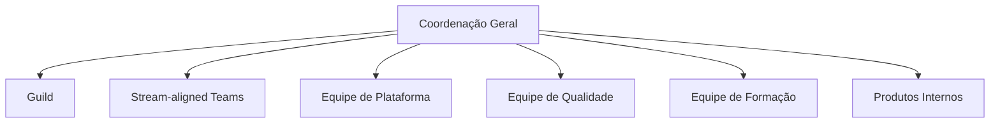

| Unidade Organizacional | Descrição   |
|------------------------|-------------|
| Guild                | É um conjunto de profissionais com as mesmas habilidades e dentro da mesma área de competência, dentro da mesma tribo, e que trocam informações, conhecimentos e experiências. Guilds são normalmente liderados por um Guild lead. | 
| Stream-aligned Team  | Um squad de desenvolvimento é uma equipe multidisciplinar e autônoma, formada por profissionais de diferentes áreas, como desenvolvedores, designers, analistas, testadores, etc., que trabalham juntos em um projeto específico, com um objetivo comum e um prazo definido. | 
| Equipe de Plataforma       |Equipe que cria e mantém uma plataforma interna composta por ferramentas, serviços, APIs ou infraestrutura que outras equipes (como Stream-aligned Teams) utilizam para acelerar a entrega de valor. | 
| Equipe de Qualidade          | Equipe responsável por garantir a que os artefatos sejam desenvolvidos com a qualidade definida.|     
| Produtos Internos          | Uma equipe que cria e mantém uma plataforma interna composta por ferramentas que ajudam a melhorar o dia-a-dia do desenvolvimento |     
| Equipe de Formação | Uma equipe que cria e mantém uma plataforma de formação inicial e continuada do Conecta |     

## Coordenação Geral

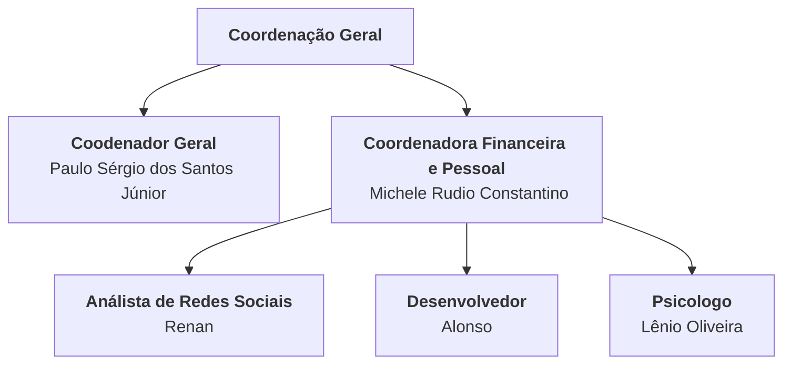
| Unidade Organizacional | Descrição   |
|------------------------|-------------|
| Coordenador Geral      | Reponsável por garantir que a equipe tenha sucesso nas entregas do projeto e atenda as necessidades da FAPES | 
| Coordenadora Financeira e Pessoal  | Responsável por garantir a saúde financeira e da cultura organizacional do projeto|  
| Análista de Redes Sociais  | Responsável pelo planejamento, análise e publicação nas redes sociais do LEDS.|
| Desenvolvedor  | Responsável pelo automação dos processos administrativos.|   
| Psicólogo  | Responsável pela saúde mental e organizacional do projeto|   

## Guild

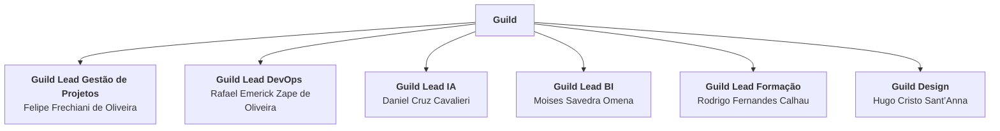

| Papel             | Descrição            |
|------------------------|-----------------------|
| Guild Lead Gestão de Projetos | Responsável por definir e garantir que as boas práticas de gestão de projeto sejam aplicadas no projeto. | 
| Guild Lead DevOps    | Responsável por definir e garantir que as boas práticas da cultura DevOps sejam aplicadas no projeto.| 
| Guild Lead IA| Responsável por definir e garantir que as boas práticas de IA sejam aplicadas no projeto.| 
| Guild Lead BI | Responsável por definir e garantir que as boas práticas de BI sejam aplicadas no projeto. | 
| Guild Lead Formação | Responsável por definir e garantir que as práticas de ensino e aprendizagem sejam aplicadas no projeto. | 
| Guild Lead Design | Responsável por definir e garantir que as boas práticas de Design (UX/UI) sejam aplicadas no projeto. | 

## Equipes

O formato das equipes é apresentados a baixo.

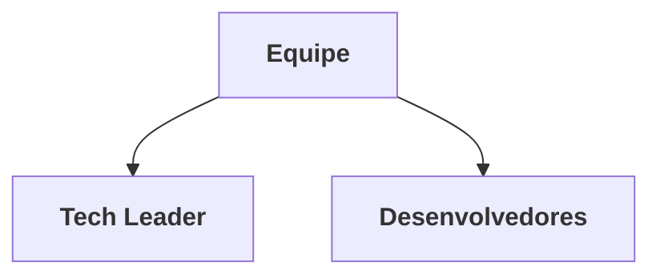
| Papel             | Descrição            |
|------------------------|-----------------------|
| Tech Leader | Responsável por liderar a equipe de desenvolvimento de software, garantindo que as soluções técnicas estejam alinhadas com os objetivos do projeto e da empresa. | 
| Desenvolvedor    | Responsável por definir e construir a solução.| 

### Stream-aligned Team

Equipe responsável por entregas de demandas do cliente.

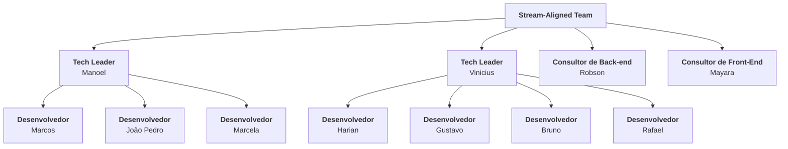

### Equipe de Designer
Equipe responsável por definir e Auditar a implementação do  Design System e  componentes de UX/UI do projeto.

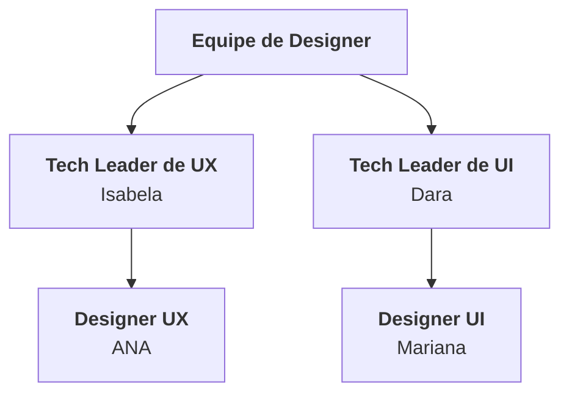

### Equipe de Negócio
Equipe responsável por entender as necessidade do negócio e passar as informações iniciais para os Stream-aligned Team.

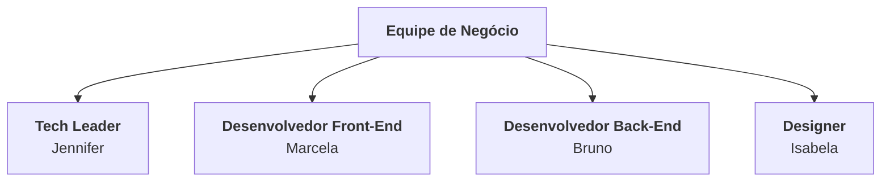

### Equipe de Plataforma de Qualidade

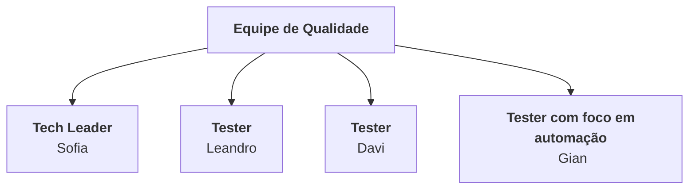

| Papel             | Descrição            |
|------------------------|-----------------------|
| Tech Leader | Responsável por liderar a equipe, garantindo que as soluções técnicas estejam alinhadas com os objetivos do projeto e da empresa. | 
| Tester    | Responsável pelo desenvolvimento e avaliação de testes criados pelos desenvolvedores e criar testes de performance e outros tipos de testes.| 
| Tester com foco em automação    | Responsável pelo desenvolvimento de automações de teste.| 

### Equipe de Plataforma

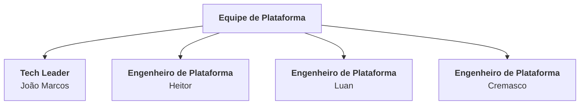

| Papel             | Descrição            |
|------------------------|-----------------------|
| Tech Leader | Responsável por liderar a equipe, garantindo que as soluções técnicas estejam alinhadas com os objetivos do projeto e da empresa. | 
| Engenheiro de Plataforma    |  Reponsável por integrar desenvolvimento e operações, criando pipelines de CI/CD e automatizando implantações e foca na disponibilidade dos sistemas, monitora desempenho e implementa alertas para reduzir falhas.| 

### Equipe de Plataforma de Produtos Internos

Equipe responsável por implementar soluções que melhorem o dia-a-dia do desenvolvimento de software. 

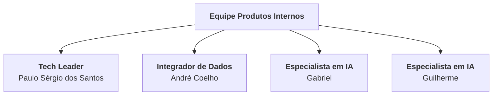

| Papel             | Descrição            |
|------------------------|-----------------------|
| Tech Leader | Responsável por liderar a equipe, garantindo que as soluções técnicas estejam alinhadas com os objetivos do projeto e da empresa. | 
| Integrador de Dados    | responsável por integrar dados das ferramentas de desenvolvimento e gerar das dashboard e estatisticas sobre o desenvolvimento de software.|
| Especialista em IA | responsável por desenvolver e implementar soluções para melhorar o dia-a-dia das squads de desenvolvimento.|

### Equipe de Formação

Equipe responsável pela formação início e contínuada das equipes.

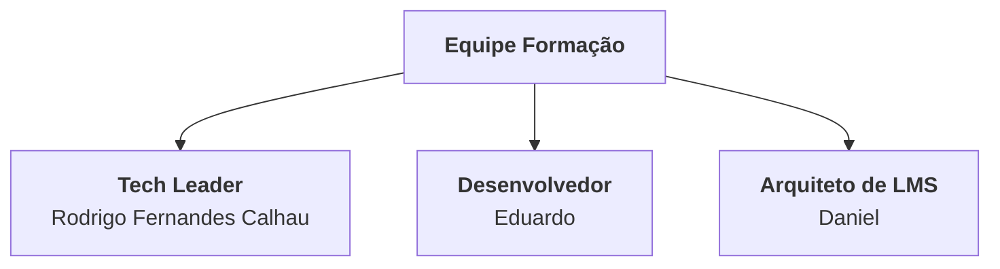

| Papel             | Descrição            |
|------------------------|-----------------------|
| Tech Leader | Responsável por liderar a equipe, garantindo que as soluções técnicas estejam alinhadas com os objetivos do projeto e da empresa. | 
| Desenvolvedor | Responsável pelo sistema de gestão de competência.| 
| Arquiteto | Responsável por manter e customizar o LMS. | 
