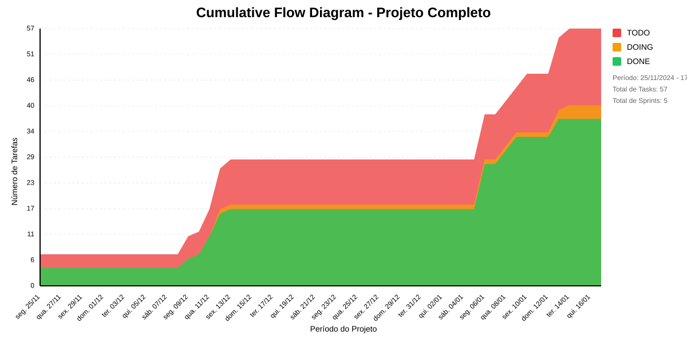

# 📊 Visão Geral do Projeto 

Business Intelligence para melhorar a tomada de decisão na FAPES.
* Data de Início: 03/12/2024
* Data de Planejado: 28/02/2025
* Data de Finalização: -

Business Intelligence para melhorar a tomada de decisão na FAPES.
## Métricas Consolidadas

| Sprint | Período | Duração | Total Tasks | Concluídas | Em Progresso | Pendentes | Velocidade | Eficiência |
|--------|---------|----------|-------------|------------|--------------|-----------|------------|------------|
| 1 - Entender os objetivos organizacionais | 24/11 - 05/12 | 11 dias | 7 | 4 (57.1%) | 3 | 0 | 0.36/dia | 57.1% |
| 2 - Levantar Infraestrutura de BI no LEDS | 08/12 - 12/12 | 4 dias | 10 | 4 (40.0%) | 6 | 0 | 1/dia | 40.0% |
| 3 - Levantar Infraestrutura de BI no LEDS | 15/12 - 19/12 | 4 dias | 11 | 9 (81.8%) | 2 | 0 | 2.25/dia | 81.8% |
| 4 - Ajustes Primeira Semana 2025 | 05/01 - 09/01 | 4 dias | 16 | 16 (100.0%) | 0 | 0 | 4/dia | 100.0% |
| 5 - Entrega Dashoard de Bolsa | 12/01 - 16/01 | 4 dias | 13 | 4 (30.8%) | 9 | 0 | 1/dia | 30.8% |

## Análise Geral

- **Total de Sprints:** 5
- **Total de Tasks:** 57
- **Taxa de Conclusão:** 64.9%

### Notas
- Período Total: 24/11 - 16/01
- Média de Duração das Sprints: 5 dias

*Última atualização: janeiro de 2025*

## Cumulative Flow 

 ## Previsão do Projeto 

## 🎯 Conclusão Principal

### ❌ ALTO RISCO DE ATRASO NO PROJETO

- **Probabilidade de conclusão no prazo**: 1.3%
- **Data mais provável de conclusão**: qua., 22/01/2025
- **Dias em relação ao planejado**: 6 dias
- **Status**: ⚠️ Atraso Moderado

### 📊 Métricas do Projeto

| Métrica | Valor | Status |
|---------|--------|--------|
| Velocidade Atual | 2.8 tarefas/dia | ❌ |
| Velocidade Necessária | 6.7 tarefas/dia | - |
| Dias Restantes | 3 dias | - |
| Tarefas Restantes | 20 tarefas | - |

### 📅 Previsões de Data de Conclusão

| Data | Probabilidade | Status | Observação |
|------|---------------|---------|------------|
| qui., 16/01/2025 | 0.0% | ✅ No Prazo | 🎯 Dentro do prazo |
| sex., 17/01/2025 | 1.3% | ⚠️ Pequeno Atraso |  |
| seg., 20/01/2025 | 6.4% | ⚠️ Pequeno Atraso |  |
| ter., 21/01/2025 | 17.8% | ⚠️ Pequeno Atraso |  |
| qua., 22/01/2025 | 25.6% | ⚠️ Atraso Moderado | 📍 Data mais provável |
| qui., 23/01/2025 | 25.4% | ⚠️ Atraso Moderado |  |
| sex., 24/01/2025 | 15.3% | ⚠️ Atraso Moderado |  |
| seg., 27/01/2025 | 6.0% | ⚠️ Atraso Moderado |  |
| ter., 28/01/2025 | 1.8% | ⚠️ Atraso Moderado |  |
| qua., 29/01/2025 | 0.4% | ⚠️ Atraso Moderado |  |
| qui., 30/01/2025 | 0.1% | ⚠️ Atraso Moderado |  |

## 💡 Recomendações

1. ❌ Realizar reunião de emergência
2. ❌ Reavaliar escopo do projeto
3. ❌ Considerar adição de recursos ou redução de escopo

## ℹ️ Informações do Projeto

- **Total de Sprints**: 5
- **Início**: seg., 25/11/2024
- **Término Planejado**: sex., 17/01/2025
- **Total de Tarefas**: 57
- **Simulações Realizadas**: 10,000

---
*Relatório gerado em 14/01/2025, 15:22:28*