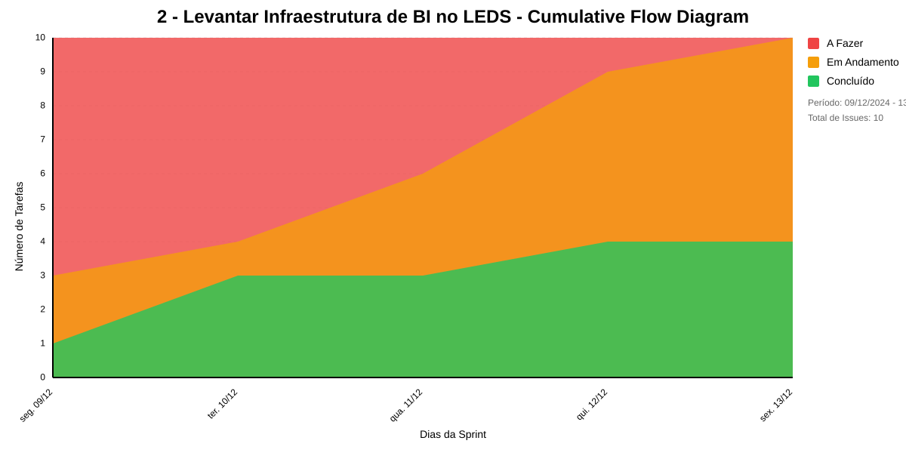

# 2 - LEVANTAR INFRAESTRUTURA DE BI NO LEDS
Levantar a infraestrutura de BI no LEDS, contendo o banco Stage Data, Apache Airflow e Power BI conectados.

## Dados do Sprint
* **Goal**:  Levantar a infraestrutura de BI no LEDS, contendo o banco Stage Data, Apache Airflow e Power BI conectados.
* **Data Início**: 09/12/2024
* **Data Fim**: 13/12/2024
* **Status**: CLOSED
## Sprint Backlog

|Nome |Resposável |Data de Inicío | Data Planejada | Status|
|:----|:--------  |:-------:       | :----------:  | :---: |
|Validar necessidade de informação|Mateus Lannes |09/12/2024||DONE|
|Validar as medidas e indicadores |Mateus Lannes |09/12/2024|10/12/2024|TODO|
|Alinhar com a equipe de DevOps|Mateus Lannes |10/12/2024|10/12/2024|DONE|
|Verificar funcionamento do Stage Data|Mateus Lannes |09/12/2024|10/12/2024|DONE|
|Instalar e configurar o Airflow|Mateus Lannes |11/12/2024|11/12/2024|DONE|
|Transformar arquivos Python em DAGs|Mateus Lannes |11/12/2024|12/12/2024|TODO|
|Testar pipelines ETL|Mateus Lannes |12/12/2024|12/12/2024|TODO|
|Importar dados no Power BI|Mateus Lannes |12/12/2024|12/12/2024|TODO|
|Criar modelo de dados no Power BI|Mateus Lannes |12/12/2024|13/12/2024|TODO|
|Validar relatórios e gráficos no Power BI|Mateus Lannes |13/12/2024|13/12/2024|TODO|

# Análise de Dependências do Sprint

Análise gerada em: 14/01/2025, 15:22:28

## 🔍 Grafo de Dependências

```mermaid
graph BT
    classDef sprint fill:#a8e6cf,stroke:#333,stroke-width:2px;
    classDef done fill:#98fb98,stroke:#333,stroke-width:2px;
    classDef external fill:#ffd3b6,stroke:#333,stroke-width:1px;
    bi.identificarobjetivo.identificarnecessidadeinformacao.entrevista["🔍 bi.identificarobjetivo.identificarnecessidadeinformacao.entrevista<br>⚠️ Dependência Externa"]:::external
    bi.identificarobjetivo.definirmedidasindicadores.pesquisar["🔍 bi.identificarobjetivo.definirmedidasindicadores.pesquisar<br>⚠️ Dependência Externa"]:::external
    bi.levantarinfraestruturaleds.levantardatastage.alinharcomdevops["🔍 bi.levantarinfraestruturaleds.levantardatastage.alinharcomdevops<br>⚠️ Dependência Externa"]:::external
    bi.levantarinfraestruturaleds.configurarairflowetl.criararquivopythonetl["🔍 bi.levantarinfraestruturaleds.configurarairflowetl.criararquivopythonetl<br>⚠️ Dependência Externa"]:::external
    bi.levantarinfraestruturaleds.configurarairflowetl.criardagsetl["🔍 bi.levantarinfraestruturaleds.configurarairflowetl.criardagsetl<br>⚠️ Dependência Externa"]:::external
    bi.levantarinfraestruturaleds.conectarbancoaopowerbi.importardadosnopowerbi["🔍 bi.levantarinfraestruturaleds.conectarbancoaopowerbi.importardadosnopowerbi<br>⚠️ Dependência Externa"]:::external
    bi.levantarinfraestruturaleds.conectarbancoaopowerbi.criarmodelopowerbi["🔍 bi.levantarinfraestruturaleds.conectarbancoaopowerbi.criarmodelopowerbi<br>⚠️ Dependência Externa"]:::external
    identificarnecessidadeinformacao.validar["📝 Tarefa: Validar necessidade de informação<br>📊 Estado: DONE<br>👤 Responsável: Mateus Lannes "]:::done
    definirmedidasindicadores.validar["📝 Tarefa: Validar as medidas e indicadores <br>📊 Estado: TODO<br>👤 Responsável: Mateus Lannes "]:::sprint
    levantardatastage.alinharcomdevops["📝 Tarefa: Alinhar com a equipe de DevOps<br>📊 Estado: DONE<br>👤 Responsável: Mateus Lannes "]:::done
    levantardatastage.verificarfuncionamentodatastage["📝 Tarefa: Verificar funcionamento do Stage Data<br>📊 Estado: DONE<br>👤 Responsável: Mateus Lannes "]:::done
    configurarairflowetl.instalarconfigurarairflow["📝 Tarefa: Instalar e configurar o Airflow<br>📊 Estado: DONE<br>👤 Responsável: Mateus Lannes "]:::done
    configurarairflowetl.criardagsetl["📝 Tarefa: Transformar arquivos Python em DAGs<br>📊 Estado: TODO<br>👤 Responsável: Mateus Lannes "]:::sprint
    configurarairflowetl.testarpipelinesetl["📝 Tarefa: Testar pipelines ETL<br>📊 Estado: TODO<br>👤 Responsável: Mateus Lannes "]:::sprint
    conectarbancoaopowerbi.importardadosnopowerbi["📝 Tarefa: Importar dados no Power BI<br>📊 Estado: TODO<br>👤 Responsável: Mateus Lannes "]:::sprint
    conectarbancoaopowerbi.criarmodelopowerbi["📝 Tarefa: Criar modelo de dados no Power BI<br>📊 Estado: TODO<br>👤 Responsável: Mateus Lannes "]:::sprint
    conectarbancoaopowerbi.criarrelatoriospowerbi["📝 Tarefa: Validar relatórios e gráficos no Power BI<br>📊 Estado: TODO<br>👤 Responsável: Mateus Lannes "]:::sprint
    identificarnecessidadeinformacao.validar -.-> bi.identificarobjetivo.identificarnecessidadeinformacao.entrevista
    definirmedidasindicadores.validar -.-> bi.identificarobjetivo.definirmedidasindicadores.pesquisar
    levantardatastage.verificarfuncionamentodatastage -.-> bi.levantarinfraestruturaleds.levantardatastage.alinharcomdevops
    configurarairflowetl.criardagsetl -.-> bi.levantarinfraestruturaleds.configurarairflowetl.criararquivopythonetl
    configurarairflowetl.testarpipelinesetl -.-> bi.levantarinfraestruturaleds.configurarairflowetl.criardagsetl
    conectarbancoaopowerbi.criarmodelopowerbi -.-> bi.levantarinfraestruturaleds.conectarbancoaopowerbi.importardadosnopowerbi
    conectarbancoaopowerbi.criarrelatoriospowerbi -.-> bi.levantarinfraestruturaleds.conectarbancoaopowerbi.criarmodelopowerbi
```

**Legenda:**
- 🟢 Verde Claro: Issues no sprint
- 🟢 Verde Escuro: Issues concluídas
- 🟡 Laranja: Dependências externas ao sprint
- ➡️ Linha sólida: Dependência no sprint
- ➡️ Linha pontilhada: Dependência externa

## 📋 Sugestão de Execução das Issues

| # | Título | Status | Responsável | Dependências |
|---|--------|--------|-------------|---------------|
| 1 |Validar necessidade de informação | DONE | Mateus Lannes  | bi.identificarobjetivo.identificarnecessidadeinformacao.entrevista⚠️ |
| 2 |Validar as medidas e indicadores  | TODO | Mateus Lannes  | bi.identificarobjetivo.definirmedidasindicadores.pesquisar⚠️ |
| 3 |Alinhar com a equipe de DevOps | DONE | Mateus Lannes  | 🆓 |
| 4 |Verificar funcionamento do Stage Data | DONE | Mateus Lannes  | bi.levantarinfraestruturaleds.levantardatastage.alinharcomdevops⚠️ |
| 5 |Instalar e configurar o Airflow | DONE | Mateus Lannes  | 🆓 |
| 6 |Transformar arquivos Python em DAGs | TODO | Mateus Lannes  | bi.levantarinfraestruturaleds.configurarairflowetl.criararquivopythonetl⚠️ |
| 7 |Testar pipelines ETL | TODO | Mateus Lannes  | bi.levantarinfraestruturaleds.configurarairflowetl.criardagsetl⚠️ |
| 8 |Importar dados no Power BI | TODO | Mateus Lannes  | 🆓 |
| 9 |Criar modelo de dados no Power BI | TODO | Mateus Lannes  | bi.levantarinfraestruturaleds.conectarbancoaopowerbi.importardadosnopowerbi⚠️ |
| 10 |Validar relatórios e gráficos no Power BI | TODO | Mateus Lannes  | bi.levantarinfraestruturaleds.conectarbancoaopowerbi.criarmodelopowerbi⚠️ |

**Legenda das Dependências:**
- 🆓 Sem dependências
- ✅ Issue concluída
- ⚠️ Dependência externa ao sprint

## Cumulative Flow

