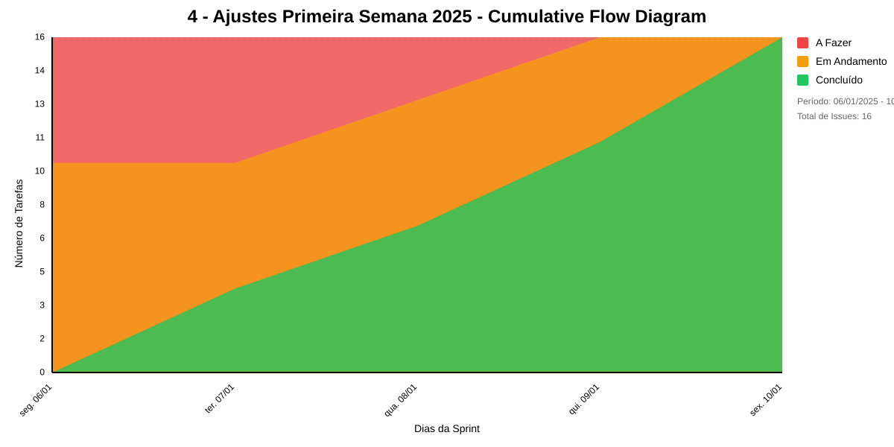

# 4 - AJUSTES PRIMEIRA SEMANA 2025

## Dados do Sprint
* **Goal**:
* **Data Início**: 06/01/2025
* **Data Fim**: 10/01/2025
* **Status**: CLOSED
## Sprint Backlog

|Nome |Resposável |Data de Inicío | Data Planejada | Status|
|:----|:--------  |:-------:       | :----------:  | :---: |
|Ajudar o Backend no Made|Mateus Lannes |08/01/2025|08/01/2025|DONE|
|Ajudar o Backend com problemas no docker|Mateus Lannes |09/01/2025|09/01/2025|DONE|
|Roadmap|Mateus Lannes |06/01/2025|07/01/2025|DONE|
|Entregas no Roadmap|Mateus Lannes |06/01/2025|07/01/2025|DONE|
|Roadmap|Felipe Costabeber|06/01/2025|07/01/2025|DONE|
|Entregas no Roadmap|Felipe Costabeber|06/01/2025|07/01/2025|DONE|
|Anotar demandas|Felipe Costabeber|06/01/2025|06/01/2025|DONE|
|Anotar demandas|Mateus Lannes |06/01/2025|06/01/2025|DONE|
|Fazer planejamento|Mateus Lannes |09/01/2025|09/01/2025|DONE|
|Atualizar Made|Mateus Lannes |06/01/2025|09/01/2025|DONE|
|Inspirar gráficos|Mateus Lannes |08/01/2025|08/01/2025|DONE|
|Prototipar novo Dashboard de Bolsa|Mateus Lannes |06/01/2025|10/01/2025|DONE|
|Inspirar gráficos|Felipe Costabeber|08/01/2025|08/01/2025|DONE|
|Prototipar novo Dashboard de Bolsa|Felipe Costabeber|09/01/2025|10/01/2025|DONE|
|inspirar Design Dashboard de Bolsa|Felipe Costabeber|06/01/2025|10/01/2025|DONE|
|Implementar Design Dashboard de Bolsa|Felipe Costabeber|06/01/2025|06/01/2025|DONE|

# Análise de Dependências do Sprint

Análise gerada em: 14/01/2025, 15:22:28

## 🔍 Grafo de Dependências

```mermaid
graph BT
    classDef sprint fill:#a8e6cf,stroke:#333,stroke-width:2px;
    classDef done fill:#98fb98,stroke:#333,stroke-width:2px;
    classDef external fill:#ffd3b6,stroke:#333,stroke-width:1px;
    backlogsprint4.epico.posreuniao.anotardemandas["🔍 backlogsprint4.epico.posreuniao.anotardemandas<br>⚠️ Dependência Externa"]:::external
    backlogsprint4.epico.posreuniao.fazerplanejamento["🔍 backlogsprint4.epico.posreuniao.fazerplanejamento<br>⚠️ Dependência Externa"]:::external
    backlogsprint4.epico.adicionargraficosnodashboardbolsa.inspiracaodegraficos["🔍 backlogsprint4.epico.adicionargraficosnodashboardbolsa.inspiracaodegraficos<br>⚠️ Dependência Externa"]:::external
    ajudarbackend.ajudarbackendmade["📝 Tarefa: Ajudar o Backend no Made<br>📊 Estado: DONE<br>👤 Responsável: Mateus Lannes "]:::done
    ajudarbackend.ajudarbackenddocker["📝 Tarefa: Ajudar o Backend com problemas no docker<br>📊 Estado: DONE<br>👤 Responsável: Mateus Lannes "]:::done
    roadmapfrancisco.roadmapcominfraestrutura["📝 Tarefa: Roadmap<br>📊 Estado: DONE<br>👤 Responsável: Felipe Costabeber"]:::done
    roadmapfrancisco.roadmapcomentregas["📝 Tarefa: Entregas no Roadmap<br>📊 Estado: DONE<br>👤 Responsável: Felipe Costabeber"]:::done
    posreuniao.anotardemandas["📝 Tarefa: Anotar demandas<br>📊 Estado: DONE<br>👤 Responsável: Mateus Lannes "]:::done
    posreuniao.fazerplanejamento["📝 Tarefa: Fazer planejamento<br>📊 Estado: DONE<br>👤 Responsável: Mateus Lannes "]:::done
    posreuniao.atualizarmade["📝 Tarefa: Atualizar Made<br>📊 Estado: DONE<br>👤 Responsável: Mateus Lannes "]:::done
    adicionargraficosnodashboardbolsa.inspiracaodegraficos["📝 Tarefa: Inspirar gráficos<br>📊 Estado: DONE<br>👤 Responsável: Felipe Costabeber"]:::done
    adicionargraficosnodashboardbolsa.prototipardashboard["📝 Tarefa: Prototipar novo Dashboard de Bolsa<br>📊 Estado: DONE<br>👤 Responsável: Felipe Costabeber"]:::done
    melhorardesigndashboard.inspiracao["📝 Tarefa: inspirar Design Dashboard de Bolsa<br>📊 Estado: DONE<br>👤 Responsável: Felipe Costabeber"]:::done
    melhorardesigndashboard.implementardesign["📝 Tarefa: Implementar Design Dashboard de Bolsa<br>📊 Estado: DONE<br>👤 Responsável: Felipe Costabeber"]:::done
    posreuniao.fazerplanejamento -.-> backlogsprint4.epico.posreuniao.anotardemandas
    posreuniao.atualizarmade -.-> backlogsprint4.epico.posreuniao.fazerplanejamento
    adicionargraficosnodashboardbolsa.prototipardashboard -.-> backlogsprint4.epico.adicionargraficosnodashboardbolsa.inspiracaodegraficos
```

**Legenda:**
- 🟢 Verde Claro: Issues no sprint
- 🟢 Verde Escuro: Issues concluídas
- 🟡 Laranja: Dependências externas ao sprint
- ➡️ Linha sólida: Dependência no sprint
- ➡️ Linha pontilhada: Dependência externa

## 📋 Sugestão de Execução das Issues

| # | Título | Status | Responsável | Dependências |
|---|--------|--------|-------------|---------------|
| 1 |Ajudar o Backend no Made | DONE | Mateus Lannes  | 🆓 |
| 2 |Ajudar o Backend com problemas no docker | DONE | Mateus Lannes  | 🆓 |
| 3 |Roadmap | DONE | Felipe Costabeber | 🆓 |
| 4 |Entregas no Roadmap | DONE | Felipe Costabeber | 🆓 |
| 5 |Anotar demandas | DONE | Mateus Lannes  | 🆓 |
| 6 |Fazer planejamento | DONE | Mateus Lannes  | backlogsprint4.epico.posreuniao.anotardemandas⚠️ |
| 7 |Atualizar Made | DONE | Mateus Lannes  | backlogsprint4.epico.posreuniao.fazerplanejamento⚠️ |
| 8 |Inspirar gráficos | DONE | Felipe Costabeber | 🆓 |
| 9 |Prototipar novo Dashboard de Bolsa | DONE | Felipe Costabeber | backlogsprint4.epico.adicionargraficosnodashboardbolsa.inspiracaodegraficos⚠️ |
| 10 |inspirar Design Dashboard de Bolsa | DONE | Felipe Costabeber | 🆓 |
| 11 |Implementar Design Dashboard de Bolsa | DONE | Felipe Costabeber | 🆓 |

**Legenda das Dependências:**
- 🆓 Sem dependências
- ✅ Issue concluída
- ⚠️ Dependência externa ao sprint

## Cumulative Flow

