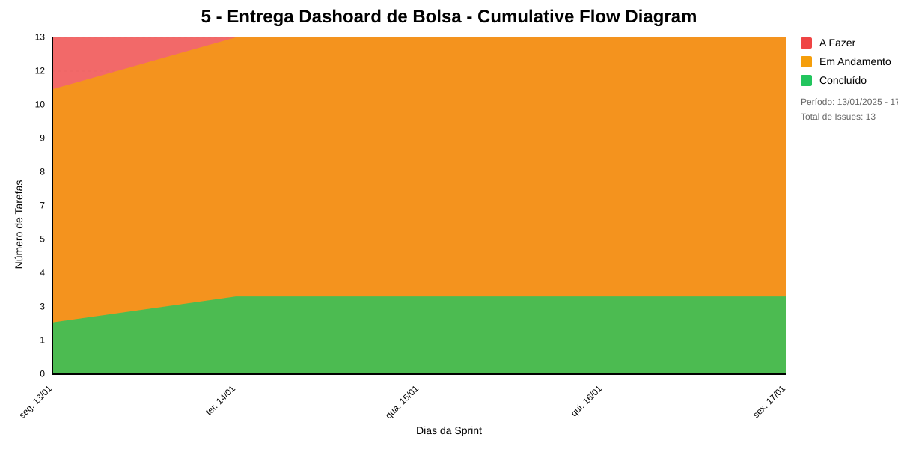

# 5 - ENTREGA DASHOARD DE BOLSA
finalizar o prototipo, e fazer o deploy do dashboard de bolsa na PRODEST

## Dados do Sprint
* **Goal**:  finalizar o prototipo, e fazer o deploy do dashboard de bolsa na PRODEST
* **Data Início**: 13/01/2025
* **Data Fim**: 17/01/2025
* **Status**: IN_PROGRESS
## Sprint Backlog

|Nome |Resposável |Data de Inicío | Data Planejada | Status|
|:----|:--------  |:-------:       | :----------:  | :---: |
|Estudar Live Connection|Felipe Costabeber|13/01/2025|13/01/2025|DOING|
|Implantar Live Connection|Felipe Costabeber|13/01/2025|13/01/2025|TODO|
|Deploy do protótipo de Bolsa na Prodest|Mateus Lannes |10/01/2025|10/01/2025|TODO|
|transferir Paineis para a versão do Power BI Desktop adaptado para RS, versão maio 2024|Mateus Lannes |10/01/2025|10/01/2025|TODO|
|transferir Paineis para a versão do Power BI Desktop adaptado para RS, versão maio 2023|Mateus Lannes |10/01/2025|10/01/2025|TODO|
|transferir Paineis para a versão do Power BI Desktop adaptado para RS, versão maio 2024|Mateus Lannes |13/01/2025|13/01/2025|DONE|
|transferir Paineis para a versão do Power BI Desktop adaptado para RS, versão maio 2023|Mateus Lannes |14/01/2025|14/01/2025|DOING|
|Aprimorar Protótipo do Painel de Bolsa|Felipe Costabeber|13/01/2025|13/01/2025|DONE|
|Aprimorar Protótipo do Painel de Bolsa|Mateus Lannes |13/01/2025|13/01/2025|DONE|
|Criar nova página de Bolsa|Mateus Lannes |13/01/2025|13/01/2025|DONE|
|Aprimorar Protótipo do Painel de Bolsa|Mateus Lannes |14/01/2025|14/01/2025|TODO|
|Criar DAGs com tratamento de dados para Bolsa|Mateus Lannes |13/01/2025|13/01/2025|TODO|
|Tratar dados de Bolsa|Mateus Lannes |13/01/2025|13/01/2025|TODO|

# Análise de Dependências do Sprint

Análise gerada em: 14/01/2025, 15:22:28

## 🔍 Grafo de Dependências

```mermaid
graph BT
    classDef sprint fill:#a8e6cf,stroke:#333,stroke-width:2px;
    classDef done fill:#98fb98,stroke:#333,stroke-width:2px;
    classDef external fill:#ffd3b6,stroke:#333,stroke-width:1px;
    backlogsprint5.desenvolverdashboardbolsa.criacaodedagsbolsa["🔍 backlogsprint5.desenvolverdashboardbolsa.criacaodedagsbolsa<br>⚠️ Dependência Externa"]:::external
    liveconnection.estudarliveconnection["📝 Tarefa: Estudar Live Connection<br>📊 Estado: DOING<br>👤 Responsável: Felipe Costabeber"]:::sprint
    liveconnection.implantarliveconnection["📝 Tarefa: Implantar Live Connection<br>📊 Estado: TODO<br>👤 Responsável: Felipe Costabeber"]:::sprint
    deployprototipobolsaprodest.deployprototipobolsaprodest.deployprototipobolsaprodest["📝 Tarefa: Deploy do protótipo de Bolsa na Prodest<br>📊 Estado: TODO<br>👤 Responsável: Mateus Lannes "]:::sprint
    deployprototipobolsaprodest.deployprototipobolsaprodest.deployprototipobolsaprodestrs["📝 Tarefa: transferir Paineis para a versão do Power BI Desktop adaptado para RS, versão maio 2024<br>📊 Estado: TODO<br>👤 Responsável: Mateus Lannes "]:::sprint
    deployprototipobolsaprodest.deployprototipobolsaprodest.deployprototipobolsaprodestrs2["📝 Tarefa: transferir Paineis para a versão do Power BI Desktop adaptado para RS, versão maio 2023<br>📊 Estado: TODO<br>👤 Responsável: Mateus Lannes "]:::sprint
    deployprototipobolsaprodest.deployprototipobolsaprodestrs["📝 Tarefa: transferir Paineis para a versão do Power BI Desktop adaptado para RS, versão maio 2024<br>📊 Estado: DONE<br>👤 Responsável: Mateus Lannes "]:::done
    deployprototipobolsaprodest.deployprototipobolsaprodestrs2["📝 Tarefa: transferir Paineis para a versão do Power BI Desktop adaptado para RS, versão maio 2023<br>📊 Estado: DOING<br>👤 Responsável: Mateus Lannes "]:::sprint
    aprimorarprototipopainelbolsa.aprimorarprototipopainelbolsamoises["📝 Tarefa: Aprimorar Protótipo do Painel de Bolsa<br>📊 Estado: DONE<br>👤 Responsável: Mateus Lannes "]:::done
    aprimorarprototipopainelbolsa.criarnovapagina["📝 Tarefa: Criar nova página de Bolsa<br>📊 Estado: DONE<br>👤 Responsável: Mateus Lannes "]:::done
    aprimorarprototipopainelbolsa.aprimorarprototipopainelbolsavitor["📝 Tarefa: Aprimorar Protótipo do Painel de Bolsa<br>📊 Estado: TODO<br>👤 Responsável: Mateus Lannes "]:::sprint
    criacaodedagsbolsa.criardagsdebolsa["📝 Tarefa: Criar DAGs com tratamento de dados para Bolsa<br>📊 Estado: TODO<br>👤 Responsável: Mateus Lannes "]:::sprint
    tratamentodedadosbolsapowerquery.tratardadosbolsa["📝 Tarefa: Tratar dados de Bolsa<br>📊 Estado: TODO<br>👤 Responsável: Mateus Lannes "]:::sprint
    tratamentodedadosbolsapowerquery.tratardadosbolsa -.-> backlogsprint5.desenvolverdashboardbolsa.criacaodedagsbolsa
```

**Legenda:**
- 🟢 Verde Claro: Issues no sprint
- 🟢 Verde Escuro: Issues concluídas
- 🟡 Laranja: Dependências externas ao sprint
- ➡️ Linha sólida: Dependência no sprint
- ➡️ Linha pontilhada: Dependência externa

## 📋 Sugestão de Execução das Issues

| # | Título | Status | Responsável | Dependências |
|---|--------|--------|-------------|---------------|
| 1 |Estudar Live Connection | DOING | Felipe Costabeber | 🆓 |
| 2 |Implantar Live Connection | TODO | Felipe Costabeber | 🆓 |
| 3 |Deploy do protótipo de Bolsa na Prodest | TODO | Mateus Lannes  | 🆓 |
| 4 |transferir Paineis para a versão do Power BI Desktop adaptado para RS, versão maio 2024 | TODO | Mateus Lannes  | 🆓 |
| 5 |transferir Paineis para a versão do Power BI Desktop adaptado para RS, versão maio 2023 | TODO | Mateus Lannes  | 🆓 |
| 6 |transferir Paineis para a versão do Power BI Desktop adaptado para RS, versão maio 2024 | DONE | Mateus Lannes  | 🆓 |
| 7 |transferir Paineis para a versão do Power BI Desktop adaptado para RS, versão maio 2023 | DOING | Mateus Lannes  | 🆓 |
| 8 |Aprimorar Protótipo do Painel de Bolsa | DONE | Mateus Lannes  | 🆓 |
| 9 |Criar nova página de Bolsa | DONE | Mateus Lannes  | 🆓 |
| 10 |Aprimorar Protótipo do Painel de Bolsa | TODO | Mateus Lannes  | 🆓 |
| 11 |Criar DAGs com tratamento de dados para Bolsa | TODO | Mateus Lannes  | 🆓 |
| 12 |Tratar dados de Bolsa | TODO | Mateus Lannes  | backlogsprint5.desenvolverdashboardbolsa.criacaodedagsbolsa⚠️ |

**Legenda das Dependências:**
- 🆓 Sem dependências
- ✅ Issue concluída
- ⚠️ Dependência externa ao sprint

## Cumulative Flow

# Previsão da Sprint

## ✅ SPRINT PROVAVELMENTE SERÁ CONCLUÍDA NO PRAZO

- **Probabilidade de conclusão no prazo**: 100.0%
- **Data mais provável de conclusão**: qui., 16/01/2025
- **Dias em relação ao planejado**: 0 dias
- **Status**: ✅ No Prazo

### 📊 Métricas Críticas

| Métrica | Valor | Status |
|---------|--------|--------|
| Velocidade Atual | 4.0 tarefas/dia | ✅ |
| Velocidade Necessária | 3.0 tarefas/dia | - |
| Dias Restantes | 3 dias | - |
| Tarefas Restantes | 9 tarefas | - |

### 📅 Previsões de Data de Conclusão

| Data | Probabilidade | Status | Observação |
|------|---------------|---------|------------|
| qui., 16/01/2025 | 100.0% | ✅ No Prazo | 📍 Data mais provável |

### 📋 Status das Tarefas

| Status | Quantidade | Porcentagem |
|--------|------------|-------------|
| Concluído | 4 | 30.8% |
| Em Andamento | 2 | 15.4% |
| A Fazer | 7 | 53.8% |

## 💡 Recomendações

1. ✅ Mantenha o ritmo atual de 4.0 tarefas/dia
2. ✅ Continue monitorando impedimentos
3. ✅ Prepare-se para a próxima sprint

## ℹ️ Informações da Sprint

- **Sprint**: 5 - Entrega Dashoard de Bolsa
- **Início**: seg., 13/01/2025
- **Término Planejado**: sex., 17/01/2025
- **Total de Tarefas**: 13
- **Simulações Realizadas**: 10,000

---
*Relatório gerado em 14/01/2025, 15:22:28*
