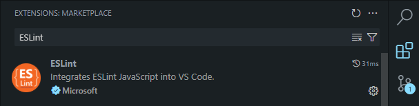
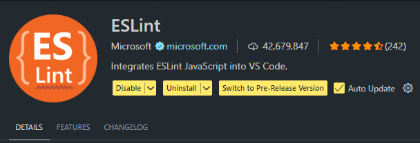
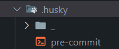
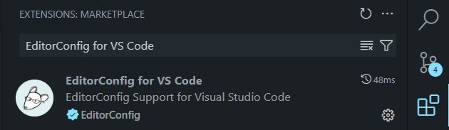
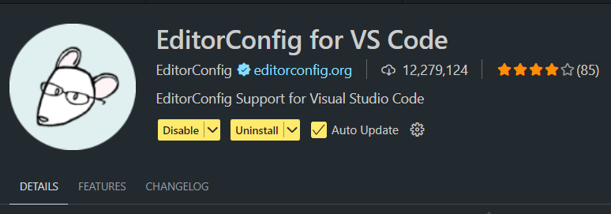
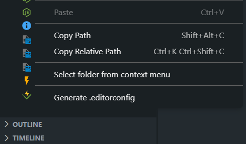

# Trilha de padronização de código com ESLint

---

    ## Padronização do Typescript e Vue no Front-End

    - Em razão da crescente dimensão do projeto ConectaFAPES, tornou-se necessária a adoção de tecnologias que organizem o código automaticamente. Para garantir o resultado esperado,
    utilizamos ESLint, Husky e EditorConfig.

---

## O que são essas ferramentas?

    ### 1. ESLint

        - ESLint é uma ferramenta de análise estática de código open-source, pluggable e configurável para JavaScript e TypeScript, que auxilia desenvolvedores a identificar e corrigir padrões problemáticos e impor convenções de codificação. Ele adota uma abordagem baseada em regras, onde cada regra pode ser ativada, desativada ou personalizada, e seu ecossistema suporta plugins para frameworks como React, Vue e TypeScript.

        - Ferramenta complementar: o Lint-Staged é uma ferramenta open-source que executa tarefas de linting apenas nos arquivos em status "staged" pelo Git, evitando uso desnecessário de processamento e garantindo qualidade de código. Após a execução, qualquer modificação gerada pelas tarefas é automaticamente reaplicada ao índice, assegurando que correções façam parte do commit.

    ### 2. Husky

        - Husky é uma ferramenta que permite configurar e gerenciar hooks do Git, como pre-commit e pre-push, de forma simples e automatizada. Ela é usada para garantir a qualidade do código ao executar tarefas como linting, testes ou formatação antes que as alterações sejam registradas no repositório. Integrando-se facilmente com ferramentas como ESLint e Prettier, o Husky ajuda a manter padrões consistentes no projeto.

    ### 3. EditorConfig

        - EditorConfig é um formato de arquivo e conjunto de plugins para editores de texto e IDEs que auxiliam na manutenção de estilos de codificação consistentes entre diferentes colaboradores e ferramentas. Ao incluir um arquivo .editorconfig em formato "initialization" na raiz do projeto, editores compatíveis ajustam automaticamente suas configurações de formatação conforme regras definidas, garantindo uniformidade no código.

## Instalação das ferramentas

    - Pré-requisitos:
        - Node.js instalado (versão ^18.18.0, ^20.9.0 ou ≥21.1.0)

    ### 1. ESLint
        - Busque por "ESLint" na aba de extensões da sua IDE e instale a extensão que pertence a "Microsoft". Para exemplo utilizaremos o Visual Studio Code.

            

            

        - Execute os comandos abaixo no terminal da sua IDE. Opte por usar o terminal Git Bash para evitar problemas com comandos desconhecidos.

            - Instalação como dependência de desenvolvimento

                ```bash
                npm install --save-dev eslint @eslint/js
                ```

            - Gerar o arquivo de configuração (eslint.config.js ou .mjs)

                ```bash
                npm init @eslint/config@latest
                ```

        - Para gerar o arquivo de configuração é preciso fazer algumas escolhas, que serão brevemente explicadas abaixo.

            - Nessa escolha é definido quais tipos de arquivos devem sofrer linting (selecione com barra de espaço)

                ```bash
                @eslint/create-config: v1.8.1

                ? What do you want to lint? ...
                √ JavaScript
                √ JSON
                √ JSON with comments
                √ JSON5
                √ Markdown
                √ CSS
                ```

            - Nessa escolha é definido o que o ESLint deve fazer ao ser executado (selecione com enter)

                ```bash
                @eslint/create-config: v1.8.1

                ? How would you like to use ESLint? ...
                > To check syntax only
                > To check syntax and find problems
                ```
            - Nessa escolha é definido o formato de módulos que o projeto utiliza (selecione com enter)

                ```bash
                @eslint/create-config: v1.8.1

                ? What type of modules does your project use? ...
                > JavaScript modules (import/export)
                > CommonJS (require/exports)
                > None of these
                ```

            - Nessa escolha é definido qual o framework que o projeto utiliza (selecione com enter)

                ```bash
                @eslint/create-config: v1.8.1

                ? Which framework does your project use? ...
                > React
                > Vue.js
                > None of these
                ```

            - Nessa escolha é definido se o projeto utiliza Typescript (selecione com enter)

                ```bash
                @eslint/create-config: v1.8.1

                ? Does your project use TypeScript? » no / yes
                ```

            - Nessa escolha é definido onde o projeto é executado (selecione com barra de espaço)

                ```bash
                @eslint/create-config: v1.8.1

                ? Where does your code run? ...
                √ Browser
                √ Node
                ```

            - Nessa parte conforme as configurações escolhidas, o ESLint apresenta as dependências que são necessárias para que o seu projeto funcione corretamente, é preciso selecionar "sim" (selecione com enter)

                ```bash
                @eslint/create-config: v1.8.1

                The config that you've selected requires the following dependencies:

                eslint, @eslint/js, globals, typescript-eslint, eslint-plugin-vue
                ? Would you like to install them now? » No / Yes
                ```

            - Nessa escolha é definido o instalador de pacotes que será utilizado para instalar as dependências, escolha o que está instalado em seu computador (selecione com enter)

                ```bash
                @eslint/create-config: v1.8.1

                ? Which package manager do you want to use? ...
                > npm
                > yarn
                > pnpm
                > bun
                ```

            - Após essa última escolha o ESLint estará instalado.

    ### 2. Husky
        - O Husky não possui extensão, logo sua instalação e feita puramente pelo terminal. Execute os comandos abaixo no terminal da sua IDE. Opte por usar o terminal Git Bash para evitar problemas com comandos desconhecidos.

            - Instale o Husky como dependência de desenvolvimento

                ```bash
                npm install --save-dev husky
                ```

            - Inicie o Husky (criação e configuração automática dos arquivos básicos)

                ```bash
                npx husky init
                ```

            - Após esse comando, a pasta do Husky já será criada.

                

    ### 3. EditorConfig
        - Busque por "EditorConfig for VS Code" na aba de extensões da sua IDE e instale a extensão que pertence a "EditorConfig". Para exemplo utilizaremos o Visual Studio Code.

            

            

        - Para gerar o arquivo de configuração é preciso clicar com o botão direito na raiz do projeto no explorador de arquivos da IDE e percorrer até a última opção "Generate .editorconfig" e selecioná-la.

            

        - Após isso o EditorConfig estará devidamente instalado.

## Configurando as ferramentas

    ### 1. ESLint
        Para configurar o ESLint, é preciso criar um arquivo do tipo eslint.config para definir as regras personalizadas para o seu projeto. Esse arquivo possui três diferentes extensões:

            1. eslint.config.js: é a forma padrão e acompanha o módulo conforme a configuração de "type" no package.json - Sem "type": "module", deve usar sintaxe CommonJS (require/module.exports). Com "type": "module", permite sintaxe ESM (import/export).

            2. eslint.config.cjs: força sempre CommonJS (independente de "type"), exportando via module.exports. Útil quando seu projeto é ESM, mas você precisa que a configuração do ESLint permaneça em CJS.

            3. eslint.config.mjs: força sempre ES Module (independente de "type"), exportando via export default. Ideal se seu projeto usa CommonJS, mas você quer escrever o config do ESLint em ESM.

        O tipo de arquivo escolhido para o projeto do ConectaFAPES foi o "eslint.config.mjs" devido as tecnologias que são utilizadas para desenvolvimento. Na pasta raiz do projeto, crie um arquivo com `Ctrl + n` ou selecionando "New file..." com o botão direito do mouse e nomeie o arquivo como `eslint.config.mjs`.

        O "Anthony's ESLint config preset" foi escolhido para ser a base da nova configuração que foi adicionada ao projeto do ConectaFAPES. Isso foi feito para agilizar o processo de integração do ESLint ao repositório de desenvolvimento, tendo em vista que a análise individual das incontáveis regras de linting existentes seria próximo ao impossível.

        #### --> Como instalar o Anthony's ESLint config preset
            1. Acesse o repositório do Anthony's - [Link para o repositório](https://github.com/antfu/eslint-config)

            2. Agora, execute o comando:

                ```bash
                npm install eslint @antfu/eslint-config --save-dev
                ```

            3. Agora crie ou abra o seu arquivo `eslint.config.mjs` nas pasta raiz e escreva o seguinte:

                ```tsx
                import antfu from '@antfu/eslint-config'

                export default antfu()
                ```

            4. Todas as configurações serão escritas dentro dos parênteses "antfu()".

        Abaixo será brevemente explicado a estrutura do arquivo de configuração e algumas das regras alteradas para adequar o linting conforme o resultado desejado (os comentários explicam as funcionalidades do código imediatamente abaixo):

        ```tsx
        import antfu from '@antfu/eslint-config'

        export default antfu({
        type: 'app', // Indica que o projeto é uma aplicação e não uma biblioteca ou outro tipo de projeto
        vue: true, // Habilita suporte para projetos Vue.js
        root: true, // Define este arquivo como a configuração raiz do ESLint
        typescript: true, // Habilita suporte para TypeScript no projeto

            // A propriedade "extends": é usada para herdar configurações de regras predefinidas de outros
            // conjuntos de regras
            extends: [
                'eslint:recommended',
                'plugin:vue/vue3-essential',
                'plugin:@typescript-eslint/recommended',
                '@vue/eslint-config-typescript/recommended',
            ],

            // A propriedade "env": Define os ambientes globais disponíveis no código. Esses ambientes
            // fornecem variáveis ou funcionalidades específicas que o linter reconhece como válidas.
            // Essa configuração habilita o suporte para macros do compilador do Vue 3 no ESLint.
            // Essas macros são usadas no contexto do script setup e incluem funcionalidades como
            // defineProps, defineEmits, defineExpose e withDefaults
            env: {
                'vue/setup-compiler-macros': true,
            },

            // Define quais arquivos ou diretórios devem ser ignorados pelo linter
            ignores: ['*.md', '*.json', '*.yml', '*.yaml', '*.lock', 'dist', 'node_modules'],

            rules: {
                // Desativa a regra que impede a re-declaração de variáveis ou funções no TypeScript
                '@typescript-eslint/no-redeclare': 'off',

                //Desativa a regra que proíbe o uso de await no nível superior de um módulo
                'antfu/no-top-level-await': 'off',

                // Exige o uso consistente de type em vez de interface para definições de tipos no TypeScript
                '@typescript-eslint/consistent-type-definitions': ['error', 'type'],

                //Enforce a ordenação de imports com base em critérios definidos (como ordem alfabética)
                'perfectionist/sort-imports': ['error', { tsconfigRootDir: '.' }],

                // Proíbe o uso de console no código, exceto para console.info
                'no-console': ['error', { allow: ['info'] }],

                // Desativa a regra que exige pares de getters e setters em objetos
                'accessor-pairs': 'off',

                // Gera erro se houver código inatingível após um retorno, lançamento de exceção ou outro
                // fluxo de controle
                'no-unreachable': 'error',

                // Desativa a regra que impede o uso simultâneo de v-if e v-for no mesmo elemento
                'vue/no-use-v-if-with-v-for': 'off',

                // Proíbe o uso do tipo any no TypeScript
                '@typescript-eslint/no-explicit-any': 'error',

                // Desativa a validação de slots no Vue
                'vue/valid-v-slot': 'off',

                // Desativa a regra que exige o uso do prefixo node: ao importar módulos nativos do Node.js
                'unicorn/prefer-node-protocol': 'off',

                // Permite nomes de componentes com uma única palavra
                'vue/multi-word-component-names': 'off',

                // Exige que todos os componentes Vue tenham uma propriedade name
                'vue/require-name-property': 'error',

                // Desativa a regra que exige ou proíbe vírgulas no final de listas
                '@typescript-eslint/comma-dangle': 'off',

                // Desativa a regra que exige o uso de === e !== em vez de == e !=
                '@typescript-eslint/eqeqeq': 'off',

                // Desativa a regra que impede o uso de variáveis ou funções antes de serem definidas
                '@typescript-eslint/no-use-before-define': 'off',

                // Desativa a regra que proíbe o uso de alert, confirm e prompt
                'no-alert': 'off',

                // Proíbe o uso de comentários como @ts-ignore ou @ts-expect-error
                '@typescript-eslint/ban-ts-comment': 'error',

                // Proíbe variáveis duplicadas no escopo de templates Vue
                'vue/no-template-shadow': 'error',

                // Gera erro para variáveis não utilizadas, mas ignora variáveis chamadas props ou emits
                '@typescript-eslint/no-unused-vars': ['error', { varsIgnorePattern: '^(props|emits)$' }],

                // Gera erro para variáveis não utilizadas, mas ignora variáveis chamadas props ou emits
                'vue/html-self-closing': [
                    'error',
                    {
                        html: {
                            void: 'always', // Tags void (ex.: ) devem ser auto-fechadas
                            normal: 'never', // Tags normais (ex.: <div>) não devem ser auto-fechadas
                            component: 'always', // Tags de componentes devem ser auto-fechadas
                        },
                        svg: 'always',
                        math: 'always',
                    },
                ],

                // Exige que o conteúdo de elementos HTML de uma única linha tenha uma nova linha:
                'vue/singleline-html-element-content-newline': [
                'error',
                    {
                        ignoreWhenNoAttributes: true, // Ignora quando não há atributos
                        ignoreWhenEmpty: true, // Ignora quando o elemento está vazio
                        ignores: ['pre', 'textarea'], // Ignora elementos como <pre> e <textarea>
                    },
                ],

                // Define o espaçamento ao redor de colchetes de fechamento:
                'vue/html-closing-bracket-spacing': [
                'error',
                    {
                        // Sem espaço antes do colchete de fechamento na tag de abertura
                        startTag: 'never',
                        // Sem espaço antes do colchete de fechamento na tag de fechamento
                        endTag: 'never',
                        // Sempre adicionar espaço antes do colchete de fechamento em tags auto-fechadas
                        selfClosingTag: 'always',
                    },
                ],

                // Exige o uso do estilo de chaves 1TBS (One True Brace Style)
                'style/brace-style': ['error', '1tbs'],

                // Define o estilo de delimitadores em membros de interfaces, tipos e classes
                'style/member-delimiter-style': [
                    'error',
                    {
                        // Usa ponto e vírgula (;) em membros multilinha e exige o delimitador
                        // no último membro
                        multiline: {
                            delimiter: 'semi',
                            requireLast: true,
                        },
                        // Usa vírgula (,) em membros de uma única linha e não exige o delimitador
                        // no último membro
                        singleline: {
                            delimiter: 'comma',
                            requireLast: false,
                        },
                    },
                ],
            },
        })

        ```

    ### 2. Husky
        - Para configurar o Husky para agir durante os pré commits, é preciso acessar o arquivo nomeado `pre-commit` na pasta `.husky`. Esse arquivo contém o script que será executado toda vez antes de se realizar um commit. Por padrão ele é gerado com `npm test` todavia iremos alterá-lo para o código abaixo.

            ```bash
            echo "Executando ESLint..."
            if npm exec lint-staged; then
                echo "✔ ESLint executado com sucesso. Você pode prosseguir com o commit."
            else
                echo "❌ O commit foi bloqueado porque o ESLint encontrou erros. Corrija-os para continuar."
                exit 1
            fi

            ```

        - Esse código executa o ESLint com o Lint-Staged e apresenta o resultado de sucesso ou fracasso do linting, apresentando uma mensagem em texto amigável que auxilia o desenvolvedor a entender o que esta acontecendo.

    ### 3. EditorConfig
        - Para configurar o EditorConfig é bem simples. Acesse o arquivo `.editorconfig` que já contém a configuração padrão. e então adicione as mudanças necessárias nas regras.

            ```tsx
            root = true

            [*]
            indent_style = space
            indent_size = 4
            end_of_line = crlf
            charset = utf-8
            trim_trailing_whitespace = false
            insert_final_newline = false

            ```

        - Após as mudanças:

            ```tsx
            // Define que as configurações do EditorConfig escrita aqui serão aplicadas apenas aos
            // arquivos com as extensões abaixo
            [*.{js,jsx,mjs,cjs,ts,tsx,mts,cts,vue,css,scss,sass,less,styl}]

            charset = utf-8
            // O tamanho da identação que deve ser é 2 e não 4
            indent_size = 2
            indent_style = space
            // O editor adiciona uma linha em branco ao final do arquivo automaticamente
            insert_final_newline = true
            // O editor remove os espaços em branco ao final das linhas automaticamente
            trim_trailing_whitespace = true

            // O formato de final de linha utilizado é o padrão linux (garante portabilidade do código)
            end_of_line = lf
            // Limita o comprimento máximo de uma linha de código
            max_line_length = 100

            ```

## Referências

    - [GitHub - Anthony's ESLint config preset](https://github.com/antfu/eslint-config)

    - [NPM JS - Lint-Staged](https://www.npmjs.com/package/lint-staged)

    - [ESLint - Documentação oficial](https://eslint.org/docs/latest/use/getting-started)

    - [Husky - Documentação oficial](https://typicode.github.io/husky/get-started.html)

    - [EditorConfig - Documentação oficial](https://editorconfig.org/)

    - [DEV - Padronização de código por Vitor DevSP](https://dev.to/vitordevsp/padronizacao-de-codigo-com-eslint-e-editorconfig-33op)

    - [YouTube - Lint como um desenvolvedor sênior com eslint + husky + lint staged + ações do github](https://www.youtube.com/watch?v=Kr4VxMbF3LY&t=86s)
