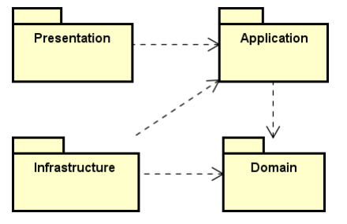

# Documentação e Tutorial C# - Clean Architecture

# Documentação do Projeto RestauranteAPI

# Visão Geral

O **RestauranteAPI** é um projeto de CRUD básico desenvolvido seguindo os princípios da **Clean Architecture** e do padrão **CQRS (Command Query Responsibility Segregation)**. O objetivo principal é proporcionar **melhor desempenho, segurança e escalabilidade** para a API, garantindo um código modular e de fácil manutenção.

---

# 🏗 Clean Architecture e CQRS

# Clean Architecture

A **Clean Architecture** busca criar um sistema que seja **fácil de entender, manter e modificar**, além de ser **independente de tecnologias específicas**. Para isso, a arquitetura organiza o sistema em **camadas bem definidas**, cada uma com sua responsabilidade.

-   As **camadas mais internas** são as mais importantes e contêm as **regras de negócio** do sistema.
-   As **camadas mais externas** lidam com aspectos técnicos, como **bancos de dados, frameworks e interfaces de usuário**.

Esse modelo **reduz o impacto de mudanças no sistema**, garantindo que modificações em uma camada afetem minimamente as outras.

---

## Integração do CQRS com a Clean Architecture

O **CQRS (Command Query Responsibility Segregation)** complementa a **Clean Architecture** ao separar as operações de **leitura (Query)** e **escrita (Command)**, garantindo maior **desempenho, escalabilidade e segurança**.

**Benefícios da integração CQRS + Clean Architecture:**

-   Melhora o desempenho do sistema ao otimizar consultas e escritas separadamente.
-   Facilita a manutenção e evolução do código.
-   Permite a introdução rápida de novas funcionalidades.
-   Organiza a lógica de negócios de forma clara e modular.
-   Torna o código mais compreensível e testável.

## 🔄 Estrutura

A arquitetura é dividida em **quatro camadas principais, conforme a imagem 1**:

**1 - Domain:** Contém as **regras de negócio** do sistema. Inclui **entidades, interfaces, validações e segurança**. **Totalmente independente** de frameworks ou tecnologias externas, garantindo reutilização e flexibilidade.

2 - **Application:** Define os **casos de uso** da aplicação. Orquestra a comunicação entre **Domain** e as camadas externas. Implementa os **serviços e manipuladores de comandos (CQRS)**.

3 - **Infrastructure:** Lida com a **persistência de dados, bibliotecas externas e integrações**. Implementa repositórios, gateways e comunicação com APIs externas.

4 - **Presentation:** Camada responsável pela **interface do usuário e entrada de dados**. Contém **controllers, views e adaptadores** que se comunicam com a camada **Application**.



Imagem 1 (Estrutura de comunicação entre as camadas)

---

### 🔎 **Recapitulando**

-   As dependências devem sempre apontar para dentro: camadas externas dependem das internas, nunca o contrário.
-   A independência de frameworks é essencial: a lógica de negócio não deve depender diretamente de tecnologias específicas.
-   O código resultante deve ser altamente testável, garantindo confiabilidade no desenvolvimento e manutenção.

# **Conceitos Básicos importantes**

**1 - O que é uma API?**

API (**Application Programming Interface**) é um conjunto de regras que permite que diferentes sistemas se comuniquem. No contexto da web, **APIs RESTful** são amplamente usadas para fornecer serviços e dados via HTTP.

**2 - O que são entidades?**

**No contexto do desenvolvimento de softwares, entidades são objetos que representam algo do mundo real**, possuindo uma identidade única e atributos que descrevem suas características.

Características de uma Entidade

1. **Identidade Única** – Cada entidade tem um identificador exclusivo (exemplo: `id`).
2. **Estado** – Possui atributos que armazenam informações (exemplo: `nome`, `preço`, `descrição`).
3. **Persistência** – Normalmente está associada ao banco de dados.
4. **Lógica de Negócio** – Pode conter regras, como validações e cálculos.

**3 - Métodos HTTP (CRUD)**

Os métodos HTTP definem as ações que podem ser realizadas em uma API:

-   **GET** → Recupera dados (exemplo: buscar usuários).
-   **POST** → Cria novos recursos (exemplo: cadastrar um usuário).
-   **PUT** → Atualiza um recurso existente por completo.
-   **PATCH** → Atualiza parcialmente um recurso.
-   **DELETE** → Remove um recurso.

**4 - Atalhos para facilitar a programação no Visual Studio**

-   Criar uma nova Classe: Ctrl Shift A;
-   Adicionar construtor, implementar interfaces ou métodos abstratos: Ctrl .

---

## Visão Geral da API

O CRUD básico desenvolvido é referente a um restaurante, que possui as Entidades **Cliente, Cidade e Pedido** e está representado na imagem abaixo.


**Obs:** Os tipos das variáveis na API não seguem o padrão da imagem. A imagem é meramente ilustrativa.

# **Passo a Passo do CRUD com Clean Architecture e CQRS**

## Passo 1 - Criando o Projeto

### **1.1 Abrindo o Visual Studio**

-   Inicie o **Visual Studio**.
-   Clique em **Criar um novo projeto**.

### **1.2 Criando uma Solução em Branco**

-   Selecione a opção **Solução em Branco**.
-   Defina um nome para o projeto. Por convenção, os projetos que implementam APIs geralmente terminam com API, então nomearemos como **RestauranteAPI**.

### **1.3 Criando as Camadas do Projeto**

Crie 3 pastas que representarão as camadas do projeto:

**Obs:** Não adicione nada nestas pastas ainda. Ao decorrer do tutorial você adicionará os Projetos à essas pastas!

1**.3.1 Crie a pasta Core:**

-   `RestauranteAPI.Domain` → Responsável pelas **regras de negócio,** entidades, interfaces, validações, etc.
-   `RestauranteAPI.Application` → Contém os **casos de uso** e a lógica de aplicação.

1**.3.2 Crie a pasta Infrastructure:**

-   `RestauranteAPI.Infrastructure` → Cuida da **persistência de dados** e serviços externos.

    1.3.3 Crie a pasta Presentation:

-   `RestauranteAPI.Presentation` → Implementa a **API**, onde ficam os controladores, algumas configurações do projeto (Como o DockerFile) e a Program.cs.

## **Passo 2 - Domain**

### **2.1 Criando a camada Domain:**

-   Clique com o botão direito sobre a pasta **Core**.
-   Selecione **Adicionar** → **Novo Projeto**.
-   Escolha **Biblioteca de Classes**.
-   Nomeie o projeto como `RestauranteAPI.Domain` e clique em **Criar**.

---

### **2.2 Criando a pasta Common**

Dentro da **camada Domain**, crie uma pasta chamada **Common**, que conterá arquivos com funcionalidades comuns às entidades do sistema.

**2.2.1 Criando BaseEntity.cs**

Dentro desta pasta, crie uma nova classe chamada `BaseEntity.cs`, que será uma classe base para todas as entidades do sistema. Segue o código:

```csharp

using System.Reflection;

namespace RestauranteAPI.Domain.Common
{
    public class BaseEntity
    {
        // Identificador único da entidade. Mesmo que um item seja excluído, esse ID nunca será repetido.
        public Guid Id { get; set; }

        // Data em que a entidade foi criada
        public DateTimeOffset DateCreated { get; set; } = DateTimeOffset.Now;

        // Data da última atualização da entidade (pode ser nula caso nunca tenha sido atualizada)
        public DateTimeOffset? DateUpdated { get; set; }

        // Data em que a entidade foi deletada (nula se ainda não foi removida)
        public DateTimeOffset? DateDeleted { get; set; }

        // Método para definir um novo ID único ao criar uma entidade
        public void Create()
        {
            Id = Guid.NewGuid();
        }

        // Método para atualizar os atributos de uma entidade sem sobrescrever o ID e a data de criação
        public void Update(BaseEntity entity)
        {
            // Percorre todas as propriedades da entidade recebida como parâmetro
            foreach (PropertyInfo property in entity.GetType().GetProperties())
            {
                // Só atualiza propriedades que podem ser escritas e que não sejam o ID ou a data de criação
                if (property.CanWrite && property.Name != nameof(Id) && property.Name != nameof(DateCreated))
                {
                    property.SetValue(this, property.GetValue(entity));
                }
            }

            // Atualiza a data de modificação para o momento atual
            this.DateUpdated = DateTimeOffset.Now;
        }

        // Método para marcar a entidade como deletada
        public void Delete()
        {
            this.DateDeleted = DateTimeOffset.Now;
        }
    }
}
```

---

🔹**Explicação da BaseEntity**

A `BaseEntity` é uma classe **genérica**, ou seja, serve como base para outras entidades no projeto. Sempre que se cria uma nova entidade, ela pode **herdar** (`: BaseEntity`) dessa classe para reutilizar funcionalidades comuns.

🔹 **Por que usamos essa classe?**

1. **Evita duplicação de código:** Todas as entidades compartilham propriedades como `Id`, `DateCreated`, `DateUpdated` e `DateDeleted`. Assim, não precisamos repetir esse código em cada classe.
2. **Garante que todas as entidades tenham um identificador único (`Id`):** O `Guid` é utilizado porque **gera um identificador global único**, evitando problemas como IDs repetidos.
3. **Facilita rastreamento de alterações:** Atributos como `DateCreated`, `DateUpdated` e `DateDeleted` ajudam a manter um **histórico das entidades**.

**🔹Observações**

-   As Entidades no Domínio representam os conceitos de negócio e podem ou não ter a mesma estrutura dos dados salvos no banco;
-   Os métodos de **`Create`**, **`Delete`**, **`Update`** e etc desta camada NÃO são os métodos que farão a persistência das entidades no banco. A persistência ocorre na camada `Infrastructure`

---

### **2.3 Criação de** Validations

Em `RestauranteAPI.Domain`, crie a pasta `Validations`. Nesta pasta, crie uma classe chamada `DomainExceptionValidation`.cs que terá uma lista de erros, conforme o código a seguir:

```csharp
namespace RestauranteAPI.Domain.Validation
{
    /*A exceção de domínio que será lançada caso ocorra algum erro no Domínio,
    cada camada terá sua validação*/
    public class DomainValidationException : Exception
    {
        public List<string> Errors { get; }

        public DomainValidationException(List<string> validationsErrors)
        {
            Errors = validationsErrors;
        }

        //Facilita a visualização da exceção
        public override string ToString()
        {
            return string.Join(Environment.NewLine, Errors);
        }
    }
}
```

---

### **2.4 Criação da entidades**

Para criar as entidades, crie uma pasta **Entities**, ainda em **`RestauranteAPI.Domain`** e crie as classes das entidades `Cliente`, `Cidade` e `Pedido` Conforme os códigos a seguir:

**2.4.1 Código da entidade Cliente**

```csharp
using RestauranteAPI.Domain.Common;
using RestauranteAPI.Domain.Validation;

  namespace RestauranteAPI.Domain.Entities
    {
    public  class Cliente : BaseEntity {

      public string Nome { get; set; }
      public string Telefone { get; set; }
      public String Identification { get; set; }
      public Guid? ClienteCidadeId { get; set; }
      //OneToMany
      public ICollection<Pedido>? Pedidos { get; set;}
      //ManyToOne
      public Cidade? Cidade { get; set; }

        public Cliente()
        {
        }

        public Cliente(string nome,string telefone,String identification, Guid clientecidadeid, Guid cidadeId)
        {

          var validationErrors = ClienteValidation(nome,telefone,identification,clientecidadeid, cidadeId);
          if (validationErrors.Count > 0)
            {
              throw new DomainValidationException(validationErrors);
            }
          Nome = nome;
          Telefone = telefone;
          Identification = identification;
          ClienteCidadeId = clientecidadeid;
          ClienteCidadeId = cidadeId;

        }

        /*Apenas uma das várias validações. Essas vallidações são necessárias para retornar o erro
            na camada mais "rasa" possível, quanto antes uma exceção for lançada, melhor. O intuito não ocorrer
            um erro no Banco de Dados*/
        private List<string>ClienteValidation(string nome,string telefone,String identification, Guid clientecidadeid, Guid cidadeId)
        {
            var errors = new List<string>();
            if (string.IsNullOrEmpty(nome))
            {
                errors.Add("O campo nome de Cliente é obrigatório!");
            }
            if (string.IsNullOrEmpty(telefone))
            {
                errors.Add("O campo telefone de Cliente é obrigatório!");
            }
            if (string.IsNullOrEmpty(identification))
            {
                errors.Add("O campo identification de Cliente é obrigatório!");
            }
            return errors;
        }
    }
  }
```

Agora, essa entidade **já possui** as propriedades `Id`, `DateCreated`, `DateUpdated`, e `DateDeleted` sem precisar declará-las novamente. Faremos o mesmo para as entidades `Cidade` e `Pedido`, conforme os códigos a seguir:

**2.4.2 Código da entidade Cidade**

```csharp
using RestauranteAPI.Domain.Common;
using RestauranteAPI.Domain.Validation;

namespace RestauranteAPI.Domain.Entities
{
    public  class Cidade : BaseEntity {
        public string Nome { get; set; }
        //Relação de 1 pra N com Cliente
        public ICollection<Cliente>? Clientes { get; set;}

        public Cidade()
        {
        }

        public Cidade(string nome)
        {
            var validationErrors = CidadeValidation(nome);

            if (validationErrors.Count > 0)
              throw new DomainValidationException(validationErrors);

            Nome = nome;
        }

        private List<string>CidadeValidation(string nome)
        {
            var errors = new List<string>();
            if (string.IsNullOrEmpty(nome))
            {
                errors.Add("O campo nome de Cidade é obrigatório!");
            }
            return errors;
        }
    }
}
```

**2.4.3 Código da entidade Pedido**

```csharp
using RestauranteAPI.Domain.Common;
using RestauranteAPI.Domain.Enums;
using RestauranteAPI.Domain.Validation;

  namespace RestauranteAPI.Domain.Entities
  {
        public  class Pedido : BaseEntity
        {
            public DateTimeOffset Data { get; set; }
            public decimal Valor { get; set; }
            public EstadoPedido EstadoPedido { get; set; }
            public Guid PedidoClienteId { get; set; }
            //ManyToOne
            public Cliente? Cliente { get; set; }

            public Pedido()
            {
            }

            public Pedido(DateTimeOffset data,decimal valor, Guid pedidoclienteid, Guid clienteId)
            {

              var validationErrors = PedidoValidation(data,valor,pedidoclienteid, clienteId);
              if (validationErrors.Count > 0)
                {
                  throw new DomainValidationException(validationErrors);
                }

              Data = data;
              Valor = valor;
              PedidoClienteId = pedidoclienteid;
              PedidoClienteId = clienteId;

            private List<string>PedidoValidation(DateTimeOffset data,decimal valor, Guid pedidoclienteid, Guid clienteId)
          {
            var errors = new List<string>();
                //Atributos como DateTimeOffSet não são inicializados como null, por isso a comparação com default
                if (data == default)
                {
                    errors.Add("O campo data do Pedido é obrigatório!");
                }
                if (valor < 0)
                {
                    errors.Add("O valor do pedido não pode ser negativo");
                }
                if (valor == default)
                {
                    errors.Add("O campo valor do pedido é obrigatório");
                }
                return errors;
          }
        }
    }
```

A Entidade **Pedido** possui uma diferença das outras, ela possui um Enum (`EstadoPedido`), que é um **tipo de dado especial** que define um conjunto de valores nomeados e constantes. Ele é útil para representar valores fixos e facilitar a leitura e manutenção do código.

---

### 2**.5 Criando Enums**

Em `RestauranteAPI.Domain`, crie uma pasta **Enums** e nela crie uma , classe, Enum chamado `BaseEnum.cs`. Nele há códigos comuns que deseja que seus Enums tenham, porém neste caso ela estará vazia.

**2.5.1 Código do `baseEnum`**

```csharp
namespace RestauranteAPI.Domain.Enums

{
    public enum Base {}
}
```

**2.5.2 Criando o Enum EstadoPedido**

Na mesma pasta crie uma , classe, Enum chamado “`EstadoPedido.cs`”, que receberá os estados do pedido, conforme o código abaixo:

```csharp
namespace RestauranteAPI.Domain.Enums
{
    public enum EstadoPedido
    {
        FEITO, //0
        CONCLUIDO, //1
        EM_ANDAMENTO //2
    }
}
```

---

### **2.6 Criação das Interfaces**

As interfaces são declaradas na **camada Domain** e, posteriormente, implementadas na camada **Infrastructure,** seguindo o princípio da **Inversão de Dependência**, um dos pilares do **SOLID**, e também é uma prática fundamental da **Clean Architecture**.

As interfaces são declaradas na camada **Domain, que** representa o núcleo do sistema, ou seja, a **regra de negócio**. Ela define o _"o que"_ deve ser feito, mas não se preocupa com *"*como*"* será feito. Por isso, as interfaces estão lá para definir **contratos** que descrevem comportamentos esperados, sem depender de detalhes de implementação.

**2.6.1 Criação do IBaseRepository**

Em `RestauranteAPI.Domain`, crie uma pasta `Interfaces` e, dentro de Interfaces crie uma pasta Common que conterá duas interfaces, `IBaseRepository`, `IUnityOfWork`.

-   `IBaseRepository` é uma interface que possui os métodos de comunicação com o banco de dados;
-   `IUnitOfWork` é responsável pelas alterações no banco. Uma explicação mais detalhada se encontra na implementação da interface, na classe UnitOfWork na camada Infrastructure.

**Código do IBaseRepository**

```csharp
using RestauranteAPI.Domain.Common;

namespace RestauranteAPI.Domain.Interfaces.Common
{
    //A interface recebe um T genérico, porém esse T deve herdar de BaseEntity
    public interface IBaseRepository<T> where T : BaseEntity
    {
        Task Create(T entity);
        Task Update(T entity);
        Task Delete(T entity);
        Task<bool> Any(Guid id);
        /*IQueryable é uma estrutura de query do C# que monta uma query. (uma estrutura que
        consegue buscar dados)*/
        IQueryable<T> GetById(Guid id);
        IQueryable<T> GetAll();
        void AddRange(ICollection<T> entities);
        void DeleteRange(ICollection<T> entities);
    }
}
```

**2.6.2 Código do IUnityOfWork**

```csharp
namespace RestauranteAPI.Domain.Interfaces.Common
{
    public interface IUnitOfWork
    {
        Task Commit(CancellationToken cancellationToken);
    }
}
```

Uma explicação mais detalhada sobre o `UnitOfWork`se encontra em sua implementação, na explicação sobre a camada `Infrastructure`.

---

### **2.7 Criação das Interfaces das Entidades**

Em `RestauranteAPI.Domain.Interfaces`, crie uma pasta chamada **Entities,** nela serão criadas interfaces para cada entidade, herdando de `IBaseRepository`.

**2.7.1 IClienteRepository**

```csharp
using RestauranteAPI.Domain.Entities;
using RestauranteAPI.Domain.Interfaces.Common;

namespace RestauranteAPI.Domain.Interfaces.Entities
{
    //Neste caso, por ser um crud simples, essa interface está vazia,
    public interface IClienteRepository : IBaseRepository<Cliente>
    {
    }
}
```

**2.7.2 ICidadeRepository**

```csharp
using RestauranteAPI.Domain.Entities;
using RestauranteAPI.Domain.Interfaces.Common;

namespace RestauranteAPI.Domain.Interfaces.Entities
{
    //Neste caso, por ser um crud simples, essa interface está vazia,
    public interface ICidadeRepository : IBaseRepository<Cidade>
    {
    }
}
```

**2.7.3 IPedidoRepository**

```csharp
using RestauranteAPI.Domain.Entities;
using RestauranteAPI.Domain.Interfaces.Common;

namespace RestauranteAPI.Domain.Interfaces.Entities
{
        //Neste caso, por ser um crud simples, essa interface está vazia,
    public interface IPedidoRepository : IBaseRepository<Pedido>
    {
    }
}
```

## **Passo 3 - Infrastructure**

### **3.1 Criando a camada Infrastructure:**

-   Clique com o botão direito sobre a pasta **Infrastructure**.
-   Selecione **Adicionar** → **Novo Projeto**.
-   Escolha **Biblioteca de Classes**.
-   Nomeie o projeto como **RestauranteAPI.Infrastructure** e clique em **Criar**.

---

### **3.2 Pacotes Necessários**

Antes de iniciar a configuração da camada **Infrastructure**, é necessário instalar algumas dependências via NuGet:

-   **Microsoft.EntityFrameworkCore.SqlServer** - Habilita o suporte ao SQL Server no Entity Framework Core;
-   Microsoft.EntityFrameworkCore;
-   **Microsoft.Extensions.Configuration** - Permite trabalhar com configurações da aplicação;
-   **Microsoft.AspNetCore.OData** - Fornece suporte para trabalhar com OData em APIs ASP.NET Core.

[**Como instalar um pacote NuGet no Visual Studio**](https://www.notion.so/Como-instalar-um-pacote-NuGet-no-Visual-Studio-f626af8f8fc444db838164d1ab2d7f3c?pvs=21)

---

### **3.3 Configurando o Contexto do Banco de Dados**

Crie uma pasta chamada **Context** dentro do projeto **RestauranteAPI.Infrastructure**. Dentro da pasta, adicione uma nova classe chamada `AppDbContext.cs`.

Essa classe é responsável por gerenciar o **contexto do banco de dados**, ou seja, ela nos permite interagir com o banco de forma simples usando o **Entity Framework Core**.

**Código do AppDbContext.cs:**

```csharp
using Microsoft.EntityFrameworkCore;
using RestauranteAPI.Domain.Entities;

namespace RestauranteAPI.Infrastructure.Context
{
    //Adição de pacote NuGet (Gerenciar Pacotes NuGet -> Procurar "Microsoft.EntityFrameworkCore")
    //Referência de projeto com a Domain (Adicionar -> Referencia de projeto -> Adicionar a Infra)

    /* AppDbContext é o contexto do banco que permitirá alterações no Bando de Dados,
    ele "diz" a aplicação como o banco funciona */
    public class AppDbContext : DbContext
    {
        public AppDbContext(DbContextOptions<AppDbContext> options) : base(options) { }

        protected override void OnModelCreating(ModelBuilder modelBuilder)
        {
            modelBuilder.ApplyConfigurationsFromAssembly(GetType().Assembly);
        }

        public DbSet<Cliente> Clientes { get; set; }
        public DbSet<Cidade> Cidades { get; set; }
        public DbSet<Pedido> Pedidos { get; set; }

    }
}

```

---

### **3.4 Configurando as Entidades (EntitiesConfiguration)**

Agora, crie uma pasta chamada **EntitiesConfiguration**. Essa pasta conterá classes responsáveis por definir como as entidades do sistema serão refletidas no banco de dados.

**3.4.1 Configuração de Cidade**

Adicione uma nova classe chamada `CidadeConfiguration.cs`.

```csharp
using Microsoft.EntityFrameworkCore;
using Microsoft.EntityFrameworkCore.Metadata.Builders;
using RestauranteAPI.Domain.Entities;

namespace RestauranteAPI.Infrastructure.EntitiesConfiguration
{
    //
    public class CidadeConfiguration : IEntityTypeConfiguration<Cidade>
    {
        public void Configure(EntityTypeBuilder<Cidade> builder)
        {
            builder.HasKey(x => x.Id); //Chave primária é o ID
            builder
                .HasMany<Cliente>(cidade => cidade.Clientes) //Cidade possui N Clientes
                .WithOne(cliente => cliente.Cidade) //Cliente tem uma Cidade
                .HasForeignKey(cidade => cidade.ClienteCidadeId); //Possui chave estrangeira, ClienteCidadeID
        }
    }
}
```

🔹 **O que foi configurado?**

-   **Chave primária:** `builder.HasKey(x => x.Id)` define o `Id` como chave primária.
-   **Relacionamento:** Cada cidade pode ter vários clientes (**1:N**), com a chave estrangeira `ClienteCidadeId` em `Cliente`.

**3.4.2 Configuração de Cliente**

Adicione uma nova classe chamada **`ClienteConfiguration.cs`**.

```csharp
using Microsoft.EntityFrameworkCore;
using Microsoft.EntityFrameworkCore.Metadata.Builders;
using RestauranteAPI.Domain.Entities;

namespace RestauranteAPI.Infrastructure.EntitiesConfiguration
{
    public class ClienteConfiguration : IEntityTypeConfiguration<Cliente>
    {
        public void Configure(EntityTypeBuilder<Cliente> builder)
        {
            builder.HasKey(x => x.Id); //Chave primária é o ID
            builder.HasIndex(x => x.Identification).IsUnique(); //Garante que o numero de identificação seja único
            builder
                .HasMany<Pedido>(cliente => cliente.Pedidos) //Cliente possui N Pedidos
                .WithOne(pedido => pedido.Cliente) //Pedido possui 1 Cliente
                .HasForeignKey(cliente => cliente.PedidoClienteId); //Possui chave estrangeira, PedidoClienteID
        }
    }
}
```

**3.4.3 Configuração de Pedido**

-   Adicione uma nova classe chamada `PedidoConfiguration.cs`.

```csharp
using Microsoft.EntityFrameworkCore;
using Microsoft.EntityFrameworkCore.Metadata.Builders;
using RestauranteAPI.Domain.Entities;

namespace RestauranteAPI.Infrastructure.EntitiesConfiguration
{
    public class PedidoConfiguration : IEntityTypeConfiguration<Pedido>
    {
        public void Configure(EntityTypeBuilder<Pedido> builder)
        {
            builder.HasKey(x => x.Id); //Possui como chave primária, ID
        }
    }
}
```

---

### **3.5 Criação dos Repositórios (Repositories)**

Agora, crie uma pasta chamada **Repositories** para implementar as interfaces definidas na camada Domain.

**3.5.1 BaseRepository e UnitOfWork**

Dentro de **Repositories**, crie a pasta **Common** e adicione as classes `BaseRepository.cs` e `UnitOfWork.cs`.

-   O `BaseRepository` é uma implementação genérica para operações CRUD básicas no banco (Create, Read, Update, Delete).
-   O `UnitOfWork` coordena todas as operações de repositórios, garantindo que todas as alterações realizadas em uma transação sejam **confirmadas de uma vez**.

**Código do BaseRepository**

```csharp
using RestauranteAPI.Domain.Common;
using RestauranteAPI.Domain.Interfaces.Common;
using RestauranteAPI.Infrastructure.Context;
using Microsoft.EntityFrameworkCore;
using System.Numerics;

namespace RestauranteAPI.Infrastructure.Repositories.Common
{
    //Implementação dos métodos de alteração do banco

    //<T> Deve herdar de BaseEntity
    public class BaseRepository<T> : IBaseRepository<T> where T : BaseEntity
    {
        protected readonly AppDbContext Context;
        protected readonly DbSet<T> DbSet;

        public BaseRepository(AppDbContext context)
        {
            Context = context;
            DbSet =  Context.Set<T>();
        }

        //Adiciona uma entidade no Banco de Dados de forma assíncrona
        public async Task Create(T entity)
        {
            await Context.AddAsync(entity);
        }

        public async Task Delete(T entity)
        {
            entity.Delete();
            /*O método Context.Remove(entity) não é um método async, porém nosso Delete é. Por isso criamos uma task.
            A CancellationToken passada como parâmetro caso o método tenha que ser cancelado em meio a seu processo. */
            await Task.Run(() => Context.Remove(entity), new CancellationToken());
        }
        public async Task Update(T entity)
        {
            //Mesmo caso do Delete
            await Task.Run(() => Context.Update(entity), new CancellationToken());
        }

        // Retorna todas as entidades do tipo T
        public IQueryable<T> GetAll()
        {
            // O método AsSplitQuery melhora o desempenho em consultas complexas. O .AsQueryable transforma a requisição em uma Query
            return Context.Set<T>()
                 .AsSplitQuery().AsQueryable();
        }

        public IQueryable<T> GetById(Guid id)
        {
            /* .AsNoTracking() instrui o Entity Framework a não rastrear as entidades retornadas. Isso melhora a performance
            quando os dados serão apenas lidos e não modificados.*/
            return Context.Set<T>().Where(x => x.Id == id).AsNoTracking().AsQueryable();
        }

        // Verifica se existe alguma entidade com o ID especificado no banco de dados.
        public async Task<bool> Any(Guid id)
        {
            return await Context.Set<T>().AnyAsync(x => x.Id.Equals(id));
        }

        // Remove um conjunto de entidades do banco de dados.
        public void DeleteRange(ICollection<T> entities)
        {
            Context.Set<T>().RemoveRange(entities);
        }

        // Adiciona um conjunto de entidades ao banco de dados.
        public void AddRange(ICollection<T> entities)
        {
            Context.Set<T>().AddRange(entities);
        }
    }
}
```

**Código do UnitOfWork**

```csharp
using RestauranteAPI.Domain.Interfaces.Common;
using RestauranteAPI.Infrastructure.Context;

namespace RestauranteAPI.Infrastructure.Repositories
{
    /*UnitOfWork é responsável pelas alterações no banco. Quando um create, update, delete é executado,
    essas alterações ainda não foram enviadas ao banco, para evitar conflitos em métodos async, por exemplo,
    nenhuma dessas alterações são feitas, elas são "guardadas" e no final do código é executado o commit do UnitOfWork,
    onde ele faz todas essas alterações de uma vez, isso evita acessos desnecessários ao banco*/
    public class UnitOfWork : IUnitOfWork
    {
        private readonly AppDbContext _context; //Contexto do banco de dados

        public UnitOfWork(AppDbContext context)
        {
            _context = context;
        }

        /// Confirma as alterações realizadas no contexto e salva no banco de dados.
        public async Task Commit(CancellationToken cancellationToken) //Token para cancelamento da operação assíncrona
        {
            await _context.SaveChangesAsync(cancellationToken);
        }
    }
}
```

**3.5.2 Repositórios Específicos**

Dentro da pasta **Repositories**, crie a subpasta **Entities** e adicione as classes `CidadeRepository.cs`, `ClienteRepository.cs` e `PedidoRepository.cs`.

Cada repositório é responsável por uma entidade específica, implementando as operações definidas nas interfaces do Domain.

**CidadeRepository.cs**

```csharp
using RestauranteAPI.Domain.Entities;
using RestauranteAPI.Domain.Enums;
using RestauranteAPI.Domain.Interfaces.Entities;
using RestauranteAPI.Infrastructure.Context;
using RestauranteAPI.Infrastructure.Repositories.Common;
using Microsoft.EntityFrameworkCore;

namespace RestauranteAPI.Infrastructure.Repositories.Entities
{
    // Repositório responsável por operações relacionadas à entidade Cidade.
    public class CidadeRepository : BaseRepository<Cidade>, ICidadeRepository
    {
        public CidadeRepository(AppDbContext context) : base(context) { }
    }
}
```

**ClienteRepository.cs**

```csharp
using RestauranteAPI.Domain.Entities;
using RestauranteAPI.Domain.Enums;
using RestauranteAPI.Domain.Interfaces.Entities;
using RestauranteAPI.Infrastructure.Context;
using RestauranteAPI.Infrastructure.Repositories.Common;
using Microsoft.EntityFrameworkCore;

namespace RestauranteAPI.Infrastructure.Repositories.Entities
{
    // Repositório responsável por operações relacionadas à entidade Cliente.
    public class ClienteRepository : BaseRepository<Cliente>, IClienteRepository
    {
        public ClienteRepository(AppDbContext context) : base(context) { }
    }
}
```

**PedidoRepository.cs**

```csharp
using RestauranteAPI.Domain.Entities;
using RestauranteAPI.Domain.Enums;
using RestauranteAPI.Domain.Interfaces.Entities;
using RestauranteAPI.Infrastructure.Context;
using RestauranteAPI.Infrastructure.Repositories.Common;
using Microsoft.EntityFrameworkCore;

namespace RestauranteAPI.Infrastructure.Repositories.Entities
{
    // Repositório responsável por operações relacionadas à entidade Pedido.
    public class PedidoRepository : BaseRepository<Pedido>, IPedidoRepository
    {
        public PedidoRepository(AppDbContext context) : base(context) { }
    }
}
```

---

### **3.6 Configuração do ServiceExtensions**

Crie a classe `Service.Extensions.cs` no projeto **RestauranteAPI.Infrastructure**. Essa classe é responsável por configurar como a aplicação interage com o banco de dados.

**Service.Extensions.cs**

```csharp
using RestauranteAPI.Domain.Interfaces;
using RestauranteAPI.Infrastructure.Context;
using RestauranteAPI.Infrastructure.Repositories;
using RestauranteAPI.Domain.Interfaces.Common;
using RestauranteAPI.Domain.Interfaces.Entities;
using RestauranteAPI.Infrastructure.Repositories.Entities;
using Microsoft.EntityFrameworkCore;
using Microsoft.Extensions.Configuration;
using Microsoft.Extensions.DependencyInjection;

namespace RestauranteAPI.Infrastructure
{
    //O serviceExtensions configura os serviços de persistência da aplicação.
    public static class ServiceExtensions
    {
        public static void ConfigurePersistenceApp(this IServiceCollection services, IConfiguration configuration)
        {
            // Obtém a string de conexão do banco de dados a partir das variáveis de ambiente.
            var connectionString = Environment.GetEnvironmentVariable("SqlServer");

            // Neste caso, estamos usando SQL Server, mas pode ser configurado para qualquer outro banco.
            //x.MigrationsAssembly() permite uma atualização mais simples do banco de dados, algo parecido com um update comum, sem necessidade de deletar e recriar o banco.
            IServiceCollection serviceCollection = services.AddDbContext<AppDbContext>(opt => opt.UseSqlServer(connectionString, x => x.MigrationsAssembly("RestauranteAPI.Infrastructure")), ServiceLifetime.Scoped);

            // Adiciona o padrão Unit of Work à injeção de dependência.
            services.AddScoped<IUnitOfWork, UnitOfWork>();

            // Registra os repositórios específicos no container de injeção de dependências.
            services.AddScoped<IClienteRepository, ClienteRepository>();
            services.AddScoped<ICidadeRepository, CidadeRepository>();
            services.AddScoped<IPedidoRepository, PedidoRepository>();
        }
    }
}
```

## Passo 4 - Application

### **4.1 Criando a Camada Application**

-   Clique com o botão direito sobre a pasta Core.
-   Selecione **Adicionar** → **Novo Projeto**.
-   Escolha **Biblioteca de Classes**.
-   Nomeie o projeto como **RestauranteAPI.Application** e clique em **Criar**.

---

### **4.2 Pacotes Necessários**

Antes de iniciar a configuração da camada Application, é necessário instalar algumas dependências via NuGet:

-   Microsoft.Extensions.DependencyInjection;
-   Flunt;
-   Microsoft.EntityFrameworkCore;
-   Fluent Validation
-   FluentValidation.DependencyInjectionExtensions.
-   Mediatr
-   AutoMapper

[**Como instalar um pacote NuGet no Visual Studio**](https://www.notion.so/Como-instalar-um-pacote-NuGet-no-Visual-Studio-f626af8f8fc444db838164d1ab2d7f3c?pvs=21)

---

### **4.3 Referenciando Projetos necessários**

Para garantir a correta comunicação entre as camadas do projeto, é necessário **referenciar projetos** dentro da solução. Isso permite que uma camada possa acessar classes e interfaces definidas em outra, mantendo a organização e modularidade do código.

**Como adicionar uma referência de projeto?**

1. No **Gerenciador de soluções**, clique com o botão direito sobre o projeto **RestauranteAPI.Application**.
2. Selecione a opção **Adicionar** → **Adicionar Referência de Projeto**.
3. Na janela que abrir, marque o projeto **RestauranteAPI.Domain**.
4. Clique em **OK** para confirmar.

Agora, referencie o projeto **RestauranteAPI.Infrastructure** com **RestauranteAPI.Application.**

### **4.4 Criando a Pasta DTO**

Dentro do projeto **RestauranteAPI.Application**, crie uma pasta chamada **DTO**.

**O que é um DTO?**

DTO (Data Transfer Object) é um padrão de projeto usado para transferir dados entre camadas da aplicação, otimizando o tráfego de informações e garantindo que apenas os dados necessários sejam expostos.

**4.4.1 Criando a Pasta Common**

Dentro da pasta **DTO**, crie uma subpasta chamada **Common**. Nela, vamos criar três classes para padronizar as respostas da API:

-   **ResponseBase**: Classe base para padronizar as respostas da API. Ex: 200,201.
-   **BaseDTO**: Classe base para os ResponseDTO (Será falado na frente), contendo o identificador (GUID).
-   **ApiResponse**: Classe que padroniza o formato das respostas da API para o front-end.

**Classe ResponseBase**

```csharp
namespace RestauranteAPI.Application.DTOs.Common
{
    //Classe base para padronizar as respostas da API
    public class ResponseBase
    {
        public int StatusCode { get; set; }  // Código de status da resposta, representando o resultado da requisição.

        public ResponseBase() { }

        // Construtor que inicializa a resposta com um código de status.
        public ResponseBase(int Estado)
        {
            StatusCode = Estado;
        }
    }
}
```

**Classe BaseDTO**

```csharp
namespace RestauranteAPI.Application.DTOs.Common
{
    //Data Transfer Object (DTO), em sua base possuirá apenas um Guid
    public class BaseDTO
    {
        public Guid Id { get; set; }
    }
}
```

**Classe ApiResponse**

```csharp
using System.Text.Json.Serialization;

namespace RestauranteAPI.Application.DTOs.Common
{
    //Padroniza o tipo de resposta para o front-end
    public class ApiResponse : ResponseBase
    {
        [JsonIgnore(Condition = JsonIgnoreCondition.WhenWritingNull)] //Quando a Uri for nula, ela não aparecerá no Json
        public string? Uri { get; set; } //Permite acessar o objeto por uma rota específica

        public string Message { get; set; } //Mensagem de sucesso, erro, etc

        [JsonIgnore(Condition = JsonIgnoreCondition.WhenWritingNull)] //Quando o Body for nulo, ele não aparecerá no Json
        public object? Body { get; set; } //Corpo da resposta, contendo os dados retornados pela API

        [JsonIgnore(Condition = JsonIgnoreCondition.WhenWritingNull)] //Quando a Lista de erros for nula, ela não aparecerá no Json
        public List<string>? Errors { get; set; } // Lista de erros ocorridos durante a requisição.

        //Construtores para diferentes cenários de resposta
        public ApiResponse(int Estado, string message) : base(Estado)
        {
            Message = message;
        }

        public ApiResponse(int Estado, string? uri, string message) : base(Estado)
        {
            Uri = uri;
            Message = message;
        }

        public ApiResponse(int Estado, string? uri, string message, object body) : base(Estado)
        {
            Uri = uri;
            Message = message;
            Body = body;
        }

        public ApiResponse(int Estado, string? uri, string message, List<string>? errors) : base(Estado)
        {
            Uri = uri;
            Message = message;
            Errors = errors;
        }
    }
}
```

**4.4.2 Criando a Pasta Entities**

Dentro da pasta **DTO**, crie uma subpasta chamada **Entities**. Em seguida, crie duas subpastas dentro de **Entities**:

-   **Request**: Contém os DTOs responsáveis por receber dados das requisições do front-end.
-   **Response**: Contém os DTOs responsáveis por enviar dados de resposta para o front-end.

**4.4.2.1 Criando os DTOs de Request**

Dentro da pasta Request crie as classes CidadeRequestDTO.cs, ClienteRequestDTO.cs e PedidoRequestDTO.cs.

**CidadeRequestDTO**

```csharp
using RestauranteAPI.Application.DTOs.Common;
using MediatR;

namespace RestauranteAPI.Application.DTOs.Entities.Request
{
    // DTO para requisições relacionadas a cidades.
    public class CidadeRequestDTO : IRequest<ApiResponse>
    {
        public Guid Id { get; set; }
        public string Nome { get; set; }
    }
}
```

**ClienteRequestDTO**

```csharp
using RestauranteAPI.Application.DTOs.Common;
using MediatR;

namespace RestauranteAPI.Application.DTOs.Entities.Request
{
    // DTO para requisições relacionadas a clientes.
    public class ClienteRequestDTO : IRequest<ApiResponse>
    {
        public Guid Id { get; set; }
        public string Nome { get; set; }
        public string Telefone { get; set; }
        public string Identification { get; set; }
        public Guid ClienteCidadeId { get; set; }
    }
}
```

**PedidoRequestDTO**

```csharp
using RestauranteAPI.Application.DTOs.Common;
using MediatR;

namespace RestauranteAPI.Application.DTOs.Entities.Request
{
    // DTO para requisições relacionadas a pedidos.
    public class PedidoRequestDTO : IRequest<ApiResponse>
    {
        public Guid Id { get; set; }
        public DateTimeOffset Data { get; set; }
        public decimal Valor { get; set; }
        public Guid PedidoClienteId { get; set; }
    }
}
```

**4.4.2.2 Criando os DTOs de Response**

Dentro da pasta Response crie as classes CidadeResponseDTO.cs, ClienteResponseDTO.cs e PedidoResponseDTO.cs .

**CidadeResponseDTO**

```csharp
using RestauranteAPI.Application.DTOs.Common;

namespace RestauranteAPI.Application.DTOs.Entities.Response
{
    // Dados de Cidade enviados de volta para o front-end
    public class CidadeResponseDTO : BaseDTO
    {
        public string Nome { get; set; }
    }
}
```

**ClienteResponseDTO**

```csharp
using RestauranteAPI.Application.DTOs.Common;

namespace RestauranteAPI.Application.DTOs.Entities.Response
{
    // Dados de Cliente enviados de volta para o front-end
    public class ClienteResponseDTO : BaseDTO
    {
        public string Nome { get; set; }
        public string Telefone { get; set; }
        public string Identification { get; set; }
        public Guid ClienteCidadeId { get; set; }
        public virtual CidadeResponseDTO Cidade { get; set; }
    }
}
```

**PedidoResponseDTO**

```csharp
using RestauranteAPI.Application.DTOs.Common;

namespace RestauranteAPI.Application.DTOs.Entities.Response
{
    // Dados de Pedido enviados de volta para o front-end
    public class PedidoResponseDTO : BaseDTO
    {
        public DateTimeOffset Data { get; set; }
        public decimal Valor { get; set; }
        public Guid PedidoClienteId { get; set; }
        public virtual ClienteResponseDTO Cliente { get; set; }
    }
}
```

---

### **4.5 Criando a Pasta Mappers**

Dentro do projeto **RestauranteAPI.Application**, crie uma pasta chamada **Mappers**.

Mapper é um componente usado para converter dados entre diferentes camadas da aplicação, facilitando o mapeamento entre entidades do domínio e objetos de transferência de dados (DTOs). O **AutoMapper** é a biblioteca utilizada para automatizar esse processo.

**4.5.1 Criando a Pasta Entities**

Dentro da pasta **Mappers**, crie uma subpasta chamada **Entities**. Ela conterá as classes responsáveis por mapear as entidades do domínio para os DTOs e vice-versa.

Crie as seguintes classes dentro da pasta **Entities**:

-   **CidadeMapper**: Responsável pelo mapeamento da entidade Cidade.
-   **ClienteMapper**: Responsável pelo mapeamento da entidade Cliente.
-   **PedidoMapper**: Responsável pelo mapeamento da entidade Pedido.

**CidadeMapper**

```csharp
using AutoMapper;
using RestauranteAPI.Application.DTOs.Entities.Request;
using RestauranteAPI.Application.DTOs.Entities.Response;
using RestauranteAPI.Application.DTOs.Common;
using RestauranteAPI.Application.UseCase.Entities.CidadeCase.Create;
using RestauranteAPI.Application.UseCase.Entities.CidadeCase.Delete;
using RestauranteAPI.Application.UseCase.Entities.CidadeCase.GetById;
using RestauranteAPI.Application.UseCase.Entities.CidadeCase.Update;
using RestauranteAPI.Domain.Entities;

namespace RestauranteAPI.Application.Mappers.Entities
{
    //Profile é uma entidade do AutoMapper que será responsável pelo auto mapeamento
    public class CidadeMapper : Profile
    {
        public CidadeMapper()
        {
            #region Entidade para DTO's
            /*Mapeando Cidade Para CidadeRequest e CidadeResponse
            * O método ReverseMap() garante que o mapeamento
            * seja tanto de entidade para request ou response quando de request ou response para entidade */
            CreateMap<Cidade, CidadeResponseDTO>().ReverseMap();
            CreateMap<Cidade, CidadeRequestDTO>().ReverseMap();

            #endregion

            #region Entidade para Commads de Caso de Uso
            // Mapeia a entidade Cidade para comandos de criação, atualização, obtenção por ID e deleção.
            CreateMap<Cidade, CreateCidadeCommand>().ReverseMap();
            CreateMap<Cidade, UpdateCidadeCommand>().ReverseMap();
            CreateMap<Cidade, GetByIdCidadeCommand>().ReverseMap();
            CreateMap<Cidade, DeleteCidadeCommand>().ReverseMap();
            #endregion

            #region DTO's para Commads de Caso de Uso
            // Mapeia DTOs de requisição para comandos correspondentes.
            CreateMap<CidadeRequestDTO, CreateCidadeCommand>().ReverseMap() ;
            CreateMap<CidadeRequestDTO, UpdateCidadeCommand>().ReverseMap() ;
            CreateMap<CidadeRequestDTO, DeleteCidadeCommand>().ReverseMap();
            #endregion

            #region Conversão para api response
            // Mapeia comandos e DTOs para ApiResponse e vice-versa.
            CreateMap<ApiResponse, CidadeRequestDTO>().ReverseMap();
            CreateMap<ApiResponse, CreateCidadeCommand>().ReverseMap();
            CreateMap<ApiResponse, UpdateCidadeCommand>().ReverseMap();
            CreateMap<ApiResponse, DeleteCidadeCommand>().ReverseMap();
            #endregion
        }
    }
}
```

**ClienteMapper**

```csharp
using AutoMapper;
using RestauranteAPI.Application.DTOs.Entities.Request;
using RestauranteAPI.Application.DTOs.Entities.Response;
using RestauranteAPI.Application.DTOs.Common;
using RestauranteAPI.Application.UseCase.Entities.ClienteCase.Create;
using RestauranteAPI.Application.UseCase.Entities.ClienteCase.Delete;
using RestauranteAPI.Application.UseCase.Entities.ClienteCase.GetById;
using RestauranteAPI.Application.UseCase.Entities.ClienteCase.Update;
using RestauranteAPI.Domain.Entities;

namespace RestauranteAPI.Application.Mappers.Entities
{
    //Profile é uma entidade do AutoMapper que será responsável pelo auto mapeamento
    public class ClienteMapper : Profile
    {
        public ClienteMapper()
        {
            #region Entidade para DTO's
            /*Mapeando Cliente Para ClienteRequest e ClienteResponse
            * O método ReverseMap() garante que o mapeamento
            * seja tanto de entidade para request ou response quando de request ou response para entidade */
            CreateMap<Cliente, ClienteResponseDTO>().ReverseMap();
            CreateMap<Cliente, ClienteRequestDTO>().ReverseMap();

            #endregion

            #region Entidade para Commads de Caso de Uso
            // Mapeia a entidade Cliente para comandos de criação, atualização, obtenção por ID e deleção.
            CreateMap<Cliente, CreateClienteCommand>().ReverseMap();
            CreateMap<Cliente, UpdateClienteCommand>().ReverseMap();
            CreateMap<Cliente, GetByIdClienteCommand>().ReverseMap();
            CreateMap<Cliente, DeleteClienteCommand>().ReverseMap();
            #endregion

            #region DTO's para Commads de Caso de Uso
            // Mapeia DTOs de requisição para comandos correspondentes, garantindo a correta associação de ClienteCidadeId
            CreateMap<ClienteRequestDTO, CreateClienteCommand>().ReverseMap()
                                                                              .ForMember(dest => dest.ClienteCidadeId, opt => opt.MapFrom(src => src.CidadeId));
            CreateMap<ClienteRequestDTO, UpdateClienteCommand>().ReverseMap()
                                                                              .ForMember(dest => dest.ClienteCidadeId, opt => opt.MapFrom(src => src.CidadeId));
            CreateMap<ClienteRequestDTO, DeleteClienteCommand>().ReverseMap();
            #endregion

            #region Conversão para api response
            // Mapeia comandos e DTOs para ApiResponse e vice-versa.
            CreateMap<ApiResponse, ClienteRequestDTO>().ReverseMap();
            CreateMap<ApiResponse, CreateClienteCommand>().ReverseMap();
            CreateMap<ApiResponse, UpdateClienteCommand>().ReverseMap();
            CreateMap<ApiResponse, DeleteClienteCommand>().ReverseMap();
            #endregion
        }
    }
}
```

**PedidoMapper**

```csharp
using AutoMapper;
using RestauranteAPI.Application.DTOs.Entities.Request;
using RestauranteAPI.Application.DTOs.Entities.Response;
using RestauranteAPI.Application.DTOs.Common;
using RestauranteAPI.Application.UseCase.Entities.PedidoCase.Create;
using RestauranteAPI.Application.UseCase.Entities.PedidoCase.Delete;
using RestauranteAPI.Application.UseCase.Entities.PedidoCase.GetById;
using RestauranteAPI.Application.UseCase.Entities.PedidoCase.Update;
using RestauranteAPI.Domain.Entities;

namespace RestauranteAPI.Application.Mappers.Entities
{
    public class PedidoMapper : Profile
    {
        //Profile é uma entidade do AutoMapper que será responsável pelo auto mapeamento
        public PedidoMapper()
        {
            #region Entidade para DTO's
            /*Mapeando Pedido para PedidoResponse e PedidoRequest
            * O método ReverseMap() garante que o mapeamento
            * seja tanto de entidade para request ou response quando de request ou response para entidade */
            CreateMap<Pedido, PedidoResponseDTO>().ReverseMap();
            CreateMap<Pedido, PedidoRequestDTO>().ReverseMap();

            #endregion

            #region Entidade para Commads de Caso de Uso
            // Mapeia a entidade Pedido para comandos de criação, atualização, obtenção por ID e deleção.
            CreateMap<Pedido, CreatePedidoCommand>().ReverseMap();
            CreateMap<Pedido, UpdatePedidoCommand>().ReverseMap();
            CreateMap<Pedido, GetByIdPedidoCommand>().ReverseMap();
            CreateMap<Pedido, DeletePedidoCommand>().ReverseMap();
            #endregion

            #region DTO's para Commads de Caso de Uso
            // Mapeia DTOs de requisição para comandos correspondentes, garantindo a correta associação de PedidoClienteId
            CreateMap<PedidoRequestDTO, CreatePedidoCommand>().ReverseMap()
                                                                            .ForMember(dest => dest.PedidoClienteId, opt => opt.MapFrom(src => src.ClienteId));
            CreateMap<PedidoRequestDTO, UpdatePedidoCommand>().ReverseMap()
                                                                            .ForMember(dest => dest.PedidoClienteId, opt => opt.MapFrom(src => src.ClienteId));
            CreateMap<PedidoRequestDTO, DeletePedidoCommand>().ReverseMap();
            #endregion

            #region Conversão para api response
            // Mapeia comandos e DTOs para ApiResponse e vice-versa.
            CreateMap<ApiResponse, PedidoRequestDTO>().ReverseMap();
            CreateMap<ApiResponse, CreatePedidoCommand>().ReverseMap();
            CreateMap<ApiResponse, UpdatePedidoCommand>().ReverseMap();
            CreateMap<ApiResponse, DeletePedidoCommand>().ReverseMap();
            #endregion
        }
    }
}
```

---

### **4.6 Criando a Pasta Interfaces**

Dentro do projeto **RestauranteAPI.Application**, crie uma pasta chamada **Interfaces**.

**4.6.1 Criando a Interface IBaseService**

Dentro da pasta **Interfaces**, crie a classe **IBaseService**. O **IBaseService** é uma interface genérica que define operações básicas de CRUD (Create, Read, Update, Delete) que devem ser implementadas por qualquer serviço da aplicação. Ele garante que todas as entidades sigam um padrão consistente para manipulação de dados e aplicação das regras de negócio.

**IBaseService**

```csharp
using RestauranteAPI.Application.DTOs.Common;

namespace RestauranteAPI.Application.Interfaces
{
    // Interface base para serviços genéricos, definindo operações CRUD que passam pelas regras de negócio.
    public interface IBaseService<Request, Response, Entity>
    {
        Task<IQueryable<Response>> GetAll();
        Task<IQueryable<Response>> GetById(Guid id);
        Task<ApiResponse> Create(Request request, CancellationToken cancellationToken);
        Task<ApiResponse> Delete(Guid id, CancellationToken cancellationToken);
        Task<ApiResponse> Update(Request request, CancellationToken cancellationToken);
        abstract List<string> SaveValidation();

    }
}
```

**4.6.2 Criando a Pasta Entities**

Dentro da pasta **Interfaces**, crie uma subpasta chamada **Entities**. Ela conterá as interfaces específicas para cada entidade.

Crie as seguintes interfaces: **ICidadeService, IClienteService, IPedidoService.**

**ICidadeService**

```csharp
using RestauranteAPI.Application.DTOs.Entities.Request;
using RestauranteAPI.Application.DTOs.Entities.Response;
using RestauranteAPI.Domain.Entities;

namespace RestauranteAPI.Application.Interfaces.Entities
{
    // Interface para o serviço de cidades, seguindo a estrutura do IBaseService.
    //Por ser um crud simples, não foi necessária a implementação de métodos nessa interface
    public interface ICidadeService : IBaseService<CidadeRequestDTO, CidadeResponseDTO, Cidade>
    {
    }
}
```

**IClienteService**

```csharp
using RestauranteAPI.Application.DTOs.Entities.Request;
using RestauranteAPI.Application.DTOs.Entities.Response;
using RestauranteAPI.Domain.Entities;

namespace RestauranteAPI.Application.Interfaces.Entities
{
    // Interface para o serviço de clientes, seguindo a estrutura do IBaseService.
    //Por ser um crud simples, não foi necessária a implementação de métodos nessa interface
    public interface IClienteService : IBaseService<ClienteRequestDTO, ClienteResponseDTO, Cliente>
    {
    }
}
```

**IPedidoService**

```csharp
using RestauranteAPI.Application.DTOs.Entities.Request;
using RestauranteAPI.Application.DTOs.Entities.Response;
using RestauranteAPI.Domain.Entities;

namespace RestauranteAPI.Application.Interfaces.Entities
{
    // Interface para o serviço de pedidos, seguindo a estrutura do IBaseService.
    //Por ser um crud simples, não foi necessária a implementação de métodos nessa interface
    public interface IPedidoService : IBaseService<PedidoRequestDTO, PedidoResponseDTO, Pedido>
    {
    }
}
```

---

### **4.7 Criando a Pasta Services**

Dentro da camada **Application**, crie uma pasta chamada **Services**. A pasta **Services** é responsável por conter as classes que implementam as regras de negócio da aplicação. Essa camada atua como um intermediário entre os controladores e os repositórios, garantindo que a lógica da aplicação seja separada da lógica de acesso a dados.

**4.7.1 Criando o BaseService**

A **BaseService** é uma classe genérica que implementa a interface I**BaseService**.

**BaseService**

```csharp
using AutoMapper;
using AutoMapper.QueryableExtensions;
using RestauranteAPI.Application.DTOs.Common;
using RestauranteAPI.Application.Interfaces;
using RestauranteAPI.Domain.Common;
using RestauranteAPI.Domain.Interfaces.Common;
using MediatR;
using Microsoft.EntityFrameworkCore;
using System.Runtime.Intrinsics.X86;

namespace RestauranteAPI.Application.Services
{
    // Serviço base genérico para operações CRUD, onde se encontrarão as regras de negócio
    public class BaseService<Request, Response, Entity, Repository> : IBaseService<Request, Response, Entity>
       where Entity : BaseEntity
       where Response : BaseDTO
       where Repository : IBaseRepository<Entity>
    {
        protected readonly IMediator _mediator; //Mediator para manipulação de eventos
        protected readonly IMapper _mapper; //Mapper para conversão entre entidades e DTOs
        protected readonly Repository _repository; //Repository para acesso ao Banco

        public BaseService(IMediator mediator, IMapper mapper, Repository repository)
        {
            _mediator = mediator;
            _mapper = mapper;
            _repository = repository;
        }

        //retorna uma coleção de entidades convertidas para DTOs
        public virtual async Task<IQueryable<Response>> GetAll()
        {
            var result = _repository.GetAll();
            var response = result.ProjectTo<Response>(_mapper.ConfigurationProvider);
            return response;
        }

        // Retorna uma entidade convertida para DTO
        public virtual async Task<IQueryable<Response>> GetById(Guid id)
        {
            var result = _repository.GetById(id);
            var response = result.ProjectTo<Response>(_mapper.ConfigurationProvider);
            return response;
        }

        public virtual async Task<ApiResponse> Create(Request request, CancellationToken cancellationToken)
        {
            var entity = _mapper.Map<Entity>(request);
            await _repository.Create(entity); //Create no banco de dados

            //Resposta da API indicando que o item foi criado com sucesso, em caso de falha, esse retorno não é executado
            return new ApiResponse(201, entity.Id.ToString(), "item criado com sucesso!");
        }

        public virtual async Task<ApiResponse> Delete(Guid id, CancellationToken cancellationToken)
        {
            var entity = await _repository.GetById(id).FirstOrDefaultAsync();
            await _repository.Delete(entity); //Delete no bando de dados

            //Resposta da API indicando sucesso, em caso de falha, esse retorno não é executado
            return new ApiResponse(200, "item deletado com sucesso!");
        }

        public virtual async Task<ApiResponse> Update(Request request, CancellationToken cancellationToken)
        {
            var entity = _mapper.Map<Entity>(request);

            var result = await _repository.GetById(entity.Id).FirstOrDefaultAsync();
            result.Update(entity); //Update da entidade

            await _repository.Update(result); //Update no banco de dados

            //Resposta da API indicando sucesso, em caso de falha, esse retorno não é executado
            return new ApiResponse(200, result.Id.ToString(), "item atualizado com sucesso!");
        }

        //Realiza uma série de verificações para confirmar se a entidade pode ser salva
        public virtual List<string> SaveValidation()
        {
            return [];

        }
    }
}
```

**4.7.2 Criando os Serviços para Entidades**

Crie uma subpasta **Entities** para organizar melhor os serviços, onde ficarão os serviços relacionados às entidades do domínio. Dentro da pasta **Entities**, crie as classes de serviço para as entidades do sistema, como **CidadeService**, **ClienteService** e **PedidoService**.

**CidadeService**

```csharp
using AutoMapper;
using RestauranteAPI.Application.DTOs.Entities.Request;
using RestauranteAPI.Application.DTOs.Entities.Response;
using RestauranteAPI.Application.DTOs.Common;
using RestauranteAPI.Application.Interfaces.Entities;
using RestauranteAPI.Domain.Entities;
using RestauranteAPI.Domain.Interfaces.Entities;
using MediatR;
using Microsoft.EntityFrameworkCore;

namespace RestauranteAPI.Application.Services.Entities
{
    // Serviço responsável por operações relacionadas à entidade Cidade.
    public class CidadeService :
        BaseService<
            CidadeRequestDTO,
            CidadeResponseDTO,
            Cidade,
            ICidadeRepository>, ICidadeService
    {

        // Construtor do serviço CidadeService, inicializa as dependências.
        public CidadeService(IMediator mediator, IMapper mapper, ICidadeRepository repository) : base(mediator, mapper, repository) { }

    }
}
```

**ClienteService**

```csharp
using AutoMapper;
using RestauranteAPI.Application.DTOs.Entities.Request;
using RestauranteAPI.Application.DTOs.Entities.Response;
using RestauranteAPI.Application.DTOs.Common;
using RestauranteAPI.Application.Interfaces.Entities;
using RestauranteAPI.Domain.Entities;
using RestauranteAPI.Domain.Interfaces.Entities;
using MediatR;
using Microsoft.EntityFrameworkCore;

namespace RestauranteAPI.Application.Services.Entities
{
    // Serviço responsável por operações relacionadas à entidade Cliente.
    public class ClienteService :
        BaseService<
            ClienteRequestDTO,
            ClienteResponseDTO,
            Cliente,
            IClienteRepository>, IClienteService
    {
        // Construtor do serviço ClienteService, inicializa as dependências.
        public ClienteService(IMediator mediator, IMapper mapper, IClienteRepository repository) : base(mediator, mapper, repository) { }

    }
}
```

**PedidoService**

```csharp
using AutoMapper;
using RestauranteAPI.Application.DTOs.Entities.Request;
using RestauranteAPI.Application.DTOs.Entities.Response;
using RestauranteAPI.Application.DTOs.Common;
using RestauranteAPI.Application.Interfaces.Entities;
using RestauranteAPI.Domain.Entities;
using RestauranteAPI.Domain.Interfaces.Entities;
using MediatR;
using Microsoft.EntityFrameworkCore;

namespace RestauranteAPI.Application.Services.Entities
{
    // Serviço responsável por operações relacionadas à entidade Pedido.
    public class PedidoService :
        BaseService<
            PedidoRequestDTO,
            PedidoResponseDTO,
            Pedido,
            IPedidoRepository>, IPedidoService
    {
        // Construtor do serviço PedidoService, inicializa as dependências.
        public PedidoService(IMediator mediator, IMapper mapper, IPedidoRepository repository) : base(mediator, mapper, repository) { }

    }
}
```

---

### 4.8 Use Cases

**Visão Geral**

A camada **UseCase** é responsável por orquestrar a lógica de negócio da aplicação, atuando como um intermediário entre os **Controllers** e os **Serviços**. Ela garante que as operações de criação, leitura, atualização e exclusão de dados (CRUD) sejam realizadas de forma organizada e desacoplada.

Essa camada utiliza o **MediatR**, um padrão de design baseado no _Mediator Pattern_, que promove a comunicação indireta entre os componentes da aplicação. Isso permite que os **Controllers** não precisem conhecer diretamente os **Serviços**, aumentando a manutenção e a escalabilidade do código.

**4.8.1 Estrutura da Pasta BaseCase**

Dentro da pasta `BaseCase`, temos classes que atuam como **Handlers**, cada uma responsável por tratar um tipo específico de operação:

-   **CreateHandler**
-   **DeleteHandler**
-   **GetAllHandler**
-   **GetByIdHandler**
-   **UpdateHandler**

Esses handlers implementam a interface `IRequestHandler` do MediatR, garantindo que cada tipo de requisição seja processado adequadamente.

---

**4.8.2 CreateHandler**

Responsável por tratar comandos de criação de novas entidades.

**Funcionamento:**

-   Recebe uma requisição (`CreateRequest`) do Controller.
-   Converte essa requisição para o formato esperado pelo serviço utilizando o **AutoMapper**.
-   Chama o método `Create` do serviço responsável.
-   Realiza o commit da transação com o `UnitOfWork`.
-   Retorna uma resposta padronizada (`ApiResponse`).

Exemplo de Uso: Quando um usuário envia um formulário para cadastrar um novo cliente, o Controller encaminha a requisição para o `CreateHandler`, que processa os dados e salva no banco de dados.

---

4.8.3 **DeleteHandler**

Gerencia a exclusão de entidades do sistema.

Funcionamento

-   Mapeia a requisição de exclusão (`DeleteRequest`) para a entidade correspondente.
-   Chama o método `Delete` do serviço, passando o ID da entidade.
-   Garante a persistência da exclusão com o `UnitOfWork`.
-   Retorna um `ApiResponse` indicando o sucesso ou falha da operação.

Exemplo: Quando um administrador deseja remover um registro de um pedido, o Controller aciona o `DeleteHandler`, que trata toda a lógica de remoção.

---

4.8.4 **GetAllHandler**

Busca e retorna todas as instâncias de uma entidade.

Funcionamento

-   Recebe uma requisição genérica (`GetRequest`).
-   Chama o método `GetAll` do serviço associado.
-   Retorna uma coleção de respostas (`IQueryable<Response>`).

Exemplo: Para listar todos os produtos cadastrados em um sistema, o `GetAllHandler` é chamado para recuperar esses dados do serviço.

---

4.8.5 **GetByIdHandler**

Busca uma entidade específica com base em seu ID.

Funcionamento

-   Converte a requisição recebida (`GetRequest`) para o tipo de entidade correspondente.
-   Chama o método `GetById` do serviço para buscar o registro.
-   Retorna o resultado mapeado para um DTO de resposta (`Response`).

Exemplo: Quando o usuário deseja visualizar os detalhes de um cliente específico, o Controller envia o ID para o `GetByIdHandler`, que retorna as informações detalhadas do cliente.

---

4.8.6 **UpdateHandler**

Gerenciara atualização de entidades existentes.

### Funcionamento

-   Recebe uma requisição de atualização (`UpdateRequest`).
-   Converte os dados da requisição para o formato da entidade.
-   Chama o método `Update` do serviço correspondente.
-   Realiza o commit da alteração utilizando o `UnitOfWork`.
-   Retorna um `ApiResponse` informando o resultado da operação.

Exemplo: Se um usuário quiser atualizar o endereço de entrega de um pedido, o Controller envia a requisição para o `UpdateHandler`, que processa e salva a alteração.

---

### 4.8 Entities

Ainda na pasta **UseCase** crie uma nova pasta **Entities.** Essa pasta possui os commands, validations e handlers relacionados a cada método CRUD de cada entidade.

-   **4.9.1 CidadeCase**
    Em Entities, crie uma nova pasta **CidadeCase** e, dentro de CidadeCase, crie outras 5 pastas chamadas **CreateCidade, DeleteCidade, GetAllCidade, GetByIdCidade** e **UpdateCidade.** Dentro de cada uma dessas pastas se encontram, como dito anteriormente, commands, validations e handlers específicos para cada um de seus métodos, conforme os códigos a seguir:
    Em **CreateCidade**, adicione as classes:
    **CreateCidadeCommand**
    ```csharp
    using RestauranteAPI.Application.DTOs.Common;
    using MediatR;
    using RestauranteAPI.Domain.Enums;

    namespace RestauranteAPI.Application.UseCase.Entities.CidadeCase.Create
    {

        public record CreateCidadeCommand(
          string? Nome
        ) : IRequest<ApiResponse>;
    }
    ```
    **CreateCidadeHandler**
    ```csharp
    using AutoMapper;
    using RestauranteAPI.Application.DTOs.Entities.Request;
    using RestauranteAPI.Application.DTOs.Entities.Response;
    using RestauranteAPI.Application.Interfaces.Entities;
    using RestauranteAPI.Application.UseCase.BaseCase;
    using RestauranteAPI.Domain.Entities;
    using RestauranteAPI.Domain.Interfaces.Common;

    namespace RestauranteAPI.Application.UseCase.Entities.CidadeCase.Create
    {
        public class CreateCidadeHandler : CreateHandler<ICidadeService, CreateCidadeCommand, CidadeRequestDTO, CidadeResponseDTO, Cidade>
        {
            public CreateCidadeHandler(IUnitOfWork unitOfWork, ICidadeService service, IMapper mapper) : base(unitOfWork, service, mapper)
            {
            }
        }
    }
    ```
    **CreateCidadeValidator**
    ```csharp
    using FluentValidation;

    namespace RestauranteAPI.Application.UseCase.Entities.CidadeCase.Create
    {
        public class CreateCidadeValidator : AbstractValidator<CreateCidadeCommand>
        {
            public CreateCidadeValidator()
            {
            }
        }
    }
    ```
    Em **DeleteCidade**, adicione as classes:
    **DeleteCidadeCommand**
    ```csharp
    using RestauranteAPI.Application.DTOs.Common;
    using MediatR;

    namespace RestauranteAPI.Application.UseCase.Entities.CidadeCase.Delete
    {
        public record DeleteCidadeCommand(Guid Id) : IRequest<ApiResponse>
        {
        }
    }
    ```
    DeleteCidadeHandler
    ```csharp
    using AutoMapper;
    using RestauranteAPI.Application.DTOs.Entities.Request;
    using RestauranteAPI.Application.DTOs.Entities.Response;
    using RestauranteAPI.Application.Interfaces.Entities;
    using RestauranteAPI.Application.UseCase.BaseCase;
    using RestauranteAPI.Domain.Entities;
    using RestauranteAPI.Domain.Interfaces.Common;
    using RestauranteAPI.Domain.Enums;

    namespace RestauranteAPI.Application.UseCase.Entities.CidadeCase.Delete
    {
        public class DeleteCidadeHandler : DeleteHandler<ICidadeService, DeleteCidadeCommand, CidadeRequestDTO, CidadeResponseDTO, Cidade>
        {
            public DeleteCidadeHandler(IUnitOfWork unitOfWork, ICidadeService service, IMapper mapper) : base(unitOfWork, service, mapper)
            {
            }
        }
    }
    ```
    DeleteCidadeValidator
    ```csharp
    using FluentValidation;

    namespace RestauranteAPI.Application.UseCase.Entities.CidadeCase.Delete
    {
        public class DeleteCidadeValidator : AbstractValidator<DeleteCidadeCommand>
        {
            public DeleteCidadeValidator()
            {

            }
        }
    }
    ```
    Em GetAll**Cidade**, adicione as classes:
    **GetAllCidadeCommand**
    ```csharp
    using RestauranteAPI.Application.DTOs.Entities.Response;
    using MediatR;

    namespace RestauranteAPI.Application.UseCase.Entities.CidadeCase.GetAll
    {
        public record GetAllCidadeCommand() : IRequest<IQueryable<CidadeResponseDTO>>;
    }
    ```
    **GetAllCidadeHandler**
    ```csharp
    using RestauranteAPI.Application.DTOs.Entities.Request;
    using RestauranteAPI.Application.DTOs.Entities.Response;
    using RestauranteAPI.Application.Interfaces.Entities;
    using RestauranteAPI.Application.UseCase.BaseCase;
    using RestauranteAPI.Domain.Entities;

    namespace RestauranteAPI.Application.UseCase.Entities.CidadeCase.GetAll
    {
        public class GetAllCidadeHandler : GetAllHandler<ICidadeService, GetAllCidadeCommand, CidadeRequestDTO, CidadeResponseDTO, Cidade>
        {
            public GetAllCidadeHandler(ICidadeService service) : base(service)
            {
            }
        }
    }
    ```
    **GetAllCidadeValidator**
    ```csharp
    using FluentValidation;

    namespace RestauranteAPI.Application.UseCase.Entities.CidadeCase.GetAll
    {
        public class GetAllCidadeValidator : AbstractValidator<GetAllCidadeCommand>
        {
            public GetAllCidadeValidator()
            {
            }
        }
    }
    ```
    Em **GetByIdCidade**, adicione as classes:
    **GetByIdCidadeCommand**
    ```csharp
    using RestauranteAPI.Application.DTOs.Entities.Response;
    using MediatR;

    namespace RestauranteAPI.Application.UseCase.Entities.CidadeCase.GetById
    {
        public record GetByIdCidadeCommand(Guid Id) : IRequest<IQueryable<CidadeResponseDTO>>
        {
        }
    }
    ```
    **GetByIdCidadeHandler**
    ```csharp
    using AutoMapper;
    using RestauranteAPI.Application.DTOs.Entities.Request;
    using RestauranteAPI.Application.DTOs.Entities.Response;
    using RestauranteAPI.Application.Interfaces.Entities;
    using RestauranteAPI.Application.UseCase.BaseCase;
    using RestauranteAPI.Domain.Entities;

    namespace RestauranteAPI.Application.UseCase.Entities.CidadeCase.GetById
    {
        internal class GetByIdCidadeHandler : GetByIdHandler<ICidadeService, GetByIdCidadeCommand, CidadeRequestDTO, CidadeResponseDTO, Cidade>
        {
            public GetByIdCidadeHandler(ICidadeService service, IMapper mapper) : base(service, mapper)
            {
            }
        }
    }
    ```
    **GetByIdCidadeValidator**
    ```csharp
    using FluentValidation;

    namespace RestauranteAPI.Application.UseCase.Entities.CidadeCase.GetById
    {
        public class GetByIdCidadeValidator : AbstractValidator<GetByIdCidadeCommand>
        {
            public GetByIdCidadeValidator()
            {

            }
        }
    }
    ```
    Em UpdateCidade, adicione as classes:
    **UpdateCidadeCommand**
    ```csharp
    using RestauranteAPI.Application.DTOs.Common;
    using MediatR;
    using RestauranteAPI.Domain.Enums;

    namespace RestauranteAPI.Application.UseCase.Entities.CidadeCase.Update
    {
        public record UpdateCidadeCommand(
          Guid Id,
          string Nome
        ) : IRequest<ApiResponse>;
    }
    ```
    **UpdateCidadeHandler**
    ```csharp
    using AutoMapper;
    using RestauranteAPI.Application.DTOs.Entities.Request;
    using RestauranteAPI.Application.DTOs.Entities.Response;
    using RestauranteAPI.Application.Interfaces.Entities;
    using RestauranteAPI.Application.UseCase.BaseCase;
    using RestauranteAPI.Domain.Entities;
    using RestauranteAPI.Domain.Interfaces.Common;

    namespace RestauranteAPI.Application.UseCase.Entities.CidadeCase.Update
    {
        public class UpdateCidadeHandler : UpdateHandler<ICidadeService, UpdateCidadeCommand, CidadeRequestDTO, CidadeResponseDTO, Cidade>
        {
            public UpdateCidadeHandler(IUnitOfWork unitOfWork, ICidadeService service, IMapper mapper) : base(unitOfWork, service, mapper) { }
        }
    }
    ```
    **UpdateCidadeValidator**
    ```csharp
    using FluentValidation;

    namespace RestauranteAPI.Application.UseCase.Entities.CidadeCase.Update
    {
        public class UpdateCidadeValidator : AbstractValidator<UpdateCidadeCommand>
        {
            public UpdateCidadeValidator()
            {

            }
        }
    }
    ```
-   **4.9.2 ClienteCase**
    Em Entities, crie uma nova pasta **ClienteCase** e, dentro de **Cliente**Case, crie outras 5 pastas chamadas **CreateCliente, DeleteCliente, GetAllCliente, GetByIdCliente** e **UpdateCliente.** Dentro de cada uma dessas pastas se encontram, como dito anteriormente, commands, validations e handlers específicos para cada um de seus métodos, conforme os códigos a seguir:
    Em **CreateCliente**, adicione as classes:
    **CreateClienteCommand**
    ```csharp
    using RestauranteAPI.Application.DTOs.Common;
    using MediatR;
    using RestauranteAPI.Domain.Enums;

    namespace RestauranteAPI.Application.UseCase.Entities.ClienteCase.Create
    {
        public record CreateClienteCommand(
          string? Nome,
          string? Telefone,
          String? Identification,
          Guid? ClienteCidadeId,

          Guid CidadeId
        ) : IRequest<ApiResponse>;
    }

    ```
    **CreateClienteHandler**
    ```csharp
    using AutoMapper;
    using RestauranteAPI.Application.DTOs.Entities.Request;
    using RestauranteAPI.Application.DTOs.Entities.Response;
    using RestauranteAPI.Application.Interfaces.Entities;
    using RestauranteAPI.Application.UseCase.BaseCase;
    using RestauranteAPI.Domain.Entities;
    using RestauranteAPI.Domain.Interfaces.Common;

    namespace RestauranteAPI.Application.UseCase.Entities.ClienteCase.Create
    {
        public class CreateClienteHandler : CreateHandler<IClienteService, CreateClienteCommand, ClienteRequestDTO, ClienteResponseDTO, Cliente>
        {
            public CreateClienteHandler(IUnitOfWork unitOfWork, IClienteService service, IMapper mapper) : base(unitOfWork, service, mapper)
            {
            }
        }
    }
    ```
    **CreateClienteValidator**
    ```csharp
    using FluentValidation;

    namespace RestauranteAPI.Application.UseCase.Entities.ClienteCase.Create
    {
        public class CreateClienteValidator : AbstractValidator<CreateClienteCommand>
        {
            public CreateClienteValidator()
            {
            }
        }
    }
    ```
    Em **DeleteCliente**, adicione as classes:
    **DeleteClienteCommand**
    ```csharp
    using RestauranteAPI.Application.DTOs.Common;
    using MediatR;

    namespace RestauranteAPI.Application.UseCase.Entities.ClienteCase.Delete
    {
        public record DeleteClienteCommand(Guid Id) : IRequest<ApiResponse>
        {
        }
    }
    ```
    Delete**Cliente**Handler
    ```csharp
    using AutoMapper;
    using RestauranteAPI.Application.DTOs.Entities.Request;
    using RestauranteAPI.Application.DTOs.Entities.Response;
    using RestauranteAPI.Application.Interfaces.Entities;
    using RestauranteAPI.Application.UseCase.BaseCase;
    using RestauranteAPI.Domain.Entities;
    using RestauranteAPI.Domain.Interfaces.Common;
    using RestauranteAPI.Domain.Enums;

    namespace RestauranteAPI.Application.UseCase.Entities.ClienteCase.Delete
    {
        public class DeleteClienteHandler : DeleteHandler<IClienteService, DeleteClienteCommand, ClienteRequestDTO, ClienteResponseDTO, Cliente>
        {
            public DeleteClienteHandler(IUnitOfWork unitOfWork, IClienteService service, IMapper mapper) : base(unitOfWork, service, mapper)
            {
            }
        }
    }
    ```
    Delete**Cliente**Validator
    ```csharp
    using FluentValidation;

    namespace RestauranteAPI.Application.UseCase.Entities.ClienteCase.Delete
    {
        public class DeleteClienteValidator : AbstractValidator<DeleteClienteCommand>
        {
            public DeleteClienteValidator()
            {

            }
        }
    }
    ```
    Em GetAll**Cliente**, adicione as classes:
    **GetAllClienteCommand**
    ```csharp
    using RestauranteAPI.Application.DTOs.Entities.Response;
    using MediatR;

    namespace RestauranteAPI.Application.UseCase.Entities.ClienteCase.GetAll
    {
        public record GetAllClienteCommand() : IRequest<IQueryable<ClienteResponseDTO>>;
    }
    ```
    **GetAllClienteHandler**
    ```csharp
    using RestauranteAPI.Application.DTOs.Entities.Request;
    using RestauranteAPI.Application.DTOs.Entities.Response;
    using RestauranteAPI.Application.Interfaces.Entities;
    using RestauranteAPI.Application.UseCase.BaseCase;
    using RestauranteAPI.Domain.Entities;

    namespace RestauranteAPI.Application.UseCase.Entities.ClienteCase.GetAll
    {
        public class GetAllClienteHandler : GetAllHandler<IClienteService, GetAllClienteCommand, ClienteRequestDTO, ClienteResponseDTO, Cliente>
        {
            public GetAllClienteHandler(IClienteService service) : base(service)
            {
            }
        }
    }
    ```
    **GetAllClienteValidator**
    ```csharp
    using FluentValidation;

    namespace RestauranteAPI.Application.UseCase.Entities.ClienteCase.GetAll
    {
        public class GetAllClienteValidator : AbstractValidator<GetAllClienteCommand>
        {
            public GetAllClienteValidator()
            {
            }
        }
    }
    ```
    Em **GetByIdCliente**, adicione as classes:
    **GetByIdClienteCommand**
    ```csharp
    using RestauranteAPI.Application.DTOs.Entities.Response;
    using MediatR;

    namespace RestauranteAPI.Application.UseCase.Entities.ClienteCase.GetById
    {
        public record GetByIdClienteCommand(Guid Id) : IRequest<IQueryable<ClienteResponseDTO>>
        {
        }
    }
    ```
    **GetByIdClienteHandler**
    ```csharp
    using AutoMapper;
    using RestauranteAPI.Application.DTOs.Entities.Request;
    using RestauranteAPI.Application.DTOs.Entities.Response;
    using RestauranteAPI.Application.Interfaces.Entities;
    using RestauranteAPI.Application.UseCase.BaseCase;
    using RestauranteAPI.Domain.Entities;

    namespace RestauranteAPI.Application.UseCase.Entities.ClienteCase.GetById
    {
        internal class GetByIdClienteHandler : GetByIdHandler<IClienteService, GetByIdClienteCommand, ClienteRequestDTO, ClienteResponseDTO, Cliente>
        {
            public GetByIdClienteHandler(IClienteService service, IMapper mapper) : base(service, mapper)
            {
            }
        }
    }
    ```
    **GetByIdClienteValidator**
    ```csharp
    using FluentValidation;

    namespace RestauranteAPI.Application.UseCase.Entities.ClienteCase.GetById
    {
        public class GetByIdClienteValidator : AbstractValidator<GetByIdClienteCommand>
        {
            public GetByIdClienteValidator()
            {

            }
        }
    }
    ```
    Em Update**Cliente**, adicione as classes:
    **UpdateClienteCommand**
    ```csharp
    using RestauranteAPI.Application.DTOs.Common;
    using MediatR;
    using RestauranteAPI.Domain.Enums;

    namespace RestauranteAPI.Application.UseCase.Entities.ClienteCase.Update
    {
        public record UpdateClienteCommand(
          Guid Id,
          string Nome,
          string Telefone,
          String Identification,
          Guid ClienteCidadeId,

          Guid CidadeId
        ) : IRequest<ApiResponse>;
    }
    ```
    **UpdateClienteHandler**
    ```csharp
    using AutoMapper;
    using RestauranteAPI.Application.DTOs.Entities.Request;
    using RestauranteAPI.Application.DTOs.Entities.Response;
    using RestauranteAPI.Application.Interfaces.Entities;
    using RestauranteAPI.Application.UseCase.BaseCase;
    using RestauranteAPI.Domain.Entities;
    using RestauranteAPI.Domain.Interfaces.Common;

    namespace RestauranteAPI.Application.UseCase.Entities.ClienteCase.Update
    {
        public class UpdateClienteHandler : UpdateHandler<IClienteService, UpdateClienteCommand, ClienteRequestDTO, ClienteResponseDTO, Cliente>
        {
            public UpdateClienteHandler(IUnitOfWork unitOfWork, IClienteService service, IMapper mapper) : base(unitOfWork, service, mapper) { }
        }
    }
    ```
    **UpdateClienteValidator**
    ```csharp
    using FluentValidation;

    namespace RestauranteAPI.Application.UseCase.Entities.ClienteCase.Update
    {
        public class UpdateClienteValidator : AbstractValidator<UpdateClienteCommand>
        {
            public UpdateClienteValidator()
            {

            }
        }
    }
    ```
-   **4.9.3 PedidoCase**
    Em Entities, crie uma nova pasta **PedidoCase** e, dentro de **Pedido**Case, crie outras 5 pastas chamadas **CreatePedido, DeletePedido, GetAllPedido, GetByIdPedido** e **UpdatePedido.** Dentro de cada uma dessas pastas se encontram, como dito anteriormente, commands, validations e handlers específicos para cada um de seus métodos, conforme os códigos a seguir:
    Em **CreatePedido**, adicione as classes:
    **CreatePedidoCommand**
    ```csharp
    using RestauranteAPI.Application.DTOs.Common;
    using MediatR;
    using RestauranteAPI.Domain.Enums;

    namespace RestauranteAPI.Application.UseCase.Entities.PedidoCase.Create
    {
        public record CreatePedidoCommand(
          DateTimeOffset? Data,
          decimal? Valor,
          Guid? PedidoClienteId,

          Guid ClienteId
        ) : IRequest<ApiResponse>;
    }

    ```
    **CreatePedidoHandler**
    ```csharp
    using AutoMapper;
    using RestauranteAPI.Application.DTOs.Entities.Request;
    using RestauranteAPI.Application.DTOs.Entities.Response;
    using RestauranteAPI.Application.Interfaces.Entities;
    using RestauranteAPI.Application.UseCase.BaseCase;
    using RestauranteAPI.Domain.Entities;
    using RestauranteAPI.Domain.Interfaces.Common;

    namespace RestauranteAPI.Application.UseCase.Entities.PedidoCase.Create
    {
        public class CreatePedidoHandler : CreateHandler<IPedidoService, CreatePedidoCommand, PedidoRequestDTO, PedidoResponseDTO, Pedido>
        {
            public CreatePedidoHandler(IUnitOfWork unitOfWork, IPedidoService service, IMapper mapper) : base(unitOfWork, service, mapper)
            {
            }
        }
    }
    ```
    **CreatePedidoValidator**
    ```csharp
    using FluentValidation;

    namespace RestauranteAPI.Application.UseCase.Entities.PedidoCase.Create
    {
        public class CreatePedidoValidator : AbstractValidator<CreatePedidoCommand>
        {
            public CreatePedidoValidator()
            {
            }
        }
    }
    ```
    Em **DeletePedido**, adicione as classes:
    **DeletePedidoCommand**
    ```csharp
    using RestauranteAPI.Application.DTOs.Common;
    using MediatR;

    namespace RestauranteAPI.Application.UseCase.Entities.PedidoCase.Delete
    {
        public record DeletePedidoCommand(Guid Id) : IRequest<ApiResponse>
        {
        }
    }
    ```
    Delete**Pedido**Handler
    ```csharp
    using AutoMapper;
    using RestauranteAPI.Application.DTOs.Entities.Request;
    using RestauranteAPI.Application.DTOs.Entities.Response;
    using RestauranteAPI.Application.Interfaces.Entities;
    using RestauranteAPI.Application.UseCase.BaseCase;
    using RestauranteAPI.Domain.Entities;
    using RestauranteAPI.Domain.Interfaces.Common;
    using RestauranteAPI.Domain.Enums;

    namespace RestauranteAPI.Application.UseCase.Entities.PedidoCase.Delete
    {
        public class DeletePedidoHandler : DeleteHandler<IPedidoService, DeletePedidoCommand, PedidoRequestDTO, PedidoResponseDTO, Pedido>
        {
            public DeletePedidoHandler(IUnitOfWork unitOfWork, IPedidoService service, IMapper mapper) : base(unitOfWork, service, mapper)
            {
            }
        }
    }
    ```
    Delete**Pedido**Validator
    ```csharp
    using FluentValidation;

    namespace RestauranteAPI.Application.UseCase.Entities.PedidoCase.Delete
    {
        public class DeletePedidoValidator : AbstractValidator<DeletePedidoCommand>
        {
            public DeletePedidoValidator()
            {

            }
        }
    }
    ```
    Em GetAll**Pedido**, adicione as classes:
    **GetAllPedidoCommand**
    ```csharp
    using RestauranteAPI.Application.DTOs.Entities.Response;
    using MediatR;

    namespace RestauranteAPI.Application.UseCase.Entities.PedidoCase.GetAll
    {
        public record GetAllPedidoCommand() : IRequest<IQueryable<PedidoResponseDTO>>;
    }
    ```
    **GetAllPedidoHandler**
    ```csharp
    using RestauranteAPI.Application.DTOs.Entities.Request;
    using RestauranteAPI.Application.DTOs.Entities.Response;
    using RestauranteAPI.Application.Interfaces.Entities;
    using RestauranteAPI.Application.UseCase.BaseCase;
    using RestauranteAPI.Domain.Entities;

    namespace RestauranteAPI.Application.UseCase.Entities.PedidoCase.GetAll
    {
        public class GetAllPedidoHandler : GetAllHandler<IPedidoService, GetAllPedidoCommand, PedidoRequestDTO, PedidoResponseDTO, Pedido>
        {
            public GetAllPedidoHandler(IPedidoService service) : base(service)
            {
            }
        }
    }
    ```
    **GetAllPedidoValidator**
    ```csharp
    using FluentValidation;

    namespace RestauranteAPI.Application.UseCase.Entities.PedidoCase.GetAll
    {
        public class GetAllPedidoValidator : AbstractValidator<GetAllPedidoCommand>
        {
            public GetAllPedidoValidator()
            {
            }
        }
    }
    ```
    Em **GetByIdPedido**, adicione as classes:
    **GetByIdPedidoCommand**
    ```csharp
    using RestauranteAPI.Application.DTOs.Entities.Response;
    using MediatR;

    namespace RestauranteAPI.Application.UseCase.Entities.PedidoCase.GetById
    {
        public record GetByIdPedidoCommand(Guid Id) : IRequest<IQueryable<PedidoResponseDTO>>
        {
        }
    }
    ```
    **GetByIdPedidoHandler**
    ```csharp
    using AutoMapper;
    using RestauranteAPI.Application.DTOs.Entities.Request;
    using RestauranteAPI.Application.DTOs.Entities.Response;
    using RestauranteAPI.Application.Interfaces.Entities;
    using RestauranteAPI.Application.UseCase.BaseCase;
    using RestauranteAPI.Domain.Entities;

    namespace RestauranteAPI.Application.UseCase.Entities.PedidoCase.GetById
    {
        internal class GetByIdPedidoHandler : GetByIdHandler<IPedidoService, GetByIdPedidoCommand, PedidoRequestDTO, PedidoResponseDTO, Pedido>
        {
            public GetByIdPedidoHandler(IPedidoService service, IMapper mapper) : base(service, mapper)
            {
            }
        }
    }
    ```
    **GetByIdPedidoValidator**
    ```csharp
    using FluentValidation;

    namespace RestauranteAPI.Application.UseCase.Entities.PedidoCase.GetById
    {
        public class GetByIdPedidoValidator : AbstractValidator<GetByIdPedidoCommand>
        {
            public GetByIdPedidoValidator()
            {

            }
        }
    }
    ```
    Em Update**Pedido**, adicione as classes:
    **UpdatePedidoCommand**
    ```csharp
    using RestauranteAPI.Application.DTOs.Common;
    using MediatR;
    using RestauranteAPI.Domain.Enums;

    namespace RestauranteAPI.Application.UseCase.Entities.PedidoCase.Update
    {
        public record UpdatePedidoCommand(
          Guid Id,
          DateTimeOffset Data,
          decimal Valor,
          Guid PedidoClienteId,
          Guid ClienteId
        ) : IRequest<ApiResponse>;
    }
    ```
    **UpdatePedidoHandler**
    ```csharp
    using AutoMapper;
    using RestauranteAPI.Application.DTOs.Entities.Request;
    using RestauranteAPI.Application.DTOs.Entities.Response;
    using RestauranteAPI.Application.Interfaces.Entities;
    using RestauranteAPI.Application.UseCase.BaseCase;
    using RestauranteAPI.Domain.Entities;
    using RestauranteAPI.Domain.Interfaces.Common;

    namespace RestauranteAPI.Application.UseCase.Entities.PedidoCase.Update
    {
        public class UpdatePedidoHandler : UpdateHandler<IPedidoService, UpdatePedidoCommand, PedidoRequestDTO, PedidoResponseDTO, Pedido>
        {
            public UpdatePedidoHandler(IUnitOfWork unitOfWork, IPedidoService service, IMapper mapper) : base(unitOfWork, service, mapper) { }
        }
    }
    ```
    **UpdatePedidoValidator**
    ```csharp
    using FluentValidation;

    namespace RestauranteAPI.Application.UseCase.Entities.PedidoCase.Update
    {
        public class UpdatePedidoValidator : AbstractValidator<UpdatePedidoCommand>
        {
            public UpdatePedidoValidator()
            {

            }
        }
    }
    ```

### **4.8 Criando a Pasta Shared**

Crie uma pasta chamada **Shared** dentro da camada **Application**. Essa pasta será responsável por conter comportamentos e tratamentos comuns utilizados em toda a aplicação, como **validações** e **tratamento de exceções**.

**4.8.1 Criando a Pasta Behavior**

Dentro da pasta **Shared**, crie uma nova pasta chamada **Behavior**. Essa pasta armazenará comportamentos aplicáveis aos handlers do MediatR, como a **validação de requisições** antes de sua execução. Agora, crie uma classe chamada `ValidationBehavior.cs`. Ela é responsável por validar as requisições antes de serem processadas pelos handlers. Caso haja falhas de validação, uma exceção será lançada impedindo a continuação do fluxo.

**Código do ValidationBehavior.cs:**

```csharp
using FluentValidation;
using MediatR;

namespace RestauranteAPI.Application.Shared.Behavior
{
    public sealed class ValidationBehavior<TRequest, TResponse> : IPipelineBehavior<TRequest, TResponse> where TRequest : IRequest<TResponse>
    {
        private readonly IEnumerable<IValidator<TRequest>> _validators;

        public ValidationBehavior(IEnumerable<IValidator<TRequest>> validators)
        {
            _validators = validators;
        }

        public async Task<TResponse> Handle(TRequest request,
                                     RequestHandlerDelegate<TResponse> next,
                                     CancellationToken cancellationToken)
        {
            if (!_validators.Any()) return await next();

            var context = new ValidationContext<TRequest>(request);

            var validationResults = await Task.WhenAll(_validators.Select(v => v.ValidateAsync(context, cancellationToken)));

            var failures = validationResults.SelectMany(r => r.Errors).Where(f => f != null).ToList();

            if (failures.Count != 0)
                throw new FluentValidation.ValidationException(failures);

            return await next();
        }
    }
}
```

🔹 **O que esse comportamento faz?**

-   **Executa validações antes de processar uma requisição**;
-   **Coleta todas as falhas de validação** e retorna uma exceção se houver alguma;
-   **Garante que apenas requisições válidas** sejam processadas pelos handlers.

**3.8.2 Criando a Pasta Exception**

Dentro da pasta **Shared**, crie uma nova pasta chamada **Exception**. Essa pasta será responsável pelo **tratamento de exceções** dentro da aplicação, garantindo respostas padronizadas para erros comuns.

**3.8.2.1 Criando a Pasta Filters**

Dentro da pasta **Exception**, crie a pasta **Filters**. Essa pasta armazenará **filtros de exceções** que padronizam a resposta da API em casos de erro. Agora, crie duas classes:

-   **BadRequestExceptionFilte: F**iltro que intercepta exceções relacionadas a **validações de domínio e de requisição**, retornando uma resposta padronizada para o cliente.
-   **DatabaseExceptionFilter:** Filtro que trata **erros do banco de dados**, como falhas ao salvar dados.

**Código do BadRequestExceptionFilter.cs:**

```csharp
using FluentValidation;
using Microsoft.AspNetCore.Mvc;
using Microsoft.AspNetCore.Mvc.Filters;
using RestauranteAPI.Domain.Validation;
using System.Linq;

namespace RestauranteAPI.Application.Shared.Exceptions.Filters
{
    public class BadRequestExceptionFilter : IExceptionFilter
    {
        public BadRequestExceptionFilter() { }

        public void OnException(ExceptionContext context)
        {
            if (context.Exception is ValidationException validationException)
            {
                var errors = validationException.Errors.Select(e => new { e.PropertyName, e.ErrorMessage });
                var result = new ObjectResult(new { Errors = errors })
                {
                    StatusCode = 400
                };
                context.Result = result;
                context.ExceptionHandled = true;
            }
            else if (context.Exception is DomainValidationException domainValidationException)
            {
                var errors = domainValidationException.Message;
                var result = new ObjectResult(new { Errors = errors })
                {
                    StatusCode = 400
                };
                context.Result = result;
                context.ExceptionHandled = true;
            }
        }
    }
}
```

🔹 **O que esse filtro faz?**

-   Captura **exceções de validação** e retorna um **HTTP 400 (Bad Request)**;
-   Formata os erros para facilitar o entendimento pelo cliente.

**Código do DatabaseExceptionFilter.cs:**

```csharp
using Microsoft.AspNetCore.Mvc;
using Microsoft.AspNetCore.Mvc.Filters;
using Microsoft.EntityFrameworkCore;
using System;

namespace RestauranteAPI.Application.Shared.Exceptions.Filters
{
    public class DatabaseExceptionFilter : IExceptionFilter
    {
        public void OnException(ExceptionContext context)
        {
            if (context.Exception is DbUpdateException dbUpdateException)
            {
                var errors = dbUpdateException.GetBaseException().Message;
                var result = new ObjectResult(new { Errors = errors })
                {
                    StatusCode = 400
                };
                context.Result = result;
                context.ExceptionHandled = true;
            }
        }
    }
}
```

🔹 **O que esse filtro faz?**

-   Captura **exceções de banco de dados** e retorna um **HTTP 400 (Bad Request)**;
-   Fornece uma mensagem clara sobre falhas ocorridas durante operações no banco.

## Passo 5 - Presentation

### 5.1 Criando a camada Presentation

-   Botão direito no Gerenciador de Soluções → Adicionar → Novo Projeto → [ASP.NET](http://ASP.NET) Core Vazio
-   Renomeie o projeto para RestauranteAPI.WebAPI. Nele você habilitará o suporte a contêineres, com o SO do contêiner sendo o Linux.


Assim que esse projeto for criado, um DockerFile será gerado automaticamente.

---

### 5.2 Pacotes necessários

Antes de iniciar a configuração da camada Presentation, é necessário instalar algumas dependências via NuGet:

-   Microsoft.AspNetCore.OData;
-   Microsoft.AspNetCore.OData.NewtonsoftJson.

[**Como instalar um pacote NuGet no Visual Studio**](https://www.notion.so/Como-instalar-um-pacote-NuGet-no-Visual-Studio-f626af8f8fc444db838164d1ab2d7f3c?pvs=21)

---

### **5.3 Referenciando Projetos necessários**

Para garantir a correta comunicação entre as camadas do projeto, é necessário **referenciar projetos** dentro da solução. Isso permite que uma camada possa acessar classes e interfaces definidas em outra, mantendo a organização e modularidade do código.

**Como adicionar uma referência de projeto?**

1. No **Gerenciador de soluções**, clique com o botão direito sobre o projeto **RestauranteAPI.WebAPI**.
2. Selecione a opção **Adicionar** → **Adicionar Referência de Projeto**.
3. Na janela que abrir, marque o projeto **RestauranteAPI.Infrastructure** e **RestauranteAPI.Application**.
4. Clique em **OK** para confirmar.

---

### 5.4 Criando o Docker-Compose

Adicionar → Suporte de Orquestrador de Contêineres… → Docker Compose → Linux .

Dentro de docker-compose haverá um arquivo chamado docker-compose.yml. Adicione o seguinte código neste arquivo:

```docker
networks:
  backend:
services:
  sqlserver:
    container_name: sqlserver
    image: mcr.microsoft.com/mssql/server
    environment:
      - ACCEPT_EULA=Y
      - MSSQL_SA_PASSWORD=Senha@123
    networks:
      - backend
    ports:
      - "1433:1433"

  restauranteapi:
    build:
      context: .
      dockerfile: RestauranteAPI/RestauranteAPI.WebAPI/Dockerfile
    networks:
      - backend
    ports:
      - "8080:8080"
      - "8081:8081"
    depends_on:
      - sqlserver
    environment:
      SqlServer: "Server=sqlserver,1433;Database=restauranteapi;User ID=sa;Password=Senha@123;Trusted_Connection=False;TrustServerCertificate=True;"
      ApiKey: ""
      JwtPrivateKey: ""
      PasswordSaltKey: ""
      DefaultFromEmail: ""
      EmailApiKey: ""
```

[](https://www.notion.so/7f53fb8ea500480e9aaddbe65649b880?pvs=21)

### 5.5 Criando os Controllers

Em Restaurante.WebAPI, Crie uma pasta chamada **Controllers**. Dentro dessa paste Crie outras duas, chamadas **BaseControllers** e **Entities**.

**5.5.1 Base Controller**

Na Pasta **BaseControllers**, crie uma classe chamada **BaseController.cs** e adicione o seguinte código:

```csharp
using AutoMapper;
using RestauranteAPI.Application.DTOs.Common;
using MediatR;
using Microsoft.AspNetCore.Mvc;
using Microsoft.AspNetCore.OData.Query;
using Microsoft.AspNetCore.OData.Routing.Controllers;

namespace RestauranteAPI.WebApi.Controllers.BaseControllers
{
    public class BaseController<GetAllCommand, GetByIdCommand, CreateCommand, UpdateCommand, DeleteCommand, Response> : ODataController
        where Response : BaseDTO
        where GetAllCommand : IRequest<IQueryable<Response>>, new()
        where GetByIdCommand : IRequest<IQueryable<Response>>
        where CreateCommand : IRequest<ApiResponse>
        where UpdateCommand : IRequest<ApiResponse>
        where DeleteCommand : IRequest<ApiResponse>
    {
        protected readonly IMediator _mediator;
        protected readonly IMapper _mapper;
        public BaseController(IMediator mediator, IMapper mapper)
        {
            _mediator = mediator;
            _mapper = mapper;
        }

        [HttpGet]
        [EnableQuery(PageSize = 25, MaxExpansionDepth = 3)]
        public async Task<IQueryable<Response>> GetAll()
        {
            var response = await _mediator.Send(new GetAllCommand(), new CancellationToken());
            return response;
        }

        [HttpGet("{id}")]
        [EnableQuery(MaxExpansionDepth = 3)]
        public async Task<IQueryable<Response>> GetById(Guid id)
        {

            return await _mediator.Send(_mapper.Map<GetByIdCommand>(id), new CancellationToken());
        }

        [HttpPost]
        public async Task<ActionResult> Create(CreateCommand Command, CancellationToken cancellationToken)
        {
            if (Command == null)
            {
                return BadRequest();
            }
            var response = await _mediator.Send(Command, cancellationToken);

            if (response.StatusCode != 201)
            {
                return ApiBadRequestResult(response);
            }

            return ApiResult(response);

        }

        [HttpDelete("{id}")]
        public async Task<ActionResult> Delete(Guid id, CancellationToken cancellationToken)
        {
            if (id == Guid.Empty) return BadRequest();

            var command = _mapper.Map<DeleteCommand>(id);
            var response = await _mediator.Send(command, cancellationToken);

            if (response != null) { }

            if (response.StatusCode != 200)
            {
                return ApiBadRequestResult(response);
            }

            return Ok();
        }

        [HttpPut("{id}")]
        public async Task<ActionResult> Update(Guid id, UpdateCommand Command, CancellationToken cancellationToken)
        {
            if (id == Guid.Empty)
            {
                return BadRequest();
            }
            var response = await _mediator.Send(Command, cancellationToken);

            if (response.StatusCode != 200)
            {
                return ApiBadRequestResult(response);
            }

            return ApiResult(response);
        }

        internal OkObjectResult ApiResult(ApiResponse? apiResponse)
        {
            if (apiResponse != null)
            {
                adicionarURI(apiResponse.StatusCode);
                //this.Response.StatusCode = apiResponse.StatusCode;
                var objectResult = new OkObjectResult(apiResponse);
                objectResult.StatusCode = apiResponse.StatusCode;
                return objectResult;
            }

            void adicionarURI(int statusCode)
            {
                apiResponse.Uri = statusCode == 201 ? string.Concat(Request.Path, "/", apiResponse.Uri) : Request.Path;
            }
            return Ok(apiResponse);
        }

        internal BadRequestObjectResult ApiBadRequestResult(ResponseBase? apiResponse)
        {

            this.Response.StatusCode = apiResponse.StatusCode;
            var badRequest = new BadRequestObjectResult(apiResponse);
            badRequest.StatusCode = apiResponse.StatusCode;
            return badRequest;
        }
    }
}
```

**Como funciona o BaseController?**

-   Ele herda de `ODataController`, o que indica que suporta consultas avançadas via OData (como filtros, paginação e ordenação). Além disso, utiliza o **MediatR** para delegar a lógica de negócios para **handlers** específicos, em vez de acessá-la diretamente;
-   Ele se comunica diretamente com o front-end por meio de **requisições HTTP, c**itadas no início desta documentação, e o front-end envia requisições HTTP para o back-end e recebe respostas padronizadas por meio do objeto `ApiResponse`.

**Como as Requisições São Processadas?**

1. **Front-end faz a requisição** → Chama um endpoint do `BaseController`.
2. **O controller repassa a requisição ao MediatR** → O MediatR encaminha a requisição para um **handler** que implementa a lógica de negócio.
3. **O handler processa a requisição** → Ele acessa o banco de dados através de repositórios e retorna um resultado.
4. **A resposta é enviada ao front-end** → O controller recebe a resposta do MediatR, formata como `ApiResponse` e a envia de volta.

---

**5.5.2 Entities**

Na pasta Entities, Crie 3 classes, chamadas CidadeControler.cs, ClienteControler.cs e PedidoController.cs. No caso deste Crud, essas classes não necessitarão de implementação ou sobrescrita de métodos específicos.

**CidadeController.cs**

```csharp
using AutoMapper;
using RestauranteAPI.Application.DTOs.Entities.Response;
using RestauranteAPI.Application.UseCase.Entities.CidadeCase.Create;
using RestauranteAPI.Application.UseCase.Entities.CidadeCase.Delete;
using RestauranteAPI.Application.UseCase.Entities.CidadeCase.GetAll;
using RestauranteAPI.Application.UseCase.Entities.CidadeCase.GetById;
using RestauranteAPI.Application.UseCase.Entities.CidadeCase.Update;
using RestauranteAPI.WebApi.Controllers.BaseControllers;
using MediatR;
using Microsoft.AspNetCore.Mvc;

namespace RestauranteAPI.WebApi.Controllers.Entities
{
    [Route("api/Cidade")] //Definição da Rota
    [ApiController]
    public class CidadeController : BaseController
        <GetAllCidadeCommand,
        GetByIdCidadeCommand,
        CreateCidadeCommand,
        UpdateCidadeCommand,
        DeleteCidadeCommand,
        CidadeResponseDTO>
    {
        public CidadeController(IMediator mediator, IMapper mapper) : base(mediator, mapper)
        {
        }
    }
}
```

**ClienteController.cs**

```csharp
using AutoMapper;
using RestauranteAPI.Application.DTOs.Entities.Response;
using RestauranteAPI.Application.UseCase.Entities.ClienteCase.Create;
using RestauranteAPI.Application.UseCase.Entities.ClienteCase.Delete;
using RestauranteAPI.Application.UseCase.Entities.ClienteCase.GetAll;
using RestauranteAPI.Application.UseCase.Entities.ClienteCase.GetById;
using RestauranteAPI.Application.UseCase.Entities.ClienteCase.Update;
using RestauranteAPI.WebApi.Controllers.BaseControllers;
using MediatR;
using Microsoft.AspNetCore.Mvc;

namespace RestauranteAPI.WebApi.Controllers.Entities
{
    [Route("api/Cliente")] //Definição da Rota
    [ApiController]
    public class ClienteController : BaseController
        <GetAllClienteCommand,
        GetByIdClienteCommand,
        CreateClienteCommand,
        UpdateClienteCommand,
        DeleteClienteCommand,
        ClienteResponseDTO>
    {
        public ClienteController(IMediator mediator, IMapper mapper) : base(mediator, mapper)
        {
        }
    }
}
```

**PedidoController.cs**

```csharp
using AutoMapper;
using RestauranteAPI.Application.DTOs.Entities.Response;
using RestauranteAPI.Application.UseCase.Entities.PedidoCase.Create;
using RestauranteAPI.Application.UseCase.Entities.PedidoCase.Delete;
using RestauranteAPI.Application.UseCase.Entities.PedidoCase.GetAll;
using RestauranteAPI.Application.UseCase.Entities.PedidoCase.GetById;
using RestauranteAPI.Application.UseCase.Entities.PedidoCase.Update;
using RestauranteAPI.WebApi.Controllers.BaseControllers;
using MediatR;
using Microsoft.AspNetCore.Mvc;

namespace RestauranteAPI.WebApi.Controllers.Entities
{
    [Route("api/Pedido")] //Definição da Rota
    [ApiController]
    public class PedidoController : BaseController
        <GetAllPedidoCommand,
        GetByIdPedidoCommand,
        CreatePedidoCommand,
        UpdatePedidoCommand,
        DeletePedidoCommand,
        PedidoResponseDTO>
    {
        public PedidoController(IMediator mediator, IMapper mapper) : base(mediator, mapper)
        {
        }
    }
}
```

---

### 5.6 Adicionando Extensions

Em **Extensions**, Criaremos a Classe **ODataConfiguration**, que possui o propósito de configurar e habilitar o suporte ao OData na API, permitindo que os endpoints ofereçam recursos avançados de consulta de dados sem a necessidade de implementar lógica adicional nos controladores.

**5.6.1 ODataConfiguration**

```csharp
using RestauranteAPI.Application.DTOs.Entities.Response;
using Microsoft.AspNetCore.OData;
using Microsoft.OData.Edm;
using Microsoft.OData.ModelBuilder;

namespace RestauranteAPI.WebApi.Extensions
{
    public static class ODataExtension
    {
        private static IEdmModel GetEdmModel()
        {
            ODataConventionModelBuilder builder = new();
            builder.EntitySet<ClienteResponseDTO>("cliente");
            builder.EntitySet<CidadeResponseDTO>("cidade");
            builder.EntitySet<PedidoResponseDTO>("pedido");

            return builder.GetEdmModel();
        }

        public static void ODataConfiguration(this IServiceCollection services)
        {
            services.AddControllers(options =>
            {
                // Add filter exceptions here
            })
            .AddOData(options => options
                .SkipToken()
                .AddRouteComponents("api", GetEdmModel()) // Adiciona OData na rota "api"
                .Select()  // Permite seleção de campos específicos
                .Filter()  // Permite filtragem de registros (ex: ?$filter=nome eq 'João')
                .OrderBy() // Permite ordenação (ex: ?$orderby=idade desc)
                .SetMaxTop(4) // Define um limite máximo de registros retornados
                .Count()   // Permite contar a quantidade total de registros
                .Expand()); // Permite expandir dados relacionados (ex: ?$expand=pedidos)
        }
    }
}
```

---

### 5.7 Configurando a Program.cs

A classe `Program.cs` é o ponto de entrada da aplicação **RestauranteAPI**, responsável por **configurar e iniciar** o servidor da API.

```csharp
using RestauranteAPI.Application.Services;
using RestauranteAPI.Infrastructure;
using RestauranteAPI.Infrastructure.Context;
using RestauranteAPI.WebApi.Extensions;
using Microsoft.EntityFrameworkCore;

var builder = WebApplication.CreateBuilder(args);

// Adiciona o services no container
//Configuração do Banco de Dados (Camada de Infra)
builder.Services.ConfigurePersistenceApp(builder.Configuration);

//Configuração da Application
builder.Services.ConfigureApplicationApp();

builder.Services.AddControllers();

//Habilita o acesso aos endpoints no Swagger
builder.Services.AddEndpointsApiExplorer();

// Adiciona suporte ao Swagger para documentação da API
builder.Services.AddSwaggerGen();

// Configuração do OData para permitir filtros, ordenação, paginação, etc.
builder.Services.ODataConfiguration();

// Constrói a aplicação com as configurações definidas
var app = builder.Build();

CreateDatabase(app);

// Configure the HTTP Command pipeline.
if (app.Environment.IsDevelopment())
{
    app.UseSwagger();
    app.UseSwaggerUI();
}

// Redireciona requisições HTTP para HTTPS
app.UseHttpsRedirection();

// Mapeia os controladores para as rotas definidas
app.MapControllers();

app.Run();

// Cria o banco de dados caso ele ainda não exista.
void CreateDatabase(WebApplication app)
{
    // Cria um escopo de serviço para acessar os serviços da aplicação
    var serviceScope = app.Services.CreateScope();

    // Obtém o contexto do banco de dados
    var dataContext = serviceScope.ServiceProvider.GetService<AppDbContext>();

    //Verifica se o Banco de Dados foi criado
    dataContext?.Database.EnsureCreated();

    // Carga no banco de dados, não necessária no caso deste crud
    //var sqlFile = "./Scripts/inserts.sql";

    //Usado no Conecta, porém não é necessário neste crud básico
    //var sql = File.ReadAllText(sqlFile);
    //dataContext?.Database.ExecuteSqlRaw(sql);
}

```

-   **REFERENCIAS**
    https://medium.com/@gabrielfernandeslemos/clean-architecture-uma-abordagem-baseada-em-princ%C3%ADpios-bf9866da1f9c
    https://macoratti.net/23/04/aspc_cleancqrs1.htm
    https://learn.microsoft.com/pt-br/azure/architecture/patterns/cqrs
    https://learn.microsoft.com/pt-br/ef/core/
    https://learn.microsoft.com/pt-br/dotnet/core/extensions/dependency-injection
    https://learn.microsoft.com/en-us/dotnet/architecture/modern-web-apps-azure/common-web-application-architectures#clean-architecture
    https://learn.microsoft.com/en-us/azure/architecture/patterns/cqrs
    [https://www.linkedin.com/in/bruno-caxias/](https://www.linkedin.com/in/bruno-caxias/)
    [https://www.linkedin.com/in/vinicius-estevam-6a519b177/](https://www.linkedin.com/in/vinicius-estevam-6a519b177/)
