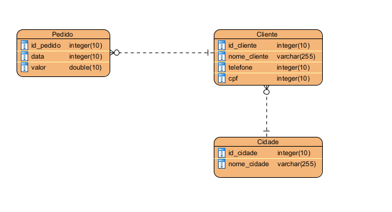
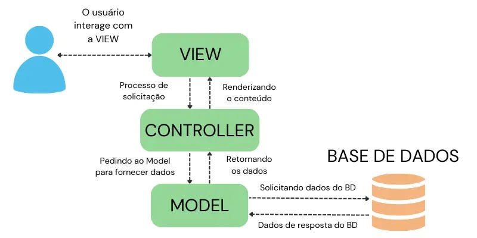
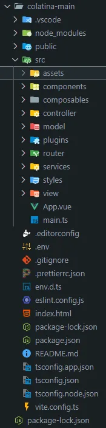

# Documentação e tutorial CRUD básico Vue.js 3 com Typescript

## 📝 O PROJETO

Para praticar os conhecimentos previamente estudados vamos criar um CRUD. Mas o que seria isso? Basicamente são funcionalidades básicas de um sistemas que formam o acrônimo abaixo.

🆕 -> Create

📖 -> Read

⬆️ -> Update

❌ -> Delete

Para realizar essa tarefa, nosso ponto de partida será o seguinte diagrama que contém o nome das entidades e seus atributos:



---

## 📜 PRÉ REQUISITOS

Conhecimentos básicos prévios:

-   HTML;
-   CSS;
-   JavaScript.
    -   OBS: Comandos do JS funcionam no TS (TypeScript), mas o contrário não é uma afirmação válida.

Tecnologias necessárias:

-   Visual Studio Code (versão mais recente)
-   NodeJS (v16.10.0 ou superior)
-   Vue.js 3 (v3.5.13 ou superior)

## ⛏️ FERRAMENTAS

Vamos utilizar ferramentas que irão aumentar um pouco a complexidade do desenvolvimento web, mas, quando utilizadas em grandes projetos elas facilitam o trabalho do programador e a manutenibilidade do código.

-   🔵Visual Studio Code: Um editor de código-fonte leve e que pode ser expandido com diversas funcionalidades, criado pela Microsoft. Ele é compatível com várias linguagens de programação, inclui um depurador embutido e uma vasta gama de extensões disponíveis.
-   🟢Vue.js: Um framework que evolui conforme as necessidades para criar interfaces de usuário. Destaca-se pela sua capacidade de reatividade e pela maneira como permite a composição de componentes, sendo uma opção ágil e versátil para o desenvolvimento de front-end.
-   ⚡Vite: Uma ferramenta inovadora para compilação e desenvolvimento de projetos de front-end, desenvolvida para proporcionar um setup ágil e eficaz, com suporte direto para ES Modules e substituição de módulos quentes (Hot Module Replacement - HMR).
-   🍍Pinia: O novo gerenciador de estado padrão para Vue.js, desenhado para oferecer simplicidade, reatividade e total integração com a Composition API. Ele vem como uma alternativa ao Vuex, prometendo mais performance e uma experiência de uso mais amigável.
-   🔵Axios: Uma biblioteca de JavaScript muito utilizada para efetuar solicitações HTTP, conhecida por sua integração com promessas, interceptores e um manejo simplificado de erros durante a comunicação com APIs.

As funcionalidades ficarão mais fáceis de entender no decorrer do tutorial, quando chegar a hora de utilizar cada uma das ferramentas.

---

## 🦝 PADRÃO DE PROJETO

O padrão utilizado é o MVC (Model-View-Controller), ele consiste em separar a aplicação em três camadas com o intuito de desacoplar as funcionalidades facilitando a manutenção

-   **Model**

    -   Representa os dados da aplicação.
    -   É responsável por gerenciar o estado da aplicação, recuperar informações do banco de dados e aplicar qualquer lógica necessária para a manipulação dos dados.
    -   O modelo não tem conhecimento da view ou do controller; ele apenas responde a solicitações de dados e notificações de alterações.

-   **View**

    -   Exibe a interface e interage com o usuário.
    -   A view obtém os dados do model e os apresenta de forma que sejam compreensíveis e utilizáveis para o usuário.
    -   Ela também pode receber entradas do usuário e passá-las para o controller.

-   **Controller**
    -   Atua como intermediário entre o model e a view.
    -   É a parte responsável pelas requisições do usuário, faz a integração entre as duas outras camadas. O controller recebe as entradas do usuário a partir da view, processa essas entradas (interagindo com o model se necessário) e retorna a saída apropriada, que geralmente é feita atualizando a view.
    -   Ele contém a lógica de controle da aplicação, decidindo qual view exibir e quando atualizar o model com novas informações.
        
    ***

## 🗂️ DIVISÃO

Cada **_pasta_** desse projeto possui uma função específica, vejamos com mais detalhes a seguir.



1. **colatina-main:** É o repositório raiz, todo o projeto está dentro dele.
2. **public**: Possui arquivos que não são publicados pelo Vite, como por exemplo o ícone do site que aparece na barra de navegação do navegador.
3. **src**: É o código fonte, nele está a estrutura do MVC e outras sub pastas

    1. **assets**: Arquivos .css, ou seja arquivos que contém o estilo da página, os padrões ficam aqui.
    2. **components**: Arquivos .vue, são componentes vue que serão reutilizados, evitando repetição de código desnecessário.
    3. **composable**: Arquivos .ts, são funções que são reutilizáveis, como por exemplo o UseApi, que será chamado por várias aplicações.
    4. **controller**: Arquivos .ts, gerenciam as regras de negócio. Cada objeto possui seu arquivo.
        1. Dentro dessa pasta temos uma subpasta chamada **store** que armazena os estados globais utilizando o Pinia🍍 (é uma biblioteca de gerenciamento de estado).
    5. **model**: Arquivos .ts, modelo dos dados, onde é declarado os atributos que cada entidade terá.
        1. **apiRoutes**: Arquivos ts, possuem a declaração das rotas. As declarações se assemelham à declaração das entidades, mas não confunda, não é a mesma coisa. As rotas apenas complementam a URL base declarada no arquivo api que está na pasta services.
        2. **repositories**: Arquivos .ts, contém os métodos que complementam a URL base.
    6. **services**: Tem toda a parte de configuração das rotas e configuração, a exemplo da importação do axios.
    7. **plugins**: Arquivos .ts, com configurações de plugins de vue, como o vuetify.
    8. **router**: Arquivos .ts, configura todas as rotas para as páginas.
    9. **service**: Arquivos .ts, é responsável pela comunicação com a API.
    10. **styles**: Arquivos .scss, contendo os styles.
    11. **view**: Arquivos .vue (geralmente nomeados “index”), as páginas que são acessadas.

    - Pastas chamadas “Generics” contém components que utilizam generics

    De forma lúdica, para manipular os dados é necessário entrar na pasta model, se precisar de um serviço que consome api, basta entrar na pasta de services, que irá retornar dados na pasta model.

## 👣 PASSO A PASSO

### Introdução

Para criar um CRUD, você pode seguir estas etapas:

1. **Modelos de Dados**: Definir os modelos de dados que você vai manipular. Nesse caso, vamos utilizar os modelos definidos pelo diagrama do CRUD disponível no tópico “O PROJETO”.
2. **Serviços de API**: Criar serviços para comunicação com a API. Isso inclui métodos para criar, ler, atualizar e deletar dados.
3. **Stores**: Configurar stores (usando Pinia🍍) para gerenciar o estado global da aplicação.
4. **Componentes Vue**: Criar componentes Vue para listar, adicionar, editar e deletar dados.

## 📦 Instalando pacotes

Vamos iniciar configurando o ambiente, para evitar termos problemas com as futuras importações que iremos fazer. Crie uma pasta vazia para guardar seu projeto, e então entre no link abaixo para instalar o Node.js e o NPM que serão necessários para o desenvolvimento do projeto. Em seguida, execute os seguintes comandos no terminal powershell do Windows para verificar se a instalação obteve sucesso:

📥 [Download Node.js](https://nodejs.org/en/download)

```bash
node -v
v22.13.1 (resposta)

npm -v
v11.1.0 (resposta)
```

Em seguida, execute os comandos abaixo, dessa vez no terminal do Visual Studio Code, para instalar o vue3 e iniciar os arquivos do projeto de fato:

```bash
npm install -g @vue/cli (instala o vue)

vue create my-project (inicia o projeto)
```

Agora alguns a instalação de alguns pacotes são necessários antes de iniciar a programação do código. Siga a lista abaixo:

```bash
npm i vue-router
npm i axios
npm i pinia
npm i sweetalert2
npm i vue-material-design-icons
npm i vuetify
```

Após essa configuração do ambiente, você consegue iniciar sua programação sem maiores dores de cabeça causadas por pacotes não instalados.

🧾[Documentação de configuração](https://www.notion.so/13860ce798e38027ab5ddaf48cd335be?pvs=21)

---

### Passo 1: Definir estrutura das entidades na pasta **_model_**

-   IEntity - entidade genêrica
    Para dar início, vamos codar uma entidade genérica para replicar atributos que são comuns à mais de um entidade.
    Desse modo, vamos iniciar o projeto declarando uma interface de nome “IEntity” que tenha o atributo “Id” que será do tipo string.
    ```tsx
    export interface IEntity {
    	Id: string;
    }
    ```
    Lembre-se que é necessário exportar essa interface para que ela seja reaproveitada em outros arquivos. Ao trabalhar com frontend, importar e exportar elementos passa a ser uma prática constante, logo vira um costume, não se preocupe.
    > OBS: Em um projeto, é de extrema importância dialogar com os desenvolvedores backend para que as estruturas de dados sejam padronizadas e na hora de realizar a integração não ocorra erros.
    -   Gabarito código IEntity
        ```tsx
        export interface IEntity {
        	Id: string;
        }
        ```

---

Agora seguiremos para as entidades que iremos utilizar diretamente → **Cidade**, **Cliente** e **Pedido**.

-   Cidade
    Vamos começar pelo desenvolvimento da entidade **Cidade**, pois ela é a mais simples e não possui relacionamentos que exijam tratamento especial durante a implementação. Outras entidades dependem desses relacionamentos e precisarão de atenção extra nesse processo.
    Começaremos de forma similar à entidade genérica, criando uma interface para **Cidade**. No CRUD do exemplo, a entidade **Cidade** terá dois atributos: `Id` e `Nome`, ambos representados como strings.

    ```tsx
    export interface ICidade {
    	Id: string;
    	Nome: string;
    }
    ```

    Com a interface criada, vamos criar a classe de Cidade.
    a classe Cidade implementa essa interface e define um **construtor**, que recebe os valores de `Id` e `Nome` no momento da criação do objeto.

    ```tsx
    export class Cidade implements ICidade {
        public constructor (public Id: string, public Nome: string) {
            this.Id = Id;
            this.Nome = Nome;
        }

    ```

    -   Gabarito código Cidade

        ```tsx
        export interface ICidade {
        	Id: string;
        	Nome: string;
        }

        export class Cidade implements ICidade {
        	public constructor(public Id: string, public Nome: string) {
        		this.Id = Id;
        		this.Nome = Nome;
        	}
        }
        ```

-   Cliente
    Agora vamos para a entidade **Cliente**, que possui uma relação n para 1 com a entidade **Cidade**. Apesar de parecer complexo no decorrer do processo você verá que é mais simples do que se imagina.
    A implementação da classe **Cliente** segue o mesmo padrão utilizado para a entidade **Cidade**. Primeiro, é criada uma interface **ICliente** para definir a estrutura do objeto, garantindo que todos os clientes possuam os atributos necessários.
    A implementação da interface **ICliente** e da classe **Cliente** segue o padrão utilizado anteriormente, garantindo que a estrutura do objeto seja bem definida.
    A interface **ICliente** estabelece um contrato que todas as instâncias da entidade **Cliente** devem seguir, garantindo que cada cliente possua os atributos `Id`, `Nome`, `Telefone`, `Identification`, `ClienteCidadeId` e `CidadeId`, todos do tipo `string`.

    ```tsx
    export interface ICliente {
    	Id: string;
    	Nome: string;
    	Telefone: string;
    	Identification: string;
    	ClienteCidadeId: string;
    	CidadeId: string;
    }
    ```

    Em seguida, a classe **Cliente** implementa essa interface e define um **construtor**, que recebe e inicializa os valores desses atributos ao criar uma instância. O uso de `ClienteCidadeId` e `CidadeId` sugere um relacionamento entre clientes e cidades, onde `CidadeId` pode representar a cidade associada ao cliente, enquanto `ClienteCidadeId` pode indicar um vínculo específico dentro do sistema, ou seja, é enviado para o backend que irá tratar esse dado como um relacionamento no banco de dados.

    ```tsx
    export class Cliente implements ICliente {
        public constructor (public Id: string, public Nome: string, public Telefone: string, public Identification: string, public ClienteCidadeId: string, public CidadeId: string) {
            this.Id = Id;
            this.Nome = Nome;
            this.Telefone = Telefone;
            this.Identification = Identification;
            this.ClienteCidadeId = ClienteCidadeId;
            this.CidadeId = CidadeId;
    }
    ```

    -   Gabarito código Cidade

        ```tsx
        import { IEntity } from "./generic/Entidade"; // Importa a interface IEntity

        export interface ICidade extends IEntity {
        	Id: string;
        	Nome: string;
        }

        export class Cidade implements ICidade {
        	constructor(public Id: string, public Nome: string) {
        		this.Id = Id;
        		this.Nome = Nome;
        	}
        }
        ```

-   Pedido
    Por último temos o **Pedido**, o qual possui uma relação 1 para n com **Cliente** e segue o mesmo padrão da entidade **Cliente**.
    Inicie desenvolvendo a interface **IPedido** que define a estrutura que qualquer objeto do tipo **Pedido** deve seguir. Cada pedido possui os atributos `Id`, `Data`, `Valor`, `PedidoClienteId` e `ClienteId`, sendo `Id`, `Data` e `ClienteId` do tipo `string`, enquanto `Valor` é um número, representando o valor total do pedido. Já o `PedidoClienteId` parece indicar um vínculo específico entre o pedido e o cliente, possivelmente para relacionar o pedido ao cliente dentro do sistema.

    ```tsx
    export interface IPedido {
    	Id: string;
    	Data: string;
    	Valor: number;
    	PedidoClienteId: string;
    	ClienteId: string;
    }
    ```

    A classe **Pedido** implementa a interface **IPedido**, e seu **construtor** recebe os valores para inicializar os atributos de um pedido. Ao criar uma instância da classe, os parâmetros são passados para o construtor, que os armazena nas propriedades correspondentes. Essa estrutura permite que você crie objetos de pedido de forma estruturada e com todas as informações necessárias para interagir com outras entidades, como o cliente e o valor do pedido.

    ```tsx
    export class Pedido implements IPedido {
    	public constructor(
    		public Id: string,
    		public Data: string,
    		public Valor: number,
    		public PedidoClienteId: string,
    		public ClienteId: string
    	) {
    		this.Id = Id;
    		this.Data = Data;
    		this.Valor = Valor;
    		this.PedidoClienteId = PedidoClienteId;
    		this.ClienteId = ClienteId;
    	}
    }
    ```

    Assim como os atributos `CidadeId` e `CidadeClienteId`, os atributos `PedidoClienteId` e `ClienteId` também estabelecerão a relação entre as entidades no banco de dados.

    -   Gabarito código Pedido

        ```tsx
        export interface IPedido {
        	Id: string;
        	Data: string;
        	Valor: number;
        	PedidoClienteId: string;
        	ClienteId: string;
        }

        export class Pedido implements IPedido {
        	public constructor(
        		public Id: string,
        		public Data: string,
        		public Valor: number,
        		public PedidoClienteId: string,
        		public ClienteId: string
        	) {
        		this.Id = Id;
        		this.Data = Data;
        		this.Valor = Valor;
        		this.PedidoClienteId = PedidoClienteId;
        		this.ClienteId = ClienteId;
        	}
        }
        ```

---

### Passo 2: Configuração das rotas e inicialização da pasta _services_

Com os modelos de dados prontos, vamos iniciar as configurações para utilizar os serviços que irão consumir as api’s, pois, para podermos codar os métodos que chamarão as funcionalidades do CRUD é necessário ter as rotas delimitadas primeiro. No caso do nosso projeto, iremos utilizar o Axios para fazer as requisições HTTP.

Primeiramente é preciso adicionar as dependências do axios, caso não esteja configurado no package.json, no package.jason e no node_modules.

```jsx
import axios from "axios";

const axiosServices = axios.create();

axiosServices.interceptors.response.use(
	(response) => response,
	(error) =>
		Promise.reject(
			(error.response && error.responde.data) || "Services errados"
		)
);

export default axiosServices;
```

Com a importação base do Axios feita, podemos seguir para a declaração da url base que será utilizada, então na mesma pasta (services) iremos criar um documento chamado “api” e escreveremos o seguinte código:

```jsx
import axios, { type AxiosInstance } from "axios";

const api: AxiosInstance = axios.create({
	baseURL: "https://localhost:3000/api",
});

export default api;
```

Agora com as configurações feitas podemos ir para o próximo passo e fazer os métodos que irão preencher as rotas e chamar os services.

---

### Passo 3: Pasta repositories, criando os métodos.

-   Cidade
    Para iniciarmos vamos para a pasta repositories e iniciar um documento para cada entidade, pois cada uma delas possui rotas específicas para os métodos. Começaremos com a entidade Cidade. Crie um documento com identificando que pertence à pasta repositories (CidadeRepository) e iniciaremos as importações necessárias.

    ```tsx
    import api from "../services/api";
    import type { ICidade } from "../../model/Cidade";
    import { Cidade } from "../../model/Cidade";
    import CidadeRoutes from "../apiRoutes/CidadeRoutes";
    ```

    Após importar vamos iniciar a parte de realizar definições.

    1. Crie a classe default CidadeRepository com uma declaração da importação da api.

        ```tsx
        export default class CidadeRepository {
          apiClient;              // Variável para armazenar o axios
          constructor() {
            this.apiClient = api;
          }...// continua as outras funções
        ```

    2. Crie o método que será responsável por o nome da entidade. Esse nome é um complemento para a URL base, ou seja, a rota para cumprir determinada funcionalidade, como por exemplo `/cidade`.

        ```tsx
        createBaseRoute() {
          return new CidadeRoutes({}).entity; /*Retorna a função entity da classe CidadeRoutes e retorna o nome da entidade
                                                é criado o método, pois em todos os outros precisa do nome que é retornado
                                                como por exemplo /cidade*/
        }
        ```

    3. Crie uma função que a rota de exclusão com id específico, como por exemplo `/cidade/{id}`.

        ```tsx
        createDeleteRoute(id: string) {
          return new CidadeRoutes({id: id}).delete; /*Pega a função delete da classe CidadeRoutes e
                                                    retorna a rota de deleção utilizando o id fornecido*/
        }
        ```

        Após isso, vamos seguir para os métodos específicos do CRUD.

        ### Método que busca todas as cidades: fetchAllCidade.

        ```tsx
        async fetchAllCliente() {
            try {
                // Criar rota de conexão
                const baseRoute = this.createBaseRoute();

                // Faz a request usando a api com o axios
                const response = await this.apiClient.get(baseRoute);

                // Retorna a função com a criação de objetos
                return response.data.value.map((cliente: ICliente) => new Cliente(cliente.Id, cliente.Nome, cliente.Telefone, cliente.Cpf, cliente.CidadeId));
            } catch (error) {
              console.error("Erro ao buscar clientes", error);
              return [];
            }
          }
        ```

        ### Método que cadastra novas cidades: Create

        ```tsx
        async createCliente(form: ICliente) {
            try {
                // Criar rota de conexão
                const baseRoute = this.createBaseRoute();

                // Faz o post usando a api com o axios e enviando os dados
                const response = await this.apiClient.post(baseRoute, form);

                // Retorna a resposta do backend
                return response;
            } catch (error) {
              console.error("Erro ao buscar clientes", error);
              return [];
            }
          }
        ```

        A estrutura irá seguir o mesmo padrão, com pequenas modificações.

        1. Iniciaremos declarando a função, o try catch, e já criar a rota base com o método `createBaseRoute` .
        2. Agora começa a diferenciar. Com a rota estabelecida vamos criar uma nova cidade. Para isso vamos utilizar um formulário/“form” que será escrito mais para frente. Ele irá dar as informações necessárias para ser criada uma cidade nova. Além disso, é importante lembrar de passar o “form” como um parâmetro para o método.
        3. Após isso é só retornar a resposta e terminar o catch com uma mensagem de erro.

        OBS: O método post já “vem de fábrica” com o Axios, assim como os outros.

        ### Método que atualiza os dados de uma cidade: Update

        ```tsx
        async updateCidade(Id: string, form: ICidade) {
            try {
              // Criar rota de conexão
              const baseRoute = this.createBaseRoute();

              // Garante que o Id está salvo dentro do form
              form.Id = Id;

              // Faz o put usando a api com o axios e enviando os dados
              const response = await this.apiClient.put(baseRoute, form);

              // Retorna a resposta do backend
              return response;
            } catch (error) {
              console.error("Erro ao buscar cidades", error);
              return [];
            }
          }
        ```

        Vamos iniciar com a mesma estrutura do método create.

        1. Declare o método e utilize o método `createBaseRoute` para criar a rota base.
        2. Após isso, reforçamos o id. Basicamente iremos sobrescrever o id para garantir a informação no back-end.
        3. Finalizamos com a resposta utilizando o método put (também vem no Axios) e o catch de mensagem de erro.

        ### Método que exclui uma cidade: Delete

        ```tsx
        async deleteCidade(Id: string) {
            try {
              // Criar rota de conexão
              const deleteRoute = this.createDeleteRoute(Id);

              // Faz o delete usando a api com o axios e enviando os dados
              const response = await this.apiClient.delete(deleteRoute);

              // Retorna a resposta do backend
              return response;
            } catch (error) {
              console.error("Erro ao buscar cidades", error);
              return [];
            }
          }
        ```

        O delete possui algumas diferenças.

        1. Iniciaremos declarando o método, passando como parâmetro o id da cidade e abrindo o try catch.
        2. Após isso, não chamaremos a função createBaseRoute e sim a deleteRoute, pois iremos passar o id como parâmetro desse método que irá retornar o nome do método e o id da cidade que será excluída.
        3. Após isso é só montar a resposta utilizando o método delete da api, lembrando de passar a rota de delete criada como parâmetro.
        4. Para finalizar basta retornar a resposta e o catch de mensagem de erro.

### - **Pedido**

    Para iniciarmos, vamos para a pasta `repositories` e criar um documento para cada entidade, já que cada uma possui rotas específicas para os métodos. Neste caso, começaremos com a entidade Pedido. Crie um documento identificando que ele pertence à pasta `repositories` (PedidoRepository) e inicie as importações necessárias.

        ```tsx
        import api from "@/services/api";
        import type { IPedido } from "../Pedido";
        import { Pedido } from "../Pedido";
        import PedidoRoutes from "./apiRoutes/PedidoRoutes";
        ```

    Após realizar as importações, vamos definir a classe e as variáveis necessárias:

    1.  **Declaração da Classe PedidoRepository**

        Crie a classe padrão `PedidoRepository`, declarando a variável que armazenará a instância da API (Axios) e inicialize-a no construtor.

            ```tsx
            export default class PedidoRepository {
                apiClient; // Variável para armazenar a instância do axios
                constructor() {
                    this.apiClient = api;
                }
            }
            ```

    2.  **Criação da Rota Base**

        Crie o método que retorna o nome da entidade, que é utilizado como complemento para a URL base. Por exemplo, `/pedido`.

            ```tsx
            createBaseRoute() {
                return new PedidoRoutes({}).entity;
            }
            ```

    3.  **Criação da Rota de Exclusão**

            Crie o método que gera a rota de exclusão para um pedido específico, utilizando o id. Essa rota será usada para operações de delete, como por exemplo `/pedido/{id}`.

                ```tsx
                createDeleteRoute(id: string) {
                    return new PedidoRoutes({ id: id }).delete;
                }
                ```

        Após definir as funções de criação de rotas, vamos para os métodos específicos do CRUD:

    -   Método que busca todos os pedidos: fetchAllPedido

            ```tsx
            async fetchAllPedido() {
                try {
                    // Cria a rota de conexão
                    const baseRoute = this.createBaseRoute();

                    // Realiza a requisição GET utilizando a API (axios)
                    const response = await this.apiClient.get(baseRoute);

                    // Retorna a resposta mapeando os dados para a
                    // criação de objetos Pedido
                    return response.data.value.map((pedido: IPedido) =>
                    new Pedido(pedido.Id, pedido.Data, pedido.Valor)
                    );
                } catch (error) {
                    // Captura qualquer erro que ocorra no bloco try,
                    // loga a mensagem de
                    // erro no console e retorna um error
                    console.error("Erro ao buscar pedidos", error);
                    return error;
                }
            }
            ```

        Neste método, iniciamos criando a rota base com o método `createBaseRoute` e, em seguida, usamos o método `get` do axios para buscar os dados. Os dados retornados são mapeados para instanciar objetos da classe `Pedido`.

    -   Método que cadastra um novo pedido: createPedido

            ```tsx
            async createPedido(form: IPedido) {
                try {
                    // Cria a rota de conexão
                    const baseRoute = this.createBaseRoute();

                    // Realiza o post utilizando a API (axios) e
                    // envia os dados do formulário
                    const response = await this.apiClient.post(baseRoute, form);

                    // Retorna a resposta do backend
                    return response;
                } catch (error) {
                    // Captura qualquer erro que ocorra no bloco try,
                    // loga a mensagem de
                    // erro no console e retorna um error
                    console.error("Erro ao buscar pedidos", error);
                    return error;
                }
            }
            ```

        A estrutura do método `createPedido` segue o padrão:

        1. Declarar o método e iniciar o bloco `try/catch`.
        2. Criar a rota base com `createBaseRoute`.
        3. Enviar o formulário (dados do pedido) com o método `post` do axios.
        4. Retornar a resposta ou capturar e logar um eventual erro.

    - Método que atualiza os dados de um pedido: updatePedido

        ```tsx
        async updatePedido(Id: string, form: IPedido) {
            try {
                // Cria a rota de conexão
                const baseRoute = this.createBaseRoute();

                // Garante que o Id está incluso no form, sobrescrevendo se necessário
                form.Id = Id;

                // Realiza o put utilizando a API (axios) e envia os dados atualizados
                const response = await this.apiClient.put(baseRoute, form);

                // Retorna a resposta do backend
                return response;
            } catch (error) {
                // Captura qualquer erro que ocorra no bloco try, loga a mensagem de
                    //erro no console e retorna um error
                console.error("Erro ao buscar pedidos", error);
                return error;
            }
        }
        ```

        Neste método:

        1. Declaramos o método e usamos `createBaseRoute` para obter a rota.
        2. Garantimos que o `Id` do pedido esteja presente no formulário de dados.
        3. Utilizamos o método `put` do axios para atualizar as informações.
        4. Retornamos a resposta ou logamos um erro caso ocorra.

    -   Método que exclui um pedido: deletePedido

        ```tsx
        async deletePedido(Id: string) {
            try {
                // Cria a rota de exclusão utilizando o id do pedido
                const deleteRoute = this.createDeleteRoute(Id);

                // Realiza o delete utilizando a API (axios)
                const response = await this.apiClient.delete(deleteRoute);

                // Retorna a resposta do backend
                return response;
            } catch (error) {
                // Captura qualquer erro que ocorra no bloco try, loga a mensagem de
                    //erro no console e retorna um error
                console.error("Erro ao buscar pedidos", error);
                return error;
            }
        }
        ```

        Para o método de exclusão:

        1. Declaramos o método passando o id do pedido.
        2. Utilizamos o método `createDeleteRoute` para montar a rota específica que inclui o id.
        3. Realizamos a requisição `delete` com o axios utilizando a rota criada.
        4. Retornamos a resposta ou, em caso de erro, registramos a mensagem de erro.

### - **Cliente**

    Para iniciarmos, vamos para a pasta `repositories` e criar um documento para cada entidade, já que cada uma possui rotas específicas para os métodos. Neste caso, começaremos com a entidade Cliente. Crie um documento identificando que ele pertence à pasta `repositories` (ClienteRepository) e inicie as importações necessárias.

        ```tsx
        import api from "@/services/api";
        import type { ICliente } from "../Cliente";
        import { Cliente } from "../Cliente";
        import ClienteRoutes from "./apiRoutes/ClienteRoutes";
        ```

    Após realizar as importações, vamos definir a classe e as variáveis necessárias:

    1.  **Declaração da Classe ClienteRepository**

        Crie a classe padrão `ClienteRepository`, declarando a variável que armazenará a instância da api (Axios) e inicialize-a no construtor.

            ```tsx
            export default class ClienteRepository {
                apiClient; // Variável para armazenar a instância do axios
                constructor() {
                    this.apiClient = api;
                }
            }
            ```

    2.  **Criação da Rota Base**

        Crie o método que retorna o nome da entidade, que é utilizado como complemento para a URL base. Por exemplo, `/cliente`.

            ```tsx
            createBaseRoute() {
                return new ClienteRoutes({}).entity;
            }
            ```

    3.  **Criação da Rota de Exclusão**

            Crie o método que gera a rota de exclusão para um cliente específico, utilizando o id. Essa rota será usada para operações de delete, como por exemplo `/cliente/{id}`.

                ```tsx
                createDeleteRoute(id: string) {
                    return new ClienteRoutes({ id: id }).delete;
                }
                ```

        Após definir as funções de criação de rotas, vamos para os métodos específicos do CRUD:

    -   Método que busca todos os clientes: fetchAllCliente
        Neste método, iniciamos criando a rota base com o método `createBaseRoute` e, em seguida, usamos o método `get` do axios para buscar os dados. Os dados retornados são mapeados para instanciar objetos da classe `Cliente`.

            ```tsx
            async fetchAllCliente() {
                try {
                    // Cria a rota de conexão
                    const baseRoute = this.createBaseRoute();

                    // Realiza a requisição GET utilizando a api (axios)
                    const response = await this.apiClient.get(baseRoute);

                    // Retorna a resposta mapeando os dados para
                    // a criação de objetos Cliente
                    return response.data.value.map((cliente: ICliente) =>
                    new Cliente(
                            cliente.Id,
                            cliente.Nome,
                            cliente.Telefone,
                            cliente.Cpf,
                            cliente.CidadeId
                        )
                    );
                } catch (error) {
                        // Captura qualquer erro que ocorra no bloco try,
                        // loga a mensagem de
                        // erro no console e retorna um error
                    console.error("Erro ao buscar clientes", error);
                    return error;
                }
            }
            ```

    -   Método que cadastra um novo cliente: createCliente

        ```tsx
        async createCliente(form: ICliente) {
            try {
                // Cria a rota de conexão
                const baseRoute = this.createBaseRoute();

                // Realiza o post utilizando a api (axios) e envia
                // os dados do formulário
                const response = await this.apiClient.post(baseRoute, form);

                // Retorna a resposta do backend
                return response;
            } catch (error) {
                console.error("Erro ao criar cliente", error);
                return error;
            }
        }
        ```

        A estrutura do método `createCliente` segue o padrão:

        1. Declarar o método e iniciar o bloco `try/catch`.
        2. Criar a rota base com `createBaseRoute`.
        3. Enviar o formulário (dados do cliente) com o método `post` do axios.
        4. Retornar a resposta ou capturar e logar um eventual erro.

    -   Método que atualiza os dados de um cliente: updateCliente

        ```tsx
        async updateCliente(Id: string, form: ICliente) {
            try {
                // Cria a rota de conexão
                const baseRoute = this.createBaseRoute();

                // Garante que o Id está incluso no form, sobrescrevendo se necessário
                form.Id = Id;

                // Realiza o put utilizando a api (axios) e envia os dados atualizados
                const response = await this.apiClient.put(baseRoute, form);

                // Retorna a resposta do backend
                return response;
            } catch (error) {
                // Captura qualquer erro que ocorra no bloco try, loga a mensagem de
                    //erro no console e retorna um error
                console.error("Erro ao atualizar cliente", error);
                return error;
            }
        }
        ```

        Neste método:

        1. Declaramos o método e usamos `createBaseRoute` para obter a rota.
        2. Garantimos que o `Id` do cliente esteja presente no formulário de dados.
        3. Utilizamos o método `put` do axios para atualizar as informações.
        4. Retornamos a resposta ou logamos um erro caso ocorra.

    -   Método que exclui um cliente: deleteCliente

        ```tsx
        async deleteCliente(Id: string) {
            try {
                // Cria a rota de exclusão utilizando o id do cliente
                const deleteRoute = this.createDeleteRoute(Id);

                // Realiza o delete utilizando a api (axios)
                const response = await this.apiClient.delete(deleteRoute);

                // Retorna a resposta do backend
                return response;
            } catch (error) {
                // Captura qualquer erro que ocorra no bloco try, loga a mensagem de
                    //erro no console e retorna um error
                console.error("Erro ao deletar um cliente", error);
                return [];
            }
        }
        ```

        Para o método de exclusão:

        1. Declaramos o método passando o id do cliente.
        2. Utilizamos o método `createDeleteRoute` para montar a rota específica que inclui o id.
        3. Realizamos a requisição `delete` com o axios utilizando a rota criada.
        4. Retornamos a resposta ou, em caso de erro, registramos a mensagem de erro.

---

### Passo 4: Controller

Nessa pasta irá ficar a lógica de controle da aplicação, gerenciando a comunicação entre a interface e os modelos de dado.

Pra começar vamos criar uma estrutura chamada `store`. Basicamente store é um padrão de arquitetura que visa armazenar o estado global da aplicação e modificar caso necessário, sendo assim, será necessário utilizarmos uma nova ferramenta, o Pinea🍍.

Inicialmente vamos criar uma store genérica com o intuito de reutilizar algumas estruturas, e colocar dentro de uma subpasta para separá-lo dos controllers das entidades.

-   Store Genérico

    -   Código - GenericStore.ts

        ````tsx
        import type { IEntity } from "@/model/generic/IEntity";
        import { defineStore } from "pinia";
        import { ref, type Ref } from "vue";

            export class GenericStore<T extends IEntity> {
            	items: Ref<T[]> = ref([]);
            	filteredItems: Ref<T[]> = ref([]);
            	loading: Ref<boolean> = ref(false);

            	private name: string;
            	private initialMockFunction: (() => Promise<T[]>) | null = null;

            	constructor(name: string) {
            		this.name = name;
            	}

            	enableMock(mockFunction: () => Promise<T[]>) {
            		this.initialMockFunction = mockFunction;
            	}

            	disableMock() {
            		this.initialMockFunction = null;
            	}

            	createStore(controller: any) {
            		const initialMockFunction = this.initialMockFunction; // preserva o valor inicial de mockFunction
            		return defineStore(this.name, {
            			state: () => ({
            				items: this.items,
            				loading: this.loading,
            				useMock: !!initialMockFunction, // armazena se o mock está ativado
            				mockFunction: initialMockFunction, // armazena a função mock no estado
            			}),
            			actions: {
            				async fetch(params: string = "") {
            					this.loading = true;

            					if (this.useMock && this.mockFunction) {
            						// Usa a função de mock quando ativada
            						const mockData = await this.mockFunction();
            						this.items = mockData;
            					} else {
            						const data = await controller.getAll(params);
            						this.items = data;
            					}

            					this.loading = false;
            				},

            				async save(item: T) {
            					this.loading = true;
            					await controller.create(item);

            					await this.fetch("");

            					this.loading = false;
            				},

            				async saveBulk(items: any) {
            					this.loading = true;

            					await controller.createBulk(items);

            					await this.fetch("");
            					this.loading = false;
            				},

            				async updateItem(Id: string, item: T) {
            					this.loading = true;

            					await controller.update(Id, item);

            					await this.fetch("");

            					this.loading = false;
            				},

            				async updateBulk(items: any) {
            					this.loading = true;

            					await controller.updateBulk(items);

            					await this.fetch("");
            					this.loading = false;
            				},

            				deleteItemLocally(id: string): void {
            					this.items = this.items.filter(
            						(item: any) => item.Id !== id
            					);
            				},

            				async deleteItem(Id: string) {
            					this.loading = true;

            					try {
            						this.items = this.items.filter(
            							(item) => item.Id !== Id
            						);
            						await controller.delete(Id);
            						await this.fetch("");
            					} catch (error) {
            						this.loading = false;
            					}
            				},

            				async filter(route: string) {
            					this.loading = true;
            					if (!this.useMock || !this.mockFunction) {
            						const data = await controller.filter(route);
            						this.items = data;
            					} else {
            						const mockData = await this.mockFunction();
            						this.items = mockData;
            					}
            					this.loading = false;
            				},
            			},
            		})();
            	}
            }
            ```

        Após criar a pasta e iniciar o arquivo vamos seguir os seguintes passos:
        ````

    1.  **Importações Necessárias**:

        1. Importe os tipos e funções necessários, incluindo IEntity, defineStore de Pinia, e ref de Vue.
            - IEntity: Interface genérica para entidades.
            - defineStore: Função de Pinia para definir uma store.
            - ref e Ref: Funções e tipos de Vue para reatividade.
                ```tsx
                import type { IEntity } from "@/model/generic/IEntity";
                import { defineStore } from "pinia";
                import { ref, type Ref } from "vue";
                ```

    2.  **Definição da Classe GenericStore**:

        1. Após importar, defina a classe GenericStore que aceita um tipo genérico T que estende IEntity.
            - A classe GenericStore é definida como uma classe genérica que aceita um tipo T que estende IEntity. Ela irá gerências uma lista de itens e um estado de carregamento, e vai ser definido os métodos do CRUD.
                ```tsx
                export class GenericStore<T extends IEntity> {}
                ```

    3.  **Propriedades da Classe**:

        1. Defina as propriedades da classe, incluindo items, filteredItems, loading, name, e initialMockFunction.

            - items: Lista reativa de itens do tipo T.
            - filteredItems: Lista reativa de itens filtrados do tipo T.
            - loading: Estado reativo de carregamento.
            - name: Nome da store.
            - initialMockFunction: Função de mock inicial.

                ```tsx
                items: Ref<T[]> = ref([])
                filteredItems: Ref<T[]> = ref([])
                loading: Ref<boolean> = ref(false)

                private name: string
                private initialMockFunction: (() => Promise<T[]>) | null = null
                ```

    4.  **Construtor da Classe**:

        1. Implemente o construtor da classe para inicializar a propriedade name.
            - Inicializa a propriedade name com o valor passado como argumento.
                ```tsx
                constructor(name: string) {
                this.name = name
                }
                ```

    5.  **Métodos para Habilitar e Desabilitar Mock**:

        1. Implemente os métodos enableMock e disableMock para gerenciar a função de mock.

            - enableMock: Define a função de mock.
            - disableMock: Remove a função de mock.

                ```tsx
                enableMock(mockFunction: () => Promise<T[]>) {
                this.initialMockFunction = mockFunction
                }

                disableMock() {
                this.initialMockFunction = null
                }
                ```

    6.  **Método createStore**:

        1.  Implemente o método `createStore` que cria e retorna uma store usando defineStore de Pinia🍍.

            Inicie declarando a função `createStore` passando o controller como parâmetro, e após isso escreva o `return` do método. O seu estado inicial inicia com:

                - `items`: Lista de itens armazenados.
                - `loading`: Estado de carregamento.
                - `useMock`: Se um mock está ativo.
                - `mockFunction`: Referência à função de mock, caso exista.

                ---

                ```tsx
                createStore(controller: any) {
                // preserva o valor inicial de mockFunction
                const initialMockFunction = this.initialMockFunction
                return defineStore(this.name, {
                    state: () => ({
                        items: this.items,
                        loading: this.loading,
                        // armazena se o mock está ativado
                        useMock: !!initialMockFunction,
                        // armazena a função mock no estado
                        mockFunction: initialMockFunction,
                    }),
                    actions: {}
                ```

        2.  Após isso iremos escrever as actions desse método.

                - OBS: As actions são métodos que são definidas dentro do defineStore dentro da store do Pinia que permitem manipular o estado da aplicação de forma assíncrona ou síncrona. Elas servem para executar operações como requisições HTTP, chamadas a APIs, manipulação de dados e atualização do estado.

                Comece abrindo as actions e vamos utilizar a mesma sequência dos arquivos repository. Primeiramente adicionamos uma função assíncrona fetch que irá buscar os dados da API ou do mock.

                Essa função deverá carregar os dados para `itens` e ao final, modificar os status de `loading` para false, no intuito de atualizar o estado dos itens.

                    ```tsx
                    async fetch(params: string = '') {
                        this.loading = true

                        if (this.useMock && this.mockFunction) {
                            // Usa a função de mock quando ativada
                            const mockData = await this.mockFunction()
                            this.items = mockData
                        } else {
                            const data = await controller.getAll(params)
                            this.items = data
                        }
                        this.loading = false
                    },
                    ```

                Após a função de carregar, iremos fazer as função de salvamento, uma para salvar dados isolados e uma para salvar dados em conjunto.

                - SALVAR ITEM
                    ```tsx
                    async save(item: T) {
                        this.loading = true
                        await controller.create(item)
                        await this.fetch('')
                        this.loading = false
                    },
                    ```

                ---

                - SALVAR CONJUNTO DE ITENS
                    ```tsx
                    async saveBulk(items: any) {
                        this.loading = true
                        await controller.createBulk(items)
                        await this.fetch('')
                        this.loading = false
                    },
                    ```

                As funções `updateItem` e `updateBulk` são responsáveis por atualizar itens no armazenamento. A função `updateItem` atualiza um único item no armazenamento, chamando o método `update` do `controller` para atualizar o item com o `Id` fornecido. A função `updateBulk` atualiza múltiplos itens no armazenamento, chamando o método `updateBulk` do `controller` para atualizar os itens fornecidos.

                - ATUALIZAR ITEM
                    ```tsx
                    async updateItem(Id: string, item: T) {
                        this.loading = true
                        await controller.update(Id, item)
                        await this.fetch('')
                        this.loading = false
                    },
                    ```

                ---

                - ATUALIZAR CONJUNTO DE ITENS
                    ```tsx
                    async updateBulk(items: any) {
                        this.loading = true
                        await controller.updateBulk(items)1
                        await this.fetch('')
                        this.loading = false
                    },
                    ```

                A função `deleteItemLocally` remove um item da lista `items` localmente, sem fazer uma chamada ao servidor. Ela filtra a lista `items` para excluir o item cujo `Id` corresponde ao `id` fornecido como argumento.

                - DELETAR ITEM LOCALMENTE
                    ```tsx
                    deleteItemLocally(id: string): void {
                        this.items = this.items.filter((item: any) => item.Id !== id)
                    },
                    ```

                - DELETAR ITEM (BANCO DE DADOS)

                Seguindo, vamos para a próxima etapa, desenvolver um método para deletar.

                Para dar início vamos declarar a função deleteItem e passar como parâmetro o `id` . Após isso altere o estado do item por meio do loading.

                Em seguida, abra um try catch e delete o elemento da store e depois chame o delete por meio do controller para remover do backend, e termina atualizando por meio do fetch.

                    ```tsx
                    async deleteItem(Id: string) {
                        this.loading = true
                        try {
                            this.items = this.items.filter((item) => item.Id !== Id)
                            await controller.delete(Id)
                            await this.fetch('')
                        } catch (error) {
                            this.loading = false
                        }
                    },
                    ```

                - FILTRAR ITEMS

                ***

                Para finalizar é criado um método filter para finalizar os elementos por meio de um critério específico, lembrando de selecionar se as fontes virão de dados mock ou API. Assim como nos outro métodos, vamos iniciar alterando o estado (loading) e chamando a estrutura do controller, caso esteja requisitando de um api.

                    ```tsx
                    async filter(route: string) {
                        this.loading = true
                        if (!this.useMock || !this.mockFunction) {
                            const data = await controller.filter(route)
                            this.items = data
                        } else {
                            const mockData = await this.mockFunction()
                            this.items = mockData
                        }
                        this.loading = false
                    },
                    ```

        Com o store genérico pronto, vamos seguir para o store de cidade.

-   Store Cidade

        Este arquivo define uma store que é uma estrutura responsável por gerenciar o estado dos dados das cidades e garantir a consistência das informações. Para codificar, usaremos a classe genérica GenericStore que você definiu anteriormente.

    -   Gabarito do código

        ```tsx
        import type { ICidade } from "@/model/Cidade";
        import { Cidade } from "@/model/Cidade";
        import CidadeController from "../CidadeController";
        import { GenericStore } from "./generic/GenericStore";

        const cidadeController = new CidadeController();
        const genericStore = new GenericStore<ICidade>("cidade");

        const cidades: Cidade[] = [
        	new Cidade("31773898-7570-43dd-85dd-39cfc88d6c2f", "Vitória"),
        	new Cidade("31773898-7570-43dd-85dd-39cfc99fs934", "Colatina"),
        	new Cidade("31773898-7570-43dd-85dd-39cfc88d6c2e", "Serra"),
        ];

        genericStore.enableMock(async () => cidades);
        export const useCidadeStore =
        	genericStore.createStore(cidadeController);
        ```

    -> **Passo a Passo para Codar CidadeStore**

    1. **Importações Necessárias**:
        - Importe os tipos e classes necessários, incluindo ICidade, Cidade, CidadeController, e GenericStore.
    2. **Instanciação do Controller**:
        - Crie uma instância de CidadeController para gerenciar a lógica de negócios das cidades.
    3. **Instanciação da Store Genérica**:
        - Crie uma instância de GenericStore passando o tipo ICidade e o nome da store (`'cidade'`).
    4. **Definição de Dados Mock**:
        - Defina uma lista de cidades mockadas para uso durante o desenvolvimento.
    5. **Habilitação do Mock**:
        - Habilite o mock na store genérica usando a função enableMock.
    6. **Criação e Exportação da Store**: - Crie a store usando a função createStore da GenericStore e exporte-a para uso na aplicação.
       Após isso, vamos para o controller da cidade.

-   **Controller Cidade**

    -   Código

        ```tsx
        import type { ICidade } from '@/model/Cidade';
        import CidadeRepository from '../data/repositories/CidadeRepository';

        export default class CidadeController {
          cidadeRepository;
          constructor() {
            this.cidadeRepository = new CidadeRepository()
          }

          async getAllCidade() {
            return await this.cidadeRepository.fetchAllCidade();
          }

          async create(form: ICidade) {
            if (import.meta.env.VITE_MOCK === "true") return
            return await this.cidadeRepository.createCidade(form);
          }

          async update(Id: string, item: ICidade) {
            if (import.meta.env.VITE_MOCK === "true") return
            return await this.cidadeRepository.updateCidade(Id, item);

          async delete(Id: string) {
            if (import.meta.env.VITE_MOCK === "true") return
            return await this.cidadeRepository.deleteCidade(Id);
          }
        ```

    1. **Importações Necessárias**:
        - Importe a interface ICidade que define a estrutura de uma cidade.
        - Importe o repositório CidadeRepository que contém os métodos para interagir com os dados de cidade.
    2. **Definição da Classe CidadeController**:
        - Defina a classe CidadeController que gerenciará a lógica de negócios para cidades.
    3. **Propriedade cidadeRepository**:
        - Declare a propriedade cidadeRepository que será usada para acessar os métodos do repositório.
    4. **Construtor da Classe**:
        - Implemente o construtor da classe para inicializar a propriedade cidadeRepository com uma nova instância de CidadeRepository.
    5. **Método getAllCidade**:
        - Implemente um método assíncrono getAllCidade que busca todas as cidades chamando o método fetchAllCidade do repositório.
    6. **Método create**:
        - Implemente um método assíncrono create que cria uma nova cidade chamando o método createCidade do repositório.
        - Adicione uma verificação para não fazer nada se o mock estiver habilitado (VITE_MOCK).
    7. **Método update**:
        - Implemente um método assíncrono update que atualiza uma cidade existente chamando o método updateCidade do repositório.
        - Adicione uma verificação para não fazer nada se o mock estiver habilitado (VITE_MOCK).
    8. **Método delete**:
        - Implemente um método assíncrono delete que deleta uma cidade chamando o método deleteCidade do repositório.
        - Adicione uma verificação para não fazer nada se o mock estiver habilitado (VITE_MOCK).

    Agora basta replicar essa estrutura para as outras entidades.

-   **Store Cidade**

    -   Código

        ```tsx
        import type { ICidade } from "@/model/Cidade";
        import { Cidade } from "@/model/Cidade";
        import CidadeController from "../CidadeController";
        import { GenericStore } from "./generic/GenericStore";

        const cidadeController = new CidadeController();
        const genericStore = new GenericStore<ICidade>("cidade");

        const cidades: Cidade[] = [
        	new Cidade("31773898-7570-43dd-85dd-39cfc88d6c2f", "Vitória"),
        	new Cidade("31773898-7570-43dd-85dd-39cfc99fs934", "Colatina"),
        	new Cidade("31773898-7570-43dd-85dd-39cfc88d6c2e", "Serra"),
        ];

        genericStore.enableMock(async () => cidades);
        export const useCidadeStore =
        	genericStore.createStore(cidadeController);
        ```

-   **Controller Cidade**

    -   Código

        ```tsx
        import type { ICidade } from '@/model/Cidade';
        import CidadeRepository from '../data/repositories/CidadeRepository';

        export default class CidadeController {
          cidadeRepository;
          constructor() {
            this.cidadeRepository = new CidadeRepository();
          }

          async getAllCidade() { /
            return await this.cidadeRepository.fetchAllCidade();
          }

          async create(form: ICidade) {
            if (import.meta.env.VITE_MOCK === "true") return
            return await this.cidadeRepository.createCidade(form);
          }

          async update(Id: string, item: ICidade) {
            if (import.meta.env.VITE_MOCK === "true") return
            return await this.cidadeRepository.updateCidade(Id, item);
          }

          async delete(Id: string) {
            if (import.meta.env.VITE_MOCK === "true") return
            return await this.cidadeRepository.deleteCidade(Id);
          }
        }

        ```

-   **Store Cliente**

    -   Código

        ```tsx
        import type { ICliente } from "@/model/Cliente";
        import { Cliente } from "@/model/Cliente";
        import ClienteController from "../ClienteController";
        import { GenericStore } from "./generic/GenericStore";

        const clienteController = new ClienteController();
        const genericStore = new GenericStore<ICliente>("cliente");

        const clientes: Cliente[] = [
        	new Cliente(
        		"39cfc88d6c2f",
        		"Marcos",
        		"27909872617",
        		"18374635546",
        		"31773898-7570-43dd-85dd-39cfc88d6c2f"
        	),
        	new Cliente(
        		"39cfc88d6c2e",
        		"Henrique",
        		"27981726346",
        		"01938345786",
        		"31773898-7570-43dd-85dd-39cfc88d6c2e"
        	),
        ];

        genericStore.enableMock(async () => clientes);
        export const useClienteStore =
        	genericStore.createStore(clienteController);
        ```

-   **Controller Cliente**

    -   Código

        ```tsx
        import type { ICliente } from "@/model/Cliente";
        import ClienteRepository from "@/data/repositories/ClienteRepository";

        export default class ClienteController {
        	clienteRepository;
        	constructor() {
        		this.clienteRepository = new ClienteRepository();
        	}

        	async getAllCliente() {
        		return await this.clienteRepository.fetchAllCliente();
        	}

        	async create(form: ICliente) {
        		if (import.meta.env.VITE_MOCK === "true") return;
        		return await this.clienteRepository.createCliente(form);
        	}

        	async update(Id: string, item: ICliente) {
        		if (import.meta.env.VITE_MOCK === "true") return;
        		return await this.clienteRepository.updateCliente(Id, item);
        	}

        	async delete(Id: string) {
        		if (import.meta.env.VITE_MOCK === "true") return;
        		return await this.clienteRepository.deleteCliente(Id);
        	}
        }
        ```

---

### Passo 5: View

Nessa etapa, iremos fazer os componentes das tela que irão ser mostrados para o usuário. Para isso, cada entidade terá o seu arquivo para que o usuário tenha acesso aos métodos do CRUD. Como de costume iniciaremos com a cidade, por ser a mais simples.

> OBS: Essa camada da aplicação possui os arquivos mais extensos de todo o projeto, por isso a estrutura irá mudar um pouco para facilitar a visualização.

Antes de iniciarmos essa etapa existem dois pontos importantes de serem pontuados.
Primeiro, ao contrário de outros frameworks, o Vue não separa os arquivos HTML, CSS e TypeScript de um componente em pastas separadas. Em vez disso, ele utiliza um único arquivo para agrupar essas três partes, permitindo que o HTML, o CSS e o TypeScript relacionados a um componente sejam escritos dentro do mesmo arquivo. Isso pode fazer com que os arquivos `.vue` se tornem maiores…
Segundo, para testar a aplicação, basta acessar a pasta do projeto no VSCode, abrir o terminal, selecionar a opção de cmd e, através dele, executar o comando `npm run dev`. Esse comando "compila" o projeto e inicia um servidor, permitindo que você acesse a aplicação e interaja com ela no navegador.

No navegador, o Vue oferece o Vue Devtools, uma ferramenta que facilita o trabalho do desenvolvedor ao permitir a análise das rotas internas do projeto, pastas, nomes, relações etc. Após Após essas explanações podemos retornar ao CRUD.

-   Cidade
    Para dar início ao documento importe todos os arquivos necessários:

    ```tsx

    <script setup lang="ts">
    import { onMounted, ref } from 'vue';

    import { useCidadeStore } from '@/controller/store/CidadeStore';
    import { Cidade } from '@/model/Cidade';
    ```

    O `ref` e `onMounted` são funcionalidades do Vue usados para reatividade e execução de código após o componente ser montado, ou seja, facilitam a manipulação do ciclo de vida. Já a store `useCidadeStore` é importada para acessar os métodos de CRUD da cidade com o backend, e o modelo `Cidade` é utilizado para tipagem da nova cidade.
    No momento em que o componente é montado (graças ao `onMounted`), a função `getPosts` é chamada. A função `getPosts` utiliza o método `fetch` da store `useCidadeStore` para buscar as cidades do banco de dados. O resultado da consulta é armazenado na variável reativa `cidades`, que é um array que contém os itens (cidades) carregados.

    ```tsx
    const cidades = ref();
    async function getPosts() {
    	await useCidadeStore.fetch("");
    	cidades.value = useCidadeStore.items;
    }
    ```

    Além disso, o código define algumas variáveis reativas adicionais para controlar a interface e o comportamento do componente. A variável `header` armazena o cabeçalho da tabela onde as cidades serão exibidas, com os títulos das colunas "NOME" e "AÇÕES", que são associados às chaves `Nome` e `actions`, respectivamente.

    ```tsx
    const header = ref([
    	{ title: "NOME", key: "Nome" },
    	{ title: "AÇÕES", key: "actions" },
    ]);
    ```

    As variáveis `showModal` e `isEditing` controlam o estado do modal de cadastro ou edição de cidades. O `showModal` determina se o modal está visível ou não, enquanto `isEditing` indica se o formulário está em modo de edição ou criação. Ademais, a variável `newCidade` é uma referência do tipo `Cidade`, que é usada para armazenar os dados da cidade que está sendo criada ou editada. Inicialmente, ela é configurada com um objeto vazio, contendo as propriedades `Id` e `Nome`, que serão preenchidas conforme o usuário interagir com o formulário.

    ```tsx
    const showModal = ref(false);
    const isEditing = ref(false);

    const newCidade = ref<Cidade>({
    	Id: "",
    	Nome: "",
    });
    ```

    Em resumo, o código configura a estrutura inicial para a exibição das cidades, permite a criação e edição de novas cidades, e manipula o estado do modal de forma reativa. A busca das cidades do backend ocorre automaticamente quando o componente é montado.
    Agora seguiremos com as funções que chamam métodos CRUD por meio do store.
    A primeira função que iremos desenvolver será o create interagindo com a store `useCidadeStore` para gerenciar as cidades no banco de dados e atualizar a interface do usuário.
    Quando o usuário deseja criar uma nova cidade, a função `createCidade()` é chamada. Ela tenta salvar a cidade no banco de dados utilizando o método `save` da store, passando os dados da nova cidade que estão armazenados em `newCidade.value`. Se a operação for bem-sucedida, o modal de criação é fechado, e a lista de cidades é atualizada chamando a função `getPosts()`. Caso haja algum erro durante o processo, ele é capturado e exibido no console.

    ```tsx
    async function createCidade() {
    	try {
    		await useCidadeStore.save(newCidade.value);
    		showModal.value = false;
    		getPosts();
    	} catch (error) {
    		console.error(error);
    	}
    }
    ```

    A função `salvarCidade()` é responsável por determinar se a ação é de criação ou edição. Se o estado `isEditing.value` for verdadeiro, significa que o usuário está editando uma cidade existente, então a função chama `submitEditCidade()` para atualizar os dados da cidade. Caso contrário, a função chama `createCidade()` para salvar uma nova cidade.

    ```tsx
    async function salvarCidade() {
    	if (isEditing.value) await submitEditCidade();
    	else await createCidade();
    }
    ```

    Quando o usuário deseja editar uma cidade, a função `editCidade()` é chamada. Ela recebe a cidade a ser editada como parâmetro, copia seus dados para o objeto `newCidade.value`, e ativa o estado de edição ajustando `isEditing.value` para `true`. O modal de edição é então aberto para o usuário realizar as alterações desejadas.

    ```tsx
    function editCidade(item: Cidade) {
    	const cidade = item;
    	newCidade.value = { ...cidade };
    	isEditing.value = true;
    	showModal.value = true;
    }
    ```

    Após o usuário fazer as alterações, a função `submitEditCidade()` é chamada. Ela usa o método `updateItem` da store para atualizar a cidade no banco de dados com os novos dados. Após a atualização, o modal é fechado e a lista de cidades é atualizada novamente com a função `getPosts()`. Se ocorrer algum erro durante a atualização, ele será exibido no console.

    ```tsx
    async function submitEditCidade() {
    	try {
    		await useCidadeStore.updateItem(
    			newCidade.value.Id,
    			newCidade.value
    		);
    		showModal.value = false;
    		getPosts();
    	} catch (error) {
    		console.error(error);
    	}
    }
    ```

    Quando o usuário deseja excluir uma cidade, a função `deleteCidade()` é acionada. Ela recebe o item a ser deletado como parâmetro, chama o método `deleteItem` da store para remover a cidade do banco de dados e, em seguida, atualiza a lista de cidades chamando a função `getPosts()`. Caso algum erro aconteça durante o processo de exclusão, ele será registrado no console.

    ```tsx
    async function deleteCidade(item: unknown) {
    	try {
    		await useCidadeStore.deleteItem(item.Id);
    		getPosts();
    	} catch (error) {
    		console.error(error);
    	}
    }
    ```

    Essas funções trabalham de forma integrada, proporcionando ao usuário uma interface para gerenciar as cidades de forma eficiente, realizando operações CRUD (criar, ler, atualizar e excluir) no banco de dados e atualizando a interface conforme necessário.
    Para finalizar o arquivo cidade, vamos criar o **template** com a parte html, ou seja, a interface que devera exibir uma lista de cidades cadastradas e permite que o usuário adicione, edite ou exclua cidades por meio de um modal.
    Inicialmente vamos criar um botão (btn), há um botão para cadastrar uma nova cidade. Quando o usuário clica nesse botão, a variável `showModal` é ativada, abrindo o modal de cadastro. Além disso, a variável `isEditing` é definida como `false`, indicando que se trata de uma nova cidade, e o objeto `newCidade` é resetado com valores vazios para garantir que nenhum dado anterior interfira na criação.

    ```html
    <v-row>
    	<v-col cols="2" class="d-flex justify-start">
    		<v-btn
    			@click="() => { showModal = true; isEditing = false; newCidade = { Id: '', Nome: '' } }"
    			class="custom-width-2"
    			color="primary"
    			variant="flat"
    		>
    			Cadastrar Cidade
    		</v-btn>
    	</v-col>
    </v-row>
    ```

    A lista de cidades cadastradas é exibida em uma tabela (`v-data-table`), onde os dados são preenchidos dinamicamente com o array `cidades`. No cabeçalho da tabela, há duas colunas: uma para o nome da cidade e outra para ações. Na coluna de ações, há dois botões para cada cidade listada. O primeiro botão, representado por um ícone de lápis (`mdi-pencil`), permite editar a cidade, chamando a função `editCidade(item)`. O segundo botão, com um ícone de lixeira (`mdi-delete`), aciona a função `deleteCidade(item)`, removendo a cidade da lista.
    Caso a tabela não tenha registros, um aviso é exibido informando que não há dados disponíveis, utilizando o componente `v-label`.

    ```html
    <v-data-table :headers="header" :items="cidades">
    	<template #item.actions="{ item }">
    		<v-btn @click="editCidade(item)" color="primary" icon>
    			<v-icon>mdi-pencil</v-icon>
    		</v-btn>
    		<v-btn @click="deleteCidade(item)" color="red" icon>
    			<v-icon>mdi-delete</v-icon>
    		</v-btn>
    	</template>
    	<template v-slot:no-data>
    		<v-label>Sem dados!</v-label>
    	</template>
    </v-data-table>
    ```

    O modal de cadastro e edição é representado por um `v-dialog` controlado pela variável `showModal`. O título do modal é dinâmico, alternando entre "Editar Resolução" e "Cadastrar Resolução" com base no estado `isEditing`. Dentro do modal, há um formulário contendo um campo de texto (`v-text-field`) onde o usuário pode inserir ou editar o nome da cidade. O campo é vinculado ao objeto `newCidade.Nome` para garantir que as alterações sejam refletidas diretamente no estado da aplicação.
    Na parte inferior do modal, há dois botões. O primeiro, "Cancelar", simplesmente fecha o modal ao redefinir `showModal` para `false`. O segundo, "Salvar", chama a função `salvarCidade()`, que decide se a cidade deve ser criada ou atualizada, dependendo do estado `isEditing`.

    ```html
    <v-dialog v-model="showModal" max-width="500">
    	<v-card>
    		<v-card-title>
    			{{ isEditing ? 'Editar Resolução' : 'Cadastrar Resolução' }}
    		</v-card-title>
    		<v-card-text>
    			<v-form>
    				<v-text-field
    					label="Nome"
    					v-model="newCidade.Nome"
    					required
    				></v-text-field>
    			</v-form>
    		</v-card-text>
    		<v-card-actions>
    			<v-btn @click="showModal = false">Cancelar</v-btn>
    			<v-btn @click="salvarCidade" color="primary">Salvar</v-btn>
    		</v-card-actions>
    	</v-card>
    </v-dialog>
    ```

    Esse código proporciona uma interface intuitiva para o gerenciamento de cidades, permitindo a interação do usuário de forma dinâmica e responsiva.

    -   Gabarito código Cidade.vue

        ```tsx
        <script setup lang="ts">
        import { onMounted, ref } from 'vue';
        // import CidadeController from '@/controller/CidadeController';
        // const controladorCidade = new CidadeController();

        import { useCidadeStore } from '@/controller/store/CidadeStore';
        import { Cidade } from '@/model/Cidade';

        onMounted(async() => {
            await getPosts();

        });

        const cidades = ref();
        async function getPosts() {
            await useCidadeStore.fetch('');
            cidades.value = useCidadeStore.items;
        }

        const header = ref([
            { title: 'NOME', key: 'Nome' },
            { title: 'AÇÕES', key: 'actions' }
        ]);

        const showModal = ref(false);
        const isEditing = ref(false);

        const newCidade = ref<Cidade>({
            Id: '',
            Nome: ''
        });
        async function createCidade() {
            try {
                await useCidadeStore.save(newCidade.value);
                showModal.value = false;
                getPosts();
            } catch (error) {
                console.error(error);
            }
        }

        async function salvarCidade() {
            if (isEditing.value) await submitEditCidade();
            else await createCidade();
        }

        function editCidade(item: Cidade) {
            const cidade = item;
            newCidade.value = { ...cidade };
            isEditing.value = true;
            showModal.value = true;
        }

        async function submitEditCidade() {
            try {
                await useCidadeStore.updateItem(newCidade.value.Id, newCidade.value)
                showModal.value = false;
                getPosts();
            } catch (error) {
                console.error(error);
            }
        }

        async function deleteCidade(item: unknown) {
            try {
                await useCidadeStore.deleteItem(item.Id);
                getPosts();
            } catch (error) {
                console.error(error);
            }
        }
        </script>

        <template>
                <v-row>
                    <v-col cols="2" class="d-flex justify-start">
                        <v-btn @click="() => { showModal = true; isEditing = false; newCidade = { Id: '', Nome: '' } }"
                            class="custom-width-2"
                            color="primary"
                            variant="flat"
                        >
                            Cadastrar Cidade
                        </v-btn>
                    </v-col>
                </v-row>
                <v-data-table :headers="header" :items="cidades">
                    <template #item.actions="{ item }">
                            <v-btn @click="editCidade(item)" color="primary" icon>
                                <v-icon>mdi-pencil</v-icon>
                            </v-btn>
                            <v-btn @click="deleteCidade(item)" color="red" icon>
                                <v-icon>mdi-delete</v-icon>
                            </v-btn>
                        </template>
                    <template v-slot:no-data>
                        <v-label>Sem dados!</v-label>
                    </template>
                </v-data-table>

            <!-- Modal de Cadastro/Edição -->
            <v-dialog v-model="showModal" max-width="500">
                <v-card>
                    <v-card-title>
                        {{ isEditing ? 'Editar Resolução' : 'Cadastrar Resolução' }}
                    </v-card-title>
                    <v-card-text>
                        <v-form>
                            <!--<v-text-field
                                label="Id"
                                v-model="newCidade.Id"
                                required
                            ></v-text-field>-->
                            <v-text-field
                                label="Nome"
                                v-model="newCidade.Nome"
                                required
                            ></v-text-field>
                        </v-form>
                    </v-card-text>
                    <v-card-actions>
                        <v-btn @click="showModal = false" >Cancelar</v-btn>
                        <v-btn @click="salvarCidade" color="primary" >Salvar</v-btn>
                    </v-card-actions>
                </v-card>
            </v-dialog>
        </template>

        ```

---

-   Cliente
    O código dos clientes carrega os dados ao iniciar o componente e exibe informações relevantes, além de permitir a interação do usuário para cadastrar e editar clientes.
    Inicialmente, importe todos os componentes necessários:

    ```tsx
    import { onMounted, ref } from "vue";

    import { usePedidoStore } from "@/controller/store/PedidoStore";
    import { useClienteStore } from "@/controller/store/ClienteStore";

    import { Pedido } from "@/model/Pedido";
    ```

    Quando o componente é montado (`onMounted`), três funções assíncronas são chamadas: `getPosts()`, `getCidades()` e `getPedidos()`. Cada uma delas busca os respectivos dados no store correspondente. `getPosts()` recupera a lista de clientes, `getCidades()` carrega todas as cidades disponíveis e `getPedidos()` obtém os pedidos registrados, imprimindo os resultados no console para verificação.

    ```tsx
    onMounted(async () => {
    	await getPosts();
    	await getCidades();
    	await getPedidos();
    });
    ```

    Os dados são armazenados em variáveis reativas (`ref`) para serem utilizados na interface do usuário. A lista de clientes fica armazenada em `clientes`, as cidades em `cidades` e os pedidos em `pedidos`. Além disso, a estrutura das tabelas é definida nas constantes `header` e `headerPedidos`, especificando quais colunas devem ser exibidas para clientes e pedidos.

    ```tsx
    const clientes = ref();
    async function getPosts() {
    	await useClienteStore.fetch("");
    	clientes.value = useClienteStore.items;
    }

    const cidades = ref<Cidade[]>([]);
    async function getCidades() {
    	await useCidadeStore.fetch("");
    	cidades.value = useCidadeStore.items;
    	console.log("Cidades carregadas:", cidades.value);
    }

    const pedidos = ref();
    async function getPedidos() {
    	await usePedidoStore.fetch("");
    	pedidos.value = usePedidoStore.items;
    	console.log("Pedidos carregados:", pedidos.value);
    }

    const header = ref([
    	{ title: "NOME", key: "Nome" },
    	{ title: "TELEFONE", key: "Telefone" },
    	{ title: "IDENTIDADE", key: "Identification" },
    	{ title: "CIDADE-ID", key: "ClienteCidadeId" },
    	{ title: "AÇÕES", key: "actions" },
    ]);

    const headerPedidos = ref([
    	{ title: "DATA", key: "Data" },
    	{ title: "VALOR", key: "Valor" },
    ]);
    ```

    Duas variáveis controlam a exibição de modais: `showModal`, que gerencia a exibição do formulário de cadastro e edição de clientes, e `showPedidosModal`, que controla a exibição dos pedidos de um cliente específico. A variável `isEditing` é usada para diferenciar entre um novo cadastro e a edição de um cliente já existente.

    ```tsx
    const showModal = ref(false);
    const showPedidosModal = ref(false);
    const isEditing = ref(false);
    ```

    O objeto `newCliente` armazena temporariamente os dados do cliente que está sendo criado ou editado. Ele contém os campos `Id`, `Nome`, `Telefone`, `Identification`, `ClienteCidadeId` e `CidadeId`. Já `pedidosCliente` é um array que armazena os pedidos associados ao cliente selecionado.

    ```tsx
    const newCliente = ref<Cliente>({
    	Id: "",
    	Nome: "",
    	Telefone: "",
    	Identification: "",
    	ClienteCidadeId: "",
    	CidadeId: "",
    });
    ```

    Após finalizar as funcionalidade com as referências e headers, seguiremos para as funcionalidade do CRUD.
    Assim como no arquivo passado, iniciaremos com a função `createCliente()` que é responsável por cadastrar um novo cliente. Antes de salvar os dados, ela copia o ID da cidade selecionada para o campo `ClienteCidadeId`, garantindo a associação correta do cliente com sua cidade. Após a criação bem-sucedida, o modal de cadastro é fechado e a lista de clientes é atualizada com `getPosts()`.

    > OBS: Essa função possui uma etapa a mais do que o CRUD da Cidade, pois, devido a um alinhamento com o backend, tivemos que duplicar o dado id da cidade. No arquivo de pedido um dos dados também será replicado.

    ```tsx
    async function createCliente() {
    	try {
    		// Copia o Id da cidade selecionada para ClienteCidadeId
    		newCliente.value.ClienteCidadeId = newCliente.value.CidadeId;

    		console.log("Criando novo cliente:", newCliente.value);
    		await useClienteStore.save(newCliente.value);
    		showModal.value = false;
    		getPosts();
    	} catch (error) {
    		console.error(error);
    	}
    }
    ```

    A função `salvarCliente()` decide se deve criar um novo cliente ou editar um existente. Se `isEditing` for `true`, a função `submitEditCliente()` será chamada para atualizar os dados do cliente no banco. Caso contrário, `createCliente()` será chamada para registrar um novo cliente.

    ```tsx
    async function salvarCliente() {
    	if (isEditing.value) await submitEditCliente();
    	else await createCliente();
    }
    ```

    Para editar um cliente, a função `editCliente(item)` recebe um objeto do tipo `Cliente`, copia seus dados para `newCliente.value` e abre o modal de edição. A variável `isEditing` é definida como `true`, indicando que a ação realizada será uma atualização, não um cadastro.

    ```tsx
    function editCliente(item: Cliente) {
    	const cliente = item;
    	newCliente.value = { ...cliente };
    	isEditing.value = true;
    	showModal.value = true;
    }
    ```

    A função `submitEditCliente()` envia os dados editados para atualização no banco. Se a operação for bem-sucedida, o modal é fechado e a lista de clientes é recarregada.

    ```tsx
    async function submitEditCliente() {
    	try {
    		await useClienteStore.updateItem(
    			newCliente.value.Id,
    			newCliente.value
    		);
    		showModal.value = false;
    		getPosts();
    	} catch (error) {
    		console.error(error);
    	}
    }
    ```

    A exclusão de um cliente é tratada por `deleteCliente(item)`, que recebe um cliente como parâmetro e o remove do banco de dados. Após a exclusão, a lista de clientes é atualizada.

    ```tsx
    async function deleteCliente(item: unknown) {
    	try {
    		await useClienteStore.deleteItem(item.Id);
    		getPosts();
    	} catch (error) {
    		console.error(error);
    	}
    }
    ```

    A função `pedidoClientes(item)` permite visualizar os pedidos associados a um cliente específico. Primeiro, ela busca todos os pedidos do banco de dados e os filtra com base no ID do cliente passado como argumento. Os pedidos filtrados são armazenados em `pedidosCliente.value` e exibidos em um modal para visualização.
    OBS: Essa funcionalidade é exclusiva do CRUD de **Cliente**, pois é necessário que o cliente veja os seus pedidos sem precisar ter conhecimento do seu id.

    ```tsx
    async function pedidoClientes(item: Cliente) {
        console.log("Buscando pedidos do cliente:", item.Id);

        // Buscar todos os pedidos do backend
        await usePedidoStore.fetch();

        // Filtrar pedidos pelo ID do cliente
        pedidos.value = usePedidoStore.items.filter(pedido => pedido.PedidoClienteId === item.Id);

        console.log(`Pedidos do cliente ${item.Id}:`, pedidos.value);

        pedidosCliente.value = pedidos.value;

        showPedidosModal.value = true;
    ```

    -   Gabarito código Cliente.vue

        ```tsx
        <script setup lang="ts">
        import { onMounted, ref } from 'vue';

        import { useClienteStore } from '@/controller/store/ClienteStore';
        import { useCidadeStore } from '@/controller/store/CidadeStore';
        import { usePedidoStore } from '@/controller/store/PedidoStore';

        import { Cliente } from '@/model/Cliente';
        import { Cidade } from '@/model/Cidade';

        import type { Pedido } from '@/model/Pedido';

        onMounted(async() => {
            await getPosts();
            await getCidades();
            await getPedidos();

        });

        const clientes = ref();
        async function getPosts() {
            await useClienteStore.fetch('');
            clientes.value = useClienteStore.items;
        }

        const cidades = ref<Cidade[]>([]);
        async function getCidades() {
            await useCidadeStore.fetch('');
            cidades.value = useCidadeStore.items;
            console.log("Cidades carregadas:", cidades.value);
        }

        const pedidos = ref();
        async function getPedidos() {
            await usePedidoStore.fetch('');
            pedidos.value = usePedidoStore.items;
            console.log("Pedidos carregados:", pedidos.value);
        }

        const header = ref([
            { title: 'NOME', key: 'Nome' },
            { title: 'TELEFONE', key: 'Telefone' },
            { title: 'IDENTIDADE', key: 'Identification' },
            { title: 'CIDADE-ID', key: 'ClienteCidadeId' },
            { title: 'AÇÕES', key: 'actions' }
        ]);

        const headerPedidos = ref([
            { title: 'DATA', key: 'Data' },
            { title: 'VALOR', key: 'Valor' },
        ]);

        const showModal = ref(false);
        const showPedidosModal = ref(false);
        const isEditing = ref(false);

        const newCliente = ref<Cliente>({
            Id: '',
            Nome: '',
            Telefone: '',
            Identification: '',
            ClienteCidadeId: '',
            CidadeId: '',
        });

        const pedidosCliente = ref<Pedido[]>([]);

        async function createCliente() {
            try {
                // Copia o Id da cidade selecionada para ClienteCidadeId
                newCliente.value.ClienteCidadeId = newCliente.value.CidadeId;

                console.log("Criando novo cliente:", newCliente.value);
                await useClienteStore.save(newCliente.value);
                showModal.value = false;
                getPosts();
            } catch (error) {
                console.error(error);
            }
        }

        async function salvarCliente() {
            if (isEditing.value) await submitEditCliente();
            else await createCliente();
        }

        function editCliente(item: Cliente) {
            const cliente = item;
            newCliente.value = { ...cliente };
            isEditing.value = true;
            showModal.value = true;
        }

        async function submitEditCliente() {
            try {
                await useClienteStore.updateItem(newCliente.value.Id, newCliente.value)
                showModal.value = false;
                getPosts();
            } catch (error) {
                console.error(error);
            }
        }

        async function deleteCliente(item: unknown) {
            try {
                await useClienteStore.deleteItem(item.Id);
                getPosts();
            } catch (error) {
                console.error(error);
            }
        }

        async function pedidoClientes(item: Cliente) {
            console.log("Buscando pedidos do cliente:", item.Id);

            // Buscar todos os pedidos do backend
            await usePedidoStore.fetch();

            // Filtrar pedidos pelo ID do cliente
            pedidos.value = usePedidoStore.items.filter(pedido => pedido.PedidoClienteId === item.Id);

            console.log(`Pedidos do cliente ${item.Id}:`, pedidos.value);

            pedidosCliente.value = pedidos.value;

            showPedidosModal.value = true;
        }

        </script>

        <template>
                <v-row>
                    <v-col cols="2" class="d-flex justify-start">
                        <v-btn @click="() => { showModal = true; isEditing = false; newCliente = { Id: '', Nome: '', Telefone: '', Identification: '', ClienteCidadeId: '', CidadeId: ''} }"
                            class="custom-width-2"
                            color="primary"
                            variant="flat"
                        >
                            Cadastrar Cliente
                        </v-btn>
                    </v-col>
                </v-row>
                <v-data-table :headers="header" :items="clientes">
                    <template #item.actions="{ item }">
                            <v-btn @click="editCliente(item)" color="primary" icon>
                                <v-icon>mdi-pencil</v-icon>
                            </v-btn>
                            <v-btn @click="deleteCliente(item)" color="red" icon>
                                <v-icon>mdi-delete</v-icon>
                            </v-btn>
                            <v-btn @click="pedidoClientes(item)" color="yellow" icon>
                                <v-icon>mdi-eye</v-icon>
                            </v-btn>
                        </template>
                    <template v-slot:no-data>
                        <v-label>Sem dados!</v-label>
                    </template>
                </v-data-table>

            <!-- Modal de Cadastro/Edição -->
            <v-dialog v-model="showModal" max-width="500">
                <v-card>
                    <v-card-title>
                        {{ isEditing ? 'Editar Resolução' : 'Cadastrar Resolução' }}
                    </v-card-title>
                    <v-card-text>
                        <v-form>
                            <v-text-field
                                label="Nome"
                                v-model="newCliente.Nome"
                                required
                            ></v-text-field>
                            <v-text-field
                                label="Telefone"
                                v-model="newCliente.Telefone"
                                required
                            ></v-text-field>
                            <v-text-field
                                label="Identidade"
                                v-model="newCliente.Identification"
                                required
                            ></v-text-field>
                            <v-select
                                label="Cidade"
                                :items="cidades"
                                item-value="Id"
                                item-title="Nome"
                                v-model="newCliente.CidadeId"
                            >
                            </v-select>
                        </v-form>
                    </v-card-text>
                    <v-card-actions>
                        <v-btn @click="showModal = false" >Cancelar</v-btn>
                        <v-btn @click="salvarCliente" color="primary" >Salvar</v-btn>
                    </v-card-actions>
                </v-card>
            </v-dialog>

            <!-- Modal de Pedidos do Cliente -->
            <v-dialog v-model="showPedidosModal" max-width="600">
                <v-card>
                    <v-card-title>
                        Pedidos do Cliente
                    </v-card-title>
                    <v-card-text>
                        <v-data-table :headers="headerPedidos" :items="pedidosCliente">
                            <template v-slot:no-data>
                                <v-label>Sem pedidos!</v-label>
                            </template>
                        </v-data-table>
                    </v-card-text>
                    <v-card-actions>
                        <v-btn @click="showPedidosModal = false" >Fechar</v-btn>
                    </v-card-actions>
                </v-card>
            </v-dialog>
        </template>

        ```

---

### - **Pedido**

    Vamos finalizar o CRUD com o arquivo Pedido.vue

        ```tsx
        const newPedido = ref<Pedido>({
            Id: "",
            Data: "",
            Valor: 0,
            PedidoClienteId: "",
            ClienteId: "",
        });
        ```

    Com as definições feitas vamos seguir para os métodos que chamam as funcionalidades do CRUD.

    A função `createPedido()` é responsável por criar um novo pedido. Antes de salvar os dados, ela copia o valor de `ClienteId` para `PedidoClienteId`, garantindo que o pedido esteja corretamente associado ao cliente correspondente. Em seguida, a função imprime os dados no console para conferência, envia a requisição para o store `usePedidoStore.save(newPedido.value)`, fecha o modal de cadastro (`showModal.value = false`) e atualiza a lista de pedidos chamando `getPosts()`.

        ```tsx
        async function createPedido() {
            try {
                // Copia o Id da cidade selecionada para ClienteCidadeId
                newPedido.value.PedidoClienteId = newPedido.value.ClienteId;

                console.log("Criando novo pedido:", newPedido.value);
                await usePedidoStore.save(newPedido.value);
                showModal.value = false;
                getPosts();
            } catch (error) {
                console.error(error);
            }
        }
        ```

    A função `salvarPedido()` verifica se o pedido está sendo editado ou criado. Se `isEditing.value` for verdadeiro, significa que um pedido existente está sendo alterado, e a função `submitEditPedido()` é chamada. Caso contrário, `createPedido()` é executada para registrar um novo pedido.

        ```tsx
        async function salvarPedido() {
            if (isEditing.value) await submitEditPedido();
            else await createPedido();
        }
        ```

    A função `editPedido(item: Pedido)` permite a edição de um pedido já existente. Ela recebe um objeto `Pedido`, copia seus valores para `newPedido.value`, marca `isEditing.value` como verdadeiro e exibe o modal de edição.

        ```tsx
        function editPedido(item: Pedido) {
            const pedido = item;
            newPedido.value = { ...pedido };
            isEditing.value = true;
            showModal.value = true;
        }
        ```

    A função `submitEditPedido()` atualiza um pedido já existente. Ela utiliza `usePedidoStore.updateItem()` para modificar os dados do pedido com base no seu `Id`. Após a atualização, o modal é fechado e a lista de pedidos é recarregada para refletir as mudanças.

        ```tsx
        async function submitEditPedido() {
            try {
                await usePedidoStore.updateItem(
                    newPedido.value.Id,
                    newPedido.value
                );
                showModal.value = false;
                getPosts();
            } catch (error) {
                console.error(error);
            }
        }
        ```

    Por fim, `deletePedido(item: unknown)` permite a exclusão de um pedido. A função chama `usePedidoStore.deleteItem(item.Id)`, removendo o pedido correspondente e atualizando a lista de pedidos com `getPosts()`.

        ```tsx
        async function deletePedido(item: unknown) {
            try {
                await usePedidoStore.deleteItem(item.Id);
                getPosts();
            } catch (error) {
                console.error(error);
            }
        }
        ```

    Agora vamos finalizar com o template da página de pedidos, finalizando assim todo o CRUD.
    No início da parte de template, vamos repetir o processo de criar um botão cadastrar, que, ao ser clicado, exibe um modal para inserir um novo pedido. Esse botão também redefine a variável `newPedido`, garantindo que os campos do formulário estejam vazios e prontos para um novo cadastro. A variável `isEditing` é definida como `false` para indicar que um novo pedido está sendo criado.

        ```tsx
        <v-row>
                    <v-col cols="2" class="d-flex justify-start">
                        <v-btn @click="() => { showModal = true; isEditing = false; newPedido = { Id: '', Data: '', Valor: 0, PedidoClienteId: '', ClienteId:''} }"
                            class="custom-width-2"
                            color="primary"
                            variant="flat"
                        >
                            Cadastrar Pedido
                        </v-btn>
                    </v-col>
                </v-row>
        ```

    Seguindo tabela `v-data-table` exibe a lista de pedidos cadastrados, utilizando a variável `Pedidos`. Para cada pedido, há duas ações disponíveis: um botão de edição (`mdi-pencil`), que chama a função `editPedido(item)` para carregar os dados do pedido selecionado no formulário, e um botão de exclusão (`mdi-delete`), que chama `deletePedido(item)`, removendo o pedido do sistema.
    Caso a lista de pedidos esteja vazia, a tabela exibe a mensagem "Sem dados!", utilizando a estrutura `v-slot:no-data`.

        ```tsx
        <v-data-table :headers="header" :items="Pedidos">
                    <template #item.actions="{ item }">
                            <v-btn @click="editPedido(item)" color="primary" icon>
                                <v-icon>mdi-pencil</v-icon>
                            </v-btn>
                            <v-btn @click="deletePedido(item)" color="red" icon>
                                <v-icon>mdi-delete</v-icon>
                            </v-btn>
                        </template>
                    <template v-slot:no-data>
                        <v-label>Sem dados!</v-label>
                    </template>
                </v-data-table>
        ```

    O modal de cadastro/edição (`v-dialog`) exibe um formulário com três campos principais:

    -   **Data**: um campo do tipo `Date`, onde o usuário pode inserir a data do pedido.
    -   **Valor**: um campo de entrada numérica para o valor do pedido.
    -   **Cliente**: um `v-select` que lista os clientes disponíveis, permitindo que o usuário escolha um cliente associado ao pedido. Esse campo utiliza `clientes` como fonte de dados, mapeando o `Id` do cliente como `item-value` e o nome como `item-title`.
        Na parte inferior do modal, há dois botões de ação. O botão "Cancelar" simplesmente fecha o modal, enquanto o botão "Salvar" chama a função `salvarPedido()`. Dependendo do contexto, essa função pode criar um novo pedido ou atualizar um já existente.

        ```tsx
        <v-dialog v-model="showModal" max-width="500">
                <v-card>
                    <v-card-title>
                        {{ isEditing ? 'Editar Resolução' : 'Cadastrar Resolução' }}
                    </v-card-title>
                    <v-card-text>
                        <v-form>
                            <v-text-field
                                label="Data"
                                type="Date"
                                v-model="newPedido.Data"
                                required
                            ></v-text-field>
                            <v-text-field
                                label="Valor"
                                v-model="newPedido.Valor"
                                required
                            ></v-text-field>
                            <v-select
                                label="Cliente"
                                :items="clientes"
                                item-value="Id"
                                item-title="Nome"
                                v-model="newPedido.ClienteId"
                            >
                            </v-select>
                        </v-form>
                    </v-card-text>
                    <v-card-actions>
                        <v-btn @click="showModal = false" >Cancelar</v-btn>
                        <v-btn @click="salvarPedido" color="primary" >Salvar</v-btn>
                    </v-card-actions>
                </v-card>
            </v-dialog>
        ```

    -   Gabarito código Pedido.vue

        ```tsx
        <script setup lang="ts">
        import { onMounted, ref } from 'vue';

        import { usePedidoStore } from '@/controller/store/PedidoStore';
        import { Pedido } from '@/model/Pedido';
        import { useClienteStore } from '@/controller/store/ClienteStore';

        onMounted(async() => {
            await getPosts();
            await getCliente();
        });

        const Pedidos = ref();
        async function getPosts() {
            await usePedidoStore.fetch('');
            Pedidos.value = usePedidoStore.items;
        }

        const clientes = ref();
        async function getCliente() {
            await useClienteStore.fetch('');
            clientes.value = useClienteStore.items;
            console.log("Clientes carregados:", clientes.value);
        }

        const header = ref([
            { title: 'DATA', key: 'Data' },
            { title: 'VALOR', key: 'Valor' },
            { title: 'CLIENTE ID', key: 'PedidoClienteId' },
            { title: 'AÇÕES', key: 'actions' }
        ]);

        const showModal = ref(false);
        const isEditing = ref(false);

        const newPedido = ref<Pedido>({
            Id: '',
            Data: '',
            Valor: 0,
            PedidoClienteId: '',
            ClienteId: '',
        });

        async function createPedido() {
            try {
                // Copia o Id da cidade selecionada para ClienteCidadeId
                newPedido.value.PedidoClienteId = newPedido.value.ClienteId;

                console.log("Criando novo pedido:", newPedido.value);
                await usePedidoStore.save(newPedido.value);
                showModal.value = false;
                getPosts();
            } catch (error) {
                console.error(error);
            }
        }

        async function salvarPedido() {
            if (isEditing.value) await submitEditPedido();
            else await createPedido();
        }

        function editPedido(item: Pedido) {
            const pedido = item;
            newPedido.value = { ...pedido };
            isEditing.value = true;
            showModal.value = true;
        }

        async function submitEditPedido() {
            try {
                await usePedidoStore.updateItem(newPedido.value.Id, newPedido.value)
                showModal.value = false;
                getPosts();
            } catch (error) {
                console.error(error);
            }
        }

        async function deletePedido(item: unknown) {
            try {
                await usePedidoStore.deleteItem(item.Id);
                getPosts();
            } catch (error) {
                console.error(error);
            }
        }
        </script>

        <template>
                <v-row>
                    <v-col cols="2" class="d-flex justify-start">
                        <v-btn @click="() => { showModal = true; isEditing = false; newPedido = { Id: '', Data: '', Valor: 0, PedidoClienteId: '', ClienteId:''} }"
                            class="custom-width-2"
                            color="primary"
                            variant="flat"
                        >
                            Cadastrar Pedido
                        </v-btn>
                    </v-col>
                </v-row>
                <v-data-table :headers="header" :items="Pedidos">
                    <template #item.actions="{ item }">
                            <v-btn @click="editPedido(item)" color="primary" icon>
                                <v-icon>mdi-pencil</v-icon>
                            </v-btn>
                            <v-btn @click="deletePedido(item)" color="red" icon>
                                <v-icon>mdi-delete</v-icon>
                            </v-btn>
                        </template>
                    <template v-slot:no-data>
                        <v-label>Sem dados!</v-label>
                    </template>
                </v-data-table>

            <!-- Modal de Cadastro/Edição -->
            <v-dialog v-model="showModal" max-width="500">
                <v-card>
                    <v-card-title>
                        {{ isEditing ? 'Editar Resolução' : 'Cadastrar Resolução' }}
                    </v-card-title>
                    <v-card-text>
                        <v-form>
                            <v-text-field
                                label="Data"
                                type="Date"
                                v-model="newPedido.Data"
                                required
                            ></v-text-field>
                            <v-text-field
                                label="Valor"
                                v-model="newPedido.Valor"
                                required
                            ></v-text-field>
                            <v-select
                                label="Cliente"
                                :items="clientes"
                                item-value="Id"
                                item-title="Nome"
                                v-model="newPedido.ClienteId"
                            >
                            </v-select>
                        </v-form>
                    </v-card-text>
                    <v-card-actions>
                        <v-btn @click="showModal = false" >Cancelar</v-btn>
                        <v-btn @click="salvarPedido" color="primary" >Salvar</v-btn>
                    </v-card-actions>
                </v-card>
            </v-dialog>
        </template>

        ```

Em resumo, esta documentação apresentou de forma prática e objetiva os passos necessários para construir um CRUD básico. Ao seguir cada etapa, você aprendeu a estruturar as operações essenciais de criação, leitura, atualização e exclusão de dados, fundamentais para o desenvolvimento de aplicações robustas. Lembre-se de que, embora este guia sirva como ponto de partida, a prática e a adaptação do conteúdo às necessidades específicas do seu projeto são fundamentais para o aprimoramento contínuo das suas habilidades. Continue explorando e experimentando novas funcionalidades para evoluir no desenvolvimento de soluções cada vez mais eficientes.
