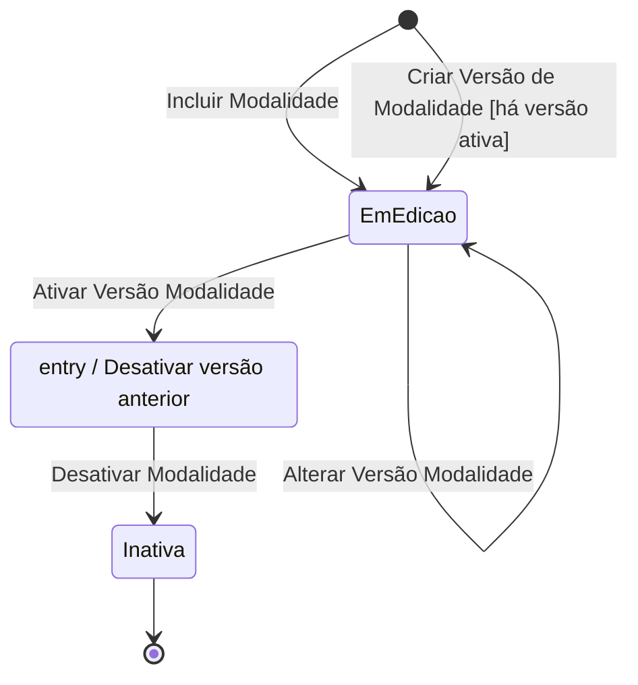

# Modelos Comportamentais

Uma instância de VersaoModalidade pode ser criada de duas maneiras. O evento Incluir Modalidade cria uma Modalidade, junto com sua primeira VersaoModalidade. Já o evento Criar Versão de Modalidade cria uma nova VersaoModalidade a partir da versão atualmente ativa da Modalidade em questão. Em ambos os casos, a VersaoModalidade é criada no estado “Em Edição”.

Enquanto uma VersaoModalidade estiver no estado “Em Edição” ela pode ser alterada, sendo possível a alteração de seus dados, bem como a inclusão, alteração e remoção de seus níveis e requisitos. Tais eventos não alteram o estado da VersaoModalidade.

O evento Ativar Versão Modalidade altera o estado da VersaoModalidade de “Em Edição” para “Ativa”. Tendo em vista que cada Modalidade só pode ter uma versão ativa, a VersaoModalidade que estava ativa tem seu estado alterado para “Inativa” (ação entry do estado “Ativa”). Dessa forma, a (nova) VersaoModalidade “Ativa” pode ser aplicada a novos projetos, enquanto a anterior “Inativa”, não.

Por fim, o evento Desativar Modalidade altera o estado de uma VersaoModalidade de “Ativa” para “Inativa”. Neste caso, a Modalidade fica sem nenhuma versão ativa, não podendo ser aplicada a novos projetos.

