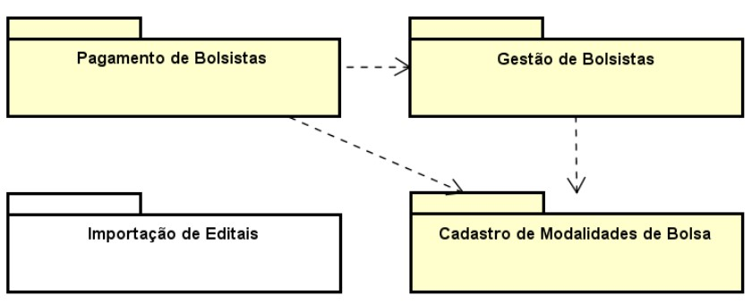

# Propósito do Módulo
O módulo Importação de Editais visa importar, do Sigfapes, as informações relativas a Editais, Projetos e Alocações, necessárias para alimentar o processo Gerar Folha de Pagamento de Bolsistas.

Este módulo se relaciona com os demais módulos (previstos ou especificados) que suportam o Macroprocesso de Gestão de Projetos conforme ilustra o diagrama de pacotes.

1. **Importação de Editais:** responsável pela importação e complementação de dados, utilizando scripts de importação e sincronização a partir do SigFapes e eventos para completar e visualizar os dados de alocações.
2. **Cadastro de Modalidades de Bolsas:** responsável pelo cadastro de modalidades e níveis de bolsas e seu versionamento por resoluções.
3. **Pagamento de Bolsistas:** responsável pelos processo de geração de folha de pagamento dos bolsistas, envolvendo a definição do calendário (marcos), liberação de editais para pagamento, consolidação e autorização de folha, geração e envio de arquivos de pagamento e cadastro para Banestes e processamento de retornos.
4. **Gestão de Bolsistas:** responsável pela inclusão, alteração, suspensão e cancelamento de bolsistas, bem como funcionalidades de suporte (necessárias para aposentar a planilha), como o remanejamento de bolsas do projeto

## Minimundo

A FAPES realiza o cadastro e gestão de seus editais, projetos e alocações de bolsistas via sistema SigFapes. Para apoiar a gestão de alocações e pagamentos são usadas planilhas. Esses dados são fundamentais para a geração de folhas de pagamento de bolsistas.

Os dados de editais, projetos e alocações de bolsistas estão registrados e são mantidos no SigFapes. Entretanto, informações como a quantidade de cotas já pagas são controladas atualmente via planilhas. Para que as folhas de pagamentos possam ser geradas, é necessário que tais dados estejam disponíveis no ConectaFapes. Assim, é preciso importar os dados existentes do SigFapes, e mantê-los sincronizados para capturar eventuais alterações no SigFapes, além de complementar com as informações das alocações, hoje mantidas em planilhas.

Neste sentido, há três contextos de recuperação de dados do SigFapes para o ConectaFapes: carga inicial, importação e sincronização.

A carga inicial é realizada com o intuito de buscar as informações básicas de editais para que o usuário possa indicar quais passarão a existir no ConectaFapes, ou seja, serão importados e sincronizados. Esta carga é realizada uma única vez e envolve os Editais, Modalidades e Níveis de Bolsas ativos. Tais dados devem ser recuperados do SigFapes e adaptados ao formato do ConectaFapes.

A importação é realizada com o intuito de buscar as informações dos editais selecionados, incluindo dados dos Editais, seus Projetos, as Alocações dos projetos e os Bolsistas alocados.

A sincronização é realizada com o intuito de atualizar as informações já importadas e recuperar possíveis novos registros. São atualizados os dados de Projetos, suas Alocações e Bolsistas. São importados novos Editais, novos Projetos, novas Alocações e novos Bolsistas.
É fundamental que as informações estejam sincronizadas imediatamente antes que seus dados possam ser alterados ou utilizados para gerar novos dados ou tomar decisões.

Para gerir e completar tais dados, são necessárias algumas funcionalidades. Após a carga inicial, o sistema deve permitir a seleção de quais editais serão importados, indicando sua área técnica. Uma vez importados os editais, para cada um de seus projetos, devem ser exibidas as suas alocações, para que o usuário possa complementar as informações considerando os dados hoje contidos em planilhas, por exemplo, a quantidade de cotas já pagas e as alocações canceladas. Uma vez que tais informações de um projeto foram completadas, este recebe o status de “Completo” e já poderá ser considerado no próximo módulo de geração de folha de pagamento.

É importante destacar que as funcionalidades de criação de Editais, Projetos, cadastro de Bolsistas, seus dados bancários, solicitação e aprovação de Alocações e outras, continuam sendo realizadas no SigFapes. Tais ações apenas geram dados que serão importados e sincronizados neste módulo.

