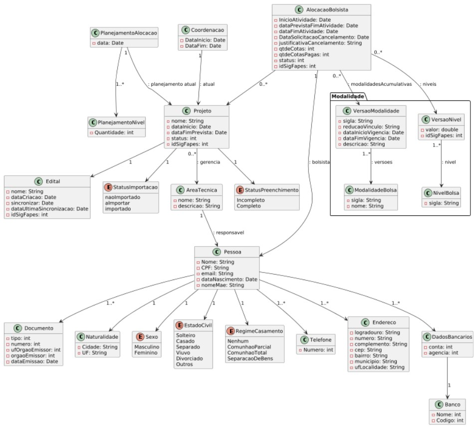

# Modelo Estrutural

O modelo de classes deste módulo está organizado em três grupos de classes. Em azul, estão as classes relativas à modalidades e níveis, especificadas no módulo Cadastrar Modalidades de Bolsas. Tais classes são utilizadas aqui para identificar o nível de bolsa (e valor) relativo a uma alocação de bolsista.

As classes em amarelo são o núcleo deste módulo e descrevem o conjunto de informações de editais, seus projetos e suas alocações. Um Edital pertence a uma AreaTecnica que gerencia suas atividades e pagamentos. Cada Edital possui um conjunto de Projetos aprovados para execução. Projetos, por sua vez, podem ter bolsistas alocados. Uma AlocacaoBolsista determina qual Bolsista está alocado a qual Projeto, recebendo qual bolsa (VersaoNivel), além de definir as quantidades de cotas totais e pagas e o status da alocação (Pendente, Ativa, Cancelada, Finalizada). Alocações canceladas possuem ainda informações sobre a data de fim das atividades do bolsista e a justificativa de cancelamento.

Para efeito de atualização dos registros durante a sincronização, as classes Edital, Projeto, AlocacaoBolsista, Bolsista e VersaoNivel possuem o atributo idSigFapes.

Por fim, as classes em rosa definem as informações exigidas pelo Banestes para cadastro e envio de remessa. Dessa forma, estão associadas ao Bolsista informações sobre sua Identificacao, InformacoesPessoais, Endereco, Contatos e DadosBancarios.

