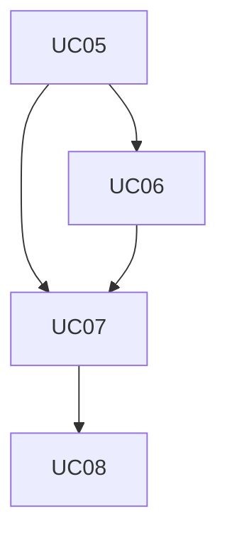
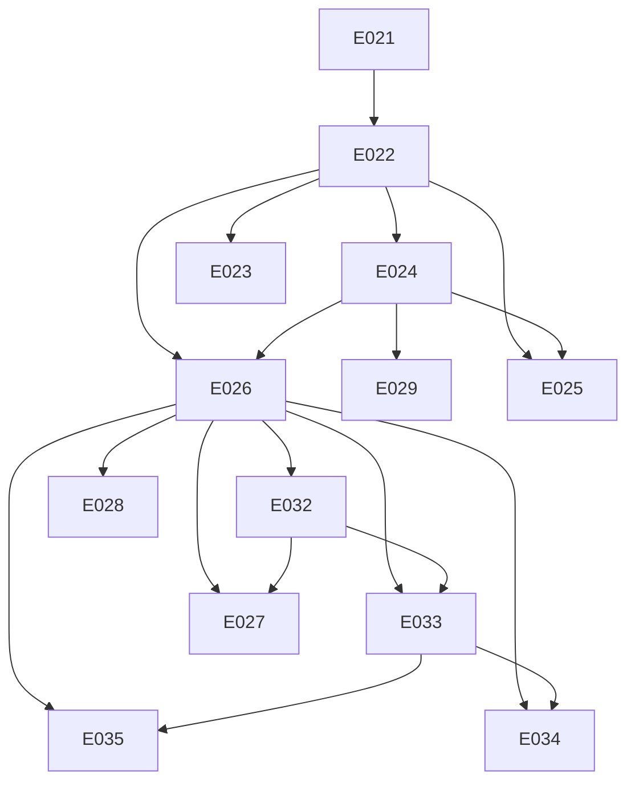

## Requisitos Funcionais

| ID   | Descrição    |Prioridade   | Dependências           |
|------|--------------|-------------|------------------------|
|RF01|O sistema deve permitir definir um calendário.|Must|-|
|RF02|O sistema deve permitir liberar editais para pagamento.|Must|RF01|
|RF03|O sistema deve permitir gerar uma folha de pagamento com os editais liberado.|Must|RF01,RF02|
|RF04|O sistema deve permitir visualizar detalhes dos projetos de um edital.|Must|-|
|RF05|O sistema deve permitir visualizar detalhes dos projetos de um edital.|Must|-|
|RF06|O sistema deve permitir consultar folhas de pagamento.|Must|RF03|
|RF07|O sistema deve permitir decidir sobre a autorização de pagamento de uma folha.|Must|RF03|
|RF08|O sistema deve permitir gerar documentos pdf para anexar ao EDOCs.|Could|-|
|RF09|O sistema deve permitir gerar arquivos de cadastro e pagamento dos bolsistas ao Banestes.|Could|RF01,RF03|
|RF10|O sistema deve processar as informações de arquivos de pagamento recebidos pelo Banestes.|Could|-|
|RF11|O sistema deve permitir solicitar transferência de recursos ao BANDES.|Could|-|

## Requisitos Não-Funcionais

| ID   | Descrição    |Prioridade   | Dependências           |
|------|--------------|-------------|------------------------|
|RNF01|O sistema deve garantir que, em cada confirmação de ação, os impactos potenciais da ação sejam apresentados de forma clara e compreensível ao usuário.|Must|-|

## Regras de Negócios

| ID   | Descrição    |Prioridade   | Dependências           |
|------|--------------|-------------|------------------------|
|RN01|Para definição do Marco de solicitação M1 (Data Limite de Solicitação de Bolsas) serão aceitas apenas datas dentro do mês de competência ou do mês anterior ao mês de competência. Por exemplo, para o mês de julho, M1 pode ter datas de Junho e Julho.|Must|RF01,RF02|
|RN02|Para definição do Marco de Geração da Folha M2 (Data Prevista de Geração da Folha Normal) serão aceitas apenas datas dentro do mês de competência. Por exemplo, para o mês de Julho, M2 deve ser data de Julho conforme.|Must|RF01,RF03|
|RN03|Para definição do Marco de pagamento M3 (Data de Pagamento da Folha Normal) serão aceitas apenas datas dentro do mês de competência ou do mês posterior ao mês de competência. Por exemplo, para o mês de julho, M3 deve ser uma data do mês de julho ou agosto.|Must|RF01,RF09|
|RN04|O marco M1 pode ser editado até o fim do dia atualmente definido para o marco. Considerando que o marco M1 seja dia 05/08, o sistema só permite que a mudança de data ocorra até às 23:59h desse mesmo dia.|Must|RF01|
|RN05|O marco M2 pode ser editado até o fim do dia anterior ao atualmente definido para o marco. Considerando que o marco M2 seja dia 15/08, o sistema só permite que a mudança de data ocorra até às 23:59h do dia 14/08.|Must|RF01|
|RN06|O marco M3 pode ser editado até antes da efetiva geração da Folha Normal do mês em questão, pois no momento da geração o arquivo de remessa é gerado e a data de pagamento definida é gravada no arquivo.|Must|RF01|
|RN07|Para cada mês em questão, o marco M1 ocorre antes do marco M2 e o marco M2 ocorre antes do marco M3.|Must|RF01|
|RN08|O marco M2 de um dado mês não pode ocorrer depois que o marco M1 do mês seguinte.|Must|RF01|
|RN09|Para cada mês em questão, é recomendável que haja uma distância maior que 5 dias entre M1 e M2 e entre M2 e M3.|Must|RF01|
|RN10|A Folha de uma competência é considerada Normal quando é a primeira folha gerada a partir do marco de gerar folha do mês vigente. Se a Folha gerada não for a primeira, é considerada uma folha Complementar. |Must|RF03|
|RN11|Editais que foram liberados e contêm pendência de avaliação de bolsa não precisarão de nova liberação quando as bolsas forem aprovadas. Quando a avaliação da bolsa for aprovada as bolsas que eram pendentes ficarão, automaticamente, disponíveis para gerar folha.|Must|RF02|
|RN12|As áreas só podem liberar os editais para a competência do mês seguinte após o marco M1 + 1 dia.|Must|RF02|
|RN13|Quando um edital entra em uma folha ele não pode mais sofrer alterações de decisão de liberação.|Must|RF02|
|RN14|Não é possível desfazer cancelar uma folha autorizada.|Must|-|
|RN15|Não é possível gerar uma nova folha se a última folha ainda estiver no estado Gerada (ou seja, a folha foi gerada mas ainda não teve uma decisão sobre sua autorização ou cancelamento).|Must|RF03|
|RN16|Caso uma folha do mês seja cancelada, a próxima ação de gerar folha daquele mês irá gerá-la novamente (e não gerar uma nova folha).|Must|RF03|

## Matrix de Dependencia dos casos de uso
| Item | Descrição | Dependências | Habilitados | Atores |
| --- | --- | --- | --- | --- |
| UC05 | Definir Calendário das Folhas |  | UC06, UC07 | GerenteGepof, GerenteAreaTecnica, DiretorAdmnistrativo |
| UC06 | Liberar Editais da Área para Pagamento | UC05 | UC07 | GerenteAreaTecnica |
| UC07 | Gerenciar Folhas de Pagamento | UC05, UC06 | UC08 | GerenteGepof |
| UC08 | Autorizar Pagamento da Folha | UC07 |  | GerenteGepof, DiretorAdmnistrativo |

### Ciclos
Caso exista ciclo, será apresentado abaixo:

### Grafo de Dependencia

## Matrix de Dependencia dos Eventos
| Item | Descrição | Dependências | Habilitados | Atores |
| --- | --- | --- | --- | --- |
| E021 | Visualizar Calendário Anual |  | E022 |  |
| E022 | Definir Marcos da Folha | E021 | E023, E024, E025, E026 |  |
| E024 | Liberar Editais para Pagamento | E022 | E025, E026, E029 |  |
| E026 | Gerar Folha | E022, E024 | E027, E028, E032, E033, E034, E035 |  |
| E032 | Listar Folhas de Pagamento | E026 | E027, E033 |  |
| E033 | Visualizar Folha | E026, E032 | E034, E035 |  |
| E035 | Decidir sobre Autorização da Folha | E026, E033 |  |  |
| E034 | Visualizar Folha com detalhes da Área Técnica | E026, E033 |  |  |
| E031 | Visualizar Bolsistas |  |  |  |
| E030 | Visualizar Projetos |  |  |  |
| E029 | Visualizar Liberações da Área | E024 |  |  |
| E028 | Visualizar Prévia de Folha Normal | E026 |  |  |
| E027 | Cancelar Folha | E026, E032 |  |  |
| E025 | Monitorar Liberações das Áreas | E022, E024 |  |  |
| E023 | Visualizar Liberação de Editais | E022 |  |  |

### Ciclos
Caso exista ciclo, será apresentado abaixo:

### Grafo de Dependencia

