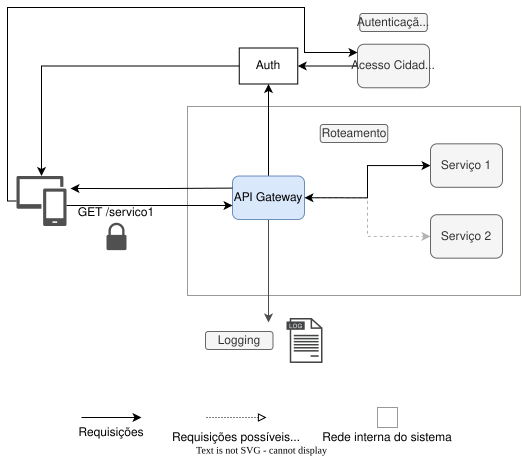
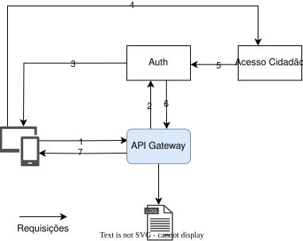
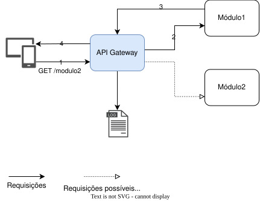

# Processos do API Gateway

## Visão Geral

### Atributos do API Gateway

### 1. **Centralização de Requisições**
O **API Gateway** atua como o ponto único de entrada para todas as requisições feitas pelos dispositivos clientes. Ele processa e encaminha as requisições para os serviços internos, funcionando como uma ponte entre o cliente e o sistema.

### 2. **Fluxo de Requisição**
O processamento de uma requisição segue as etapas abaixo:

- **Envio de Requisição**: 
  - O cliente realiza uma chamada para um endpoint específico, como `GET /servico1`.
  
- **Verificação**:
  - **Autenticação e Autorização**: 
    - Valida as credenciais do cliente e verifica se ele possui permissões adequadas para acessar o recurso solicitado.
  - **Validação de IP**: 
    - Confirma que o endereço IP de origem está dentro da faixa permitida.

- **Roteamento**:
  - Com base no endpoint solicitado e nas regras configuradas, o gateway encaminha a requisição para o serviço correspondente, como **Serviço 1** ou **Serviço 2**.

### 3. **Logging**
- Todas as requisições e respostas geram registros detalhados, que são usados para:

  - **Monitoramento**: Garantir o desempenho do sistema.
  - **Auditoria**: Registrar acessos para fins de segurança.
  - **Diagnóstico**: Identificar e resolver problemas.

### 4. **Segurança**
O API Gateway adiciona uma camada robusta de segurança ao sistema:

- Bloqueia requisições não autorizadas.
- Impede acessos diretos aos serviços internos, garantindo que apenas requisições autenticadas e autorizadas passem pelo gateway.
- Protege contra ataques comuns, como **DDoS** e acessos maliciosos.

## Processo de Autenticação:

1. Requisição Inicial:
    - O cliente (dispositivo ou navegador) envia uma requisição para o API Gateway, solicitando acesso a um recurso ou serviço.
2. Encaminhamento para Autenticação:
    - O API Gateway analisa a requisição e identifica que é necessário autenticar o cliente. Ele encaminha os dados da requisição para o módulo de autenticação (Auth).s
3. Autenticação no Módulo Auth:
    - O módulo Auth processa a requisição inicial e redireciona o cliente para a página de login do Acesso Cidadão.
4. Login no Acesso Cidadão:
    - O cliente realiza o login na interface do Acesso Cidadão, que autentica as credenciais do usuário. Após a validação, o Acesso Cidadão retorna os dados do usuário autenticado para o módulo Auth.
5. Validação e Emissão de Token:
    - O módulo Auth verifica se o usuário autenticado está registrado no banco de dados local. Caso o usuário exista, o Auth emite um token JWT (JSON Web Token) e o retorna ao API Gateway.
6. Autorização no API Gateway:
    - O API Gateway recebe o token JWT e valida sua autenticidade. Se o token for válido, o Gateway roteia a requisição para o serviço apropriado.
7. Resposta ao Cliente:
    - O API Gateway retorna uma resposta ao cliente. Se autenticado com sucesso, o cliente recebe o resultado esperado (dados ou serviço solicitado). Caso contrário, o Gateway retorna uma mensagem de erro, como "401 - Não Autorizado".

## Processo de roteamento:

1. Requisição do Cliente:
    - O cliente (dispositivo ou navegador) envia uma requisição HTTP para o endpoint do API Gateway, como `GET /servico1`.
2. Processamento no API Gateway:
    - O API Gateway analisa a requisição recebida e decide qual serviço interno deve processá-la com base no endpoint solicitado e nas regras de roteamento configuradas.
    - Se a requisição for destinada a `/servico1`, ela será encaminhada ao Serviço 1. Caso seja outro endpoint, como `/servico2`, ela será roteada para o Serviço 2.
3. Resposta do Serviço:
    - O serviço interno (por exemplo, Serviço 1) processa a requisição e retorna a resposta para o API Gateway.
4. Resposta ao Cliente:
    - O API Gateway recebe a resposta do serviço interno, registra as informações relevantes (como logs de requisição e resposta) para fins de monitoramento e auditoria, e, em seguida, envia a resposta ao cliente.