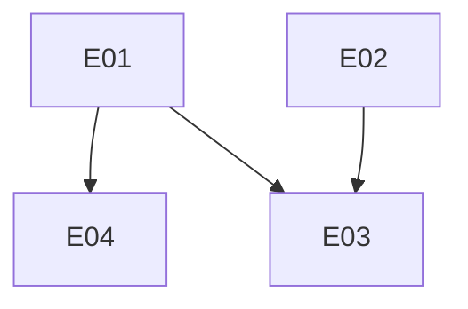

## Requisitos Funcionais

| ID   | Descrição    |Prioridade   | Dependências           |
|------|--------------|-------------|------------------------|
|RESTRICAOIP|Permitir acesso apenas aos IPs válidos.|-|CADASTROIP|
|CONTROLEROTA|Autorizar acesso às rotas apenas para usuários com papéis autorizados, baseado nas politicas de acesso.|-|-|
|CADASTROIP|Cadastrar IPs válidos para acessar o sistema.|-|-|
|RATELIMIT|Configurar limite de acesso por rota.|-|-|
|VALIDARTOKENACESSO|Valiar se o token de acesso foi criado por um serviço do conecta Fapes|-|-|

## Requisitos Não-Funcionais

| ID   | Descrição    |Prioridade   | Dependências           |
|------|--------------|-------------|------------------------|


## Regras de Negócios

| ID   | Descrição    |Prioridade   | Dependências           |
|------|--------------|-------------|------------------------|


## Matrix de Dependencia dos casos de uso
| Item | Descrição | Dependências | Habilitados | Atores |
| --- | --- | --- | --- | --- |
| UC03 | Restrição de acesso por token gerado |  |  | clientapp |
| UC02 | Restrição de acesso por poliicas de acesso |  |  | clientapp |
| UC01 | Restrição de acesso por IP |  |  | clientapp |


### Ciclos
Caso exista ciclo, será apresentado abaixo:


### Grafo de Dependencia
```mermaid
graph TD

```

## Matrix de Dependencia dos Eventos
| Item | Descrição | Dependências | Habilitados | Atores |
| --- | --- | --- | --- | --- |
| E01 | Permitir acesso ao IP. |  | E03, E04 |  |
| E02 | Restringir acesso ao IP |  | E03 |  |
| E04 | Restringir acesso à rota baseado no cargo do usuário | E01 |  |  |
| E03 | Permitir acesso à rota baseado no cargo do usuário | E01, E02 |  |  |


### Ciclos
Caso exista ciclo, será apresentado abaixo:


### Grafo de Dependencia


