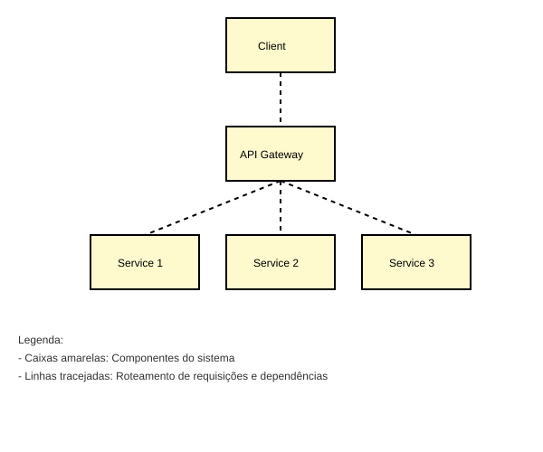
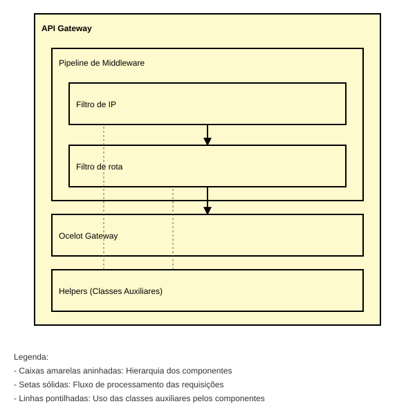

# Arquitetura

## Arquitetura geral do Gateway

O API Gateway funciona como o ponto de entrada para os aplicativos clientes interagirem com os diferentes serviços do sistema. Ele atua como um intermediário, desacoplando o cliente dos detalhes de implementação dos serviços.

Como mostrado no primeiro diagrama, o API Gateway conecta o cliente aos serviços do backend do conecta fapes. Isso permite que o cliente acesse a funcionalidade desses serviços através de uma interface unificada.

## Componentes do API Gateway

Esse diagrama fornece mais detalhes sobre os componentes internos do API Gateway:

1. **Filtro de IP**: O filtro de IP é responsável por filtrar as solicitações de entrada com base em endereços IP ou outros critérios de nível de rede.

2. **Filtro de rota**: O filtro de rota é usado para aplicar lógica de processamento ou roteamento adicional às solicitações de entrada antes que elas sejam encaminhadas para os serviços back-end.

3. **Ocelot Gateway**: O Ocelot Gateway é o componente principal do API Gateway, responsável por tarefas como roteamento de solicitação/resposta, balanceamento de carga e descoberta de serviço.

4. **Helpers (Classes Auxiliares)**: Componentes auxiliares que fornecem funcionalidade de suporte ao API Gateway, como registro em log.

As setas representam o fluxo de solicitações e respostas entre o cliente, o API Gateway e os serviços back-end. As linhas tracejadas indicam dependências ou interações entre os componentes.