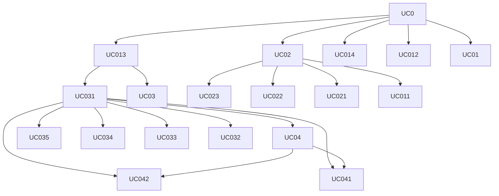

## Requisitos Funcionais

| ID       | Descrição                                                                                                                                     | Prioridade | Dependências             |
|----------|-----------------------------------------------------------------------------------------------------------------------------------------------|------------|--------------------------|
| RF01.01 | O sistema deve permitir que o usuário acesse sua conta com credenciais válidas.                                                              | Alta       |                         |
| RF01.02 | O sistema deve verificar pendências no perfil do usuário após o login e exibir avisos correspondentes.                                       | Alta       | RF01.01                 |
| RF02.01 | O sistema deve exibir avisos de bolsas implementadas ou pendentes na página inicial.                                                         | Alta       | RF01.01                 |
| RF02.02 | O sistema deve exibir avisos sobre bolsas prestes a vencer.                                                                                   | Média      | RF01.01                 |
| RF02.03 | O sistema deve exibir aos pesquisadores os avisos sobre a implementação de suas bolsas.                                                      | Alta       | RF01.01                 |
| RF02.04 | O sistema deve exibir aos pesquisadores pendências no cadastro pessoal.                                                                       | Alta       | RF01.01, RF03.01       |
| RF02.05 | O sistema deve exibir aos coordenadores informações de implementação de bolsas dos projetos vinculados.                                      | Alta       | RF01.01, RF04.01       |
| RF02.06 | O sistema deve exibir aos coordenadores os projetos com os quais têm vínculo.                                                                 | Alta       | RF01.01                 |
| RF02.07 | O sistema deve permitir ao coordenador acessar detalhes dos projetos listados.                                                                | Alta       | RF02.06, RF04.02       |
| RF02.08 | O sistema deve exibir ao bolsista informações sobre pagamento das bolsas e depósitos futuros.                                                 | Alta       | RF01.01                 |
| RF03.01 | O sistema deve permitir que usuários logados via Acesso Cidadão completem seus dados pessoais.                                                | Alta       | RF01.01                 |
| RF03.02 | O sistema deve permitir que o pesquisador cadastre e edite informações como sexo, idade, identidade e documentos pessoais.                   | Alta       | RF03.01                 |
| RF03.03 | O sistema deve permitir o cadastro e edição de endereços e anexação de comprovantes de residência e trabalho.                                | Alta       | RF03.01                 |
| RF03.04 | O sistema deve permitir que o pesquisador gerencie documentos de formação acadêmica.                                                          | Média      | RF03.01                 |
| RF03.05 | O sistema deve permitir o cadastro de dados bancários com validação obrigatória da conta no banco Banestes.                                  | Alta       | RF03.01                 |
| RF03.06 | O sistema deve exibir um aviso sobre a obrigatoriedade do preenchimento dos dados bancários antes da solicitação de bolsa.                   | Alta       | RF03.05, RF04.05       |
| RF04.01 | O sistema deve listar os projetos vinculados ao coordenador na página inicial.                                                                | Alta       | RF01.01                 |
| RF04.02 | O sistema deve exibir uma página de detalhes do projeto ao clicar no nome do projeto.                                                         | Alta       | RF04.01                 |
| RF04.03 | O sistema deve exibir um botão de acesso aos relatórios e dashboards dos projetos.                                                            | Média      | RF04.02                 |
| RF04.04 | O sistema deve exibir dashboards com estatísticas do projeto selecionado.                                                                     | Média      | RF04.03                 |
| RF04.05 | O sistema deve permitir ao coordenador solicitar nova bolsa para o projeto.                                                                   | Alta       | RF04.02, RF03.06       |
| RF04.06 | O sistema deve validar o prazo de solicitação de bolsa e exibir mensagem de erro se estiver fora do prazo.                                   | Alta       | RF04.05                 |
| RF04.07 | O sistema deve permitir salvar a solicitação como rascunho.                                                                                   | Alta       | RF04.05                 |
| RF04.08 | O sistema deve exibir mensagem de sucesso ao submeter uma nova solicitação de bolsa.                                                          | Alta       | RF04.05                 |
| RF04.09 | O sistema deve permitir ao coordenador cancelar uma bolsa com dupla confirmação.                                                              | Alta       | RF04.05                 |
| RF04.10 | O sistema deve atualizar o status da bolsa para “cancelada” após o cancelamento.                                                              | Alta       | RF04.09                 |
| RF04.11 | O sistema deve permitir ao coordenador transferir a bolsa de um bolsista, validando o cronograma do projeto.                                 | Alta       | RF04.05                 |
| RF04.12 | O sistema deve exibir status e informações detalhadas das bolsas na listagem do projeto.                                                      | Alta       | RF04.05                 |
| RF04.13 | O sistema deve exibir o motivo do cancelamento de uma bolsa, se aplicável.                                                                    | Média      | RF04.10                 |
| RF04.14 | O sistema deve permitir apagar bolsas com status de "Rascunho".                                                                               | Alta       | RF04.07                 |
| RF04.15 | O sistema deve permitir visualizar os detalhes das bolsas em qualquer status permitido.                                                       | Alta       | RF04.05                 |
| RF04.16 | O sistema deve permitir ao bolsista visualizar e anexar documentos obrigatórios para bolsas com status "Pendente documentos".                | Alta       | RF04.05                 |
| RF04.17 | O sistema deve permitir ao bolsista acompanhar o status individual dos documentos enviados.                                                   | Alta       | RF04.16                 |
| RF04.18 | O sistema deve exigir que o bolsista leia e assine o Termo de Responsabilidade da FAPES.                                                      | Alta       | RF04.16                 |
| RF05.01 | O sistema deve permitir que a Área Técnica visualize todas as implementações de bolsa com detalhes.                                           | Alta       | RF04.05                 |
| RF05.02 | O sistema deve permitir à Área Técnica aprovar individualmente cada documento enviado para a bolsa.                                           | Alta       | RF04.16                 |
| RF05.03 | O sistema deve permitir à Área Técnica aprovar a implementação da bolsa após validação de todos os documentos.                               | Alta       | RF05.02                 |
| RF05.04 | O sistema deve permitir à Área Técnica reprovar individualmente documentos ou solicitar revisão com prazo.                                   | Alta       | RF05.02                 |
| RF05.05 | O sistema deve habilitar a reprovação geral da implementação caso haja documentos reprovados.                                                | Alta       | RF05.04                 |


## Requisitos Não Funcionais

| ID       | Descrição                                                                                                      | Prioridade | Dependências       |
|----------|---------------------------------------------------------------------------------------------------------------|------------|--------------------|
| RNF01   | O sistema deve garantir autenticação segura com uso de JWT e expiração de sessão após 30 minutos de inatividade. | Alta       | RF01.01           |
| RNF02   | O sistema deve seguir as diretrizes da LGPD, protegendo dados pessoais de usuários e bolsistas.               | Alta       | RF03.01           |
| RNF06   | O sistema deve ser responsivo e acessível em dispositivos móveis e navegadores modernos.                      | Alta       | Todas as interfaces|
| RNF07   | As mensagens de erro devem ser claras, descritivas e não expor detalhes técnicos ou falhas do sistema.        | Alta       | RF04.06, RF04.10 |
| RNF08   | O sistema deve registrar logs de atividades dos usuários para fins de auditoria.                              | Alta       | RF01.01           |
| RNF14   | O frontend deve estar internacionalizado para possibilitar tradução futura.                                   | Baixa      | -                  |


## Regras de Negócios

| ID    | Descrição                                                                                     | Prioridade | Dependências                    |
|-------|-----------------------------------------------------------------------------------------------|------------|---------------------------------|
| RN01 | Apenas bolsistas com dados bancários válidos e conta no Banestes podem receber bolsas.       | Alta       | UC02.3, UC03.1                  |
| RN02 | Se o bolsiste não possuir conta no Banestes, ela é criada automaticamente                    | Alta       | UC02.3, UC03.1                  |
| RN03 | O campo "Banco" nos dados bancários deve sempre ser preenchido com "BANESTES" e não editável.| Alta       | UC02.3                          |
| RN04 | Uma bolsa só pode ser implementada dentro do prazo definido pelo sistema.                    | Alta       | UC03.1                          |
| RN05 | Uma bolsa em status "Rascunho" pode ser excluída, mas não pode ser aprovada.                 | Média      | UC03.4                          |
| RN06 | Para cancelar uma bolsa, o coordenador deve confirmar a ação duas vezes.                     | Média      | UC03.2                          |
| RN07 | O pesquisador deve completar todos os dados pessoais obrigatórios antes de solicitar bolsa.  | Alta       | UC01.1, UC02.0 – UC02.3         |
| RN08 | O bolsista deve assinar o termo de responsabilidade antes de concluir a submissão dos docs.  | Alta       | UC03.5                          |
| RN09 | Documentos reprovados devem ser corrigidos e reenviados dentro do prazo estipulado.          | Alta       | UC04.2                          |
| RN10 | A Área Técnica só pode aprovar a implementação após todos os documentos estarem aprovados.   | Alta       | UC04.1                          |
| RN11 | O sistema deve exibir apenas os projetos e bolsas aos quais o usuário possui vínculo.         | Alta       | UC01.2, UC01.3, UC03.0          |
| RN12 | As estatísticas e dashboards exibem apenas dados dos projetos com vínculo ativo do usuário.   | Média      | UC03.0                          |


## Matrix de Dependencia dos casos de uso
| Item | Descrição | Dependências | Habilitados | Atores |
| --- | --- | --- | --- | --- |
| UC04GP | Gestão de projetos Portal Admin (Back-Office) |  |  |  |
| UC03GP | Gestão de projetos Portal Fapes (Front-Office) |  |  |  |
| UC02PM | Exibir dados em Meu Perfil |  |  |  |
| UC01SA | Exibir sistema de avisos de bolsas |  |  |  |
| UC0LG | Login e Logout |  |  |  |


### Ciclos
Caso exista ciclo, será apresentado abaixo:


### Grafo de Dependencia
```mermaid
graph TD

```

## Matrix de Dependencia dos Eventos
| Item | Descrição | Dependências | Habilitados | Atores |
| --- | --- | --- | --- | --- |
| UC0 | Acesso ao sistema |  | UC01, UC012, UC013, UC014, UC02 |  |
| UC013 | Exibir aos Coordenadores os projetos que ele possui relação | UC0 | UC03, UC031 |  |
| UC031 | Permitir ao Coordenador implementar uma bolsa para o projeto | UC013 | UC032, UC033, UC034, UC035, UC04, UC041, UC042 |  |
| UC04 | Permitir a Área Técnica visualizar as implementações de bolsas | UC031 | UC041, UC042 |  |
| UC02 | Permitir ao Pesquisador completar os dados pessoais | UC0 | UC011, UC021, UC022, UC023 |  |
| UC042 | Permitir a Área Técnica reprovar uma implementação | UC031, UC04 |  |  |
| UC041 | Permitir a Área Técnica aprovar uma implementação | UC031, UC04 |  |  |
| UC035 | Permitir ao Bolsista inserir documentos necessários para implementar uma bolsa | UC031 |  |  |
| UC034 | Permitir ao Coordenador acompanhar o processo de implementação de bolsas | UC031 |  |  |
| UC033 | Permitir ao Coordenador mudar a bolsa de um bolsista | UC031 |  |  |
| UC032 | Permitir ao Coordenador cancelar uma bolsa do projeto | UC031 |  |  |
| UC03 | Permitir ao Coordenador visualizar dados em Dashboard dos projetos | UC013 |  |  |
| UC023 | Permitir ao Pesquisador cadastrar seus dados bancários | UC02 |  |  |
| UC022 | Permitir ao Pesquisador gerenciar os documentos de formação | UC02 |  |  |
| UC021 | Permitir ao Pesquisador inserir seu endereço e comprovantes | UC02 |  |  |
| UC014 | Exibir aos Bolsistas informações sobre o pagamento das bolsas | UC0 |  |  |
| UC012 | Exibir aos Coordenadores avisos de sobre a implementação de bolsas | UC0 |  |  |
| UC011 | Exibir aos Pesquisadores informações sobre a atualização cadastral | UC02 |  |  |
| UC01 | Exibir aos pesquisadores avisos de implementação de bolsas | UC0 |  |  |


### Ciclos
Caso exista ciclo, será apresentado abaixo:


### Grafo de Dependencia


