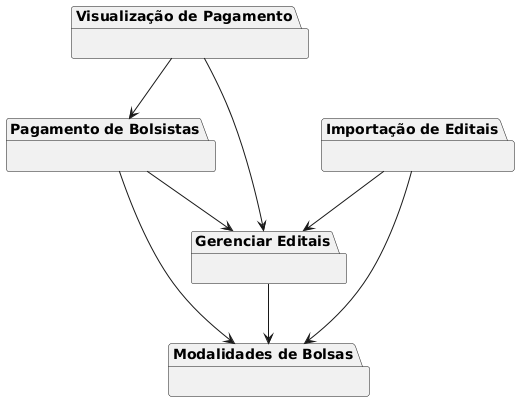

# Visão Geral
Referimos como *módulos* componentes do sistema que encapsulam um conjunto de funcionalidades relacionadas.

Módulos facilitam a organização, manutenção e escalabilidade do software, permitindo que diferentes partes do sistema sejam desenvolvidas, testadas e atualizadas de forma independente.

## Tabela Geral de Módulos
| ID   | Nome   | Descrição    |Valor|Equipe|Tipo|
|------|-----   |--------------|---- |---- |---- |
|M001 | Modalidades de Bolsas| Visa permitir o cadastro e manutenção das Modalidades, Níveis e Requisitos de Bolsas definidos por meio de Resoluções da FAPES.|Não|Blue|Negócio|
|M002 | Importação de Editais|Visa importar, do Sigfapes, as informações relativas a Editais, Projetos e Alocações, necessárias para alimentar o processo Gerar Folha de Pagamento de Bolsistas.|Não|Green|Negócio|
|M003 | Gerenciar Editais|Permitir o Visualização de dados sobre  Editais, Projetos, Bolsistas, Alocaçõe, provendo visualizações de dados para tomada de decisão para realizar pagamentos|Não|Blue|Negócio|
|M004|Pagamento de Bolsistas|Permitir a geração dos dados das folhas de pagamentos mensais dos bolsistas (exceto UnAC e capacitação) & Operacionalizar o pagamento da folha, apoiando a comunicação com Banestes e BANDES, além de gerar documentos a serem anexados no EDOCS|Sim|Green|Negócio|
|M005|Autenticação, Autorização e Auditoria|Implementar um módulo de autenticação e autorização integrado ao Acesso Cidadão que nos permita definir autorizações em nível de dados e delegação de funções|Não|Black|Sistema|

Tipos de Módulos:
* Negócio: tem como objetivo atender um requisito funcional do projeto. 
* Sistema: tem como objetivo atender um requisito funcional não funcional do projeto (e.g., Segurança e Performance). 

##  Relação entre os Módulos

## Cronograma Geral 2024

| Módulo  | Funcionalidade  | Data   Prevista | Data Planejada | Data Entregue |Feito?|Estágio|
|---------|:-----------------|:-----------:|:-----------:|---|---|---|
| Importação de Editais                     | Sincronizar dados de Edital                                   | 29/11/2024 | 19/12/2024 |19/12/2024| Sim | Pendente de subir no servidor |
| Importação de Editais                     | Sincronizar dados de Projeto                                  | 29/11/2024 | 19/12/2024 |19/12/2024| Sim | Pendente de subir no servidor |
| Importação de Editais                     | Sincronizar dados de Pessoa (e.g., dados pessoais e bancários)| 29/11/2024 | 19/12/2024 |19/12/2024| Sim | Pendente de subir no servidor |
| Importação de Editais                     | Sincronizar dados de alocação de Projeto                      | 29/11/2024 | 19/12/2024 |19/12/2024| Sim | Pendente de subir no servidor |
| Pagamento de Bolsistas  | Gerenciar Folha de Pagamento (Gerar, Cancelar, Visualizar)                      | 20/12/2024 |-| 19/12/2024 | Sim | Pendente de subir no servidor |
| Pagamento de Bolsistas  | Definir Calendário das Folhas                                                   | 25/11/2024 |-| 22/11/2024 | Sim | Pendente de subir no servidor |
| Pagamento de Bolsistas  | Liberar Editais da Área para Pagamento                                          | 16/12/2024 |-| 25/11/2024 | Sim | Pendente de subir no servidor |
| Autenticação, Autorização e Auditoria     | Configurar OpenFGA em Docker                                  | 29/11/2024 |-|-|-|-|
| Autenticação, Autorização e Auditoria     | Desenvolver frontend admin do OpenFGA                         | 02/12/2024 |-|-|-|-|
| Autenticação, Autorização e Auditoria     | Configurar ambiente Kubernetes                                | 06/12/2024 |-|-|-|-|

## Cronograma Geral 2025
|Módulo| Funcionalidade| Data Prevista|Data Entregue|Feito?|Estágio|
|-----|:------------|:----:|:---:|---|---|
| Autenticação, Autorização e Auditoria     | Definir política de acesso                                    | 20/01/2025 |-|-|-|
| Visualização de dados de Pagamento        | Dashboard                                                     | 27/01/2025 |-|-| Em Andamento |
| Autenticação, Autorização e Auditoria     | Desenvolvimento e deploy da API Gateway                       | 07/02/2025 |-|-|-|
| Autenticação, Autorização e Auditoria     | Implementar Kubernetes nas aplicações                         | 14/02/2025 |-|-|-|
| Autenticação, Autorização e Auditoria     | Desenvolver logs de acesso com ELK Stack                      | 21/02/2025 |-|-|-|
| Pagamento de Bolsistas                    | Autorizar Pagamento da Folha                                  | 20/01/2025 |-|-|-|
| Pagamento de Bolsistas                    | Cadastrar Bolsista no Banestes                                | **03/02/2025** (Rever essas datas) |-|-|-|
| Pagamento de Bolsistas                    | Processar Pagamento via Banestes (remessa e retorno)          | **28/02/2025** (Rever essas datas)|-|-|-|
| Pagamento de Bolsistas                    | Solicitar ao Bandes Transferência de Recursos                 | **28/02/2025** (Rever essas datas)|-|-|-|
| Importação de Editais                     | Tratamento de erros do job de importação de editais           |-|-|-|-|-|