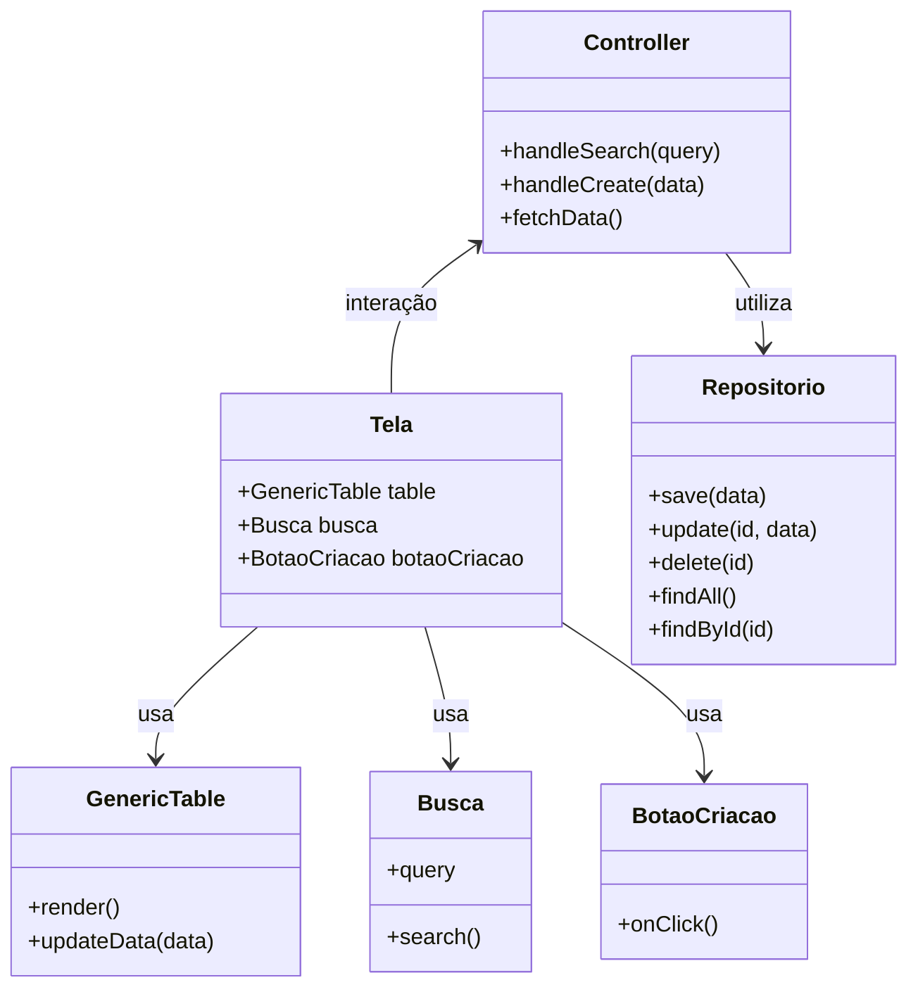

## Contexto

**Módulo**: Pagamento

**Equipe:** Squad Blue 

**Backlog de Exemplo:**

https://docs.google.com/spreadsheets/d/1QEja-DjuN7_IIN5eTKQs4f0mCOfz5qpXfGm5ivgTKLc/edit?gid=2082184915#gid=2082184915

## Unsdestanding 

Requisitos acordados com o cliente para a sprint: 

**Backlog da Sprint**
- Definir Calendário das Folhas
- Liberar Editais da Área para Pagamento


## Realizar Inspiração de Design Sprint

Busca de soluções existentes...


## Registrar impressões e insights para realizar a tarefa


Planilha simples de Folha de pagamento encontrada: 

https://docs.google.com/spreadsheets/d/1bAbdCZg6wgGdbsx_yRPo6P42Pn4uebzS/edit?gid=131372299#gid=131372299

Algumas telas de sistemas de pagamentos encontrados:

https://docs.google.com/document/d/1gc47nB4i82M2wZcW6JJpcNGazojKJBwCAyevdeWp4a0/edit?tab=t.0

Inserir telas do sigfapes também. 

Para **definir o Calendário de Pagamento**, foi desenvolvida uma tela utilizando HTML, Bootstrap e LocalStorage, com o auxílio do ChatGPT.

Se você deseja criar algo semelhante, basta solicitar à IA de sua preferência que crie uma tela em HTML utilizando Bootstrap (ou qualquer outro framework visual) e configure o armazenamento dos dados no LocalStorage.

Resultado:
https://chatgpt.com/c/673b4a5c-89a4-8009-b1cc-2d84e6b496c7


## Definir Histórias de Usuários

Detalhamento das histórias de usuário selecionadas. 

Eu, no papel de gerente de área 


**Definir Calendário de Pagamento**

- Criar:
Como administrador do sistema, eu preciso cadastrar o calendário de pagamento da FAPES, definindo as datas de pagamento, para que o sistema possa gerenciar e organizar a folha de pagamento de forma controlada e eficiente.

- Atualizar:
Como administrador do sistema, eu preciso atualizar o calendário de pagamento da FAPES, permitindo ajustes nas datas de pagamento quando necessário, para garantir que o gerenciamento e a organização da folha de pagamento reflitam alterações pontuais ou emergenciais.

- Remover:
Como administrador do sistema, eu preciso remover entradas do calendário de pagamento da FAPES que não sejam mais necessárias, para manter os dados atualizados e evitar conflitos ou confusões no gerenciamento da folha de pagamento.

- Listar:
Como administrador do sistema, eu preciso visualizar a lista completa do calendário de pagamento da FAPES, para acompanhar de forma clara e organizada as datas de pagamento e garantir que todas as informações estejam corretas e disponíveis para consulta


**Esta documentaçao deve ser completada com descrição de regras de negocio, etc...**


**Desenvolver protótipo de prova de conceito (PoC)**

TODO: Figma aqui o codigo em vue ou em html.

## Obter insights junto com cliente usuário (validação prévia)

Mostrar o protótipo junto ao cliente para validaçao.

## Definir estrutura mínima viável do projeto

Projeto as classes de domínio e as separações dos componentes para implementação. Definir rotas para comunicação do frontend com o backend. 



### Rotas para o componente

**post:**
/api/calendario
**get:**
/api/calendario

**get por ano:**
/api/calendario?porano=2024


## Definir estrutura de dados entre Front-End e Back-End

Definir uma estrutura de dados para comunicação frontend e backend 

```
{
  "calendarios": [
    {
      "ano": 2024,
      "meses": [
        {
          "mes": "Janeiro",
          "d1": "2024-01-10",
          "d2": "2024-01-20",
          "d3": "2024-01-31"
        },
        {
          "mes": "Fevereiro",
          "d1": "2024-02-10",
          "d2": "2024-02-20",
          "d3": "2024-02-29"
        },
        {
          "mes": "Março",
          "d1": "2024-03-10",
          "d2": "2024-03-20",
          "d3": "2024-03-31"
        }
      ]
    },
    {
      "ano": 2025,
      "meses": [
        {
          "mes": "Janeiro",
          "d1": "2025-01-15",
          "d2": "2025-01-25",
          "d3": "2025-01-30"
        },
        {
          "mes": "Fevereiro",
          "d1": "2025-02-12",
          "d2": "2025-02-22",
          "d3": "2025-02-28"
        },
        {
          "mes": "Março",
          "d1": "2025-03-10",
          "d2": "2025-03-20",
          "d3": "2025-03-30"
        }
      ]
    }
  ]
}

```


## Desenvolver frontend protótipo real

....