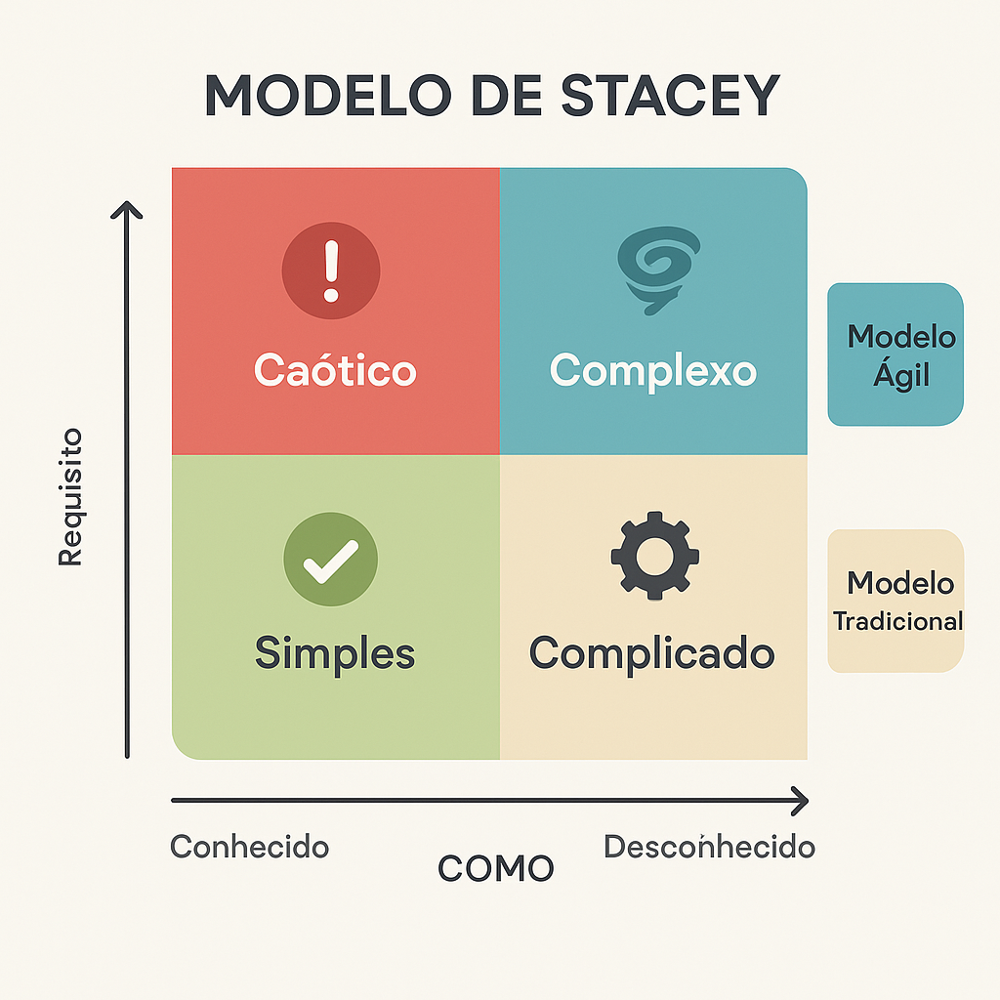

O **Modelo de Stacey** é uma ferramenta visual criada por Ralph D. Stacey para ajudar gestores a **entender o nível de complexidade de um problema** e, com isso, **escolher a melhor abordagem de gestão**.

A matriz é construída com base em dois eixos:

* **Eixo X**: Clareza de *como* resolver o problema (tecnologia, métodos, processos).
* **Eixo Y**: Clareza de *o que* precisa ser feito (objetivos, requisitos).

A partir desses dois fatores, o modelo define **quatro zonas de complexidade**:

---

## 🔵 Zona Simples

* Tudo é conhecido: tanto os requisitos quanto a solução.
* Exemplo: emissão de boletos, cálculo de folha de pagamento.
* **Abordagem ideal**: processos padronizados, modelos tradicionais (Waterfall).

## 🟡 Zona Complicada

* Os requisitos são claros, mas a solução exige análise técnica.
* Exemplo: integração de sistemas com regras complexas.
* **Abordagem ideal**: especialistas, documentação, algum planejamento detalhado.

## 🟠 Zona Complexa

* Os requisitos ainda não estão totalmente definidos e a solução emerge com o tempo.
* Exemplo: desenvolvimento de produtos inovadores, apps digitais.
* **Abordagem ideal**: **Métodos Ágeis** como Scrum, Kanban, XP.
* **Por que Agile?**: porque o contexto exige **experimentação, adaptação contínua e colaboração com o cliente**.

## 🔴 Zona Caótica

* Nada é claro: nem o que fazer, nem como resolver. Situação de crise.
* Exemplo: incidentes em produção, falhas graves em sistemas críticos.
* **Abordagem ideal**: ação imediata, tomada de decisões rápidas, estabilização.

---

## 📌 Por que Agile está na Zona Complexa?

Métodos ágeis foram criados para lidar com **incerteza e mudanças constantes**. Eles se encaixam perfeitamente na zona **Complexa** do Modelo de Stacey, onde:

* Os requisitos evoluem com o tempo;
* O cliente descobre o que realmente precisa ao ver incrementos do produto;
* A solução não é óbvia e precisa de testes, feedback e adaptação contínua.

> Em vez de planejar tudo no início, Agile **aprende e entrega valor continuamente**.

---

## 🎯 Conclusão

O **Modelo de Stacey** nos ensina que **não existe uma única abordagem ideal para todos os projetos**. Cada tipo de problema exige uma estratégia diferente.

* **Projetos previsíveis?** Use o modelo tradicional.
* **Projetos incertos e inovadores?** Use **Agile**.

Escolher o método certo depende de **avaliar a complexidade do problema** — e o Modelo de Stacey é uma excelente bússola para essa decisão.

