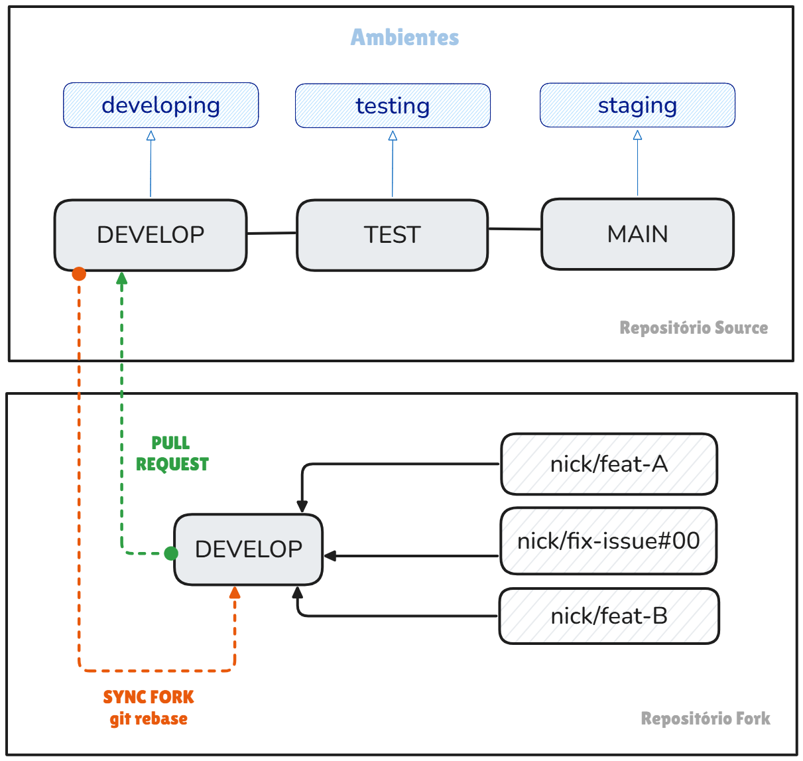
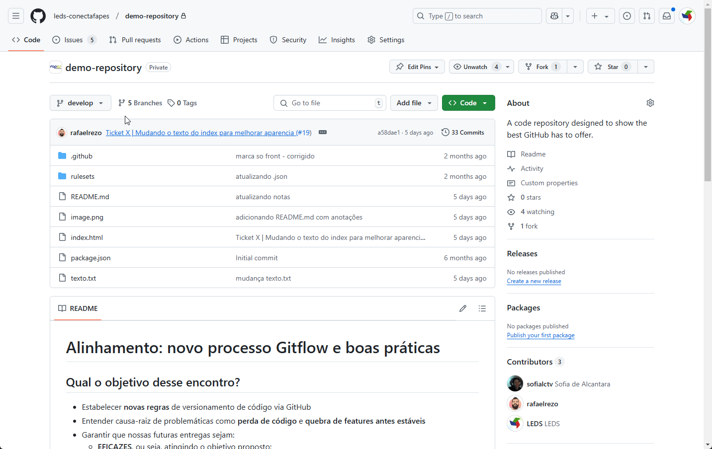
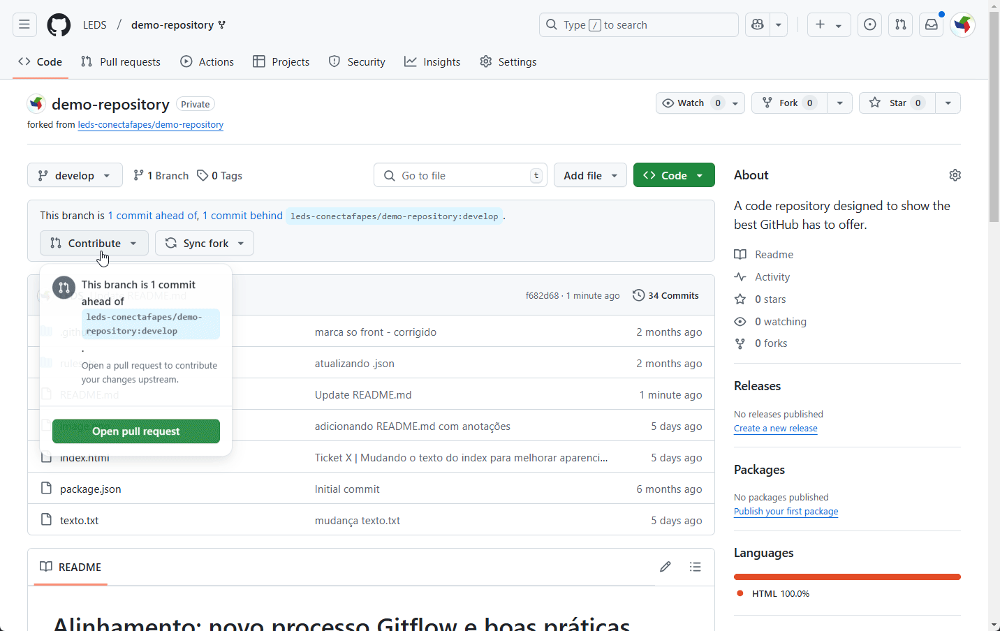

# Boas Práticas de Git

Este documento descreve boas práticas a serem seguidas por *todos* os colaboradores da organização **leds-conectafapes** para garantir um fluxo de trabalho eficiente e organizado no GitHub. Vamos abordar os principais eventos:

- Fork and Pull Strategy: nossa abordagem de colaboração
- Criando repositórios
- Padrões de nomenclatura

## Estratégia Fork and Pull

A **Fork and Pull Strategy** é uma abordagem amplamente utilizada em projetos colaborativos no GitHub, especialmente em equipes distribuídas ou em projetos de código aberto e a adotamos também no projeto ConectaFapes.

Nessa estratégia, cada colaborador cria um **fork** **(uma cópia independente)** do repositório principal em sua própria conta do GitHub. Isso permite que trabalhem de forma isolada, sem afetar diretamente o repositório original. As alterações são feitas em branches específicas no fork, seguindo padrões como `nick/feat-nome-da-feature` ou `nick/fix-issue#numero-issue` (que explicaremos mais tarde). Quando a feature estiver concluída, o desenvolvedor abre um **Pull Request (PR)** para propor a integração das mudanças no repositório principal. 

Essa abordagem promove um fluxo de trabalho seguro e organizado, pois mantém o repositório principal **protegido contra alterações diretas**, facilita a revisão de código e permite que os mantenedores tenham controle total sobre o que é mesclado.

## Branches Padrão nos Repositórios

No repositório principal (repositório source), as branches default são:
- `main`: Branch estável que contém o código de produção.
- `develop` (default): Branch de desenvolvimento onde as novas funcionalidades são integradas e a partir de onde novos repositórios fork são gerados.
- `test`: Branch utilizada para testes antes de integrar as mudanças na `develop`.

No repositório fork, as branches padrão de dão por:
- `develop`: Branch de desenvolvimento onde as novas funcionalidades são integradas.
- `nick/feat-A`, `nick/fix-issue#00`, etc: Branches utilizadas para codificação das tarefas. **O trecho `nick/` é relativo ao seu usuário no GitHub.**

### Prefixos de branches
Elas devem seguir o padrão:

- **Branches de Funcionalidades (Feature Branches):** Essas branches são usadas para desenvolver novas funcionalidades. Use o prefixo `nick/feat`. Por exemplo, `nick/feat-sistema-de-login`.

- **Branches de Correção de Bugs (Bugfix Branches):** Essas branches são usadas para corrigir bugs ou solicitações de design no código. Use o prefixo `nick/fix`. Por exemplo, `nick/fix-issue#29`.

- **Branches de Correção Emergencial (Hotfix Branches):** Essas branches são criadas diretamente a partir da branch de produção para corrigir bugs críticos no ambiente de produção. Use o prefixo `nick/hotfix`. Por exemplo, `nick/hotfix-problema-critico-de-seguranca`.

- **Branches de Documentação (Documentation Branches):** Essas branches são usadas para escrever, atualizar ou corrigir documentação, por exemplo, o arquivo `README.md`. Use o prefixo `nick/docs`. Por exemplo, `nick/docs-endpoints-da-api`.

### Regras básicas para nomeação de branches
1. **Letras Minúsculas e Separadas por Hífens:**  
   Utilize **apenas** letras minúsculas nos nomes das branches e separe as palavras com hífens. Por exemplo: `feat/novo-login` ou `fix/estilo-do-cabecalho`.

2. **Caracteres Alfanuméricos:**  
   Use apenas caracteres alfanuméricos (a-z, 0–9) e hífens. Evite pontuações, espaços, underlines (`_`) ou qualquer caractere não alfanumérico.

3. **Sem Hífens Contínuos:**  
   Não utilize hífens contínuos. Nomes como `feat--novo-login` podem ser confusos e difíceis de ler.

4. **Sem Hífens no Final:**  
   Não termine o nome da branch com um hífen. Por exemplo, `feat-novo-login-` não é uma boa prática.

5. **Descritivo e Conciso:**  
   O nome deve ser descritivo e conciso, refletindo de forma clara o trabalho realizado na branch.

## Ambientes de Desenvolvimento
As branches default estão intimamente ligadas aos **ambientes de desenvolvimento**, que *são espaços isolados que permitem aos desenvolvedores trabalhar em projetos de software de forma independente e sem interferências externas* [¹](https://logap.com.br/blog/ambientes-de-codigo/). 

Veja a relação entre branches e ambientes abaixo:

| **Repositório** |     **Branch**    |        **Ambiente associado**       |
|:---------------:|:-----------------:|:-----------------------------------:|
| source          |        main       |   staging.conectafapes.leds.dev.br  |
| source          |        test       |   testing.conectafapes.leds.dev.br  |
| source          |      develop      | developing.conectafapes.leds.dev.br |
| fork            |      develop      |            Não se aplica            |
| fork            |   nick/feat-A     |            Não se aplica            |
| fork            | nick/fix-issue#00 |            Não se aplica            |
| fork            |       [...]       |                                     |

## Procedimento de criação e manutenção de Repositórios Forks

### 1. Criação do Fork
   - Cada colaborador deve criar um fork do repositório principal para seu próprio espaço de trabalho no GitHub.
   - O fork deve ser atualizado regularmente com as mudanças do repositório principal para evitar divergências. **O sync entre os repos fork e source é de inteira responsabilidade do desenvolvedor.**

:::info
Mantenha o nome original do repositório e realize o clone somente da branch default!
:::

### 2. Criação de Branches no Fork
   - É recomendável manter a branch default do repo source intacta, de modo que você possa realizar *syncs*, que são nada além de um [rebase](https://git-scm.com/book/pt-br/v2/Branches-no-Git-Rebase), de modo prático. A partir dela, cria as branches de acordo com sua necessidade.
   - As branches no fork devem seguir o padrão `nick/feat-nome-da-feature`, `nick/fix-issue#numero-issue` ou `nick/hotfix-issue#numero-issue`, como apresentado no tópico [Prefixos de branches](#prefixos-de-branches).
  
  

### 3. Commits
   - Os commits devem ser **atômicos**, ou seja, cada commit é responsável por uma única alteração e, idealmente, representa a alteração completa.
   - As mensagens de commit devem ser claras e descritivas, explicando o que foi alterado e por quê. Exemplo: `"Adiciona funcionalidade de autenticação de usuário"`.

### 4. Pull Requests (PRs)

:::caution[**Todas as entregas devem ser feitas através de Pull Requests, nunca diretamente via commits.**]
:::
   - **O título do PR deve ser descritivo e seguir um padrão que facilite a identificação do conteúdo**. Se possível, utilize *flags* nos títulos dos PRs e, caso aplicável, referencie issues como nos exemplos abaixo:
     - `[FEAT]: Adiciona autenticação de usuário`
     - `[FIX]: Corrige erro na validação de formulário #123`
     - `[HOTFIX]: Corrige falha crítica na autenticação #456`
     - `[DOCS]: Atualizando README.md`

## Conclusão
Seguir as boas práticas apresentadas ajudará a equipe a evitar problemas como perda de código e quebra de features estáveis, garantindo que as entregas sejam eficazes, eficientes e efetivas. **Contamos com a colaboração de todos!** 😊

:::note[Em caso de dúvidas ou sugestões, contate um membro do time de Qualidade.]
:::

### Saiba mais em...
- [Commit Often, Perfect Later, Publish Once: Git Best Practices](https://sethrobertson.github.io/GitBestPractices/)
- [Commits Atômicos: O que são?](https://community.revelo.com.br/commits-atomicos-o-que-sao/)
- [Merging vs. Rebasing](https://www.atlassian.com/git/tutorials/merging-vs-rebasing)
- [Git Squash Commits: A Guide With Examples](https://www.datacamp.com/tutorial/git-squash-commits)
- [Best practices for using Git](https://deepsource.com/blog/git-best-practices#_1-make-clean-single-purpose-commits)
