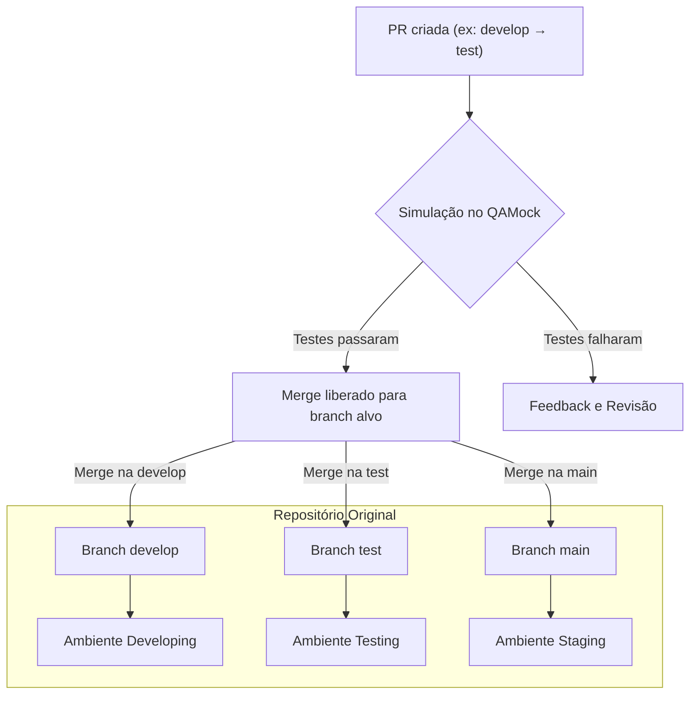

# Ambientes

Este documento descreve os ambientes, suas branches e fluxos de deploy/integração contínuo(a) do projeto.
<!-- , incluindo o papel do **QAMock** na validação de pull requests (PRs). -->

---

## 1. **Ambiente de Desenvolvimento (Developing)**
### Finalidade
- Utilizado para desenvolvimento ativo de novas funcionalidades e correções.
- Ambiente instável, com atualizações frequentes direto do branch `develop`.

### Acesso
- **URL**: [`https://developing.conectafapes.leds.dev.br`](developing.conectafapes.leds.dev.br)
- **VPN**: Sim (acesso restrito à rede interna).

### Branch Relacionado
- **Branch**: `develop`
- **Repositório**: [Link para o branch](https://github.com/leds-conectafapes/leds-conectafapes-frontend-admin/tree/develop)
- **Observação**: Atualizado continuamente via pull requests aprovadas.

---

## 2. **Ambiente de Testes (Testing)**
### Finalidade
- Validação manual e automatizada de funcionalidades pela equipe de QA.
- Ambiente estável, preparado para testes de aceitação (UAT).

### Acesso
- **URL**: [`https://testing.conectafapes.leds.dev.br`](testing.conectafapes.leds.dev.br)
- **VPN**: Sim.

### Branch Relacionado
- **Branch**: `test`
- **Repositório**: [Link para o branch](https://github.com/leds-conectafapes/leds-conectafapes-frontend-admin/tree/test)
- **Observação**: Recebe código apenas após aprovação via PR de `develop` para `test`.

---

## 3. **Ambiente de Staging**
### Finalidade
- Simulação fiel do ambiente de produção para validação final (performance, segurança, integração).
- Última etapa antes da implantação em produção.

### Acesso
- **URL**: [`https://staging.conectafapes.leds.dev.br`](staging.conectafapes.leds.dev.br)
- **VPN**: Sim.

### Branch Relacionado
- **Branch**: `main`
- **Repositório**: [Link para o branch](https://github.com/leds-conectafapes/leds-conectafapes-frontend-admin/tree/main)
- **Observação**: Recebe código apenas após aprovação via PR de `test` para `main`.

---

## 4. **QAMock (Ambiente de Simulação de PR)**
### Finalidade
- Simular o resultado de um merge antes de aprovar uma PR.
- Executar testes automatizados nesse ambiente simulado.
- Evitar conflitos ou quebras no código principal.

### Funcionamento
1. Uma PR é criada (ex: de `develop` para `test`).
2. O sistema gera um ambiente efêmero no QAMock com o resultado simulado do merge.
3. Testes automatizados são executados neste ambiente.
4. Se os testes passarem, a PR é liberada para merge manual.

### Observações
- Não está vinculado a um branch fixo.

---

## Fluxograma

