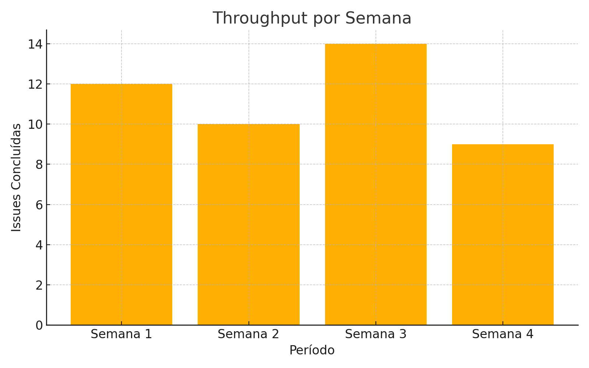
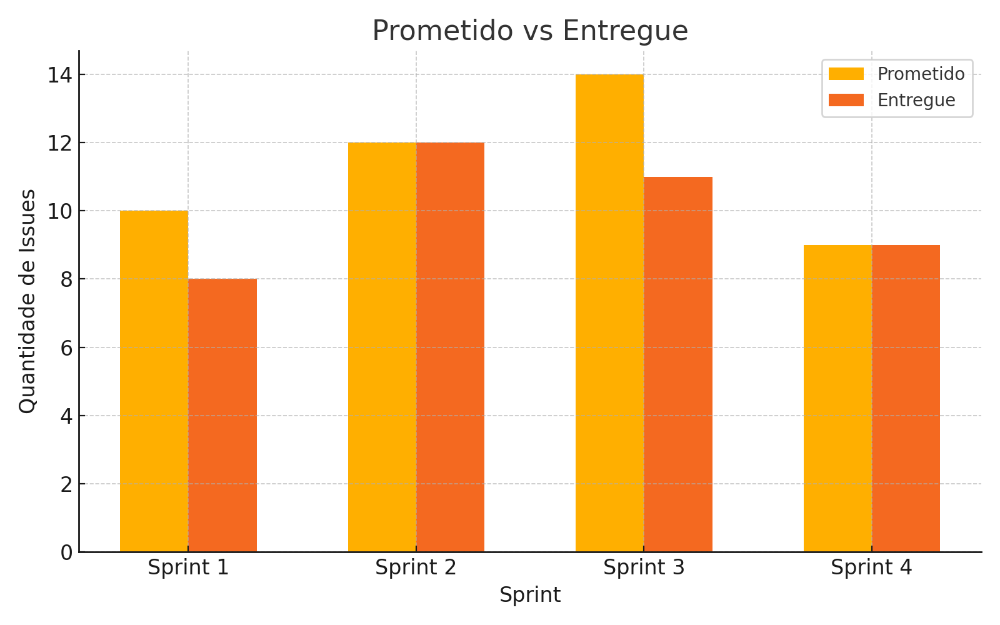
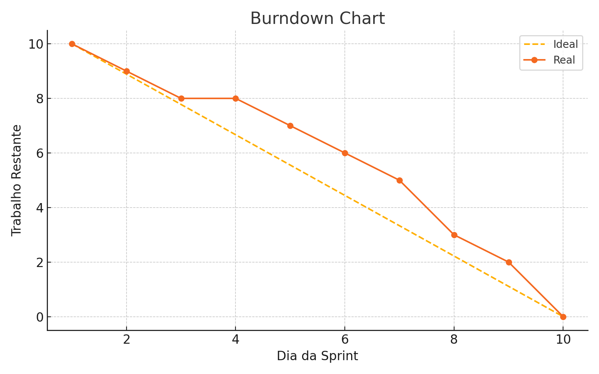
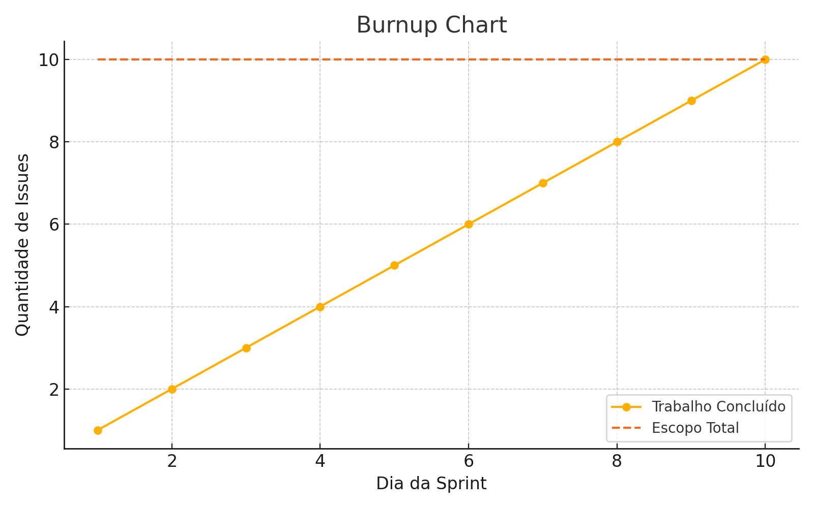
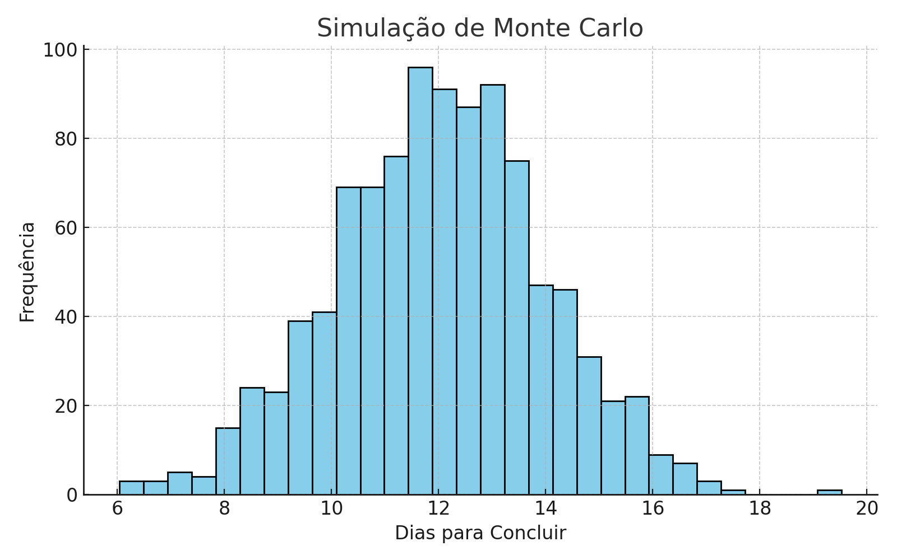

A utilização de métricas permite acompanhar a saúde do processo, melhorar a previsibilidade e fomentar a melhoria contínua. Abaixo estão as principais métricas aplicáveis na gestão de projetos usando dados de _issues_ do GitHub.

Quando aplicadas diretamente aos dados de _issues_ do GitHub, tornam-se ferramentas poderosas para uma gestão orientada a dados, promovendo:
- **Transparência**
- **Melhoria Contínua**
- **Previsibilidade**
- **Confiabilidade nas Entregas**

## 🔄 Throughput

O **Throughput** representa a quantidade de _issues_ concluídas em um período (semana, sprint ou mês). Essa métrica reflete a capacidade do time de entregar trabalho.

**✅ Benefícios:**
- Mede a produtividade do time.
- Ajuda a entender a capacidade média de entrega.
- Serve como base para previsões.

**❓ Perguntas que responde:**
- Qual é a nossa capacidade média de entrega?
- Quantas tarefas concluímos por sprint, semana ou mês?
- Estamos aumentando, reduzindo ou mantendo nossa produtividade ao longo do tempo?
- Como comparar a capacidade entre diferentes times ou períodos?

| Período  | Issues Concluídas |
|----------|--------------------|
| Semana 1 | 12                 |
| Semana 2 | 10                 |
| Semana 3 | 14                 |
| Semana 4 | 9                  |

## 🎯 Prometido vs Entregue

Compara o que foi **planejado (prometido)** no início da sprint ou ciclo com o que foi efetivamente **entregue** no final.

**✅ Benefícios:**
- Avalia a assertividade do planejamento.
- Identifica padrões de superestimativa ou subestimativa.
- Melhora a previsibilidade dos próximos ciclos.

**❓ Perguntas que responde:**
- Estamos planejando bem? Nossas estimativas são realistas?
- Qual a diferença entre o que prometemos e o que entregamos?
- Existe uma tendência de superestimar ou subestimar?
- Quão confiável é nosso planejamento atual?

| Sprint | Prometido | Entregue |
|--------|-----------|----------|
| 1      | 10        | 8        |
| 2      | 12        | 12       |
| 3      | 14        | 11       |
| 4      | 9         | 9        |

## 🔥 Burndown Chart

O **Burndown** mostra como o trabalho restante está sendo reduzido ao longo do tempo dentro de um ciclo (ex.: sprint).

**✅ Benefícios:**
- Permite acompanhar se o ritmo está adequado.
- Detecta desvios no andamento durante a sprint.
- Facilita a identificação de gargalos rapidamente.

**❓ Perguntas que responde:**
- Estamos no ritmo certo para concluir a sprint?
- Quantas tarefas ainda restam?
- Houve aumento no escopo ou bloqueios no ciclo?
- O time está progredindo diariamente?

**🔧 Interpretação:**
- Linha ideal: ritmo constante para terminar no prazo.
- Linha real acima: atraso.
- Linha real abaixo: adiantamento.

## 🚀 Burnup Chart

O **Burnup** mostra o progresso cumulativo das entregas em relação ao escopo total.

**✅ Benefícios:**
- Exibe claramente o progresso.
- Permite visualizar mudanças no escopo (quando o total sobe).
- Mostra tanto trabalho concluído quanto o escopo total.

**❓ Perguntas que responde:**
- Estamos progredindo em direção ao objetivo final?
- Houve aumento ou redução no escopo durante o ciclo?
- O time está perto de concluir o trabalho planejado?
- Qual é a tendência de progresso ao longo do tempo?

**🔧 Interpretação:**
- Quando a linha de trabalho concluído atinge a linha de escopo total, o trabalho foi finalizado.

## 🎲 Simulação de Monte Carlo

A **Simulação de Monte Carlo** usa os dados históricos de Throughput para gerar previsões probabilísticas sobre quando um conjunto de tarefas será concluído.

**✅ Benefícios:**
- Previsões mais precisas baseadas em dados reais.
- Reduz incertezas nas estimativas.
- Suporte à tomada de decisão com análise de risco.

**❓ Perguntas que responde:**
- Quando provavelmente entregaremos esse conjunto de tarefas?
- Qual a probabilidade de entregar até uma data específica?
- Quais são os piores e melhores cenários de prazo?
- Como podemos planejar considerando incertezas?

**🔧 Funcionamento:**
- Usa milhares de simulações baseadas no throughput histórico.
- Gera intervalos de confiança (ex.: 85%, 95%).

**🔍 Exemplo de saída:**
- Com 85% de confiança, o backlog atual será entregue entre 10 e 14 dias úteis.

