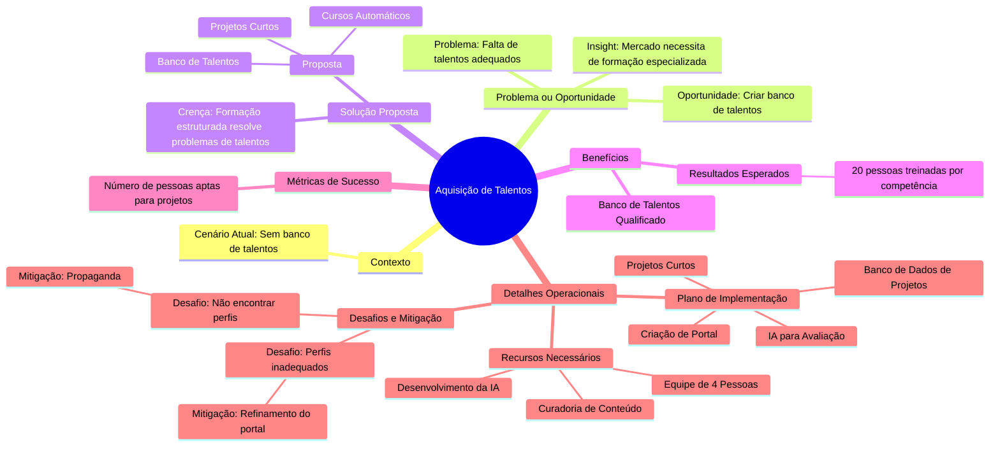

Atualmente, não temos um banco de talentos para os projetos de desenvolvimento e pesquisa. Essa lacuna impacta diretamente a capacidade de realizar projetos estratégicos com a qualidade e velocidade desejadas.

## Problema ou Oportunidade
### Problema
Há um problema na aquisição de talentos com as competências adequadas para os projetos.

### Oportunidade
Criar um banco de dados de talentos que pode ser utilizado tanto pela academia quanto pelo mercado, proporcionando maior eficiência na alocação de profissionais especializados.

### Insight
O mercado precisa de formação especializada, focada e com experiência prática.

## Solução Proposta
### Crença
Um conjunto de etapas de formação bem estruturadas pode resolver o problema de aquisição de talentos qualificados.

### Proposta
1. **Cursos Automáticos**: Criação de conteúdos educativos automatizados para formação técnica e prática.
2. **Banco de Talentos**: Um repositório com informações sobre profissionais qualificados.
3. **Projetos Curtos**: Atividades práticas para simular demandas reais e trazer experiência aos participantes.

## Benefícios
1. Banco de talentos preparado para atender às demandas dos projetos de desenvolvimento e pesquisa.
2. Resultados esperados:
   - Ter pelo menos 20 pessoas treinadas e aptas em cada competência necessária.

## Métricas de Sucesso
- Quantidade de pessoas aptas a participar de projetos após a implementação.

## Detalhes Operacionais
### Plano de Implementação
1. **Criação de um Portal**:
   - Cursos e desafios interativos onde os candidatos resolvem problemas práticos.
2. **IA para Avaliação**:
   - Uso de inteligência artificial para avaliar automaticamente os artefatos produzidos pelos candidatos.
3. **Banco de Dados de Projetos**:
   - Repositório de projetos para prática e experiências reais.
4. **Projetos Curtos**:
   - Atividades práticas para proporcionar experiência direta aos candidatos.

### Recursos Necessários
- **Equipe**:
  - 4 pessoas para desenvolver e monitorar os desafios.
- **Curadoria**:
  - Seleção de vídeos e cursos disponíveis na internet.
- **Tecnologia**:
  - Desenvolvimento da inteligência artificial para avaliação automática.

### Desafios e Mitigação
1. **Desafio**: Não encontrar pessoas com o perfil adequado.
   - **Mitigação**: Campanhas de propaganda direcionadas e uso de redes sociais.
2. **Desafio**: Pessoas inadequadas para os desafios propostos.
   - **Mitigação**: Refinamento contínuo do portal e dos critérios de avaliação.

## Visão Geral

