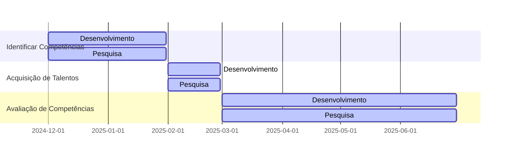
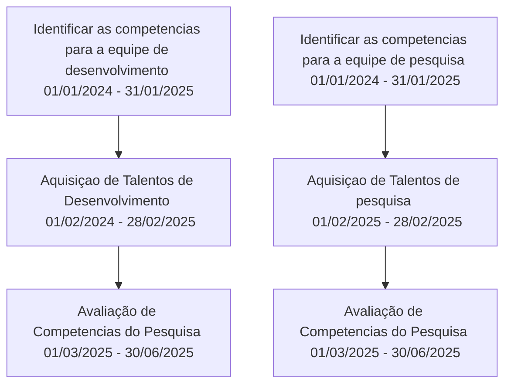

Tem como objetivo identificar competencias e criar capacitações para que a trilha de desenvolvimento e pesquisa seja concluído com sucesso.

| ID   | Nome   | Descrição    |Importância|
|------|-----   |--------------|--------------|
|01| Identificar as competencias para a equipe de desenvolvimento|Identificar quais competências são necessárias para o desenvolvimento do Conecta Fapes|100|
|02| Aquisiçao de Talentos de Desenvolvimento| Adquirir Talentos com as competências necessárias para o desenvolvimento do Conecta Fapes e criar capacitações|95|
|03| Identificar as competencias para a equipe de pesquisa|Identificar quais competências são necessárias para a pesquisa no  Conecta Fapes|90|
|04| Aquisiçao de Talentos de Pesquisa| Adquirir Talentos com as competências necessárias para a pesquisa do Conecta Fapes e criar capacitações|94|
|05| Avaliação de Competencias do desenvolvimento | Avaliar a competência dos talentos do desenvolvimento|80|
|06| Avaliação de Competencias de Pesquisa| Avaliar a competência dos talentos do desenvolvimento|79|

## Cronograma Macro do Projeto

| ID   | Nome   |Data Inicial  |Data Final|
|------|-----   |--------------|----------|
|01| Identificar as competencias para a equipe de desenvolvimento |01/01/2024|31/01/2025|
|02| Aquisiçao de Talentos de Desenvolvimento|01/02/2025|28/02/2025|
|03| Identificar as competencias para a equipe de pesquisa |01/01/2024|31/01/2025|
|04| Aquisiçao de Talentos de pesquisa |01/02/2025|28/02/2025|
|05| Avaliação de Competencias do desenvolvimento |01/03/2025|30/06/2025|
|06| Avaliação de Competencias de Pesquisa|01/03/2025|30/06/2025|

### Resultados

**Identificar as competencias para a equipe de desenvolvimento**: atualmente precisamos de talentos que tenhas uma dessas competências:

#### Habilidades Sociais Comuns

  |Competencia |O que se espera ?| 
  |------------|----------------|
  |Trabalho em equipe|-|
  |Filosofia Ágil||
  |Sprint Design/Human-Centered Design||
  |PriorizAÇÃO -> Pareto (20/80)||
  |Compartilhar Conhecimento||
  |Aprendizado Contínuo||
  |Espirito de Dono (Solucionador/Autonomia)||
  |Pensamento Cientifico||
  |Sem medo de errar||
    
#### Hard-Skills
  
  |Perfil|Competencia Minima|Desejado| Reponsável Por definir Competência|
  |------|------------------|--------|-----------------------------------|
  |Engenheiro de Software|||Felipe|
  |Desenvolvedor Back-end ( C#)|||Felipe|
  |Desenvolvedor Front-End (Vue)|||Felipe|
  |Desenvolvedor de Teste|||Paulo/Emerick|
  |Desenvolvedor de IA focado em suporte ao processo de desenvolvimento|||Daniel|
  |Desenvolvedor de IA focando em suporte a processos de negócio|||Daniel|
  |Engenheiro de Plataforma (e.g., configuração de serviços de suporte ao desenvolvimento)|||Emerick|
  |Analista de Segurança da Informação|||Emerick|
  |Desenvolvedor de BI|||Moises|
  |Analisa de Ferramentas de Devops|||Emerick|

## Gantt do Cronograma Macro

## Relação entre as entregas 

* É importante informa que uma entrega pode habilitar o inicio parcial ou total de outra entrega.

