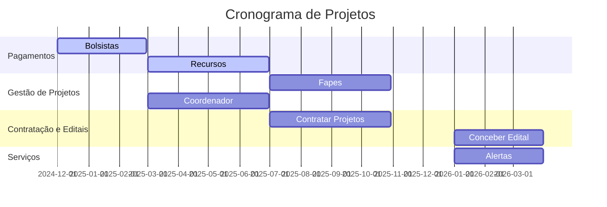
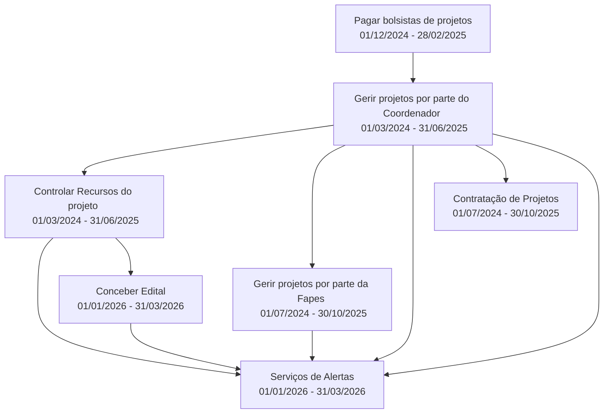
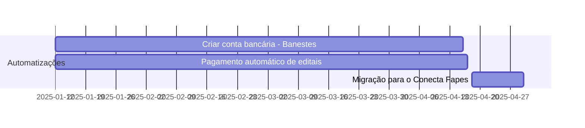
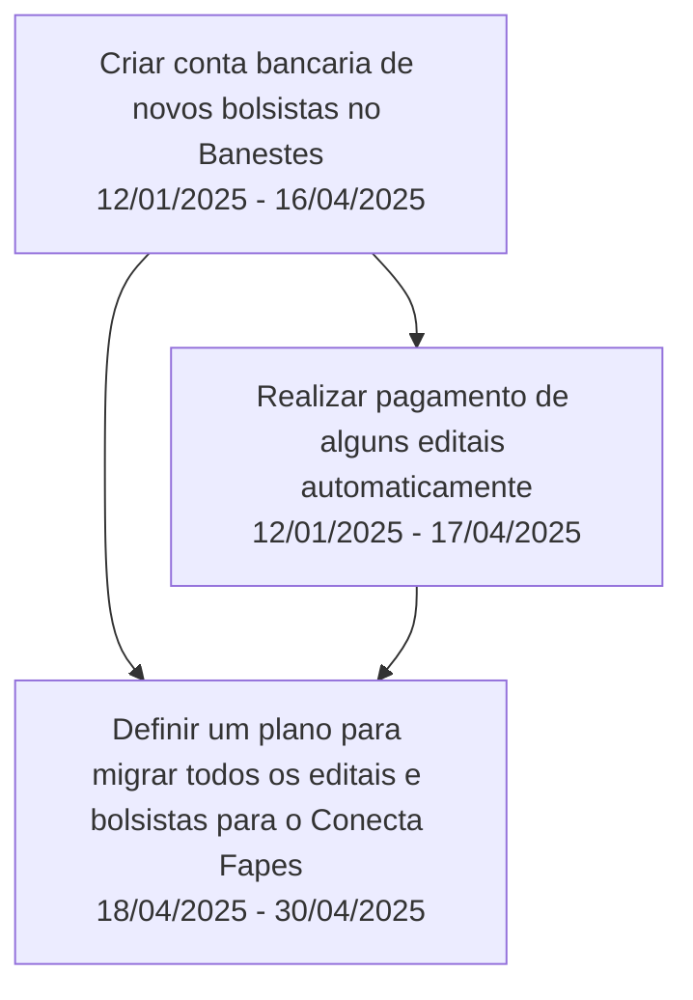
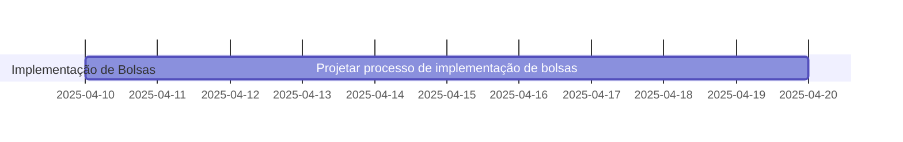
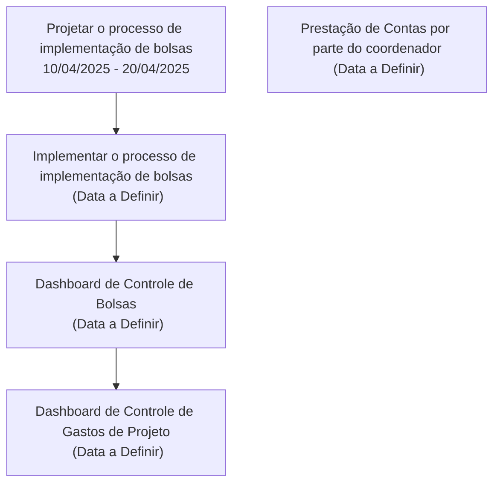
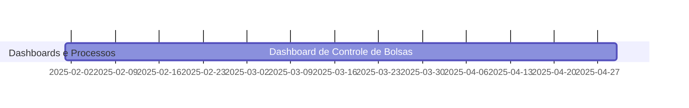
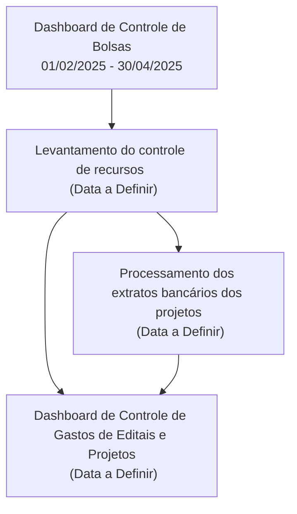

Tem como objetivo desenvolver as capacitades do conecta fapes.

| ID   | Nome   | Descrição    |Importância|
|------|-----   |--------------|--------------|
|01| Pagar bolsistas de projetos| Melhorar o processo de pagamento de bolsistas de projetos, dashboard de controle de bolsas |100|
|02| Gerir bolsas do projeto por parte do Coordenador e Fapes| Permitir que o coordenador de projeto faça a gestão do projeto (e.g., solicitar cancelamento da bolsa, Contratar bolsita, Implementar a Bolsa, transformação/remanejamento de bolsas e Fapes aprovado as solicitações)|90|
|03| Controlar Recursos do projeto | Melhorar o processo de pagamento de recursos  do projeto, dashboards e relatórios sobre o uso do recurso, , usar o extrato do Banestes para ajudar no controle do projeto. |80|
|04| Gerir projetos por parte da Fapes| Permitir que a equipe da Fapes faça a gestão financeira e entregável dos projetos, Remanejamento do Recurso, Dashboard de Bolsistas e Recurso|70|
|05| Contratação de Projetos| Melhorar o processo de contratação de projetos|60|
|06| Conceber Edital| Melhorar o processo de conceber, submeter contratar projetos por editais|50|
|07| Serviços de Alertas| Criar um conjunto de serviços que permite implementar gestão de recursos financeiro, transparência e outros itens relacionados a publicação de informação para os stakeholders (e.g., governo, estudantes, escola, ...) |40|

### Demandas não mapeadas:
* Módulo para gestão de projetos para as Instituições de Ensino e Empresas
* Empresas responsáveis por projetos (e.g., uma empresa pode ser contrata para ser responsável por um projeto).
* Prestação de contas
* Avaliação de documentos de bolsistas
* Dupla atenticação quando acontecer o pagamento: ter um token de autorização para confirmar o pagamento de bolsas e recurso

## Cronograma Macro do Projeto

Todos os prazos são referentes as entregas na infraestrutura do LEDS.

| ID   | Nome   |Data Inicial  |Data Final|
|------|-----   |--------------|----------|
|01| Pagar bolsistas de projetos |01/12/2024|28/02/2025|
|02| Gerir projetos por parte do Coordenador |01/03/2025 | 31/06/2025|
|03| Controlar Recursos do projeto| 01/03/2025 | 31/06/2025|
|04| Gerir projetos por parte da Fapes| 01/07/2025| 30/10/2025|
|05| Contratação de Projetos| 01/07/2025| 30/10/2025|
|06| Conceber Edital| 01/01/2026 | 31/03/2026|
|07| Serviços de Alertas|01/01/2026 | 31/03/2026|

## Gantt do Cronograma Macro

## Relação entre as entregas 

* É importante informa que uma entrega pode habilitar o inicio parcial ou total de outra entrega.

## Backlog e Planejamento do Pagamento de Bolsistas

| ID  | Nome | Descriçao | Prioridade | Data Inicial | Data Final   | Dependência |
|-----|------|-----------|:------------:|:------------:|:------------:|:----------:|
| 01  | Realizar Pagamento de alguns editais automaticamente                | Implementar uma rotina no qual é possivel realizar pagamento de bolsistas de 6 editais totalizando um pagamento de ~500 bolsistas           | 100        | 12/01/2025    | 17/04/2025   | 2            |
| 02  | Criar conta bancaria de novos bolsistas no Banestes                 | Implementar uma rotina no qual é possivel criar contas bancarias no banestes de forma automatica.                                            | 99         | 12/01/2025    | 16/04/2025   | -            |
| 03  | Definir um plano para migrar todos os editais e bolsistas para o Conecta Fapes | Definir um projeto junto a Fapes para migrar os editais e bolsitas presentes no SigFapes e Conecta Fapes levando em conta a limpeza e correçõo dos dados. | 98         | 18/04/2025    | 30/04/2025   |        1,2      |

### Gantt do Cronograma

### Relação entre as Entregas

## Backlog e Planejamento do Gerir Projetos por parte do Coordenador

| ID  | Nome | Descrição | Prioridade | Data Inicial | Data Final | Dependência |
|:----:|:----:|:--------:|:--------:|:--------:|:--------:|:--------:|
| 01  | Projetar o processo de implementação de bolsas | Realizar o levantamento do processo e o projeto da solução para implementar bolsas | 100 | 10/04/2025| 20/04/2025 | - |
| 02  | Implementar o processo de implementação de bolsas  | Desenvolver o processo de implementação de bolsas | 99 | -| - | 1|
| 03  | Prestação de Contas por parte do coordenador       | Implementar um meio no qual o Coordenador realize a prestação de conta de tal forma que não sobrecarrega a área técnica | 90 | - | -| -|
| 04  | Dashboard de Controle de Bolsas                    | Implementar um dashboard que permita o Coordenador do projeto tome decisões de projeto baseado no saldo de bolsas | 80 | - | -   | 2 |
| 05  | Dashboard de Controle de Gastos de Projeto         | Implementar um dashboard que permita o Coordenador do projeto tome decisões de projeto baseado no saldo em conta do projeto | 80 | -| -  | 4 |

### Gantt do Cronograma

### Relação entre as Entregas

## Backlog e Planejamento do Gerir Projetos por parte do Coordenado

| ID  | Nome | Descrição | Prioridade | Data Inicial | Data Final | Dependência |
|:----:|:----:|:--------:|:--------:|:--------:|:--------:|:--------:|
| 01  | Projetar o processo de implementação de bolsas | Realizar o levantamento do processo e o projeto da solução para implementar bolsas | 100 | 10/04/2025| 20/04/2025 | - |
| 02  | Implementar o processo de implementação de bolsas  | Desenvolver o processo de implementação de bolsas | 99 | -| - | 1|
| 03  | Prestação de Contas por parte do coordenador       | Implementar um meio no qual o Coordenador realize a prestação de conta de tal forma que não sobrecarrega a área técnica | 90 | - | -| -|
| 04  | Dashboard de Controle de Bolsas                    | Implementar um dashboard que permita o Coordenador do projeto tome decisões de projeto baseado no saldo de bolsas | 80 | - | -   | 2 |
| 05  | Dashboard de Controle de Gastos de Projeto         | Implementar um dashboard que permita o Coordenador do projeto tome decisões de projeto baseado no saldo em conta do projeto | 80 | -| -  | 4 |

### Gantt do Cronograma

### Relação entre as Entregas

## Backlog e Planejamento do Gerir projetos por parte da Fapes

| ID  | Nome | Descrição | Prioridade | Data Inicial | Data Final| Dependência |
|:----:|:----:|:--------:|:--------:|:--------:|:--------:|:--------:|
| 01  | Dashboard de Controle de Bolsas | Implementar um dashboard que permita a Fapes visualizar as implementações de bolsa e pagamento de um projeto. | 90  | 01/02/2025    | 30/04/2025   | - |
| 02  | Realizar levantamento do controle de recursos         | Realizar o levantamento do processo e o projeto da solução para controle de recursos | 89 |   | - | 01|
| 03  | Processamento dos extratos bancários dos projetos     | Implementar o processamento dos extratos bancários das contas bancarias   | 80 | - | - | 02 |
| 04  | Dashboard de Controle de Gastos de Editais e Projetos | Implementar um dashboard que permita o Coordenador do projeto tome decisões de projeto baseado no saldo em conta do projeto | 80 | - |- | 02,03 |

### Gantt do Cronograma

### Relação entre as Entregas
