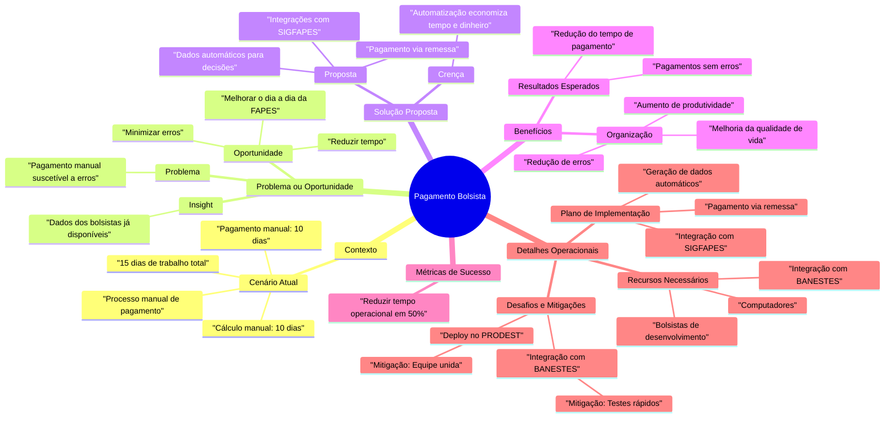

Redução de Erros e Tempo no Processo de Pagamento de Bolsistas.

## Contexto
Atualmente, o processo de pagamento mensal dos bolsistas é realizado de forma manual. Este processo consome aproximadamente 15 dias de trabalho, distribuídos da seguinte forma:
- **Cálculo manual**: feito por projeto, demora cerca de 10 dias de trabalho por setor.
- **Pagamento manual**: consome mais 10 dias de trabalho.

### Dados Relevantes
- O cálculo é manual e realizado por projeto, cada setor da fapes dedica 10 dias para isso.
- O pagamento é manual, gerando retrabalho mensal, 2 a 3 pessoas dedicada 2 semanas para essa atividade.

## Problema ou Oportunidade
### Problema
- O pagamento manual pode gerar erros, além de ser um processo demorado e suscetível a falhas humanas.

### Oportunidade
- **Reduzir o tempo de pagamento**: economizar tempo operacional.
- **Minimizar os erros no pagamento**: melhorar a precisão do processo.
- **Melhorar o dia a dia da FAPES**: automatizar tarefas repetitivas e liberar a equipe para atividades estratégicas.

### Insight
A FAPES já possui os dados de todos os bolsistas e seus valores, eliminando a necessidade de retrabalho mensal para compilar essas informações.

## Solução Proposta
### Crença
A automatização do processo economizará tempo e dinheiro para a FAPES, além de aumentar a eficiência organizacional.

### Proposta
Automatizar o processo de pagamento com as seguintes ações:
1. Criar integrações com o SIGFAPES para automatizar cálculos.
2. Gerar dados automáticos para decisões de pagamento.
3. Implementar pagamentos via arquivos de remessa diretamente para o BANESTES.

## Benefícios
### Para a Organização
- Redução de erros operacionais.
- Aumento da produtividade.
- Melhoria na qualidade de vida dos envolvidos.

### Resultados Esperados
- Pagamentos realizados sem erros.
- Redução significativa do tempo necessário para o processo de pagamento.

## Métricas de Sucesso
- **Redução do tempo operacional do processo de pagamento em 50%** (de 15 dias para aproximadamente 7 dias).

## Detalhes Operacionais
### Plano de Implementação
1. **Integração de Dados**: Conectar os dados do SIGFAPES com o sistema de pagamento.
2. **Automação do Processo**: Gerar arquivos automáticos para tomada de decisão de pagamento.
3. **Pagamento Automatizado**: Utilizar arquivos de remessa para pagamentos no BANESTES.

### Recursos Necessários
- Bolsistas de desenvolvimento para criar as automações.
- Computadores e infraestrutura para desenvolvimento.
- Integração junto ao BANESTES para pagamento.

### Desafios e Mitigações
- **Desafio**: Integração com o BANESTES.
  - **Mitigação**: Realizar testes rápidos e contínuos com o banco.
- **Desafio**: Deploy no ambiente do PRODEST.
  - **Mitigação**: Contar com uma equipe unida e coordenada com o PRODEST.

## Visão Geral

