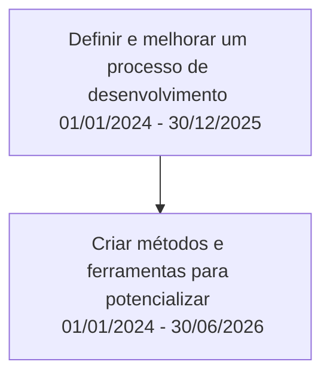

Tem como objetivo desenvolver artefatos que melhorem a produtividade da equipe de desenvolvimento e capacitação.

| ID   | Nome   | Descrição    |Importância|
|------|-----   |--------------|:--------------:|
|01| Definir e melhorar um processo de desenvolvimento|Tomando como base as caracteristicas do Conecta Fapes propor e implementar um processo e boas prática  de desenvolvimento de software|100|
|02| Criar métodos e ferramentas para potencializar a equipe|Criar métodos e ferramentas que automatizaem parte ou todo processo de desenvolvimento de software proposto|90|

## Backog: Definir e melhorar um processo de desenvolvimento

| ID   | Nome   | Descrição    |Resultado|Importância|
|------|-----   |--------------|:-----------:|:--------------:|
|01| Definir o processo de desenvolvimento ágil|Criar um processo que seja focado em entrega de valor e entregas curtas e aplicando engenharia de software contínua.|Versão Inicial no [link](https://conectafapes.docs.leds.dev.br/desenvolvimento/processosoftware/visao_geral)|100|
|02| Definir um processo de avaliação da saúde mental da equipe de desenvolvimento|Criar um processo no qual avaliamos e ajudamos desenvolvedores com problemas de saúde mental |Não Existe|97|
|03| Encurtar o gap entre o processo de design de interface e sua implementação|Atualmente o processo de design de interface não é aproveitado pela equipe de desenvolvimento, como podemos criar um processo/ferramentas que reuse o que foi feito na equipe de design para o desenvolvimento.|Não Existe|95|
|04| Definir o processo de desenvolvimento de teste ágil|Implementar práticas de testes em todas as etapas do processo de desenvolvimento para garantir a qualidade de produto.|Não Existe|90|
|05| Definir um processo de avaliação de competências| Definir meios e práticas para evoluir as pessoas da equipe baseado na sua capacidade |Não Existe|85|
|06| Definir o processo de gestão escalavel ágil|Implementar práticas de [Engenharia de Software Contínua](https://www.sciencedirect.com/science/article/pii/S0164121215001430), [LESS](https://less.works/) e [SAFE](https://scaledagileframework.com/) para gestão dos projetos e da organização.|Versão Inicial no [link](https://conectafapes.docs.leds.dev.br/gestao/processogestaomacro)|80|

## Backog: Criar métodos e ferramentas para potencializar a equipe

| ID   | Nome   | Descrição    |Resultado|Importância|
|:------:|-----   |------------|:--------:|:--------------:|
|01| Geração de código para as arquiteturas do projeto| Criar uma engine de geração de código de backend que permita criar e atualizar codidgos já existentes |[Spark](https://docs.leds.dev.br/category/spark)|100|
|02| Geração de interfaces | Criar uma engine de geração de código que permita criar e atualizar codigos de interface já existentes | Não existe|98|
|03| Ferramenta de gestão de projetos| Ferramenta que permite orientar a equipe no desenvolvimento de projeto e uma visão holistica do projeto |[Made](https://docs.leds.dev.br/category/made)|95|
|04| Revisão de Código| Revisar o código do desenvolvedor quando enviado para realizar pull request, enviando feedback de melhorias |[Code Wise](https://docs.leds.dev.br/tools/code_review/code_wise)|96|
|05| Design System| Ter um design system que seja adequado para pessoas com necessidades especiais e seja fácil de implementar pela equipe de desenvolvimento |Não existe|97|
|06| Geração de Testes| Criar uma ferramenta que permite gerar testes automatizados e um plano de teste baseados nos casos de uso e códigos gerados |[Test.AI](https://docs.leds.dev.br/tools/testing_support/testai)|93|
|07| Processo automatizado entre as fases de desenvolvimento| Processo automatizado que una a analise, projeto, implementação e testes de forma minimizar o tempo de desenvolvimento, gerando artefatos de software em sequência. |Não Existe|92|
|08| Geração do processo de extração de dados| Criar uma ferramenta que permita criar pipeline de extração, transformação e carga de dados | Não existe|91|
|09| Geração de Documentaçao para as soluções desenvolvidas| Criar uma engine de geração de documentação que apresenta os requisitos, arquiteturas e outra documentação que ajude no entendimento e no planejamento do projeto |[Andes](https://docs.leds.dev.br/category/andes)|90|

## Cronograma Macro do Projeto

| ID   | Nome   |Data Inicial  |Data Final|
|------|-----   |--------------|----------|
|01| Definir e melhorar um processo de desenvolvimento |01/01/2024|30/12/2025|
|02| Criar métodos e ferramentas para potencializar |01/01/2024|30/06/2026|

## Relação entre as entregas 

* É importante informa que uma entrega pode habilitar o inicio parcial ou total de outra entrega.

## Relação entre as Trilhas de Capacitação, Desenvolvimento e Pesquisa