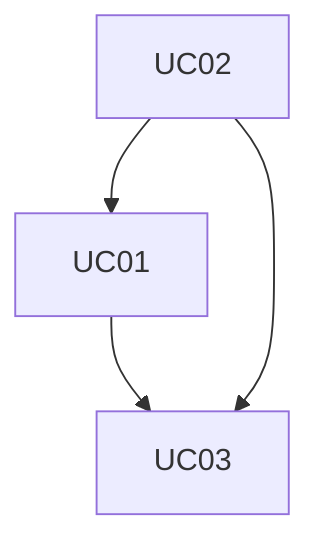
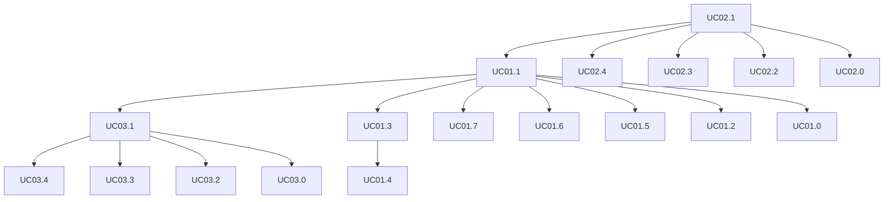

# Requisitos
Tomando por base o contexto do sistema, foram identificados os requisitos de usuário a seguir.
## Requisitos Funcionais

| ID   | Nome| Descrição    | Dependências           |
|------|-----|--------------|------------------------|
|UC01|Controlar Modalidade de Bolsa|O Sistema deve permitir o cadastro de modalidades de bolsa.|UC02|
|UC02|Cadastrar Resolução|O Sistema deve permitir o cadastro das resoluções que criam ou alteram modalidades de bolsas||
|UC03|Cadastrar Nível de Bolsa|O Sistema deve permitir o cadastro de níveis em uma modalidade de bolsa|UC01,UC02|

## Requisitos Não-Funcionais

| ID   | Nome| Descrição    | Dependências           |
|------|-----|--------------|------------------------|
|RNF01|Controle de acesso| O controle de acesso ao sistema deve ser feito pelo Acesso Cidadão.||

## Regras de Negócio

| ID   | Descrição    | Prioridade  |
|------|-----|--------------|
|RN01| As modalidades, níveis e requisitos de bolsas são definidas e atualizadas por Resoluções.|Must|
|RN02|Uma resolução pode definir/atualizar uma ou mais modalidades de bolsa.|Must|
|RN03|Uma modalidade é dividida em um ou mais níveis e cada nível pertence a apenas uma modalidade.|Must|
|RN04|Duas versões de uma mesma modalidade podem ter níveis diferentes (ex. a versão 1 da BPIG tem os níveis de I a IX e a versão 2 adicionou o nível X)|Must|
|RN05|Quando cria-se uma nova versão da modalidade cria-se também novas versões dos níveis.|Must|
|RN06|Duas versões de uma mesma modalidade podem ter requisitos diferentes. O mesmo vale para duas versões de um mesmo nível.|Must|
|RN07|O valor da bolsa é definido pela versão do nível da bolsa.|Must|
|RN08|Uma vez publicada, uma versão de modalidade não pode mais ser alterada.|Must|

### Matriz de Dependência dos Casos de Uso Ordenado

| Item | Caso de Uso | Dependencia | Habilita |
| --- | --- | --- | --- |
| UC02 | Cadastrar Resolução |  | UC01, UC03 |
| UC01 | Controlar Modalidade de Bolsa | UC02 | UC03 |
| UC03 | Cadastrar Nível de Bolsa | UC01, UC02 |  |

### Ciclos
Caso exista ciclo, será apresentado abaixo:

### Grafo de Dependencia

## Eventos dos Casos 

| ID   | Evento| Caso de Uso|
|------|-----|--------------|
|UC01.0|Listar Modalidade|UC01|
|UC01.1|Incluir Modalidade|UC01|
|UC01.2|Criar Versão de Modalidade|UC01|
|UC01.3|Alterar Versão da Modalidade|UC01|
|UC01.4|Ativar Versão da Modalidade|UC01|
|UC01.5|Consultar Modalidade|UC01|
|UC01.6|Excluir Versão de Modalidade|UC01|
|UC01.7|Desativar Modalidade|UC01|
|UC02.0|Listar Resolução|UC02|
|UC02.1|Incluir Resolucao|UC02|
|UC02.2|Alterar Resolucao|UC02|
|UC02.3|Consultar Resolução|UC02|
|UC02.4|Excluir Resolução|UC02|
|UC03.0|Listar Nível|UC03|
|UC03.1|Incluir Nível|UC03|
|UC03.2|Alterar Nível|UC03|
|UC03.3|Consultar Nível|UC03|
|UC03.4|Excluir Nível|UC03|

### Matrix de Dependência dos Eventos Ordenado

| ID | Evento | Depende | Habilita |
| --- | --- | --- | --- |
| UC02.1 | Incluir Resolucao |  | UC01.1, UC02.0, UC02.2, UC02.3, UC02.4 |
| UC01.1 | Incluir Modalidade | UC02.1 | UC01.0, UC01.2, UC01.3, UC01.5, UC01.6, UC01.7, UC03.1 |
| UC03.1 | Incluir Nível | UC01.1 | UC03.0, UC03.2, UC03.3, UC03.4 |
| UC01.3 | Alterar Versão da Modalidade | UC01.1 | UC01.4 |
| UC03.4 | Excluir Nível | UC03.1 |  |
| UC03.3 | Consultar Nível | UC03.1 |  |
| UC03.2 | Alterar Nível | UC03.1 |  |
| UC03.0 | Listar Nível | UC03.1 |  |
| UC02.4 | Excluir Resolucao | UC02.1 |  |
| UC02.3 | Consultar Resolucao | UC02.1 |  |
| UC02.2 | Alterar Resolucao | UC02.1 |  |
| UC02.0 | Listar Resolução | UC02.1 |  |
| UC01.7 | Desativar Modalidade | UC01.1 |  |
| UC01.6 | Excluir Versão de Modalidade | UC01.1 |  |
| UC01.5 | Consultar Modalidade | UC01.1 |  |
| UC01.4 | Ativar Versão da Modalidade | UC01.3 |  |
| UC01.2 | Criar Versão de Modalidade | UC01.1 |  |
| UC01.0 | Listar Modalidade | UC01.1 |  |

### Ciclos
Caso exista ciclo, será apresentado abaixo:

### Grafo de Dependência

