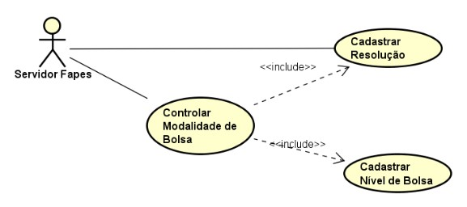

# Casos de Uso
O modelo de casos de uso captura e descreve as funcionalidades que o sistema provê a seus atores. No módulo Cadastro de Modalidades de Bolsas da plataforma ConectaFapes foi identificado um único ator acessando quatro casos de uso, organizados em eventos.

| Ator            | Descrição           |
|-------------------|--------------------|
| **Servidor Fapes**   | Responsável por manter os dados administrativos da Fapes, como, por exemplo, o cadastro de modalidades de bolsas.             |

O módulo conta com três casos de uso em que o acesso às funcionalidades é realizado pelo UC Controlar Modalidade de Bolsa. Assim, um usuário, ao cadastrar uma modalidade de bolsa, complementa o seu cadastro cadastrando também a resolução que a define e os níveis em que é organizada. O ator **Servidor Fapes¹** é o responsável por realizar as funcionalidades deste módulo.

*¹ Ator genérico utilizado provisoriamente neste módulo enquanto não há uma definição mais clara dos perfis de usuário da Fapes.*

# Descrição dos Casos de Uso
Nos eventos de caso de uso não foram descritos os fluxos alternativos referentes a validação de dados e cancelamento da execução do evento. Esses fluxos são considerados padrão e devem ser observados em todos os eventos. A validação de dados deve respeitar as definições do Dicionário de Dados.

## UC01: Controlar Modalidade de Bolsa
### UC01.0: Listar Modalidade

        1. O Sistema exibe as modalidades de bolsa, informando: sigla, número da resolução da versão ativa, nome da versão ativa e um indicativo se há uma versão em edição.
        2. O Servidor Fapes pode refinar a busca das modalidades por filtro de texto.
        3. O Servidor Fapes pode selecionar uma das modalidades para realizar os demais eventos do UC

### UC01.1: Incluir Modalidade

        1. O Servidor Fapes informa os dados da modalidade [sigla, nome, descrição; redução por vínculo, data de início da vigência e modalidades de bolsa compatíveis].
        2. O Servidor Fapes seleciona a resolução que define a modalidade.
        3. O Servidor Fapes inclui os requisitos da versão da modalidade.
        4. O Sistema valida e salva a modalidade e sua primeira versão com o status 'Em edição'.
        5. Para cada nível da modalidade, o evento **Incluir Nível** é realizado.

### UC01.2: Criar Versão de Modalidade

        1. O Servidor Fapes seleciona a Modalidade (com uma versão ativa e nenhuma em edição) que deseja versionar.
        2. O Servidor Fapes seleciona a Resolução que atualizou a modalidade e informa a data de início de vigência da nova versão.
        3. O Sistema cria e exibe uma cópia da versão ativa da modalidade selecionada (incluindo seus níveis e requisitos).
            a. Uma nova versão da modalidade é criada a partir da versão ativa, com a resolução e data de início de vigência informados, data de fim de vigência nula e status 'Em Edição'.
            b. Para cada versão de nível existente é gerada uma nova versão de nível, associada à nova versão de modalidade e ao nível correspondente, mantendo seus dados.
            c. Todos os requisitos associados à versão da modalidade ativa são copiados para  nova versão da modalidade.
            d. Todos os requisitos associados às versões de nível existentes são copiados para as novas versões de nível correspondentes.
        4. O Servidor Fapes realiza evento **Alterar Versão de Modalidade** para atualizar as informações da nova versão da modalidade, bem como seus níveis e requisitos.

### UC01.3: Alterar Versão da Modalidade

        1. O Servidor Fapes seleciona a modalidade (com uma versão em edição) que deseja alterar.
        2. O Sistema exibe os dados da versão em edição dessa modalidade.
        3. O Servidor Fapes faz alterações nos dados da modalidade (sigla, nome e descrição) apenas se a versão selecionada for a única.
        4. O Servidor Fapes faz alterações nos dados da versão da modalidade (nome, redução por vínculo, data de início de vigência, resolução e modalidades compatíveis).
        5. O Servidor Fapes pode incluir, alterar ou excluir requisitos da versão da modalidade.
        6. O Sistema valida e salva as alterações.
        7. O Servidor Fapes pode incluir, alterar ou remover níveis realizando os eventos do **UC Cadastrar Nível**.

### UC01.4: Ativar Versão da Modalidade

        1. O Servidor Fapes seleciona a modalidade (com uma versão em edição) que deseja ativar.
        2. O Sistema exibe os dados da versão em edição da modalidade.
        3. O Servidor Fapes confirma a ativação da versão da modalidade.
        4. O Sistema altera para “inativa” o status da versão atualmente ativa da modalidade em questão e define sua data de fim de vigência como igual à data de início de vigência da versão em edição da modalidade.
        5. O Sistema altera para “ativa” o status da versão em edição da modalidade, bloqueando alterações futuras e permitindo que ela seja associada a projetos.

### UC01.5: Consultar Modalidade

        1. O Servidor Fapes seleciona a modalidade que deseja consultar.
        2. O Sistema exibe os dados da versão ativa da modalidade, incluindo seus níveis e requisitos.
        3. O Servidor Fapes pode selecionar versões anteriores da modalidade para visualizar seus dados.

### UC01.6: Excluir Versão de Modalidade

        1. O Servidor Fapes seleciona a modalidade para excluir a sua versão em edição.
        2. O Sistema exibe os dados dessa versão de modalidade, incluindo níveis e requisitos.
        3. O Servidor Fapes confirma a exclusão da modalidade.
        4. O Sistema exclui a versão da modalidade, suas versões de nível e requisitos.
        5. Caso a versão excluída seja a única da modalidade, a modalidade também é excluída

### UC01.7: Desativar Modalidade

        1. O Servidor Fapes seleciona a modalidade (com a versão mais atual ativa) que deseja desativar.
        2. O Sistema exibe os dados da modalidade.
        3. O Servidor Fapes confirma a desativação da modalidade.
        4. O Sistema altera para “inativa” o status da versão mais atual da modalidade e sua data de fim de vigência para a data corrente, deixando a modalidade sem nenhuma versão ativa, o que impede a sua associação a projetos e a criação de novas versões

## UC02: Cadastrar Resolução
### UC02.0: Listar Resolução

        1. O Sistema exibe as resoluções, informando seu número e data.
        2. O Servidor Fapes pode refinar a busca das resoluções por filtro de texto.
        3. O Servidor Fapes pode selecionar uma das resoluções para realizar os demais eventos deste UC.

### UC02.1: Incluir Resolução

        1. O Servidor Fapes informa os dados da resolução [o número, a data, a ementa e o link da resolução].
        2. O Sistema valida e salva a resolução..

### UC02.2: Alterar Resolução

        1. O Servidor Fapes seleciona a resolução que deseja alterar.
        2. O Sistema exibe os dados da resolução.
        3. O Servidor Fapes faz alterações nos dados da resolução.
        4. O Sistema valida e salva as alterações.

### UC02.3: Consultar Resolução

        1. O Servidor Fapes seleciona a resolução que deseja consultar.
        2. O Sistema exibe todos os dados da resolução

### UC02.4: Excluir Resolução

        1. O Servidor Fapes seleciona a resolução (sem modalidades associadas) que deseja excluir.
        2. O Servidor Fapes confirma a exclusão da resolução.
        3. O Sistema exclui a resolução.

## UC03: :Cadastrar Nível de Bolsa
### UC03.0: Listar Nível

        1. O Sistema exibe as versões de nível da versão de modalidade corrente, informando: sigla, moeda e valor, e requisitos.
        2. O Servidor Fapes pode refinar a listagem das versões de nível por filtro de texto.
        3. O Servidor Fapes pode selecionar uma das versões de nível para realizar os demais eventos deste UC.

### UC03.1: Incluir Nível

        1. O Servidor Fapes informa os dados do nível da versão da modalidade corrente [sigla,valor e moeda].
        2. O sistema verifica se a sigla informada já identifica um nível associado a alguma versão dessa modalidade.
        3. O Servidor Fapes inclui os requisitos da versão do nível.
        4. O sistema salva o nível e a versão do nível, associando-o à versão da modalidade corrente

### UC03.2: Alterar Nível

        1. O Servidor Fapes seleciona o nível que deseja alterar.
        2. O Sistema exibe os dados da versão do nível da versão de modalidade corrente.
        3. O Servidor Fapes altera a sigla do nível apenas se esta for a única versão.
        4. O Servidor Fapes altera os dados da versão do nível (moeda e valor).
        5. O Servidor Fapes pode incluir, alterar ou excluir requisitos da versão do nível.
        6. O Sistema valida e salva as alterações.

### UC03.3: Consultar Nível

        1. O Servidor Fapes seleciona o nível que deseja consultar.
        2. O Sistema exibe os dados da versão do nível, incluindo seus requisitos

### UC03.4: Excluir Nível

        1. O Servidor Fapes seleciona o nível para excluir a sua versão que está associada à versão de modalidade corrente.
        2. O Sistema exibe os dados dessa versão de nível, incluindo seus requisitos.
        3. O Servidor Fapes confirma a exclusão da versão de nível.
        4. O Sistema exclui a versão do nível e seus requisitos.
        5. Caso a versão excluída seja a única do nível, o nível também é excluído.

    