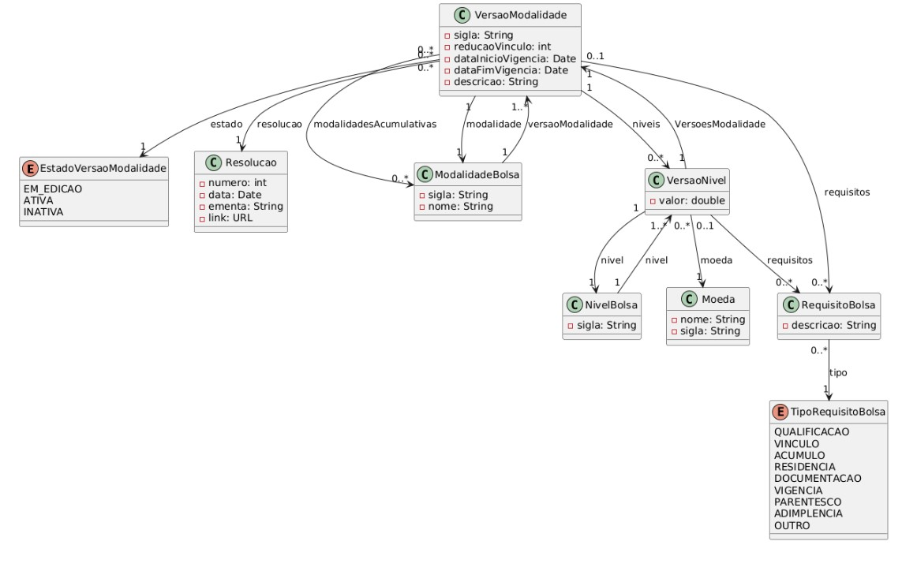

# Modelo Estrutural

As modalidades e níveis de bolsas são definidas por resoluções. Uma resolução versa sobre uma ou mais modalidades de bolsa, gerando uma nova versão para cada uma das modalidades tratadas na resolução. Assim, uma resolução (Resolucao) define uma versão (VersaoModalidade) de uma ou mais modalidades de bolsa (ModalidadeBolsa). Porém, uma Resolução não pode definir mais de uma versão para uma mesma Modalidade (RI1). Por exemplo, uma mesma resolução pode definir uma nova versão da modalidade BPIG e uma nova versão da modalidade DTI, no entanto não faz sentido uma resolução definir duas versões da BPIG.

Quando uma nova versão de modalidade é criada são definidas quais modalidades são compatíveis com a nova versão criada. Por exemplo, a versão 2023 da BPIG é compatível com bolsas da UnAC, em outras palavras, um bolsista pode acumular as duas bolsas, recebendo
simultaneamente bolsas UnAC e BPIG versão 2023.

As modalidades (ModalidadeBolsa) definem níveis (NivelBolsa) que também são versionados (VersaoNivel). Assim, quando é criada uma nova versão da modalidade, também são criadas novas versões de seus níveis. Logo, uma versão da modalidade define várias versões de níveis,
cada uma delas referentes a um nível. Não faz sentido uma mesma VersaoModalidade definir duas Versões para o mesmo Nível (RI2), por exemplo, a versão 2023 da modalidade BPIG definir duas versões para o nível BPIG-I.

As versões de modalidade e de níveis definem os requisitos a serem atendidos para implementação das bolsas. Assim um requisito é definido ou para uma modalidade ou para um nível (XOR). Por exemplo, o requisito de possuir CPF é necessário para a modalidade BPIG,
enquanto o requisito de ser graduado é necessário para o nível BPIG-V. Para receber uma bolsa de um dado nível o bolsista deve atender a todos os requisitos do nível e da modalidade da bolsa.

Quando um projeto (Projeto) é contratado, define-se quais versões de modalidades de bolsas (VersaoModalidade) poderão ser concedidas no contexto do projeto. Por exemplo, o projeto Conecta Fapes está associado à versão 2023 da BPIG. Quando uma bolsa (Bolsa) é atribuída a um bolsista, a mesma é associada a uma versão de um nível. Por exemplo, os desenvolvedores do Conecta Fapes recebem bolsas BPIG-VII, versão 2023. As classes Projeto e Bolsa estão representadas em branco no diagrama pois a criação de projetos e a atribuição de bolsas estão fora do escopo deste módulo.

Apresenta os modelos estruturais do projeto.

## Dicionário de Dados

| Classe| Atributo| Definição| Obrig. | Tipo| Domínio| Tamanho | Único |
|-------|---------|----------|--------|-----|--------|---------|-------|
| **Resolução**    | numero                 | Número de identificação da resolução                                                                       | Sim    | Int                                 | Ex: 332                                                                                          |         | Sim   |
|                  | data                   | Data em que foi lançada a resolução                                                                        | Sim    | Date                                | Ex: 17/03/2024                                                                                   |         |       |
|                  | elemento               | Descrição dos objetivos da resolução                                                                       | Sim    | String                              |                                                                                                  | 500     |       |
|                  | url                    | Url de acesso à publicação da resolução                                                                    | Sim    | URL                                 |                                                                                                  |         |       |
|                  | sigla                  | Sigla de identificação da modalidade                                                                       | Sim    | String                              | Ex: BPIG, DTI-A                                                                                  |         | Sim   |
| **Modalidade Bolsa** | nome                | Nome da modalidade apresentada na resolução                                                                | Sim    | String                              |                                                                                                  |         | Sim   |
|                  | versoesModalidade      | Lista de versões dessa Modalidade                                                                         | Sim    | List&lt;VersaoModalidade&gt;              |                                                                                                  |         |       |
|                  | sigla                  | Combinação entre o nome da modalidade, hífen, ano e resolução que define essa modalidade                   | Gerado | String                              | Ex: BPIG-2023, DTI-A-2024                                                                        |         | Sim   |
|                  | reducaoVinculo         | Percentual de valor da bolsa a ser pago em caso de vínculo empregatício                                    | Sim    | Int                                 | 100% [default] ou 0%                                                                             |         |       |
|                  | dataInicioVigencia     | Data de início que vigor a versão da modalidade                                                           | Sim    | Date                                | Ex: 25/05/2024                                                                                   |         |       |
|                  | dataFimVigencia        | Data de término da versão da modalidade                                                                   | Sim    | Date                                |                                                                                                  |         |       |
|                  | descricao              | Finalidade dessa modalidade definida na resolução                                                         | Sim    | String                              | Ex: criar finalidade no projeto Fapes                                                             |         |       |
|                  | estado                 | Define o estado da versão da modalidade, vinculado ao DTA de Seção 7                                      | Gerado | EstadoVersaoModalidade              | &lt;enum&gt; Em edição, Ativa, Inativa                                                                  |         |       |
|                  | modalidade             | Modalidade na qual a versão se baseia                                                                     | Sim    | ModalidadeBolsa                     |                                                                                                  |         |       |
|                  | resolucao              | Resolução que define essa versão de Modalidade                                                           | Sim    | Resolucao                           |                                                                                                  |         |       |
|                  | modalidadesAcumulativas | Lista de modalidades que podem ser cumulativas com a versão de Modalidade                                  | Sim    | List&lt;ModalidadeBolsa&gt;               |                                                                                                  |         |       |
|                  | requisitos             | Lista de requisitos da versão de Modalidade                                                              | Sim    | List&lt;RequisitoBolsa&gt;                |                                                                                                  |         |       |
|                  | niveis                 | Lista de versões de nível da versão de Modalidade                                                        | Sim    | List&lt;VersaoNivel&gt;                   |                                                                                                  |         |       |
| **NivelBolsa**  | sigla          | Sigla de identificação do nível, no formato sigla da modalidade, hífen, número ou índice        | Sim    | String                     | Ex: BPIG-1, BPIG-1, DTI-A-1                                                          |         | Sim   |
|                 | versoesNivel   | Lista de versões que esse nível possui                                                         | Sim    | List&lt;VersaoNivel&gt;          |                                                                                      |         |       |
|                 | valor          | Valor monetário correspondente à versão do nível                                              | Sim    | Double                     | Ln n [n in (n,n)]                                                                    |         |       |
| **VersaoNivel** | moeda          | Moeda em que o valor da bolsa é cotado                                                        | Sim    | Moeda                      |                                                                                      |         |       |
|                 | versaoModalidade | Versão de Modalidade que define a Versão de Nivel                                              | Sim    | VersaoModalidade           |                                                                                      |         |       |
|                 | requisitos     | Lista de requisitos da versão de Nível                                                        | Sim    | List&lt;RequisitoBolsa&gt;       |                                                                                      |         |       |
| **Moeda**       | nome           | Nome da moeda em que o valor da bolsa é cotado                                                | Sim    | String                     |                                                                                      |         |       |
|                 | sigla          | Sigla da moeda em que o valor da bolsa é cotado                                               | Sim    | String                     | Ex: Real [default], Dólar, Euro, Libra                                               |         |       |
| **RequisitoBolsa** | tipo        | Tipo de requisito que a resolução define para implementação da bolsa                          | Sim    | &lt;enum&gt; TipoRequisitoBolsa  | Qualificação, Vínculo, Residência, Documentação, Vigência Parentesco, Adimplência... |         |       |
|                 | descricao      | Descrição textual do requisito exigido para implementação da bolsa                            | Sim    | String                     |                                                                                      |         |       |

Quanto à Tipagem:
i. para atributos simples foram atribuídos os tipos da linguagem C#, conforme pertinência. E.g., numero: int; data: Date; ementa: String.
ii. para atributos que possuem um conjunto de valores bem definido, foram criados tipos enumerados (Enums). E,g., Enum TipoRequisitoBolsa.
iii. para atributos que exigem valores pré-definidos na base de dados, foram criadas classes. E.g., Classe Moeda.

Quanto à Navegabilidade, ela indica o sentido de implementação de uma relação, resultando em um atributo na classe de origem.
i. para relações navegáveis com cardinalidade de destino 1, a classe de origem recebe um atributo do tipo da classe de destino. E.g., em VersaoModalidade haverá um atributo resolucao: Resolucao.
ii. para relações navegáveis com cardinalidade de destino N, a classe de origem recebe um atributo lista do tipo da classe de destino. E.g., em VersaoModalidade haverá um atributo listaRequisitoBolsa

A classe moeda terá seu cadastro, mas essa funcionalidade está fora do escopo deste módulo. Inicialmente, ela contará com dados previamente cadastrados (ver domínio no dicionário de dados). 

