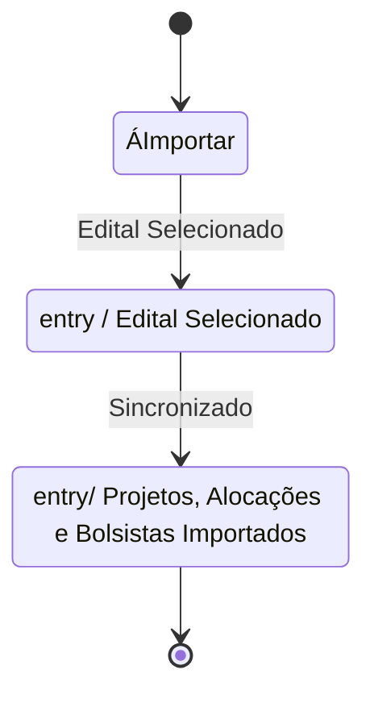
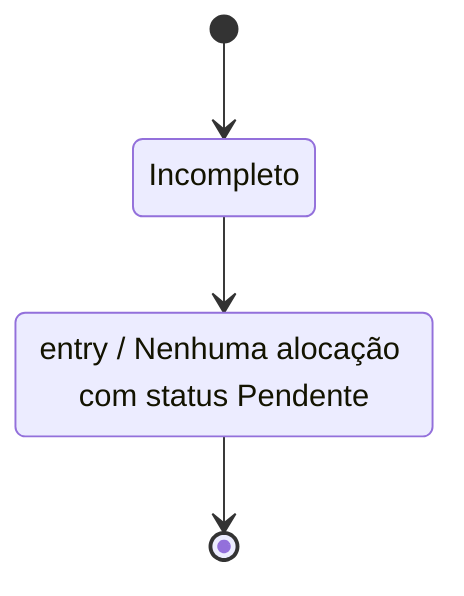
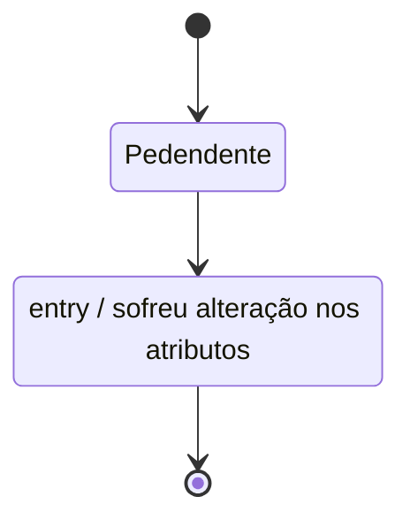

# Modelos Comportamentais

Diagrama de Estados das seguintes classes: Edital, Projeto e Alocação.

## Edital

Periodicamente os editais são cadastrados do Sigfapes para o Conecta Fapes. Esses novos editais recebem o status de **À Importar**. Quando um Gerente da Área Técnica seleciona um edital no qual deseja trabalhar, esse edital passa para o status **Não Importado**. Assim, o sistema de integração, periodicamente, busca informações sobre Projetos, Alocacações de Bolsistas e Bolsistas associados ao edital. Quando esses dados são sincronizados no Conecta Fapes o Edital recebe o status de **importado**.

## Projeto

Quando um projeto é cadastrado pela primeira vez no Conecta Fapes, pelo processo de integração, esse recebe o status de **Incompleto**. Após nenhuma alocação associada ao projeto estar com o status Pendente, o projeto recebe o status **Completo**.

## Alocação Bolsita

Quando um projeto é sincronizado pela primeira vez, todas as alocações vem com o status **Pendente**. Quando um valor da alocação é modificada e salva no sistema, essa assume o status **Modificado**. 

