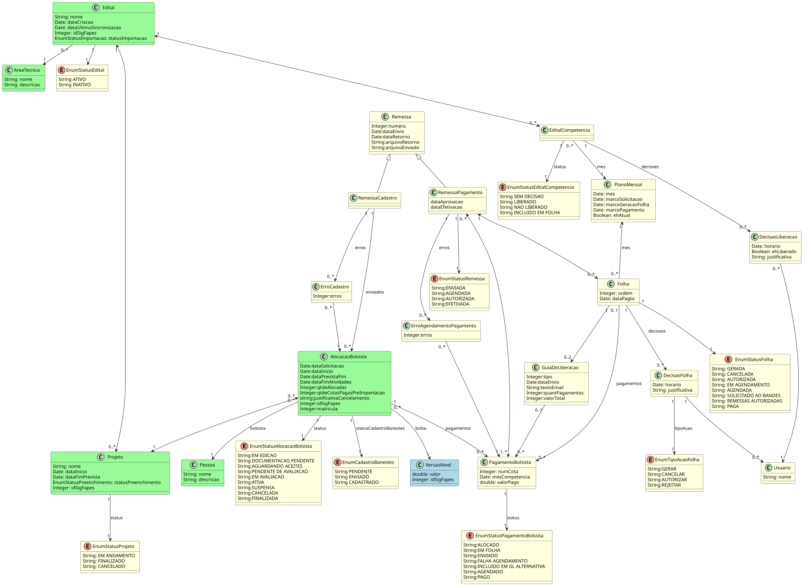

# Modelo de Domínio

O modelo conceitual estrutural captura e descreve as informações (classes, associações e atributos) que o sistema deve representar para prover as funcionalidades descritas nos casos de uso.
    
O diagrama organiza as classes relevantes a este módulo considerando, as classes do Módulo de Importação de Editais (em verde), as classes do Módulo de Cadastro de Modalidades de Bolsas (em azul) e as novas classes do Módulo de Pagamento de Bolsistas (em amarelo).

Cada área técnica (AreaTecnica) é responsável pela gestão de um conjunto de editais (Edital) que possuem projetos (Projeto) com a alocação (AlocacaoBolsista) de bolsistas (Pessoa) definindo um nível de bolsa (VersaoNivel) que determina o valor a ser pago em cada cota.
Todos os anos a FAPES define um planejamento para cada mês (PlanoMensal) com três datas principais: Data Limite de Solicitação de Bolsas (M1), Data Prevista de Geração da Folha Normal (M2) e Data de Pagamento da Folha Normal (M3). Para efeito de pagamentos, o mês atual é aquele que possui o marco de geração mais recente (/ehAtual).

Como os bolsistas são pagos mensalmente, é necessário realizar um controle de pagamentos de cada edital por competência (EditalCompetencia). Assim, um edital que possua projetos com bolsistas alocados ao longo de, exatamente, o ano de 2024 terá associadas 12 instâncias de EditalCompetencia, cada uma representando a possibilidade de pagamento de cada mês de vigência do edital. Ao longo do ano, a área técnica pode decidir, a cada competência, se já pode liberar ou não o edital para pagamento, atribuindo os estados “Liberado” ou “Não Liberado”. Cada decisão sobre um EditalCompetencia é registrada (DecisaoLiberacao), sendo que as decisões de não liberar requerem justificativa.

Os objetos da classe PagamentoBolsista representam cada uma das cotas de pagamentos esperadas para o bolsista (AlocacaoBolsista). Assim, quando uma alocação assume o status de “Ativa” (seja na sua aprovação ou na importação), todas as cotas de pagamentos futuros do bolsista devem ser criadas com o status “Alocado”. Por exemplo, se uma alocação é aprovada para um período de 12 meses, são criadas 12 instâncias de PagamentoBolsista, referentes às 12 cotas a serem pagas nas competências futuras. Se uma alocação é importada com duração de 10 meses, mas 4 cotas já foram pagas, são criadas 6 instâncias de PagamentoBolsista.

Uma Folha de pagamento é gerada agrupando todos os PagamentoBolsista, até a competência em questão, dos editais que foram liberados. Cada Folha refere-se a um único PlanoMensal, e cada PlanoMensal pode possuir uma ou mais folhas, sendo a primeira (ordem 1) chamada Folha Normal e as demais (ordem 2, 3, N) Folha Complementar N. Uma folha guarda ainda a data de pagamento a ser enviada ao banco e as decisões sobre ela tomadas (DecisaoFolha), que podem ser de Gerar, Cancelar, Autorizar e Rejeitar.

Para melhor entendimento dos estados de cada classe, é importante consultar os Modelos Comportamentais.

