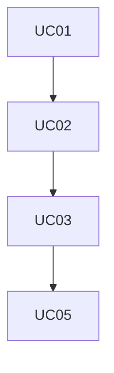
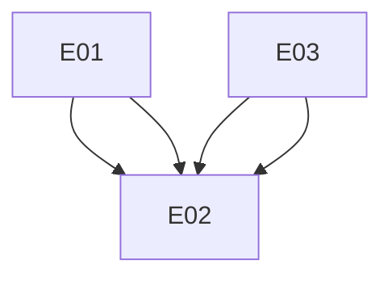

## Requisitos Funcionais

| ID   | Descrição    |Prioridade   | Dependências           |
|------|--------------|-------------|------------------------|
|RF01|O sistema deve cadastrar stores.|Alta|-|
|RF02|O sistema deve cadastrar as políticas de segurança.|Alta|RF02|
|RF03|O sistema deve cadastrar relações entre objetos.|Alta|RF03|
|RF04|O sistema deve avaliar se o usuário pode acessar o objeto baseado nas relações.|Alta|RF03|

## Requisitos Não-Funcionais

| ID   | Descrição    |Prioridade   | Dependências           |
|------|--------------|-------------|------------------------|

## Regras de Negócios

| ID   | Descrição    |Prioridade   | Dependências           |
|------|--------------|-------------|------------------------|

## Matrix de Dependencia dos casos de uso
| Item | Descrição | Dependências | Habilitados | Atores |
| --- | --- | --- | --- | --- |
| UC01 | Validar regras de acesso |  | UC02 | GestorDePoliticaDeSeguranca |
| UC02 | Cadastrar Políticas de Segurança | UC01 | UC03 | GestorDePoliticaDeSeguranca |
| UC03 | Instanciar as Políticas | UC02 | UC05 | GestorDePoliticaDeSeguranca |
| UC05 | Validar Regras de Acesso | UC03 |  |  |
| UC04 | Validar Regras de Acesso |  |  | GestorDePoliticaDeSeguranca |

### Ciclos
Caso exista ciclo, será apresentado abaixo:

### Grafo de Dependencia

## Matrix de Dependencia dos Eventos
| Item | Descrição | Dependências | Habilitados | Atores |
| --- | --- | --- | --- | --- |
| E03 | Listar Store |  | E02 |  |
| E01 | Criar Store |  | E02 |  |
| E02 | Deletar Store | E01, E03, E01, E03 |  |  |

### Ciclos
Caso exista ciclo, será apresentado abaixo:

### Grafo de Dependencia

