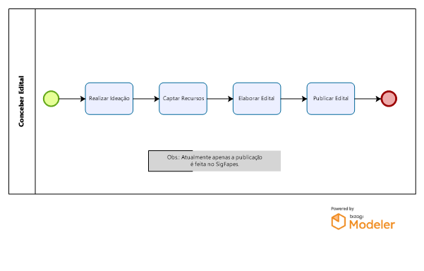

# Conceber Edital
Processo que envolve todas as tarefas desde a concepção do edital, escrita do edital e publicação do mesmo.

## Realizar Ideação
Identificar necessidade, definir objetivos.
##	Captar Recursos
Captar recursos junto aos pares (MCI, Órgãos Estaduais, FINEP, FINDES, Setor Privado, Institutos Internacionais).
##	Elaborar Edital
Escrita e validação (Gerência, DIREX, CCAF, PGE) do edital.
##	Edital
Divulgação do edital (sistema, site e mídias da Fapes, DIO, jornais). 