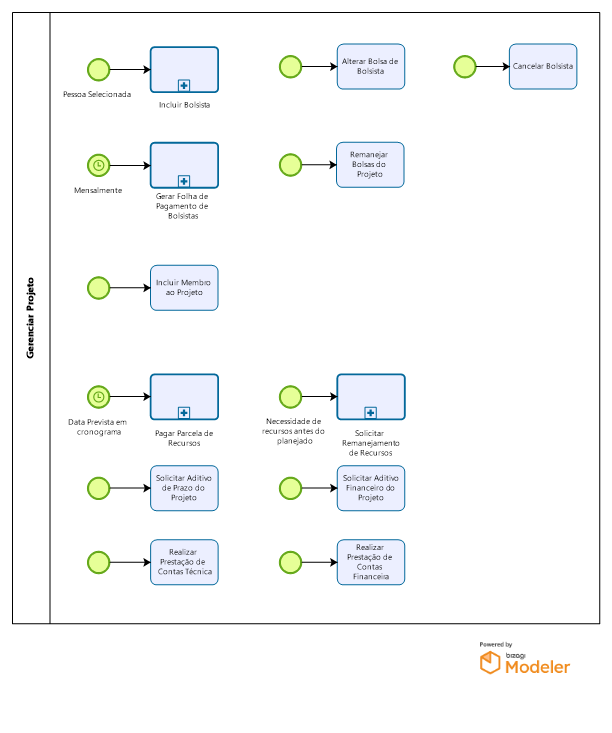

# Gerenciar Projetos

Composto pelos subprocessos de Inclusão de Bolsista; Alteração de Bolsa de Bolsista; Cancelamento de Bolsista; Pagamento de Parcela de Recursos; Solicitação de Aditivo de Prazo ou Financeiro do Projeto; Realização de Prestação de Contas Técnica e Financeira; Geração de Folha de Pagamento de Bolsistas; Remanejamento de Bolsas do Projeto; Inclusão de Membro ao Projeto e Solicitação de Remanejamento de Recursos

## Incluir Bolsista

Regras de Negócio sobre Bolsas.
1.  Categorização. As Bolsas são organizadas em um tipo (ex.: BPIG, UnAC, DTI, EXT, ICT), subdividido em níveis (ex.: BPIG-I a X).
2. Acúmulo. As restrições de possibilidade de acúmulo entre bolsas FAPES são feitas por tipo de bolsa. Por exemplo BPIG pode acumular com UnAC. Dentro de um mesmo tipo um bolsista não pode ter mais de uma bolsa ativa. O acúmulo de bolsas FAPES com outras bolsas externas é regido por resoluções e/ou editais (indesejável que o edital imponha regras diferentes da resolução). Para alguns tipos de bolsa pode ser aplicado um redutor por vínculo empregatício. Assim, o tipo de bolsa pode ser classificado como: (i) incompatível com vínculo (ex.: ICT, EXT-D); (ii) compatível, mas com redução (ex.: BPIG pode acumular, aplicando redutor para 60% do valor padrão da bolsa); e (iii) compatível sem redução (ex.: DTI).
3. Periodicidade de Pagamento. Todas as bolsas com exceção à UnAC são pagas mensalmente, do início ao fim da vigência informada. No caso da UnAC, os pagamentos são esporádicos em meses a serem definidos pelo coordenador, dentro da vigência do projeto.
4. Atualização de Valor. O valor da bolsa é definido por nível. Quando o projeto é aprovado os valores das bolsas são definidos com base na tabela de valores atuais do tipo e nível das bolsas. Se os valores dos tipos e níveis são reajustados durante a execução do projeto, os reajustes não são aplicados automaticamente às bolsas dos projetos em andamento.
Observação.: Existe diferenciação entre Bolsa (com vigência) e Auxílio (pagamento único).

##	 Alterar Bolsa de Bolsista
Coordenador envia e-mail à Área Técnica solicitando alterar a data de fim da bolsa e/ou alterar o tipo/nível da bolsa. Área Técnica avalia a viabilidade em conceder, verificando: (i) requisitos da nova bolsa e documentação, (ii) vigência do projeto, (iii) quantidade de cotas disponíveis.
Observação.: Algumas Áreas Técnicas não fazem isso. Solicitam que o coordenador cancele a bolsa em questão e faça nova solicitação de bolsa.

##	 Cancelar Bolsista
Coordenador solicita o cancelamento da bolsa de um bolsista pelo SigFapes e a Área Técnica aceita a solicitação, confirmando o cancelamento no SigFapes. Outra possibilidade é o coordenador solicitar por e-mail e a Área Técnica realiza o cancelamento no SigFapes.
Em ambos os casos, a Área Técnica confirma a data de cancelamento e desativa o bolsista na planilha, atualizando a data de vigência da bolsa. Se o último dia de atividade for menor que 16, não se paga a bolsa daquele mês de referência. Se a solicitação for feita em tempo hábil para retirar do pagamento do mês, será feito.

##	 Gerar Folha de Pagamento de Bolsistas

###	 Remanejar Bolsas do Projeto
Coordenador solicita, por e-mail à Área Técnica, o remanejamento das cotas de bolsas disponíveis. As cotas disponíveis (aprovadas, mas não alocadas) podem ser remanejadas dentro dos tipos/níveis permitidos ao projeto. A Área Técnica avalia a solicitação garantindo que o valor total da nova configuração de cotas não exceda o valor total disponível para pagamento de bolsas no projeto. Em caso positivo, a planilha do projeto é atualizada com a nova configuração.

###	 Incluir Membro ao Projeto
Coordenador envia e-mail à Área Técnica solicitando que a pessoa (já cadastrada) seja vinculada ao projeto, tornando-se, assim, um membro do mesmo. Com isso, a pessoa passa a poder usufruir dos recursos do projeto (por exemplo, usar verbas de diárias e passagens do projeto).

###	 Pagar Parcela de Recursos

* Pagar Primeira Parcela: Gerência solicita pagamento da primeira parcela a SUPOF, que verifica questões bancárias e realiza o depósito na conta do projeto e devolve o processo do E-DOCs para a Gerência.
* Pagar Demais Parcelas: Conforme o cronograma de pagamentos, Gerência avalia o andamento do Projeto e, caso esteja cumprindo suas metas, solicita pagamento da parcela a SUPOF, que avalia e realiza o depósito na conta do projeto e devolve o processo do E-DOCs para a Gerência. (hoje não acontece)

* Solicitar Parcela: A partir de data prevista no cronograma de pagamentos, Coordenador solicita pagamento da parcela em questão. Gerência avalia o andamento do Projeto e, caso esteja cumprindo suas metas, solicita pagamento da parcela a SUPOF, que avalia e realiza o depósito na conta do projeto e devolve o processo do E-DOCs para a Gerência.

* Solicitar Adiantamento de Parcela: Antes de data prevista no cronograma de pagamentos, Coordenador solicita pagamento de parcela futura. Gerência avalia a justificativa da solicitação e o andamento do Projeto e, caso a justificativa seja aceita, solicita pagamento da parcela a SUPOF, que avalia e realiza o depósito na conta do projeto e devolve o processo do E-DOCs para a Gerência.

###  Solicitar Aditivo de Prazo do Projeto
Coordenador envia e-mail à Área Técnica solicitando prorrogar o fim do projeto até data X. Área Técnica avalia a justificativa da solicitação e a viabilidade em conceder.

###	 Solicitar Aditivo Financeiro do Projeto
Coordenador envia e-mail à Área Técnica solicitando adição de X em recursos ao projeto. Área Técnica avalia a justificativa da solicitação e a viabilidade em conceder. 
