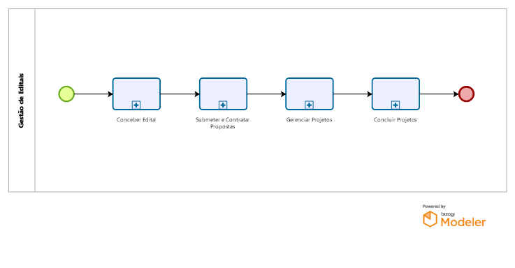

#	Gestão de Editais

Processo para gestão dos editais

##	 Conceber Edital
Envolve todas as tarefas desde a concepção do edital, escrita do edital e publicação do mesmo.

##	 Submeter e Contratar Propostas
Envolve todas as tarefas desde a submissão de propostas, com avaliação de documentações e méritos, classificação de propostas e, por fim, contratação de propostas dando origem a projetos.

##	 Gerenciar Projetos

Composto pelos subprocessos de Inclusão de Bolsista; Alteração de Bolsa de Bolsista; Cancelamento de Bolsista; Pagamento de Parcela de Recursos; Solicitação de Aditivo de Prazo ou Financeiro do Projeto; Realização de Prestação de Contas Técnica e Financeira; Geração de Folha de Pagamento de Bolsistas; Remanejamento de Bolsas do Projeto; Inclusão de Membro ao Projeto e Solicitação de Remanejamento de Recursos.

##	 Concluir Projetos

[Após avaliação das gerências técnica e financeira das prestações de contas finais...] 

As prestações de contas são encaminhadas aos respectivos diretores para avaliar o parecer das prestações de contas. Diretor realiza feedback e envia para a DIREX homologar a prestação de contas. Coordenador é comunicado da conclusão do projeto. Observação.: processo em adaptação
