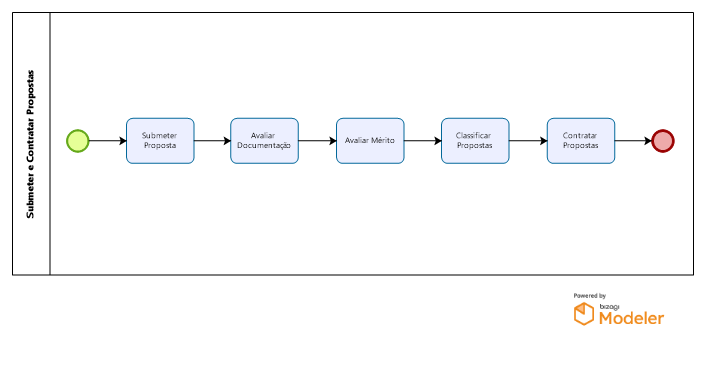

#	Submeter e Contratar Propostas

Envolve todas as tarefas desde a submissão de propostas, com avaliação de documentações e méritos, classificação de propostas e, por fim, contratação de propostas dando origem a projetos.

Processo composto, de modo geral, pelas etapas 1. Submeter Proposta, 2. Avaliar Documentação, 3. Avaliar Mérito, 4. Classificar Propostas e 5. Contratar Propostas.
##	 Submeter Proposta
Proponente submete a proposta no sistema (até o prazo) com preenchimento de dados e anexo de documentos exigidos pelo edital. 
##	 Avaliar Documentação
A Área Técnica (GEINOV, GECAP, GEPED, NUPEX) verifica se a documentação submetida atende aos requisitos do edital. Resultado da avaliação é publicado, cabendo recursos. 
##	 Avaliar Mérito
Avaliadores (2-3) (Ad-hoc ou Câmara de Assessoramento) avaliam o mérito da proposta conforme critérios do edital, resultando em uma nota e ponderações à proposta. Resultado da avaliação é publicado, cabendo recursos.
Observação.: Atribuição de avaliadores (não automática) e notas estão no SigFapes. Controle financeiro de pagamento de Avaliadores Ad-hoc é manual. 
##	 Classificar Propostas
Gerência ordena as propostas classificadas conforme as divisões (regiões, microrregiões, área de conhecimento) e critérios do edital. Resultado final é divulgado em duas listas: classificados e desclassificados. 
##	 Contratar Propostas
GEPOF/SUCON avalia documentos de contratação (podendo desclassificar a proposta, chamando suplente), produz um termo de outorga (assinado pelo proponente, DIRAF e outros no E-DOCs) e publica contratados no DIOES. Proposta passa a ser um Projeto Contratado e Processo é criado no E-DOCs, incluindo o TO e outros documentos. Planilha Gerencial não é criada. 
