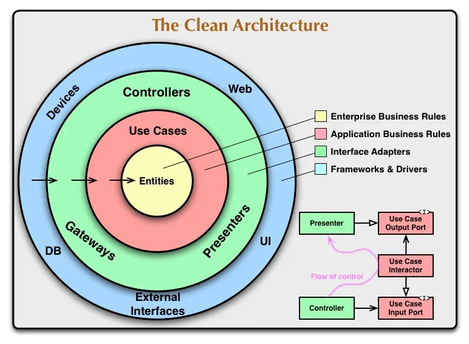
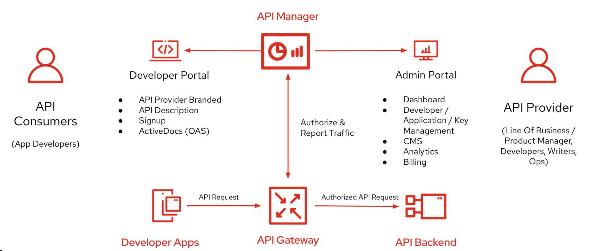
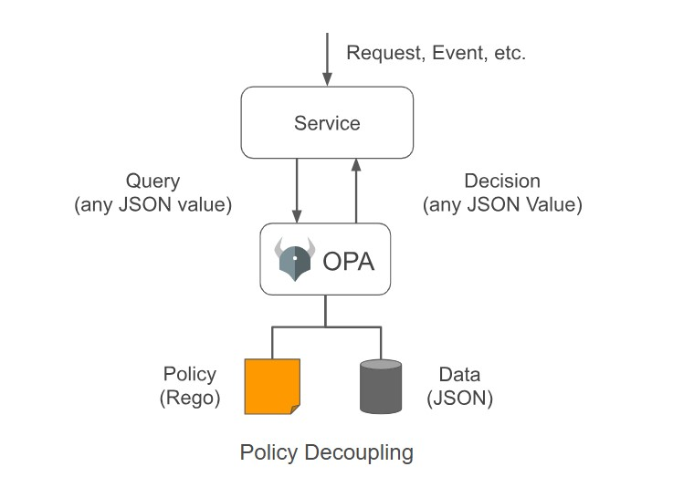

# Conceitos
Para melhor entendimento, veja os conceitos básicos que utilizamos:

## Clean Architecture

A Clean Architecture foi criada por Robert C. Martin e promovida em seu livro Clean Architecture: A Craftsman’s Guide to Software Structure. Assim como outras filosofias de design de software, a Clean Architecture tenta fornecer uma metodologia a ser usada na codificação, a fim de facilitar o desenvolvimento códigos, permitir uma melhor manutenção, atualização e menos dependências.

Um objetivo importante da Clean Architecture é fornecer aos desenvolvedores uma maneira de organizar o código de forma que encapsule a lógica de negócios, mas mantenha-o separado do mecanismo de entrega.



* **Enterprise Business Rules**: A camada de “Enterprise Business” é a camada mais interna e fundamental da Clean Architecture, também chamada de camada de domínio. Ela abriga as regras de negócios centrais e as entidades principais da aplicação. Nesta camada, você define as entidades de domínio, que representam os objetos de negócios, e implementa as regras de negócios essenciais. Essas entidades e regras são independentes de qualquer detalhe técnico e não devem depender de frameworks ou tecnologias externas.

* **Application Business Rules**: A camada de “Application Business” está logo acima da camada de “Enterprise Business”. Ela coordena a execução dos casos de uso (use cases) e gerencia o fluxo da aplicação. Nesta camada, você define os casos de uso da aplicação, que representam funcionalidades específicas ou operações que o sistema pode realizar. Os casos de uso são implementados aqui e são responsáveis por orquestrar a interação entre as entidades do domínio. A camada de “Application Business” atua como um intermediário entre a interface de usuário e o domínio.

* **Interface Adapters**: A camada de “Interface Adapters” fica entre as camadas de negócios e as camadas externas como a interface de usuário e os frameworks externos. Aqui, você adapta os detalhes técnicos e as interfaces de entrada e saída para atender às necessidades das camadas de negócios. A camada de “Interface Adapters” ajuda a manter as camadas internas isoladas de tecnologias externas.

* **Framework & Drivers**: Esta é a camada mais externa da Clean Architecture, onde você lida com os detalhes técnicos e as tecnologias externas com as quais seu sistema interage. Nesta camada, você implementa a interação com frameworks externos, como bancos de dados, bibliotecas de interface gráfica entre outros. Esta camada deve ser a mais flexível para permitir a substituição ou atualização de tecnologias sem afetar as camadas internas.

**Referência**: https://medium.com/@gabrielfernandeslemos/clean-architecture-uma-abordagem-baseada-em-princ%C3%ADpios-bf9866da1f9c

## Gateway de API

O gateway de Gerenciamento de API (também chamado de plano de dados ou runtime) é o componente de serviço responsável por fazer proxy de solicitações de API, aplicar políticas e coletar telemetria.

Especificamente, o gateway:

Atua como uma fachada para serviços de back-end aceitando chamadas à API e roteando-as para back-ends apropriados
Verifica as chaves de API e outras credenciais, como tokens JWT e certificados apresentados com solicitações
Impõe cotas de uso e limites de taxa Opcionalmente, transforma solicitações e respostas conforme especificado em instruções de política Se configurado, armazena em cache as respostas para aprimorar a latência de resposta e minimizar a carga nos serviços de back-end Emite logs, métricas e rastreamentos para monitoramento, relatórios e solução de problemas.



 Aqui estão alguns dos principais aspectos e funcionalidades de um API Gateway:

    * Roteamento de Solicitações: Direciona as solicitações de entrada para o serviço ou endpoint apropriado. Isso é particularmente útil em arquiteturas de microservices, onde uma única solicitação pode precisar acessar múltiplos serviços.

    * Agregação de Respostas: Combina resultados de vários serviços em uma única resposta para o cliente. Isso reduz a quantidade de chamadas que um cliente precisa fazer, melhorando a eficiência e a experiência do usuário.

    * Autenticação e Autorização: Verifica as credenciais das solicitações e assegura que o solicitante tenha permissão para acessar os serviços solicitados. Isso pode incluir integração com sistemas de autenticação, como OAuth, JWT, etc.

    * Limitação de Taxa (Rate Limiting): Controla o número de solicitações que um cliente pode fazer em um determinado período de tempo para prevenir abusos e garantir a disponibilidade do serviço.

    * Monitoramento e Logging: Coleta e registra informações sobre as solicitações, como tempo de resposta, erros, e outros métricos importantes para monitorar o desempenho e detectar problemas.

    * Transformação de Protocolos: Converte solicitações e respostas entre diferentes formatos de protocolo (por exemplo, de REST para SOAP ou vice-versa).

    * Cache: Armazena em cache as respostas para melhorar a performance e reduzir a carga nos serviços backend.

    * Manipulação de Erros: Garante que os erros sejam manejados de forma consistente e que respostas de erro úteis sejam retornadas ao cliente.


**Referência**: https://learn.microsoft.com/pt-br/azure/api-management/api-management-gateways-overview

## Open Police

O Open Policy Agent (OPA, pronunciado "oh-pa") é um motor de políticas de propósito geral e código aberto que unifica a aplicação de políticas em toda a pilha. O OPA fornece uma linguagem declarativa de alto nível que permite especificar políticas como código e APIs simples para delegar a tomada de decisões de políticas para fora do seu software.

O OPA desacopla a tomada de decisões de políticas da aplicação de políticas. Quando o seu software precisa tomar decisões de políticas, ele consulta o OPA e fornece dados estruturados (por exemplo, JSON) como entrada. O OPA aceita dados estruturados arbitrários como entrada.



O OPA gera decisões de políticas avaliando a entrada da consulta em relação às políticas e aos dados. O OPA e o Rego são agnósticos ao domínio, permitindo que você descreva quase qualquer tipo de invariável em suas políticas. 

 Aqui estão os principais aspectos e funcionalidades do OPA:

    * Controle de Políticas Descentralizado: OPA permite a criação e aplicação de políticas que definem quem pode acessar quais recursos e sob quais condições. Ele pode ser integrado em diversos pontos de uma arquitetura de software, incluindo gateways de API, Kubernetes, sistemas de CI/CD, e serviços de microservices.

    * Linguagem de Políticas Rego: OPA utiliza uma linguagem de políticas declarativa chamada Rego. Com Rego, os administradores podem escrever regras complexas de controle de acesso, validação de dados, roteamento e muito mais.

    * Decisões em Tempo de Execução: OPA pode tomar decisões de autorização em tempo real, respondendo rapidamente às solicitações de autorização com base nas políticas definidas. Ele avalia essas políticas contra dados fornecidos em solicitações para determinar se a ação solicitada deve ser permitida ou negada.

    * Integração Fácil: OPA é projetado para ser integrado facilmente em diversas plataformas e sistemas. Ele pode funcionar como um serviço separado ou ser embutido diretamente nos serviços existentes.

    * Auditoria e Transparência: OPA fornece funcionalidades de registro e auditoria, permitindo que as organizações rastreiem decisões de políticas e revisem históricos de auditoria para conformidade e análise de segurança.

    * Escalabilidade e Desempenho: OPA é construído para ser altamente escalável e eficiente, adequado para ambientes de produção com alta carga e requisitos de baixa latência.

    * Aplicação em Diversos Contextos: OPA pode ser usado em uma variedade de contextos, desde políticas de acesso e segurança até políticas de configuração, validação de dados, e conformidade com normas regulatórias.

    * Comunidade e Suporte: Como um projeto de código aberto, OPA tem uma comunidade ativa de desenvolvedores e usuários que contribuem com melhorias, plugins, e integrações, além de oferecer suporte e compartilhamento de melhores práticas.

Aqui está um exemplo simples de uma política Rego que gerencia a rota de um recurso em uma API que permite cadastrar usuários. Esse exemplo verifica se a requisição de cadastro de um novo usuário possui as permissões necessárias.

Vamos supor que queremos permitir apenas que usuários com a função "admin" possam cadastrar novos usuários.

```csharp title="Exemplo: permisão Admin"
package example.authz

default allow = false

# Entrada esperada
# {
#   "input": {
#     "method": "POST",
#     "path": ["users"],
#     "user": {
#       "role": "admin"
#     }
#   }
# }

# Permitir cadastro de usuário apenas se o método for POST, a rota for "users" e o usuário tiver a função "admin"
allow {
    input.method == "POST"
    input.path == ["users"]
    input.user.role == "admin"
}
```

**Referência:** https://www.openpolicyagent.org/docs/latest/
