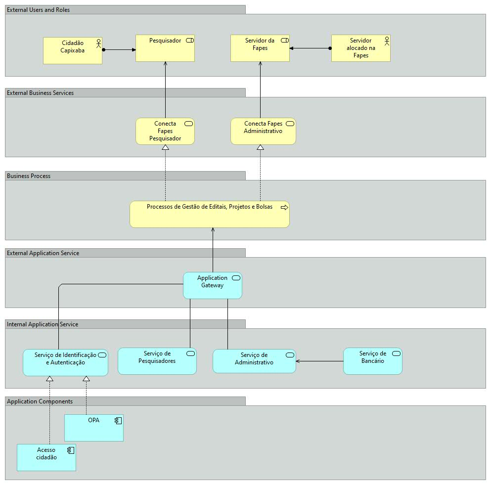

# Arquitetura Conceitual

Apresenta uma visão conceitual dos componentes da arquitetura do projeto. 

## Camada External Users and Roles
Apresenta os usuários e papéis que usam os serviços da plataforma.

|Componente| Descrição|
|------|--------------|
|Cidadão Capixaba|Qualquer cidadão que tenha endereço fixo no Espírito Santo|
|Servidor alocado na Fapes|Qualquer pessoa que esteja alocado em um cargo da FAPES|
|Pesquisador|Um cidadão capixaba que possui um projeto ou bolsa fomentado pela FAPES|
|Servidor da Fapes|Um servidor da FAPES que possui autorização em usar o Conecta Fapes|

## Camada External Business Services

Apresentar os serviços que preevem funcionalidades para os seus usuários. 

|Componente| Descrição|
|------|--------------|
|Conecta Fapes Pesquisador|Serviço que prover funcionalidades para os Pesquisadores|
|Conecta Fapes Administrativo|Serviço que prover funcionalidades para os Servidores da Fapes|

## Camada Business Process

Apresenta os processos que são utilizados pelos serviços providos aos usuários. 

|Componente| Descrição|
|------|--------------|
|Processos de Gestão de Editais, Projetos e Bolsas|Conjunto de processos que são executados para a gestão de editais, projetos e bolsas|

## Camada External Application Service

Apresenta os serviços que são utilizados para materializar os processos.

|Componente| Descrição|
|------|--------------|
|Application Gateway|Gateway para controle de acesso aos dados e serviços|

## Camada Internal Application Service

Apresenta os serviços internos que são utilizados para materializar os processos.

|Componente| Descrição|
|------|--------------|
|Serviço de Identificação e Autorização| Serviço que realiza a identificação e autorização de um usuário no sistema |
|Serviço de Pequisadores| Serviço que prover funcionalidades para os Pesquisadores |
|Serviço Administrativos| Serviço que prover funcionalidades para os Servidores da Fapes |
|Serviço de Bancário| Serviço que prover funcionalidades bancarias para a Fapes |

## Camada Application Components
Apresenta os componentes internos que compoem um ou mais serviços internos.
|Componente| Descrição|
|------|--------------|
|[**Acesso Cidadão**](/docs/referencias/03_governo/01_acesso_cidadao.md)| sistema que centralizasse as informações do cidadão e do servidor público em uma base de dados única, facilitando assim a validação da consistência dos dados e provendo autenticação e autorização de uma forma simples e segura  |
|**OPA (Open Policy Agent)**| sistema de código aberto desenvolvido para implementar políticas de controle de acesso e gerenciamento de regras em diversas plataformas e serviços. Ele permite a definição, implementação e aplicação de políticas de maneira centralizada e consistente em todo o ecossistema de uma organização|