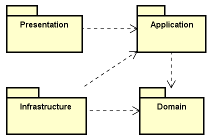
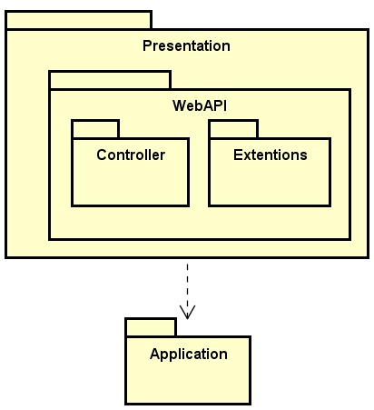
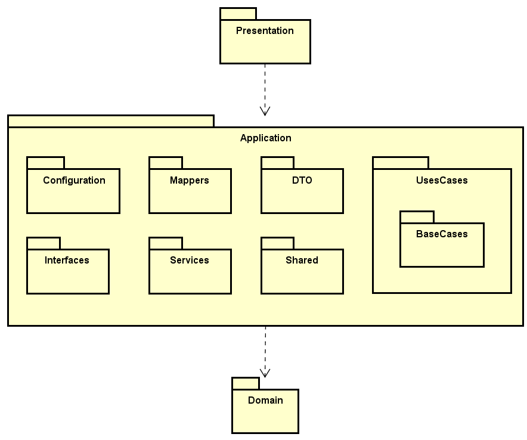
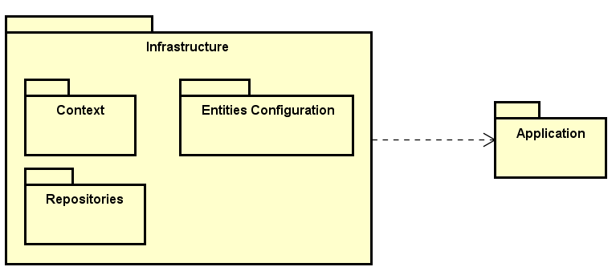
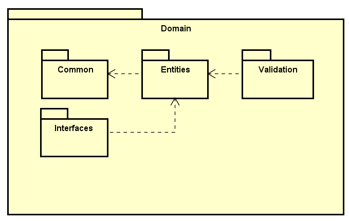

# Visão Geral dos Componentes

Essa seção apresenta as definições e padrões dos componentes utilizados na arquitetura do projeto. 

## Arquitetura dos Serviços do Back-End

|Camada| Descrição    |
|------|--------------|
|Presentation|Interage com os usuários finais ou outros sistemas através de interfaces de entrada|
|Application|Orquestra o fluxo de dados para e do domínio e coordena as operações de negócios|
|Infrastructure|Implementa detalhes de infraestrutura, como persistência de dados e comunicações externas|
|Domain|Contém a lógica de negócios central e entidades do sistema|

### Camada de Presentation

|Componente| Descrição    |
|------|--------------|
|Controller|Ponto de entrada para o sistema, recebendo solicitações e retornando respostas. Eles não contêm lógica de negócios, mas chamam casos de uso da camada de aplicação|
|Extensions|Extensão das configurações do arquivo Program.cs que é o main da api|

### Camada de Application

|Componente| Descrição    |
|------|--------------|
|Configuration|Contém o arquivo de configuração das injeções de dependências utilizadas, bem como a configuração de bibliotecas externas|
|Mappers|Transformam objetos de um tipo em outro, como converter um DTO (Data Transfer Object) da camada de apresentação em uma entidade de domínio|
|DTOs (Data Transfer Objects)| Estruturas de dados usadas para transferir informações entre a camada de aplicação e outras camadas|
|Interfaces|Definem contratos que descrevem o que o sistema precisa para funcionar, sem se preocupar com implementações específicas|
|Services|Contém a implementação de funções auxiliares a lógica de aplicação, coordenando interações entre repositórios, entidades do domínio|
|Shared|Contém arquivos com implementação de funções compartilhadas entre os componentes da camada application|
|Use Cases|Contêm a lógica de aplicação, coordenando interações entre as entidades do domínio e outros serviços. Eles são responsáveis por realizar ações específicas solicitadas pelos usuários ou sistemas|

### Camada de Infrastructure

|Componente| Descrição    |
|------|--------------|
|Context|Define a configuração do contexto do Entity Framework Core para a aplicação|
|Entities Configuration|Contém as configurações do modelo das tabelas no banco de dados, como tipo, limitações e valores padrões das colunas e bem como a definição dos relacionamentos entre tabelas|
|Repositories|Implementações de interfaces definidas na camada de aplicação para acesso a dados|

### Camada de Domain

|Componente| Descrição    |
|------|--------------|
|Common|Define Classes abstratas que possuem atributos e métodos comuns a outras entidades|
|Entities|Define classes do dominio do problema|
|Interfaces|Definir os métodos que devem ser implementados nos repositórios da camada de Infrastructure e usado na camada de aplicação|
|Validation|Gerar e retornar os erros de validação das entities|
