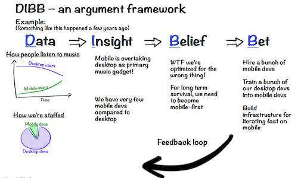

O **DIBB Framework** (Data -> Insight -> Belief -> Bet) é uma abordagem usada pelo Spotify para priorizar iniciativas de forma estratégica e alinhada aos objetivos gerais da empresa, conhecidos como *North Star goals*. 

1. **Data**: Reúne informações e métricas relevantes.
2. **Insight**: Transforma os dados em aprendizados e entendimentos valiosos.
3. **Belief**: Baseado nos insights, desenvolvem-se crenças sobre o que deve ser feito para atingir os objetivos.
4. **Bet**: Essas crenças resultam em esforços focados (*Bets*), que são iniciativas priorizadas e alinhadas para impulsionar os objetivos principais da organização.

Cada *Bet* fornece contexto e orientação para os times envolvidos na solução de um problema específico. Essas apostas são organizadas em ordem de prioridade (*stack-ranked*), recebem os recursos necessários e são compartilhadas de maneira transparente por toda a empresa, promovendo foco e alinhamento estratégico.

Referências:

* [Spotify Rhythm – how we get aligned (slides from my talk at Agile Sverige)](https://blog.crisp.se/2016/06/08/henrikkniberg/spotify-rhythm?ref=https://product-frameworks.com)