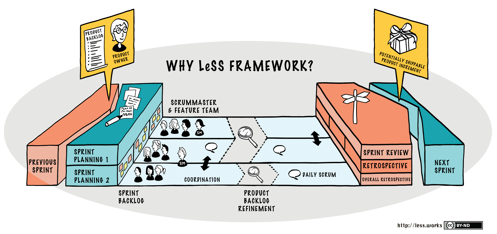

**LeSS (Large-Scale Scrum)** é uma estrutura de escala para equipes que utilizam Scrum em organizações de grande porte. O principal objetivo do LeSS é simplificar a adoção de Scrum em múltiplas equipes, mantendo o foco em entregar valor ao cliente e promover a agilidade organizacional.

## Principais Características do LeSS:
1. **Base no Scrum:** LeSS mantém os princípios do Scrum, como transparência, inspeção e adaptação, aplicando-os em um contexto com várias equipes.
   
2. **Simples e Adaptável:** Prioriza a simplicidade ao invés de criar complexidade para coordenar equipes. A adaptação às necessidades do cliente e do negócio é central.

3. **Uma Definição de Produto:** Todas as equipes trabalham em um único backlog de produto, priorizado pelo Product Owner, promovendo alinhamento e colaboração.

4. **Coordenação Entre Equipes:**
   - **Scrum of Scrums:** Um encontro entre representantes de diferentes equipes para compartilhar progresso e resolver impedimentos.
   - **Sprint Reviews Conjuntas:** Todas as equipes apresentam o incremento do produto em uma revisão unificada.
   
5. **Foco em Aprendizado:** Incentiva o aprendizado organizacional por meio da melhoria contínua e da experimentação.

6. **Papéis Claros:** 
   - Um único **Product Owner** gerencia o backlog de produto.
   - As equipes Scrum são autônomas e multifuncionais.
   - Não há papéis intermediários, como gerentes de projeto, para evitar burocracia.

7. **Dois Níveis de Escala:**
   - **LeSS Básico:** Para até oito equipes.
   - **LeSS Huge:** Para centenas de equipes, organizado em áreas de requisito.

## Benefícios do LeSS:
- **Transparência:** Todas as equipes compartilham o mesmo backlog e trabalham de forma integrada.
- **Simplicidade Organizacional:** Evita a criação de estruturas e processos desnecessariamente complexos.
- **Melhoria Contínua:** Promove a reflexão e o aprendizado no nível organizacional.

## Quando Usar:
LeSS é ideal para organizações que já adotam o Scrum e buscam expandi-lo para múltiplas equipes, mantendo a agilidade e simplicidade. É particularmente eficaz em contextos onde a colaboração e a entrega de valor contínuo são fundamentais.

No **LeSS (Large-Scale Scrum)**, o **Sprint Planning** é adaptado para o contexto de várias equipes trabalhando em um único produto. Ele mantém a essência do planejamento no Scrum, mas com abordagens específicas para coordenar as equipes de forma eficaz. O Sprint Planning no LeSS é dividido em duas partes principais:

---

## **1. Sprint Planning Parte 1: Planejamento de Escopo Compartilhado**
- **Objetivo:** Todas as equipes entendem o que será trabalhado no Sprint e como contribuirão para o objetivo do Sprint.
- **Participantes:** 
  - Product Owner
  - Representantes de todas as equipes (não necessariamente todos os membros).
- **Atividades:**
  - **Discussão do Backlog do Produto:** O Product Owner apresenta os itens mais prioritários do backlog.
  - **Definição do Objetivo do Sprint:** O grupo trabalha para definir um único objetivo para o Sprint que abrange todas as equipes.
  - **Divisão do Trabalho:** As equipes selecionam os itens que irão trabalhar, garantindo que a seleção respeite as dependências e maximize a eficiência do trabalho colaborativo.
- **Resultados:** 
  - Objetivo do Sprint definido.
  - Itens de backlog inicialmente atribuídos às equipes.

---

## **2. Sprint Planning Parte 2: Planejamento Detalhado de Cada Equipe**
- **Objetivo:** Cada equipe detalha o planejamento para os itens selecionados, organizando o trabalho dentro da equipe.
- **Participantes:**
  - Membros da equipe específica.
  - Product Owner (disponível para esclarecimentos, se necessário).
- **Atividades:**
  - **Divisão de Tarefas:** Os itens do backlog são quebrados em tarefas específicas para o time.
  - **Estimação:** As tarefas podem ser estimadas, se necessário.
  - **Planejamento Técnico:** Identificação de soluções técnicas e dependências entre equipes.
- **Resultados:**
  - Backlog da Sprint detalhado para a equipe.
  - Compromisso com o trabalho e alinhamento interno.

---

## Diferenças do LeSS em Relação ao Scrum Tradicional:
1. **Colaboração entre Equipes:**
   - O Sprint Planning Parte 1 promove um alinhamento entre todas as equipes para evitar redundâncias ou lacunas.
   - Pode envolver discussões sobre como dividir itens de backlog complexos entre várias equipes.
   
2. **Objetivo do Sprint Único:** 
   - Todas as equipes compartilham o mesmo objetivo de Sprint, promovendo colaboração em torno de uma visão comum do produto.

3. **Flexibilidade:** 
   - O trabalho planejado pode ser ajustado ao longo do Sprint com base nas descobertas e na coordenação entre equipes.

---

## Benefícios do Sprint Planning no LeSS:
- **Alinhamento Global:** Todas as equipes têm clareza sobre o objetivo do Sprint e como cada uma contribui para alcançá-lo.
- **Cooperação:** Reduz o risco de silos ao promover comunicação e compartilhamento de conhecimento entre equipes.
- **Entrega Coordenada:** Aumenta a probabilidade de entregar um incremento integrado e funcional ao final do Sprint.

O planejamento no LeSS combina simplicidade com a colaboração necessária para escalar o Scrum de forma eficiente e eficaz.

Referências:

* [Visão geral sobre LeSS](https://less.works/)