## 5.1 Visão Geral da Arquitetura

A arquitetura foi projetada para garantir segurança e controle de acesso, organizando a defesa em profundidade da aplicação. A seguir, estão os principais componentes e fluxos:

---

## 5.1.1. Tipos de Acesso

A aplicação possui três perfis de acesso distintos:

- **Público Interno (FAPES):** Usuários internos da fundação.
- **Público Externo:** Coordenadores e pesquisadores.
- **Sysadmin:** Interface de administração de autorizações e políticas.

---

## 5.1.2. Interface do Servidor Interno

- Há um **front-end** exclusivo para o público interno.
- Possui um **módulo de autenticação** que gerencia:
  - Redirecionamento para o sistema **Acesso Cidadão**.
  - Interface de login integrada.

---

## 5.2. Processo de Autenticação

1. O usuário acessa a interface.
2. É redirecionado para o **Acesso Cidadão**.
3. O Acesso Cidadão identifica o usuário e o sistema gera um **token de autenticação**.
4. Com o token, o usuário pode acessar o **gateway** da aplicação.

---

## 5.3. Gateway de Acesso

- **Dois gateways distintos:**
  - **Gateway Interno**
    - Aplica regras de autorização.
    - Consulta o **servidor de decisão de regras (OpenFGA)** para verificar se a requisição tem permissão.
    - Se autorizado, a requisição é encaminhada ao back-end correspondente.

  - **Gateway Público**
  - Resolve as rotas públicas e para as de acesso controlado, redirecionado para o gateway Interno
---

## 5.4. Backends da Aplicação

- **Conect Admin:**
  - Centraliza importações do sistema legado e tem os modelos de classe para os demais componentes.
  - Importa editais do sistema legado para a base de dados `ConectaFapsDB`.

- **Dashboard de Pagamento:**
  - Exibe informações sobre gastos realizados por edital.

- **Módulo de Pagamento:**
  - Gera arquivos de remessa de pagamentos para o Banestes.
  - O envio e a verificação do retorno ainda são realizados **manualmente**.

- **Gerenciamento de Usuários:**
  - Cria usuários na base `ConectaFapsDB`, funcionando como **última barreira de acesso**.
  - Mesmo com permissões no sistema, sem um usuário criado na base, não há acesso.

---

## 5.5. Administração de Regras e Políticas

- Realizada via sistema na parte inferior da arquitetura (interface administrativa).
- Permite:
  - Autenticação similar à interface interna.
  - Autenticação local para usuários `sysadmin` ou `root`.
  - Inserção de regras de tuplas no servidor **OpenFGA** via back-end administrativo.

---
### 5.5.1. PAP (Policy Administration Point)

- Interface para configuração de políticas de autorização, criação de usuários e visualização de logs.

### 5.5.2. PIP (Policy Information Point)

- Captura informações do sistema:
  - Rotas acessadas
  - Recursos e objetos utilizados
- Essas informações são usadas para aplicação e ajuste das regras de autorização.

