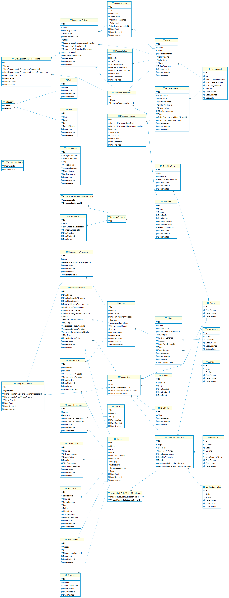

## Estrutura dos Bancos de Dados do Sistema ConectaFapes

### ConectaFapesDB
Este é o banco de dados principal do sistema. Ele armazena todas as informações que o sistema gera e consome, sendo a base para todas as operações da plataforma.

### ConectaFapesJobImportacaoDB
Banco intermediário utilizado para armazenar dados importados do sistema Sigfapes. Ele serve como um repositório temporário para facilitar a importação e sincronização de dados entre o Sigfapes e o ConectaFapesDB.

### ConectaFapesJobsDB
Banco de dados destinado ao armazenamento de dados que será gerado por jobs gerais que o sistema necessita. Ele é utilizado para controle dos dados gerados pelos processos automáticos e tarefas agendadas.

