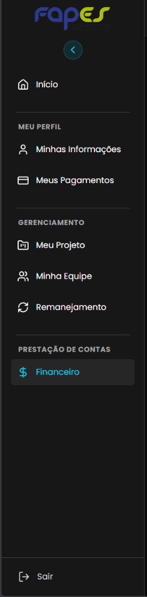
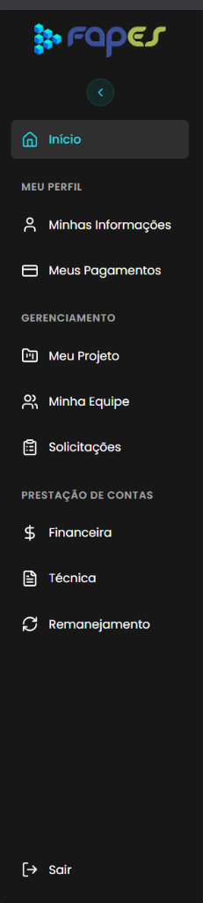
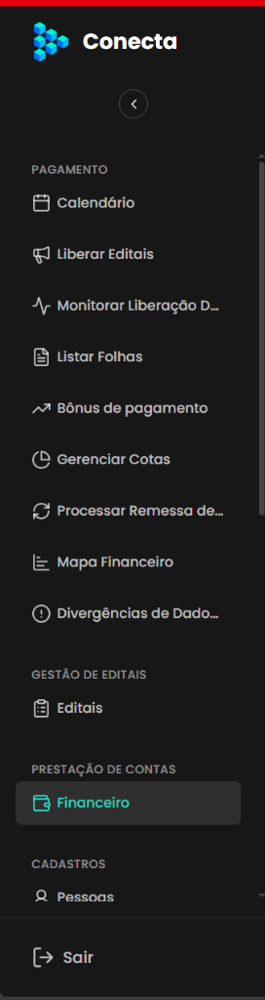

## Título
Presença indevida de linhas divisórias entre componentes no menu lateral do Frontoffice (componente global compartilhado entre todos os perfis) em divergência com o Protótipo e Backoffice

## ID
BUG-M003-FO-001

## Requisito/Regra Violada
- Regra Canônica: `EP-02` (Shell do Portal e Contexto do Projeto) / `docs/design-system.md` (Estrutura do Shell e Consistência)
- Heurística Violada: Nielsen H4 — Consistência e Padrões (*Consistency and Standards*)
- Rota/Componente: Shell do Frontoffice / `LayoutBase.vue` / Menu Lateral global (`AppSidebar.vue` / `Sidebar.tsx`) compartilhado por todos os perfis autenticados (`Coordenador`, `Bolsista`, `Proponente`, `Voluntário`, `Reitor`, `Diretor`) nas rotas do Frontoffice (`/*`)

## Ambiente
[ ] Produção  [ ] Staging  [x] Homologação

## Dispositivo/SO
[Windows 11 / Google Chrome v120+ / Frontoffice Vue-Nuxt UI em ambiente de homologação em `https://conectafapes.hom.es.gov.br` e `https://frontoffice-conecta.vercel.app`]

## Gravidade/Prioridade
[ ] 🔴 Bloqueante  [ ] 🟠 Alta  [ ] 🟡 Média  [x] 🟢 Baixa

## Passo a Passo
1. Acessar o ambiente de homologação do Frontoffice do Conecta FAPES (`https://conectafapes.hom.es.gov.br/` ou `https://frontoffice-conecta.vercel.app/`) e autenticar com qualquer perfil de usuário (ex: Coordenador, Bolsista, Proponente, Voluntário, etc.).
2. Abrir o menu lateral (`Sidebar`) no estado expandido.
3. Observar as divisões visuais entre os blocos de navegação e componentes do menu.
4. Notar a presença de linhas horizontais divisórias (`border`/`
`):
   - Abaixo do item "Início";
   - Abaixo dos blocos intermediários de navegação (ex: abaixo da seção MEU PERFIL / Meus Pagamentos);
   - Abaixo de seções de gestão/prestação (ex: GERENCIAMENTO / Remanejamento no fluxo do coordenador);
   - Acima do botão "Sair" no rodapé.
5. Alternar para outros perfis de acesso (ou verificar outros fluxos de usuário) e constatar que o mesmo comportamento de linhas divisórias ocorre de forma transversal em todas as variações do menu.
6. Comparar com o protótipo oficial do Frontoffice e com o menu lateral do Backoffice.

## Dados de Entrada
- Rotas Frontoffice Homologação: Rotas autenticadas globais (`/coordenador/*`, `/bolsista/*`, `/proponente/*`, `/inicio`, etc.) em `https://conectafapes.hom.es.gov.br`
- Perfis de Usuário Afetados: **Todos os tipos de usuários** (Coordenador, Bolsista, Proponente, Voluntário, Diretor, Reitor), visto que o Menu Lateral (`AppSidebar.vue`) é o mesmo componente reaproveitado no Shell global (`LayoutBase.vue`) da aplicação.
- Referência Protótipo Frontoffice: `prototype/frontOffice/src/app/components/Sidebar.tsx` e `prototype/frontOffice-vue/src/components/AppSidebar.vue`
- Referência Backoffice: `prototype/backoffice/src/app/components/DashboardLayout.tsx`

## Comportamento Esperado
O menu lateral do Frontoffice — **independentemente do papel ou perfil de acesso do usuário logado** — não deve conter linhas horizontais divisórias separando as seções ou os componentes:

- Como o menu lateral é um componente estrutural único e compartilhado, seu padrão visual deve ser consistente em qualquer visualização:
  1. A segregação visual entre os grupos de navegação (`MEU PERFIL`, `GERENCIAMENTO`, `PRESTAÇÃO DE CONTAS`, `PROJETOS`, etc.) deve ocorrer exclusivamente por meio de **espaçamento vertical (whitespace)** e pela **hierarquia tipográfica** dos títulos de seção em caixa alta (`uppercase`, `text-xs`, `font-semibold`, `color: var(--muted-foreground)`).
  2. O rodapé com o botão "Sair" deve permanecer integrado ao fluxo da barra lateral sem nenhuma linha horizontal divisória delimitadora.
- Essa limpeza visual é o padrão canônico estabelecido tanto no **Protótipo do Frontoffice** quanto no **Menu Lateral do Backoffice**, preservando uma experiência contínua e sem ruídos em todos os produtos da FAPES.

## Comportamento Atual
Ao abrir o menu lateral do Frontoffice no ambiente de homologação, o componente global renderiza linhas horizontais visíveis separando os componentes e grupos de menu para todos os tipos de usuário:

1. Uma linha divisória horizontal entre o item **"Início"** e a seção subsequente do menu.
2. Linhas divisórias horizontais entre as seções temáticas de navegação (conforme os itens habilitados para o perfil ativo).
3. Uma linha divisória horizontal contínua imediatamente acima do botão **"Sair"** no rodapé da barra lateral.

## Evidências

### 📷 Comparativo Visual das Telas

| ❌ Frontoffice Homologação (Atual — com linhas indevidas) | ✅ Protótipo Frontoffice (Esperado — sem linhas) | ✅ Backoffice (Referência — sem linhas) |
|:---:|:---:|:---:|
|  |  |  |
| *Exibição com linhas divisórias horizontais entre blocos* | *Separação limpa por espaçamento e tipografia* | *Separação fluida sem linhas entre categorias* |

## Sugestão de Investigação
- Inspecionar a raiz do componente global de barra lateral (`src/components/AppSidebar.vue` ou layout compartilhado `LayoutBase.vue` em Nuxt UI / Vue) no repositório do Frontoffice.
- Remover tags `
`, componentes `<UDivider>` ou classes utilitárias de borda divisória (como `border-b border-sidebar-border`, `border-t`, `divide-y`, etc.) que estão sendo aplicadas nos templates iteradores das seções e na div que envelopa o botão de logout.
- Como a alteração será feita diretamente no componente compartilhado da sidebar, a correção normalizará a interface para todos os perfis de acesso simultaneamente (Coordenador, Bolsista, Proponente, etc.), restabelecendo a fidelidade ao protótipo e ao Backoffice.
