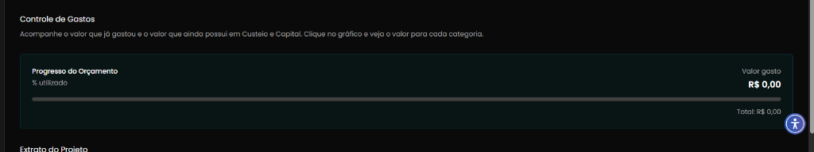
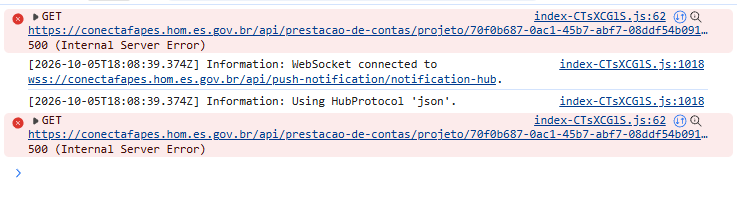
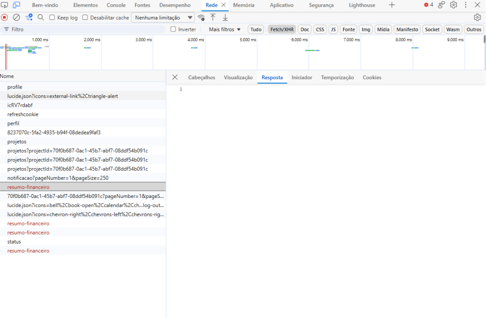

## Título
[Bug] Seção de Controle de Gastos exibe valores zerados devido a erro HTTP 500 no endpoint de resumo financeiro

## ID
BUG-M014-FO-PREST-006

## Requisito/Regra Violada
- Regra Canônica:
  - M014: `ConsultarPrestacaoContas` (Visualização dos dados e extrato financeiro da prestação).
  - M013: `RN06` (Orçamento Aprovado por Rubrica), `RN09` (Snapshot de Rubricas e Saldos), `RI-SLD1` (Invariante de consistência e cálculo de saldos).
- Heurísticas de Usabilidade de Nielsen:
  - **Heurística #1 (Visibilidade do Status do Sistema)**: O sistema não apresenta indicador de erro ou indisponibilidade ao falhar a busca do orçamento; em vez disso, renderiza `R$ 0,00` e esconde os percentuais, transmitindo a percepção incorreta de que o projeto possui saldo ou gastos zerados.
  - **Heurística #9 (Ajudar usuários a reconhecer, diagnosticar e recuperar-se de erros)**: A falha HTTP 500 ocorre silenciosamente para o usuário comum na interface, sem exibir mensagem amigável, toast ou opção de tentar novamente (retry).
- Casos de Teste Relacionados: `CT-M014-FO-005` (validar percentual utilizado), `CT-M014-FO-006` (validar campo valor gasto), `CT-M014-FO-007` (validar total do orçamento), `CT-M014-FO-008` (validar barra de progresso), `CT-M014-FO-014` (validar gastos zerados).
- Rota/Componente: `/coordenador/prestacao-financeira` (`OrcamentoProgress.vue` / `useOrcamentoProgress.ts`)
- Endpoint Afetado: `GET /api/prestacao-de-contas/projeto/:projetoId/resumo-financeiro`

## Ambiente
[ ] Produção  [ ] Staging  [x] Homologação

## Dispositivo/SO
Windows 11 / Chrome v120 / Frontoffice Vue-Nuxt UI em `https://conectafapes.hom.es.gov.br`

## Gravidade/Prioridade
[ ] 🔴 Bloqueante  [x] 🟠 Alta  [ ] 🟡 Média  [ ] 🟢 Baixa

## Passo a Passo
1. Autenticar no portal do Frontoffice (`https://conectafapes.hom.es.gov.br`) com o perfil de Coordenador.
2. Selecionar o projeto ativo vinculado (ex.: `projectId: 70f0b687-0ac1-45b7-abf7-08ddf54b091c`).
3. Navegar para a tela de Prestação de Contas Financeira através do menu ou pela rota `/coordenador/prestacao-financeira`.
4. Observar o card da seção `Controle de Gastos` e inspecionar as abas Console e Rede (Network) das ferramentas de desenvolvedor (F12).

## Dados de Entrada
- Perfil: Coordenador
- URL: `https://conectafapes.hom.es.gov.br/coordenador/prestacao-financeira`
- Projeto ID: `70f0b687-0ac1-45b7-abf7-08ddf54b091c`
- Requisição com Falha: `GET https://conectafapes.hom.es.gov.br/api/prestacao-de-contas/projeto/70f0b687-0ac1-45b7-abf7-08ddf54b091c/resumo-financeiro`
- Retorno HTTP: `500 Internal Server Error`

## Comportamento Esperado
- A requisição `GET /api/prestacao-de-contas/projeto/{projetoId}/resumo-financeiro` deve retornar com status HTTP 200 contendo o objeto `ResumoFinanceiro` (percentual utilizado, valor gasto, valor total previsto e detalhamento consumido por conta contábil).
- A seção `Controle de Gastos` deve exibir o percentual utilizado (ex.: `XX% utilizado`), o montante de `Valor gasto` e o `Total:` orçado do projeto, preenchendo proporcionalmente a barra de progresso (`UProgress`).
- Caso ocorra falha de comunicação ou erro no servidor, o frontend deve exibir um estado de erro visível com feedback amigável e opção de recarregar a consulta, em vez de mascarar a falha com valores zerados (`R$ 0,00`).

## Comportamento Atual
- A chamada à API `GET /api/prestacao-de-contas/projeto/70f0b687-0ac1-45b7-abf7-08ddf54b091c/resumo-financeiro` falha com status `500 (Internal Server Error)`.
- No console são registrados sucessivos erros de 500 no arquivo de bundle `index-CTsXCGlS.js:62`.
- Na aba Rede (Network), as requisições para `resumo-financeiro` falham repetidamente em vermelho com HTTP 500 sem payload de resposta válido.
- O card `Controle de Gastos` renderiza o título `Progresso do Orçamento`, o texto incompleto `% utilizado` (sem percentual), `Valor gasto R$ 0,00`, barra de progresso desativada e `Total: R$ 0,00`, gerando desinformação orçamentária para o coordenador.

## Evidências
- 📷 **Card Controle de Gastos com campos zerados e percentual omitido:**  
  

- 📷 **Console do navegador registrando erro HTTP 500 no endpoint de resumo-financeiro:**  
  

- 📷 **Aba Rede (Network) exibindo requisições com falha HTTP 500 em resumo-financeiro:**  
  

- 🧾 **Logs / Retorno da API:**
  ```http
  GET /api/prestacao-de-contas/projeto/70f0b687-0ac1-45b7-abf7-08ddf54b091c/resumo-financeiro HTTP/1.1
  Host: conectafapes.hom.es.gov.br
  Status: 500 Internal Server Error
  ```

## Sugestão de Investigação
- **Backend (`leds-conectafapes-prestacao-de-contas` / M014 / M013):**
  - Investigar o controller e handler associados à rota `GET /api/prestacao-de-contas/projeto/{projetoId}/resumo-financeiro`.
  - Verificar se ocorre `NullReferenceException` ou erro de agregação SQL/LINQ ao somar despesas quando o projeto não possui movimentações em determinadas rubricas contábeis ou quando a conta contábil vinculada não possui registros no snapshot orçamentário.
  - Verificar a integridade dos dados orçamentários do projeto `70f0b687-0ac1-45b7-abf7-08ddf54b091c` nas tabelas de orçamento do módulo M013.
- **Frontend (`leds-conectafapes-frontoffice-frontend-develop`):**
  - No composable `src/modules/PrestacaoContas/composables/useOrcamentoProgress.ts`, expor as propriedades `isError`, `isLoading` e `refetch` retornadas pelo `useQuery` do TanStack.
  - No componente `src/modules/PrestacaoContas/components/OrcamentoProgress.vue`, implementar tratamento defensivo de falha de carregamento (`v-if="isError"` / skeleton loader em loading), impedindo que os fallbacks `data?.valorGasto ?? 0` e `data?.valorCapitalPrevisto ?? 0` mostrem silenciosamente `R$ 0,00` em caso de erro na API.
