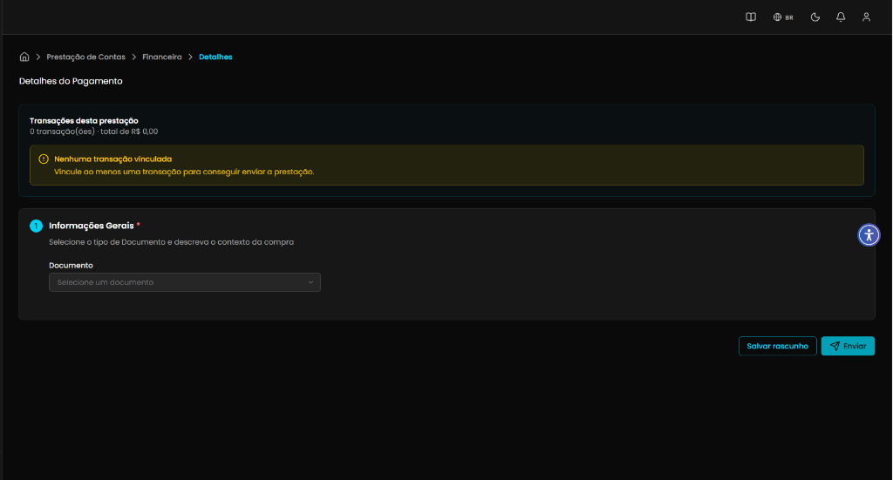
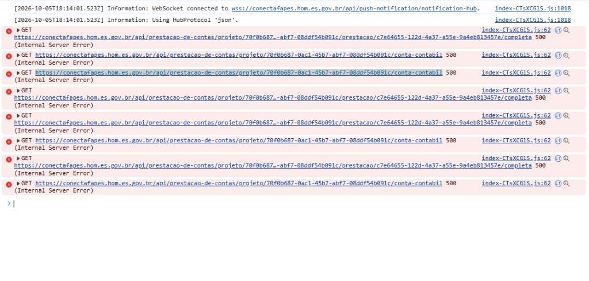
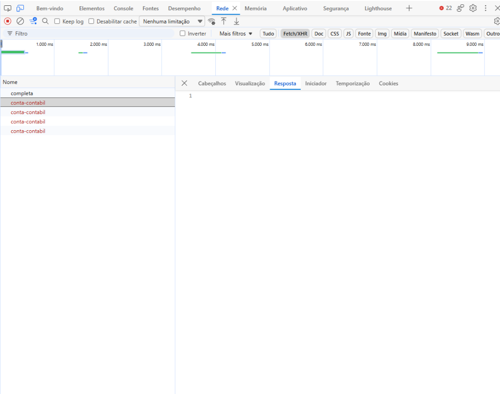

## Título
[Bug] Transação de débito com status não pendente carrega tela de detalhes com valores vazios e erro HTTP 500 em /completa e /conta-contabil

## ID
BUG-M014-FO-PREST-007

## Requisito/Regra Violada
- Regra Canônica:
  - M014: `ConsultarPrestacaoContas` (Visualização agregada da prestação, suas transações bancárias e justificativas de despesa).
  - M014: `RN01` (Ciclo de Vida da Prestação: transição e persistência dos estados Rascunho, Em Análise, Em Revisão e Em Devolução).
  - M014: `RN02` (Conciliação Extrato x Despesa / Vinculação consistente de Transação Financeira à Prestação).
- Heurísticas de Usabilidade de Nielsen:
  - **Heurística #1 (Visibilidade do Status do Sistema)**: A interface exibe a mensagem enganosa *"⚠️ Nenhuma transação vinculada - Vincule ao menos uma transação para conseguir enviar a prestação"* e *"0 transação(ões) · total de R$ 0,00"*, quando na realidade a transação existe, possui valor no extrato e já possui vínculo persistido com a prestação. O sistema mascara a falha de carregamento da API apresentando um estado vazio falso.
  - **Heurística #9 (Ajudar usuários a reconhecer, diagnosticar e recuperar-se de erros)**: As falhas HTTP 500 nos endpoints `/completa` e `/conta-contabil` ocorrem silenciosamente no console e na rede sem apresentar nenhum alerta amigável, toast ou opção de recarregamento (retry) na interface para o usuário.
- Casos de Teste Relacionados: `CT-M014-FO-002` (abrir o detalhe de uma transação elegível no extrato), `CT-M014-FO-010` (validar envio da prestação financeira).
- Rota/Componente: `/coordenador/prestacao-financeira/:id` (`DetalhesPrestacao.vue`, `usePrestacao.ts`, `usePrestacaoList.ts`, `DetalhesPrestacaoResumoCard.vue`)
- Endpoints Afetados:
  - `GET /api/prestacao-de-contas/projeto/:projetoId/prestacao/:id/completa`
  - `GET /api/prestacao-de-contas/projeto/:projetoId/conta-contabil`

## Ambiente
[ ] Produção  [ ] Staging  [x] Homologação

## Dispositivo/SO
Windows 11 / Chrome v120 / Frontoffice Vue-Nuxt UI em `https://conectafapes.hom.es.gov.br`

## Gravidade/Prioridade
[ ] 🔴 Bloqueante  [x] 🟠 Alta  [ ] 🟡 Média  [ ] 🟢 Baixa

## Passo a Passo
1. Autenticar no portal do Frontoffice (`https://conectafapes.hom.es.gov.br`) com o perfil de Coordenador.
2. Selecionar o projeto ativo vinculado (ex.: `projectId: 70f0b687-0ac1-45b7-abf7-08ddf54b091c`).
3. Navegar para a tela de Prestação de Contas Financeira (`/coordenador/prestacao-financeira`).
4. Na listagem de movimentações do extrato, localizar uma transação de débito cujo status seja diferente de "Pendente" (ex.: "Em Rascunho", "Em Análise", "Em Devolução", "Em Revisão").
5. Clicar no card da transação para acessar a tela de detalhes (`/coordenador/prestacao-financeira/:id`).
6. Observar a tela de detalhes renderizada e inspecionar o Console e a aba Rede (Network) das ferramentas de desenvolvedor (F12).

## Dados de Entrada
- Perfil: Coordenador
- URL Origem: `https://conectafapes.hom.es.gov.br/coordenador/prestacao-financeira`
- Projeto ID: `70f0b687-0ac1-45b7-abf7-08ddf54b091c`
- Status da Transação selecionada: Diferente de Pendente (ex.: `Em Rascunho`, `Em Análise`, `Em Devolução`)
- URL Destino: `https://conectafapes.hom.es.gov.br/coordenador/prestacao-financeira/c7e64655-122d-4a37-a55e-9a4eb813457e`
- Endpoints com falha:
  - `GET https://conectafapes.hom.es.gov.br/api/prestacao-de-contas/projeto/70f0b687-0ac1-45b7-abf7-08ddf54b091c/prestacao/c7e64655-122d-4a37-a55e-9a4eb813457e/completa`
  - `GET https://conectafapes.hom.es.gov.br/api/prestacao-de-contas/projeto/70f0b687-0ac1-45b7-abf7-08ddf54b091c/conta-contabil`
- Retorno HTTP: `500 Internal Server Error`

## Comportamento Esperado
- Ao clicar em uma transação com status não pendente, as requisições `GET /completa` e `GET /conta-contabil` devem retornar com status HTTP 200 OK.
- A tela de detalhes (`/coordenador/prestacao-financeira/:id`) deve carregar todos os dados da prestação e da transação vinculada:
  - O card `Transações desta prestação` deve exibir a transação com identificador, data e valor corretos, sem exibir alerta de transação desvinculada.
  - O formulário de comprovação (Nota Fiscal, Passagem ou Invoice) deve ser exibido com os dados previamente salvos (em modo leitura ou edição conforme o status da prestação).
- Em caso de indisponibilidade da API ou erro 500 no servidor, o frontend deve apresentar um estado visual de erro explícito com aviso amigável e opção de tentar novamente, nunca renderizando a tela como se a prestação estivesse vazia ou desvinculada.

## Comportamento Atual
- A navegação abre a rota `/coordenador/prestacao-financeira/:id`, porém as requisições para `prestacao/:id/completa` e `conta-contabil` falham repetidamente com status `500 (Internal Server Error)`.
- No Console são registrados erros consecutivos de requisição GET com código 500 no bundle `index-CTsXCGlS.js:62`.
- Na aba Rede (Network), as requisições para `completa` e `conta-contabil` aparecem destacadas em vermelho com status 500.
- Com a ausência do payload de resposta, o frontend renderiza a tela com campos vazios e valores zerados:
  - O card `DetalhesPrestacaoResumoCard` exibe `0 transação(ões) · total de R$ 0,00` e o alerta amarelo *"⚠️ Nenhuma transação vinculada - Vincule ao menos uma transação para conseguir enviar a prestação"*.
  - A seção `Informações Gerais` exibe o seletor de documento com `Selecione um documento`, omitindo qualquer dado previamente preenchido.

## Evidências
- 📷 **Tela da transação carregada com valores zerados e alerta de nenhuma transação vinculada:**  
  

- 📷 **Console do navegador registrando erros HTTP 500 nos endpoints /completa e /conta-contabil:**  
  

- 📷 **Aba Rede (Network) exibindo requisições GET com falha HTTP 500:**  
  

- 🧾 **Logs / Retorno da API:**
  ```http
  GET /api/prestacao-de-contas/projeto/70f0b687-0ac1-45b7-abf7-08ddf54b091c/prestacao/c7e64655-122d-4a37-a55e-9a4eb813457e/completa HTTP/1.1
  Host: conectafapes.hom.es.gov.br
  Status: 500 Internal Server Error

  GET /api/prestacao-de-contas/projeto/70f0b687-0ac1-45b7-abf7-08ddf54b091c/conta-contabil HTTP/1.1
  Host: conectafapes.hom.es.gov.br
  Status: 500 Internal Server Error
  ```

## Sugestão de Investigação
- **Backend (`leds-conectafapes-prestacao-de-contas` / M014):**
  - Investigar o handler do endpoint `GET /api/prestacao-de-contas/projeto/{projetoId}/prestacao/{id}/completa`:
    - Verificar se ocorre `NullReferenceException` ou falha de mapeamento/serialização ao carregar prestações que possuem dados vinculados em status avançados (como `EM_RASCUNHO`, `EM_ANALISE`, `EM_DEVOLUCAO`), especialmente ao projetar entidades filhas como `justificativas`, `devolucao`, `transacoesDevolucao` ou `contestacoes`.
    - Validar se o identificador recebido na URL (`c7e64655-122d-4a37-a55e-9a4eb813457e`) é de fato o `PrestacaoId` ou se houve divergência com o ID da entidade associativa `TransacaoFinanceiraPrestacaoId`.
  - Investigar o endpoint `GET /api/prestacao-de-contas/projeto/{projetoId}/conta-contabil` para identificar o motivo do erro 500 concorrente para o projeto `70f0b687-0ac1-45b7-abf7-08ddf54b091c`.
- **Frontend (`leds-conectafapes-frontoffice-frontend-develop`):**
  - No composable `src/modules/PrestacaoContas/composables/usePrestacao.ts`, tratar os estados de erro (`isError`) das queries de prestação e contas contábeis para não deixar `prestacao` e `transacao` como `undefined` silenciosamente.
  - Na view `src/modules/PrestacaoContas/view/DetalhesPrestacao.vue`, adicionar barreira de erro / tratamento defensivo de falha de carregamento, informando ao usuário sobre a indisponibilidade momentânea do serviço e prevenindo a renderização do alerta de "Nenhuma transação vinculada".
