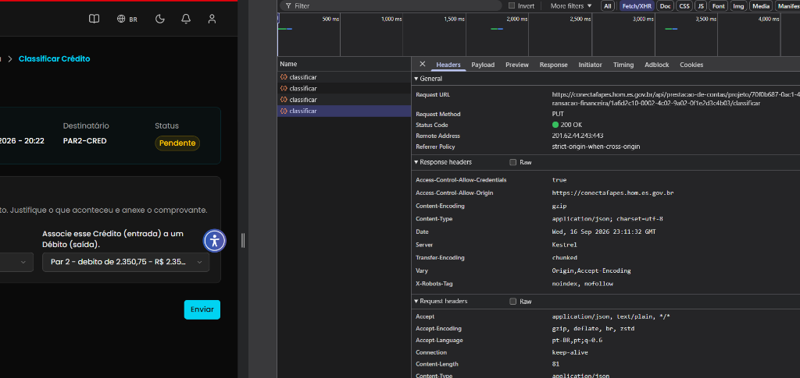
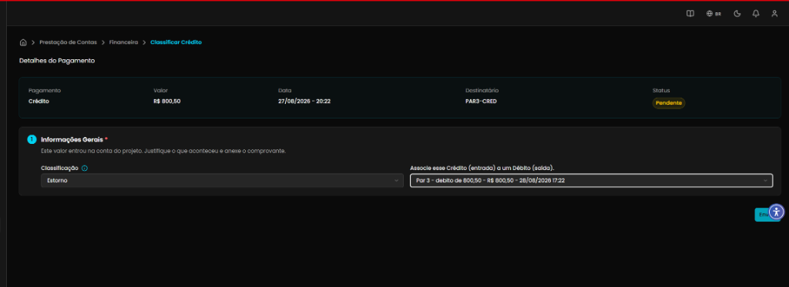

## Título
Ausência de bloqueio do botão Enviar após classificar crédito como Estorno permitindo múltiplos disparos de requisições PUT

## ID
BUG-M014-FO-007

## Requisito/Regra Violada
- Regra Canônica: M014: `RN11` / `RN13` (Classificação de crédito — pareamento de débito com estorno e idempotência na submissão de classificação financeira)
- Rota/Componente: `https://conectafapes.hom.es.gov.br/prestacao-financeira/classificar-credito/:paymentId` / `PUT /api/prestacao-de-contas/projeto/{projetoId}/transacao-financeira/{transacaoId}/classificar`

## Ambiente
[ ] Produção  [ ] Staging  [x] Homologação

## Dispositivo/SO
[Windows 11 / Chrome v120 / Frontoffice Vue-Nuxt UI em `https://conectafapes.hom.es.gov.br`]

## Gravidade/Prioridade
[ ] 🔴 Bloqueante  [x] 🟠 Alta  [ ] 🟡 Média  [ ] 🟢 Baixa

## Passo a Passo
1. Acessar o extrato financeiro em `/coordenador/financeira` e abrir uma transação de crédito com status `Pendente`.
2. Na seção `1. Informações Gerais *`, selecionar a opção `Estorno` no campo `Classificação`.
3. No campo `Associe esse Crédito (entrada) a um Débito (saída)`, selecionar um débito correspondente na lista (ex: `Par 3 - debito de 800,50 - R$ 800,50 - 28/08/2026 17:22`).
4. Abrir as ferramentas de desenvolvedor do navegador (`F12`) na aba **Network (Rede)**.
5. Clicar no botão `Enviar`.
6. Observar que a chamada `PUT .../classificar` retorna `200 OK`, mas o botão `Enviar` permanece ativo e clicável na tela.
7. Clicar repetidamente no botão `Enviar` sem recarregar a página e constatar novos disparos de requisições `PUT` no terminal/DevTools.
8. Pressionar `F5` para recarregar a página e observar que apenas após a recarga o estado é atualizado e o formulário é bloqueado.

## Dados de Entrada
- Rota de Acesso: `https://conectafapes.hom.es.gov.br/prestacao-financeira/classificar-credito/:paymentId`
- Endpoint Disparado: `PUT /api/prestacao-de-contas/projeto/{projetoId}/transacao-financeira/{transacaoId}/classificar`
- Campo Classificação: `Estorno`
- Campo Débito Vinculado: Débito de mesmo valor selecionado

## Comportamento Esperado
- Ao acionar o botão `Enviar`, ele deve imediatamente passar para o estado desabilitado/carregando (`disabled` / `is-loading`) para evitar submissões concorrentes ou duplicadas.
- Após o retorno bem-sucedido (`200 OK`) da API, o estado local da tela deve ser atualizado de forma reativa (atualizando o badge de status e bloqueando os campos) ou o usuário deve ser redirecionado para o extrato com notificação de sucesso (toast), impedindo novos disparos sem necessidade de reload manual (`F5`).

## Comportamento Atual
- O botão `Enviar` não é bloqueado durante nem após a conclusão da requisição `PUT`.
- O usuário consegue reenviar a classificação indefinidamente, gerando múltiplas chamadas consecutivas `PUT /classificar` com status `200 OK` registradas no Network do navegador.
- A tela só reflete o bloqueio e a atualização do estado após um `F5` manual pelo usuário.

## Evidências
- 📷 **Múltiplos disparos de PUT no Network DevTools com retorno 200 OK:**
  
- 📷 **Tela de Classificação de Crédito com botão Enviar habilitado após submissão:**
  

## Sugestão de Investigação
- Implementar controle de loading/disabled no botão `Enviar` (`:loading="isSubmitting"` e `:disabled="isSubmitting || isSuccess"`).
- No callback `onSuccess` da mutação que executa o `PUT /classificar`, invalidar a query de dados da transação via Vue Query (`queryClient.invalidateQueries`) ou atualizar o estado local para desabilitar o formulário e exibir feedback de conclusão sem depender do recarregamento da página (`F5`).
