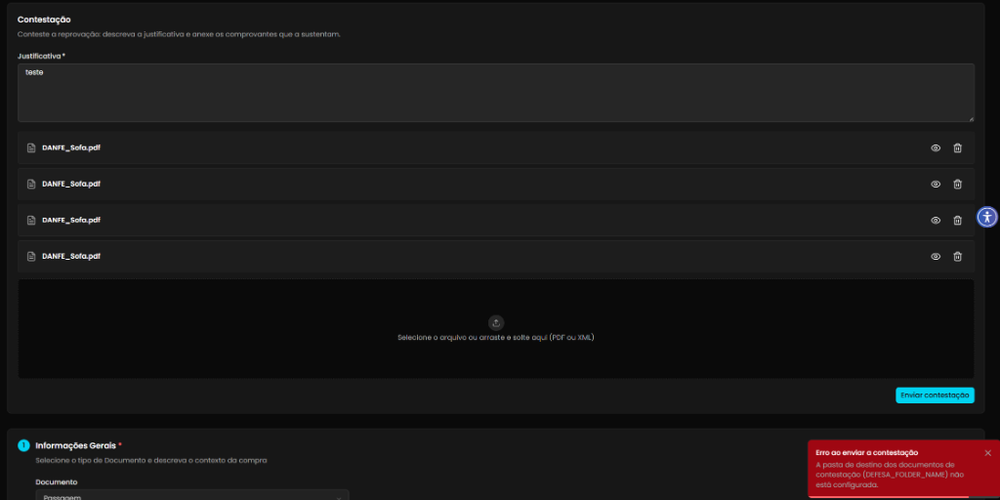
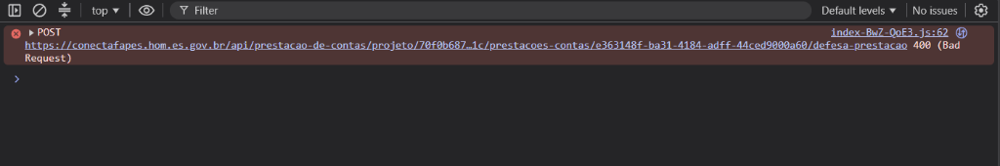
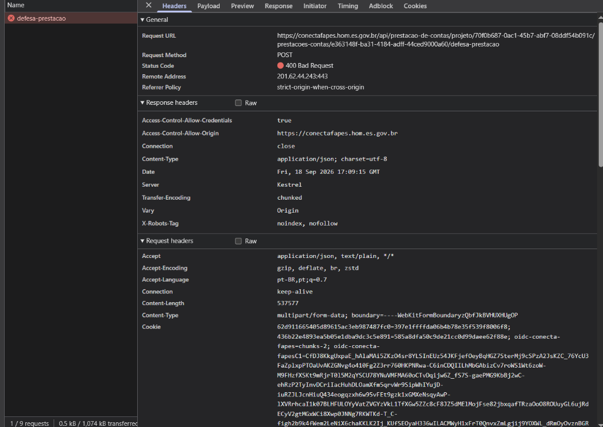

## Título
Erro 400 e toast de falha ao enviar contestação de transação rejeitada por ausência de configuração da pasta de destino (DEFESA_FOLDER_NAME)

## ID
BUG-M014-FO-PREST-003

## Requisito/Regra Violada
- Regra Canônica: M014: `EPIC-M014-003 — US-M014-008 (Contestar Recusa)` / Gestão de Documentos de Defesa de Prestação de Contas
- Rota/Componente: `/coordenador/prestacao-financeira/detalhes/:paymentId` / `POST /api/prestacao-de-contas/projeto/{projetoId}/prestacoes-contas/{prestacaoId}/defesa-prestacao`

## Ambiente
[ ] Produção  [ ] Staging  [x] Homologação

## Dispositivo/SO
[Windows 11 / Chrome v120 / Frontoffice Vue-Nuxt UI em `https://conectafapes.hom.es.gov.br`]

## Gravidade/Prioridade
[x] 🔴 Bloqueante  [ ] 🟠 Alta  [ ] 🟡 Média  [ ] 🟢 Baixa

## Passo a Passo
1. Acessar o extrato financeiro do projeto em `/coordenador/financeira` com perfil de Coordenador.
2. Localizar e abrir uma transação de débito com status de reprovação/rejeição para visualizar os detalhes da comprovação.
3. Na seção `Contestação` (*"Conteste a reprovação: descreva a justificativa e anexe os comprovantes que a sustentam"*), preencher o campo `Justificativa *` (ex: `"teste"`).
4. Anexar um ou mais documentos comprovatórios válidos em PDF ou XML (ex: `DANFE_Sofa.pdf`).
5. Clicar no botão `Enviar contestação`.
6. Observar o retorno na tela e inspecionar a aba *Console* e *Network* das ferramentas de desenvolvedor (`F12`).

## Dados de Entrada
- Rota de Acesso: `/coordenador/prestacao-financeira/detalhes/:paymentId`
- Endpoint Disparado: `POST https://conectafapes.hom.es.gov.br/api/prestacao-de-contas/projeto/70f0b687-0ac1-45b7-abf7-08ddf54b091c/prestacoes-contas/e363148f-ba31-4184-adff-44ced9000a60/defesa-prestacao`
- Content-Type: `multipart/form-data`
- Campo Justificativa: `"teste"`
- Anexos Submetidos: `DANFE_Sofa.pdf`

## Comportamento Esperado
- O envio da contestação deve ser processado e aceito com sucesso pelo backend (`200 OK` ou `201 Created`), realizando o upload dos documentos para o bucket/armazenamento correspondente no MinIO/Storage.
- A aplicação deve exibir um toast de sucesso e atualizar o status da transação para `Em Contestação` (ou `Em Análise`), registrando formalmente a defesa apresentada pelo Coordenador.

## Comportamento Atual
- A requisição `POST /defesa-prestacao` é rejeitada pela API com status HTTP `400 (Bad Request)`.
- É apresentado um toast vermelho de erro na interface:
  > *"Erro ao enviar a contestação: A pasta de destino dos documentos de contestação (DEFESA_FOLDER_NAME) não está configurada."*
- O envio da contestação não é persistido, bloqueando integralmente o fluxo de recurso do Coordenador.

## Evidências
- 📷 **Toast de Erro exibido na tela:**
  
- 📷 **Exceção no Console do Navegador (400 Bad Request):**
  
- 📷 **Detalhes da Requisição POST na aba Network:**
  

## Sugestão de Investigação
- Verificar as configurações de ambiente (`appsettings.json` ou variáveis de ambiente do serviço de Prestação de Contas no backend em homologação).
- Definir o valor da variável/chave de configuração `DEFESA_FOLDER_NAME` (ou equivalente no serviço de MinIO / File Storage) para apontar para o diretório correto destinado aos comprovantes de defesa da prestação de contas.
