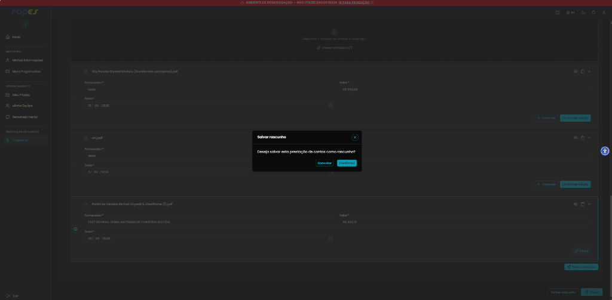
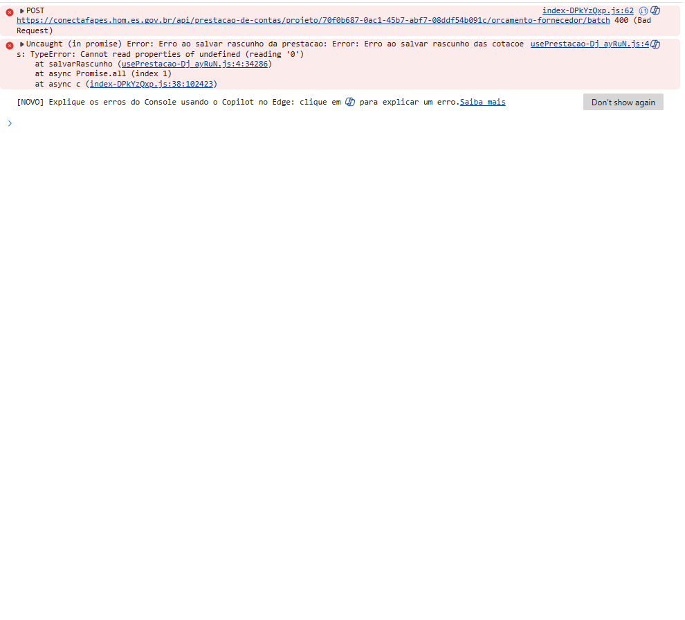

# Título
[Bug] Erro 400 Bad Request e TypeError ao acionar "Salvar rascunho" com cotações anexadas na Seção 4

## ID
BUG-M014-FO-NF-010

## Requisito/Regra Violada
- Regra Canônica: M014: `RN01` / `RN07` — Salvamento parcial de rascunho da prestação de contas com orçamentos de cotação
- Rota/Componente: `https://conectafapes.hom.es.gov.br/prestacao-financeira/:paymentId` — Botão `Salvar rascunho` (`usePrestacao-Dj_ayRuN.js`)
- Endpoint: `POST /api/prestacao-de-contas/projeto/:projetoId/orcamento-fornecedor/batch`

## Ambiente
[ ] Produção  [ ] Staging  [x] Homologação

## Dispositivo/SO
Windows 11 / Chrome / Frontoffice Vue-Nuxt UI em `https://conectafapes.hom.es.gov.br`

## Gravidade/Prioridade
[ ] 🔴 Bloqueante  [x] 🟠 Alta  [ ] 🟡 Média  [ ] 🟢 Baixa

## Passo a Passo

1. Acessar `https://conectafapes.hom.es.gov.br/prestacao-financeira/:paymentId` com uma transação de débito pendente.
2. Na seção `4. Cotação`, anexar os arquivos de cotação de fornecedores (ex: 3/3 orçamentos) e preencher os dados dos fornecedores.
3. No rodapé da página principal, clicar no botão `Salvar rascunho`.
4. Na modal de confirmação *"Deseja salvar esta prestação de contas como rascunho?"*, clicar no botão ciano `Confirmar`.
5. Observar a ausência de resposta positiva na interface e os erros registrados no console do navegador (`F12`).

## Dados de Entrada
- URL: `https://conectafapes.hom.es.gov.br/prestacao-financeira/:paymentId`
- Estado da tela: Cotações anexadas e preenchidas na Seção 4
- Ação: Clicar em `Salvar rascunho` → Confirmar na modal

## Comportamento Esperado
- O sistema deve salvar o rascunho da prestação de contas incluindo os dados e arquivos anexados das cotações de fornecedores (`200 OK`).
- A modal de confirmação deve ser fechada e um toast de sucesso exibido: *"Rascunho salvo com sucesso."*.

## Comportamento Atual
- Ao confirmar o salvamento de rascunho, nada acontece na interface (a ação não é concluída nem exibe feedback de sucesso).
- A requisição para o endpoint `.../orcamento-fornecedor/batch` falha com **HTTP 400 Bad Request**.
- O console do navegador dispara a exceção:
  ```text
  POST https://conectafapes.hom.es.gov.br/api/prestacao-de-contas/projeto/:projetoId/orcamento-fornecedor/batch 400 (Bad Request)
  Uncaught (in promise) Error: Erro ao salvar rascunho da prestacao: Error: Erro ao salvar rascunho das cotacoes: TypeError: Cannot read properties of undefined (reading '0')
      at salvarRascunho (usePrestacao-Dj_ayRuN.js:4:34286)
      at async Promise.all (index 1)
      at async c (index-DPkYzQxp.js:38:102423)
  ```

## Evidências
- 📷 **Modal "Salvar rascunho" sobreposta à Seção 4 com cotações anexadas:**

  

- 📷 **Console do navegador com HTTP 400 Bad Request e TypeError no método `salvarRascunho`:**

  

## Sugestão de Investigação
- O método `salvarRascunho` aciona internamente o salvamento em lote das cotações (mesmo fluxo com a função de montar lote em `usePrestacao-Dj_ayRuN.js`), onde a tentativa de acessar a propriedade `[0]` de uma lista/objeto indefinido gera o `TypeError` e causa o payload malformado de HTTP 400.